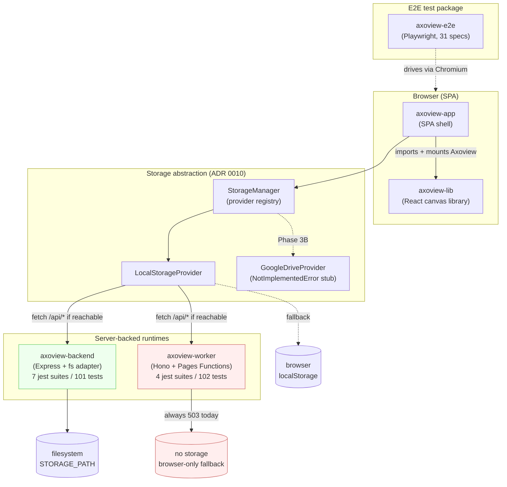
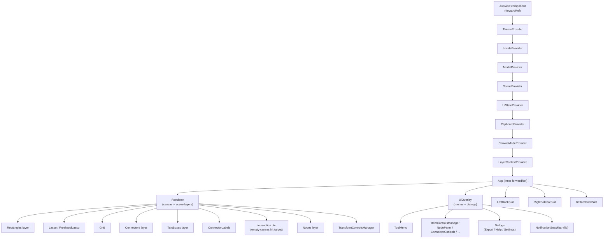
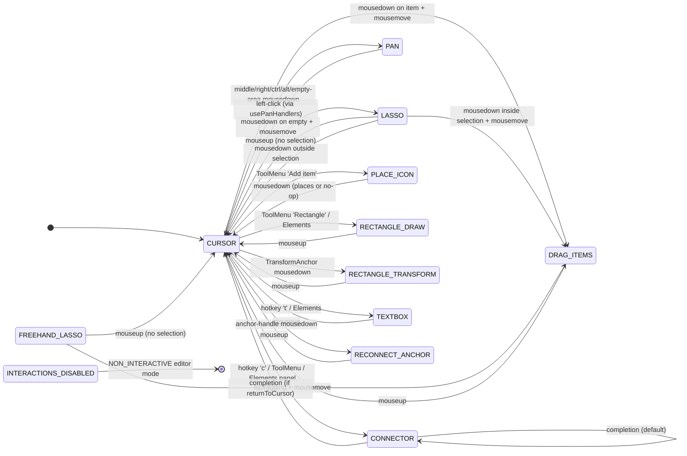
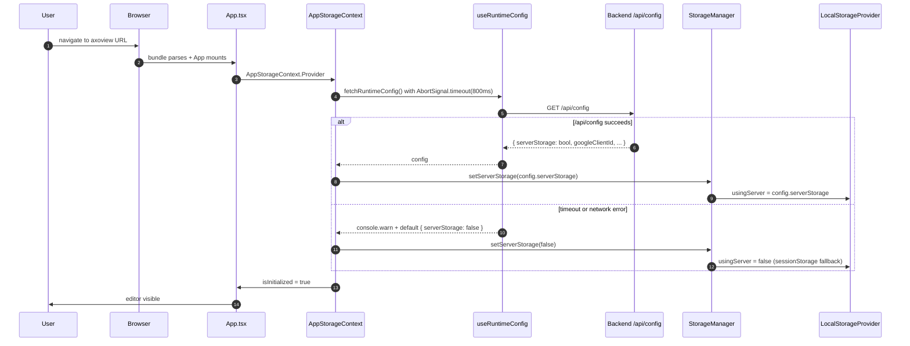
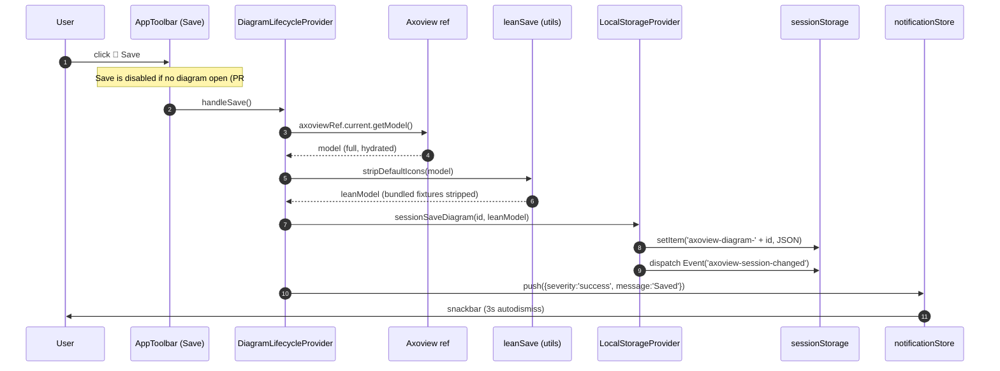
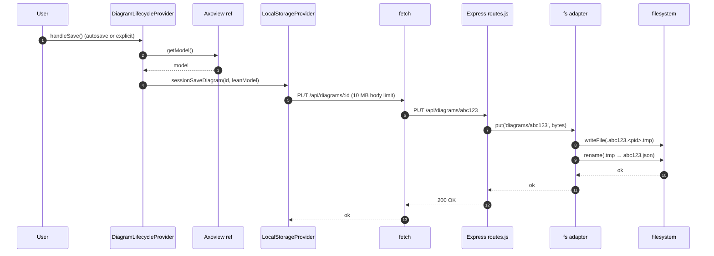
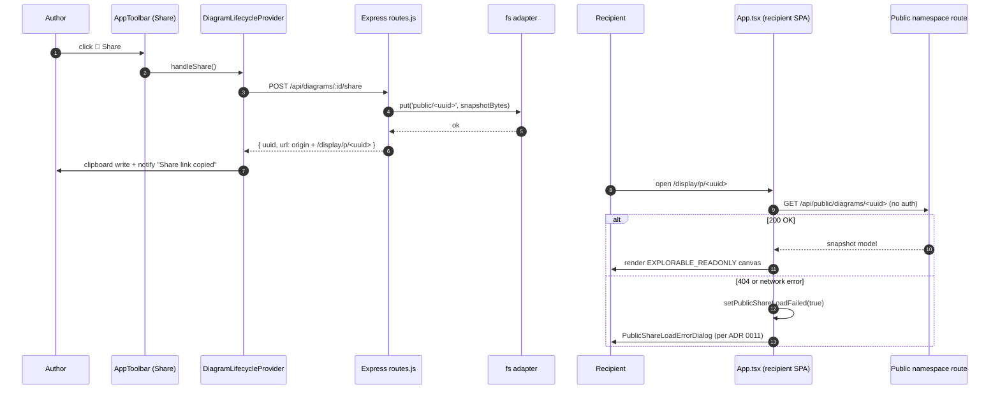
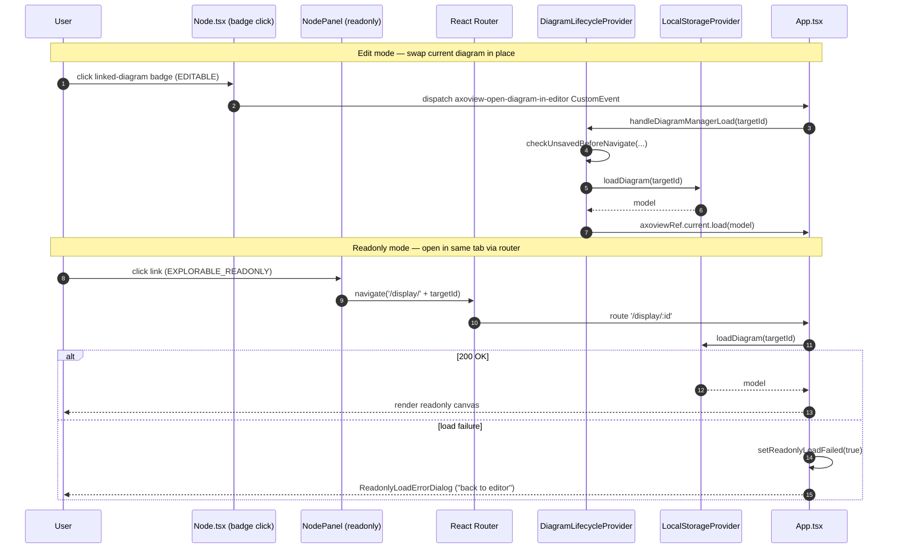
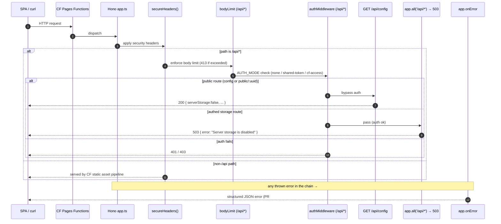

# Axoview Technical Review — 2026-06

> **Status:** Frozen-on-publish 2026-06-10 (post-v1.1 wave, v2.0.1). Reviewer-ready. This document is a snapshot of the post-v1.1 state — it does not track ongoing changes; the [ADRs](../adr/), [PLAN.md](../../PLAN.md), and [docs/guidelines/architecture.md](../guidelines/architecture.md) are the living artifacts. The prior [2026-05 review](technical-review-2026-05.md) is preserved unedited as the v1.0.0 snapshot; this artifact tracks the delta since.

## Table of contents

- [0. How to use this document](#0-how-to-use-this-document)
- [1. Executive summary](#1-executive-summary)
- [2. Before / After](#2-before--after)
  - [2.1 At-a-glance comparison](#21-at-a-glance-comparison)
  - [2.2 What did *not* change](#22-what-did-not-change)
- [3. Architecture overview](#3-architecture-overview)
  - [3a. System diagram](#3a-system-diagram)
  - [3b. Package responsibilities](#3b-package-responsibilities)
  - [3c. State management](#3c-state-management)
  - [3d. Component tree (high level, lib-side)](#3d-component-tree-high-level-lib-side)
  - [3e. Interaction modes](#3e-interaction-modes)
- [4. Sequence diagrams](#4-sequence-diagrams)
  - [4a. App boot + mode detection (single `/api/config` probe)](#4a-app-boot--mode-detection-single-apiconfig-probe)
  - [4b. Save diagram — browser-only mode](#4b-save-diagram--browser-only-mode)
  - [4c. Save diagram — server-backed mode](#4c-save-diagram--server-backed-mode)
  - [4d. Share link generation + public consumption](#4d-share-link-generation--public-consumption)
  - [4e. Diagram-to-diagram link navigation](#4e-diagram-to-diagram-link-navigation)
  - [4f. Worker request lifecycle — onError + 503 short-circuit](#4f-worker-request-lifecycle--onerror--503-short-circuit)
- [5. Deployment topology](#5-deployment-topology)
  - [5a. Three deploy targets](#5a-three-deploy-targets)
  - [5b. Mode detection contract](#5b-mode-detection-contract)
  - [5c. CI/CD chain](#5c-cicd-chain)
  - [5d. Env-var contract per target](#5d-env-var-contract-per-target)
  - [5e. Bundle-size budget](#5e-bundle-size-budget)
  - [5f. Dual `wrangler.toml`](#5f-dual-wranglertoml)
  - [5g. Distribution model](#5g-distribution-model)
- [6. Security posture](#6-security-posture)
  - [6a. Auth model](#6a-auth-model)
  - [6b. Storage isolation — single-tenant per deploy](#6b-storage-isolation--single-tenant-per-deploy)
  - [6c. Public-namespace cutout](#6c-public-namespace-cutout)
  - [6d. CSP + security headers](#6d-csp--security-headers)
  - [6e. Concurrent-write semantics](#6e-concurrent-write-semantics)
  - [6f. Atomicity](#6f-atomicity)
  - [6g. CI security scanning](#6g-ci-security-scanning)
  - [6h. Known security gaps (tracked, not blocking)](#6h-known-security-gaps-tracked-not-blocking)
- [7. File-by-file inventory](#7-file-by-file-inventory)
  - [7.1 What moved since 2026-05](#71-what-moved-since-2026-05)
  - [7.2 `packages/axoview-lib`](#72-packagesaxoview-lib)
  - [7.3 `packages/axoview-app`](#73-packagesaxoview-app)
  - [7.4 `packages/axoview-backend`](#74-packagesaxoview-backend)
  - [7.5 `packages/axoview-worker`](#75-packagesaxoview-worker)
  - [7.6 `packages/axoview-e2e`](#76-packagesaxoview-e2e)
  - [7.7 Repo shell + `docs/`](#77-repo-shell--docs)
  - [7.8 Cross-package observations](#78-cross-package-observations)
  - [7.9 Inventory totals](#79-inventory-totals)
- [8. Quality KPIs aggregate](#8-quality-kpis-aggregate)
  - [8a. Test inventory](#8a-test-inventory)
  - [8b. CI gate inventory](#8b-ci-gate-inventory)
  - [8c. LOC + file totals](#8c-loc--file-totals)
  - [8d. Test:source ratio — by package](#8d-testsource-ratio--by-package)
  - [8e. Lint debt](#8e-lint-debt)
  - [8f. Cognitive-complexity baseline (Sonar S3776)](#8f-cognitive-complexity-baseline-sonar-s3776)
  - [8g. Production runtime metrics](#8g-production-runtime-metrics)
- [9. Decisions catalog](#9-decisions-catalog)
  - [9.1 ADRs](#91-adrs)
  - [9.2 Locked decisions (productization audit)](#92-locked-decisions-productization-audit)
- [10. Reviewer prompts](#10-reviewer-prompts)
  - [10a. General quality + architecture review (broad lens)](#10a-general-quality--architecture-review-broad-lens)
  - [10b. Productization-readiness review (narrow lens)](#10b-productization-readiness-review-narrow-lens)
- [11. Open known issues](#11-open-known-issues)

---

## 0. How to use this document

**Audience.** An external reviewer (likely another AI agent) asked to assess Axoview's current state and suggest improvements. The artifact serves two lenses at once:

1. **General code-quality review** — architecture, testing, technical debt, maintainability.
2. **Productization-readiness review** — distribution model, deployment posture, CI/CD discipline, error UX, security headers, repo hygiene.

The reviewer prompts in [§10](#10-reviewer-prompts) split into two checklists; the rest of the artifact serves both.

**Reading order.**

- Read **1 → 2 → 3 → 4** sequentially. Those four sections build the mental model.
- Jump to **§10** for the actual review questions.
- Treat **§5–§8** as reference material; consult as needed.
- **§9** is the durable decisions record (ADRs are the source of truth; §9 is a quick-scan view).
- **§11** lists known gaps that the v1.1 wave did not close — review for cumulative-debt impact.

**Snapshot date.** This artifact is dated **2026-06-10** and is **not a living doc**. It captures the state at the close of the **v1.1 quality wave** (PRs #3–#23 against the v1.0.0 baseline; release `v2.0.1`). The ADRs, [PLAN.md](../../PLAN.md), and [docs/guidelines/architecture.md](../guidelines/architecture.md) are the living artifacts; this one is a frozen review surface, published once and not edited in place (errors found later go in a future `## 12. Corrections` appendix, the convention the [2026-05 artifact](technical-review-2026-05.md#12-corrections-added-2026-05-25) used).

**Relationship to the 2026-05 review.** The [prior artifact](technical-review-2026-05.md) reviewed the post-M10 v1.0.0 state and is preserved unedited. Crucially, its §1–§11 carried a number of claims that its own §12 corrections appendix (added 2026-05-25) then walked back; **this artifact folds those corrections in as baseline truth** rather than repeating the error-then-correct structure. Where a 2026-05 claim was corrected, the new prose states the corrected fact directly and notes the lineage. The 2026-05 review also linked heavily into `docs/tactical/productization-audit.md` and sibling tacticals; **that directory no longer exists** — every tactical was wrapped per the [docs convention](../workflow.md) and its durable record migrated to PLAN.md + the ADRs + PR commit history. This artifact therefore cites PLAN.md and git history where the prior one cited tacticals.

**Vocabulary note (load-bearing).** Two pairs of terms appear throughout, and one is inverted from intuition:

| User-facing prose says… | Internal code-name says… | What it means |
|---|---|---|
| **browser-only** | **Local mode** | No backend; the SPA persists to `localStorage` / `sessionStorage`. Default Cloudflare Pages posture today. |
| **server-backed** | **Session mode** | An Express-or-Worker backend persists diagrams. The Docker compose stack runs in this mode. |

The historical name `Session mode` originated when the only persistence path was the per-tab `sessionStorage`; over time the backend became the load-bearing storage and the name stuck despite the inversion. This artifact uses **"browser-only"** and **"server-backed"** in narrative prose. Internal symbols (`LocalModeBanner`, `LocalStorageProvider`) keep their code names. See [ADR 0008 Decision 1](../adr/0008-naming-convention.md) for the rename that closed the worst offender (the old `SessionModeBanner` became `LocalModeBanner` because it only fires in browser-only mode).

**One more vocabulary lock — Dialog / Modal / Popover / Panel / Banner / Screen.** [ADR 0008 Decision 2](../adr/0008-naming-convention.md) and [ADR 0011 §2](../adr/0011-error-ux-contract.md) reserve these terms. Expect "Dialog" to mean centred + focus-trapped + dismissible (the error-UX shape), "Popover" to mean trigger-anchored, "Panel" to mean a persistent chrome region.

---

## 1. Executive summary

Axoview is a browser-based isometric diagram editor — a fork of the upstream [FossFLOW](https://github.com/stan-smith/FossFLOW) project (lineage acknowledged in the lib's LICENSE) hardened, restructured, and productized to ship as a self-hostable Docker container and as a Cloudflare Pages deployment at [https://axoview.pages.dev/](https://axoview.pages.dev/). The user-facing artefact is an SPA: drag icons onto an isometric (or 2D cartesian) grid, connect them with routed connectors, label them, group them into views and layers, save the workspace as a tree of folders + diagrams, and either share a public-snapshot URL or export the whole workspace as a project zip.

The [2026-05 review](technical-review-2026-05.md) closed at **v1.0.0** — the productization milestone (M10) that made the dual-target deploy real. Everything since is the **v1.1 quality wave**: nineteen PRs (#3–#23) that shipped almost no new user-facing surface and instead paid down debt, raised the test floor, eliminated a whole class of type-unsafety, and decomposed the canvas's most complex functions. The single user-visible behaviour change in the whole wave is small and defensive: session-mode Save is now disabled when no diagram is open ([PR #19](../../PLAN.md), `cf2ebde`). The rest is invisible to a user and load-bearing for a maintainer. Two semantic-release cuts fired across the wave — `v2.0.0` (triggered by the MainMenu `BREAKING CHANGE` footer in the Track 0 dead-code squash) and `v2.0.1`.

**The wave split into four arcs**, each independently verifiable in the commit history:

- **Tech-debt cleanup (PRs #3–#7, plus #6 carried from the v1.0.0 era).** Track 0 removed ~9.4k LOC of dead code across eight clusters (the burger-menu `MainMenu`/`MenuItem`/`ConfirmDiscardDialog` cascade, the legacy `axoview-lib/docs/` Next.js scaffold, web-vitals plumbing, and more). Track 1 fixed audit-truth drift (nginx security headers, `isPublicRoute` alignment, the [ADR 0005](../adr/0005-toolbar-and-dock-layout-contract.md) MainMenu-deletion amendment, the i18n `mainMenu` namespace cascade). Track 2 locked productization decisions (backend `npm ci` + committed lockfile, `NPM_TOKEN` dropped from `release.yml`, Node 20 dropped from the CI matrix, compose service renamed `axoview` → `app`). Track 3 wrote the [§12 corrections appendix](technical-review-2026-05.md#12-corrections-added-2026-05-25) into the 2026-05 artifact. Track 4 handled the T4 external GitHub actions (CodeQL toggle, branch protection, single-tenant deployment callout). Mid-cleanup, [PR #6](../../PLAN.md) (`2ed5f79`) fixed a lasso connector-delete regression and added path-hit selection semantics.
- **Test coverage (PRs #8–#10).** The 2026-05 review's single **high-severity** open issue — `axoview-backend` and `axoview-worker` carrying *zero* jest configuration while the shared `/api/*` route surface is the most load-bearing code in the monorepo — is **closed**. Backend now has 7 suites / 101 tests; worker has 4 suites / 102 tests. PR #9 expanded the canvas cross-interaction E2E suite (connector-deep, click-select, waypoint regression, lasso connector-delete); PR #10 unlocked the iso tile→screen helper and landed the deferred-spec follow-ups.
- **Type safety + Cloudflare hardening (PRs #11–#15).** The `no-explicit-any` baseline went from **144 sites across 30 files to zero**, swept per-workspace (PR #13 storage boundary 64→0, PR #14 app peripheral 25→0, PR #15 lib 55→0), and the rule was promoted from `warn` to **`error`** ([eslint.config.mjs:45](../../eslint.config.mjs#L45)). PR #11 diagnosed the Worker probe-input path and added a Hono `onError` handler; PR #12 closed the `cf-access` JWT RS256 signature-verify test gap (the happy + invalid-signature paths that were deferred during the backend/worker contract-test push).
- **Sonar-driven refactor (PRs #17–#23).** A local SonarQube scan (2026-05-26, 499 issues triaged) surfaced ~40 functions over the S3776 cognitive-complexity threshold (>15). The wave decomposed **32 S3776 + 10 S2004 functions across 25 files**, smallest-first, culminating in the `useInteractionManager.ts` capstone (cyclomatic 131 → <16, [PR #22](../../PLAN.md)). The module-handler pattern was applied across the hot canvas paths (Cursor, Connector, DragItems, usePanHandlers, useInteractionManager) while preserving the [ADR 0006](../adr/0006-canvas-selection-contract.md) selection contract; no logic bugs surfaced. PR #17's M1 also swept 18 Tier-2 sites (S2486 empty-catch, S1854 dead-store, S6479 array-index React keys). PR #23 wrapped the initiative.

**What the wave deliberately did *not* touch.** No new product features (the [ADR 0011](../adr/0011-error-ux-contract.md) failure-of-intent Dialog gaps remain a [deferred-features register](../../PLAN.md) row, awaiting a product decision, not engineering authorization). No Google Drive persistence (Phase 3B). No npm publish, no Docker Hub image, no multi-tenant isolation — all still the explicit deferrals locked in the productization audit. Cloudflare hardening Workstream B (edge WAF/bot-fight/rate-limit) was deferred indefinitely after the A.1 verdict found the production 5xx signal non-reproducible from the current bundle.

**Composition.** A Node 22 + npm 10 monorepo of four packages — [`axoview-lib`](../../packages/axoview-lib/) (the published-shape React library), [`axoview-app`](../../packages/axoview-app/) (the SPA shell), [`axoview-backend`](../../packages/axoview-backend/) (Express + filesystem adapter), [`axoview-worker`](../../packages/axoview-worker/) (Hono on Cloudflare Pages Functions) — plus the sibling [`axoview-e2e`](../../packages/axoview-e2e/) Playwright package. State is Zustand (four lib stores + the app's notification store), persistence goes through the [ADR 0010](../adr/0010-session-backend-contract.md) `StorageProvider` abstraction, UI is MUI v7. Build is rsbuild + tsc; tests are Jest + jsdom for lib/app and now **also for backend + worker**, Playwright Chromium for E2E. The jest surface is **1318 passing + 1 skipped across 116 suites** (lib 1029+1 / app 86 / backend 101 / worker 102), plus 31 E2E spec files. All four packages and the root carry `v2.0.1` — including `axoview-worker`, which this review surfaced stranded at `1.0.0` and the same pass corrected by adding it to the [`update-version.js`](../../scripts/update-version.js) sync list (see [§11](#11-open-known-issues)).

**What's load-bearing about the wave, not the code.** The v1.1 wave is the project's first sustained demonstration that the [workflow](../workflow.md) cadence holds under repetition: every arc spawned a tactical, ran a discovery-with-evidence pass, shipped per-PR, and wrapped the tactical into PLAN.md + git history with the doc deleted. The reviewer's biggest leverage is verifying that the *contracts* (ADRs 0008–0011) still match the *shipped reality* after a wave that touched 190 files (12,291 insertions / 13,930 deletions across the full v1.0.0→v2.0.1 span) — and that the refactor wave preserved behaviour, which the now-substantial test floor is designed to guarantee.

---

## 2. Before / After

The "Before" column anchors at **v1.0.0** (2026-05-23) — the state the [2026-05 review](technical-review-2026-05.md) froze. The "After" column reflects the post-v1.1-wave state (2026-06-10, `v2.0.1`). Citations are PR numbers, commit SHAs, or ADR/PLAN references. This table tracks only what the v1.1 wave changed; the v1.0.0→2026-02 delta lives in the [prior artifact's §2](technical-review-2026-05.md#2-before--after).

### 2.1 At-a-glance comparison

| Dimension | Before (v1.0.0, 2026-05-23) | After (post-v1.1, 2026-06-10) | Evidence |
|---|---|---|---|
| **Backend test config** | None — `axoview-backend` carried zero jest config (named the highest-leverage gap in the 2026-05 review) | 7 suites / 101 tests against `routes.js` + adapters | PR #8, [`packages/axoview-backend/jest.config.js`](../../packages/axoview-backend/jest.config.js) |
| **Worker test config** | None — `axoview-worker` carried zero jest config | 4 suites / 102 tests (app, authMiddleware, isPublicRoute, cfAccessJwt) | PR #8 + #12, [`packages/axoview-worker/jest.config.cjs`](../../packages/axoview-worker/jest.config.cjs) |
| **`cf-access` JWT verify** | Structural-validation paths covered; RS256 signature happy + invalid-sig paths deferred | Full RS256 signature paths tested (fixture-keypair harness) | PR #12 (`eb5a439`), [`cfAccessJwt.spec.ts`](../../packages/axoview-worker/src/__tests__/cfAccessJwt.spec.ts) |
| **`no-explicit-any` baseline** | 144 sites across 30 files; rule was `warn` (133 of the 196 lint warnings) | **0 sites**; rule promoted to **`error`** | PRs #13/#14/#15, [eslint.config.mjs:45](../../eslint.config.mjs#L45) |
| **Cognitive complexity (Sonar S3776)** | ~40 functions over the >15 threshold (unmeasured pre-Sonar) | 32 S3776 + 10 S2004 functions decomposed across 25 files; capstone cx 131 → <16 | PRs #17/#18/#20/#21/#22/#23 |
| **Worker error handling** | No `onError`; unhandled throws surfaced as raw 500s | Hono `app.onError` handler at [`app.ts:22`](../../packages/axoview-worker/src/app.ts#L22) | PR #11 (`d6a4ce3`) |
| **Total jest tests** | 1009 passing + 1 skipped (93 suites, lib + app only) | 1318 passing + 1 skipped (116 suites, all four packages) | this artifact §8a |
| **E2E spec files** | 13 specs / 33 tests | 31 spec files (~58 top-level cases) incl. connector-deep, multi-diagram, lasso-connector-delete, multi-select-drag | PR #9, [`packages/axoview-e2e/tests/`](../../packages/axoview-e2e/tests/) |
| **Dead code** | ~9.4k LOC of identified-but-unremoved dead code (burger menu, legacy docs scaffold, web-vitals) | Removed across 8 clusters | PR #3 (`6d33f1b`) |
| **Doc structure** | `docs/tactical/` held the live productization-audit + sibling tacticals | `docs/tactical/` **deleted**; durable records in PLAN.md + ADRs + PR history | [workflow.md](../workflow.md), PLAN.md "Completed alongside 2D" |
| **Session-mode Save with no diagram** | Save enabled even with nothing open (could write an empty/garbage state) | Save disabled when no diagram is open | PR #19 (`cf2ebde`) |
| **Lasso connector-delete** | Regression: deleting a lassoed connector mis-behaved; path-hit selection absent | Fixed + path-hit selection semantics added | PR #6 (`2ed5f79`) |
| **Version** | `v1.0.0` (semantic-release) | `v2.0.1` (all packages + root; worker's missing entry in `update-version.js` fixed in this pass) | git tags, package.json files, [`scripts/update-version.js`](../../scripts/update-version.js) |
| **CI matrix** | Node 20 / 22 / 24 | Node 22 / 24 (Node 20 dropped) | PR #4 Track 2 |
| **Release secrets** | `release.yml` carried `NPM_TOKEN` | `NPM_TOKEN` removed (no npm publish per LD #11) | PR #4 Track 2 |

### 2.2 What did *not* change

Worth naming explicitly so the reviewer doesn't infer churn where there is none:

- **Every ADR's core decision.** ADRs 0001–0006 and 0008–0011 carry the same accepted decisions. ADR 0005 gained a 2026-05-23 amendment recording the MainMenu cascade deletion (the burger menu the lib used to export is gone), but the toolbar/dock contract itself is unchanged. No ADR was superseded during the wave; no new ADR was authored (ADR 0007 remains the never-authored trace-harness placeholder).
- **The deployment contract.** Two targets, one HTTP contract, storage-less Worker by design. ADRs 0009/0010 unchanged. The `_headers` / `_routes.json` / dual-`wrangler.toml` surfaces are byte-stable.
- **The four-store Zustand topology** (model, scene, uiState, locale) + the app's notification store. The Sonar refactor changed *function shapes* inside the interaction layer, not store boundaries.
- **The canvas engine** (isometric projection, connector pathfinding, hit-testing, the 11-mode machine). The refactor decomposed handlers; it did not change the state machine's transitions or the selection contract ([ADR 0006](../adr/0006-canvas-selection-contract.md) preserved by construction).
- **Build system** (rsbuild + tsc), **distribution model** (container + CDN, no npm/Docker Hub), and **single-tenant-per-deploy** assumption — all unchanged scoped decisions.

---

## 3. Architecture overview

The architecture is structurally identical to the v1.0.0 state — the v1.1 wave changed function shapes, test coverage, and dead-code residue, not the package graph or the store topology. The diagrams below are re-verified against current HEAD; deltas from the [2026-05 version](technical-review-2026-05.md#3-architecture-overview) are called out inline.

### 3a. System diagram



The only delta from the 2026-05 diagram: the two server runtimes now carry jest suites (the previously-named highest-leverage test gap is closed). The storage-less Worker is unchanged.

### 3b. Package responsibilities

Four shipped packages plus the E2E test package. The v1.1 wave's relevant corrections to the 2026-05 prose are folded in directly.

**[`packages/axoview-lib`](../../packages/axoview-lib/)** — the React canvas library. Owns the renderer, scene layers (Nodes, Connectors, Rectangles, TextBoxes), the 11-state interaction machine, the four Zustand stores (model, scene, uiState, locale), the i18n layer (14 locales), and every component inside the canvas chrome (LeftDock, RightSidebar, ToolMenu, BottomDock, dialogs). Primary entry: [`Axoview.tsx`](../../packages/axoview-lib/src/Axoview.tsx) (361 LOC — forwardRef component, mounts the provider tree + `useAxoview` imperative handle). Consumed only by `axoview-app`; per [Locked Decision #11](../../PLAN.md) the lib is monorepo-only (`"private": true`, not npm-published). The v1.1 Sonar wave decomposed the lib's most complex functions (Cursor / Connector / DragItems handlers, `useInteractionManager.ts`) into a module-handler pattern; LOC grew in several hot files even as per-function cognitive complexity fell (e.g. `useInteractionManager.ts` is now 992 LOC but no single function exceeds the S3776 threshold). The burger-menu `MainMenu`/`MenuItem`/`ConfirmDiscardDialog` cascade was **deleted** in Track 0b — the lib no longer exports a top menu, and the `mainMenuOptions` prop on `<Axoview>` is gone (see the [ADR 0005 2026-05-23 amendment](../adr/0005-toolbar-and-dock-layout-contract.md)). Test surface: 1029 passing + 1 skipped across 94 suites.

**[`packages/axoview-app`](../../packages/axoview-app/)** — the SPA application shell. Owns storage providers (`StorageManager` + `LocalStorageProvider` + the Drive stub), the file explorer UI, the app toolbar, the notification stack, the cross-diagram link registry, the icon-pack manager, the diagram lifecycle (`DiagramLifecycleProvider` — 1,488 LOC, the package's largest file), the share-URL handler, and the three [ADR 0011](../adr/0011-error-ux-contract.md) error dialogs. Entry: [`App.tsx`](../../packages/axoview-app/src/App.tsx) — **442 LOC, and *not* the "pure provider composition" the prior architecture doc described**: it carries the React Router tree (`/`, `/display/:id`, `/display/p/:uuid`), mounts the three error dialogs + the export/import dialogs, and runs icon-usage scanning. (The "103-line App.tsx" figure in the 2026-05 review and [architecture.md §2l](../guidelines/architecture.md) was already stale — the file was 402 LOC at the v1.0.0 tag; it is 442 LOC today.) Deploys to Cloudflare Pages + nginx. Test surface: 86 tests across 11 suites; `no-explicit-any` is now zero here (78 sites swept in PRs #13/#14).

**[`packages/axoview-backend`](../../packages/axoview-backend/)** — Node 22 + Express + filesystem adapter. Owns the canonical `/api/*` HTTP contract (every route in [`src/routes.js`](../../packages/axoview-backend/src/routes.js), 409 LOC). Implements the `StorageAdapter` interface via [`fs.js`](../../packages/axoview-backend/src/adapters/fs.js) — atomicity via tmp-file + rename per [ADR 0010 D3](../adr/0010-session-backend-contract.md). Auth via `AUTH_MODE` (`none` / `shared-token`; `cf-access` rejected at request time as Cloudflare-only). Health probe at `/healthz`. **Now has a jest config** ([`jest.config.js`](../../packages/axoview-backend/jest.config.js)) — 7 suites / 101 tests against the route contract + adapters, landed in PR #8. The Docker image sets `ENV ENABLE_SERVER_STORAGE=true` ([Dockerfile](../../Dockerfile)), so the shipped container defaults to server-backed even though the bare Node process defaults to off.

**[`packages/axoview-worker`](../../packages/axoview-worker/)** — Hono on Cloudflare Pages Functions, 54 LOC of [`app.ts`](../../packages/axoview-worker/src/app.ts) + 220 LOC of [`auth.ts`](../../packages/axoview-worker/src/auth.ts). Owns the Cloudflare-side `/api/*` surface. **It does *not* import `routes.js` at runtime** — the cross-package coupling is typecheck-only (`tsconfig.json` `include`s `../axoview-backend/src/**/*`); at runtime the Worker re-implements `/api/config` inline ([app.ts:38](../../packages/axoview-worker/src/app.ts#L38)) and short-circuits every other `/api/*` route to **503** ([app.ts:50-51](../../packages/axoview-worker/src/app.ts#L50)) per [ADR 0009 D1](../adr/0009-deployment-topology.md). PR #11 added a Hono `app.onError` handler ([app.ts:22](../../packages/axoview-worker/src/app.ts#L22)). Implements `cf-access` auth (full JWKS RS256 verify in [`auth.ts`](../../packages/axoview-worker/src/auth.ts)). Bundle <1 MB uncompressed (CI-enforced). **Now has a jest config** ([`jest.config.cjs`](../../packages/axoview-worker/jest.config.cjs)) — 4 suites / 102 tests (app, authMiddleware, isPublicRoute, cfAccessJwt), the last landed in PR #12 to close the RS256 signature-verify gap. Versioned `2.0.1` in sync with the monorepo (this review found it stranded at `1.0.0` — omitted from `update-version.js` — and the same pass corrected it; see [§11](#11-open-known-issues)).

**[`packages/axoview-e2e`](../../packages/axoview-e2e/)** — Playwright Chromium against the local dev server. Grew from 13 spec files to **31** during PR #9's canvas cross-interaction expansion (connector-deep, multi-diagram, multi-select-drag, lasso-connector-delete, mode-transitions, rectangle/textbox ops, z-order, viewport, hotkeys, and more). Page Object Model per surface; `data-axoview-id` attributes added lazily per [ADR 0008 D5](../adr/0008-naming-convention.md). Runs on PRs + master push via [`e2e-playwright.yml`](../../.github/workflows/e2e-playwright.yml).

### 3c. State management

Unchanged by the v1.1 wave. The lib carries four Zustand stores; the app carries one more (notifications). All five use the React-context-wrapped Zustand pattern (per-mount-instance isolation) — see [architecture.md §2a](../guidelines/architecture.md).

| Store | Owner | Persistence | Purpose |
|---|---|---|---|
| `modelStore` | lib | included in saved diagram | Persistent model: items, connectors, rectangles, textBoxes, views, icons, colors. Immer-patch history stack (max 50). |
| `sceneStore` | lib | derived (computed from model) | Computed scene data: connector paths, textbox sizes. Independent history stack. |
| `uiStateStore` | lib | settings persist to `localStorage` (`axoview-*` keys) | Mode, zoom, scroll, selection (`selectedIds` + `itemControls`), dialogs, settings, dirty flag, mouse state. |
| `localeStore` | lib | localStorage | Current locale + dictionary. |
| `notificationStore` | app | not persisted | Side-effect notifications. Capped at 3 visible; queue drains FIFO. |

**Mode detection on boot (per [ADR 0009 D2](../adr/0009-deployment-topology.md)).** A single `GET /api/config` with an 800 ms `AbortSignal.timeout`. The `serverStorage` boolean selects the path: `true` → `LocalStorageProvider` with `usingServer=true` (routes to `/api/diagrams/*`); `false` or probe failure → `usingServer=false` (sessionStorage fallback). The `serverStorage` field is **live and load-bearing** — [`AppStorageContext.tsx`](../../packages/axoview-app/src/providers/AppStorageContext.tsx) calls `manager.setServerStorage(config.serverStorage)`, which is the upstream source for `LocalStorageProvider.usingServer` (the 2026-05 review's "dead field" anomaly was corrected in its §12).

**Reducer pattern.** Every mutating action in `useScene` routes through a pure reducer in [`stores/reducers/`](../../packages/axoview-lib/src/stores/reducers/): `(payload, state) → State`, immer `produce()`, no I/O. The hook layer wraps reducer calls with `saveToHistoryBeforeChange()` unless inside a `transaction()` (N operations collapse into one history entry). The Sonar refactor preserved this contract.

### 3d. Component tree (high level, lib-side)



Two deltas from the 2026-05 tree: (1) the `MainMenu` node is **gone** (deleted in Track 0b — the lib no longer ships a burger menu); (2) a `CanvasModeProvider` now sits between `ClipboardProvider` and `LayerContextProvider` (verified in [`Axoview.tsx`](../../packages/axoview-lib/src/Axoview.tsx#L292)). Order still matters: the **interaction div** sits *below* the Nodes layer, so `e.target === interactionDiv` is true *only* on empty-canvas clicks — the `isRendererInteraction` guard threaded through the mode handlers.

### 3e. Interaction modes

The 11-mode state machine is unchanged in its transitions — formal definitions in [architecture.md §2b](../guidelines/architecture.md). What changed in v1.1: the dispatcher in [`useInteractionManager.ts`](../../packages/axoview-lib/src/interaction/useInteractionManager.ts) is now a **module-handler map** (one handler module per mode, [line 54](../../packages/axoview-lib/src/interaction/useInteractionManager.ts#L54)) rather than an inline switch, which is what dropped the capstone function's cognitive complexity from 131 to under 16 ([PR #22](../../PLAN.md)) without altering any transition. The mode handlers live in [`interaction/modes/`](../../packages/axoview-lib/src/interaction/modes/) (Cursor, Connector, DragItems, FreehandLasso, Lasso, Pan, PlaceIcon, ReconnectAnchor, Rectangle/, TextBox).



`INTERACTIONS_DISABLED` remains the early-return state for the `NON_INTERACTIVE` editor mode (the early-return now lives at [`useInteractionManager.ts:870`](../../packages/axoview-lib/src/interaction/useInteractionManager.ts#L870)). The other two editor modes are `EDITABLE` (all modes active) and `EXPLORABLE_READONLY` (Pan + Zoom + click-to-open readonly NodePanel).

---

## 4. Sequence diagrams

Six representative flows. Flows 4a–4e are unchanged by the v1.1 wave (re-verified against current HEAD; line references updated). Flow 4f is **new for this review**: it diagrams the Worker request lifecycle that PR #11 hardened with an `onError` handler — the most consequential server-side change of the wave. The unchanged failure-of-intent error-UX flow is in the [2026-05 review §4f](technical-review-2026-05.md#4f-error-ux--failure-of-intent-flow-per-adr-0011).

### 4a. App boot + mode detection (single `/api/config` probe)



Single-probe boot per [ADR 0009 D2](../adr/0009-deployment-topology.md); `/api/storage/status` was deleted from both runtimes in the productization arc and stays gone.

### 4b. Save diagram — browser-only mode



The only v1.1 change to this flow is the guard noted in the diagram: [PR #19](../../PLAN.md) (`cf2ebde`) disables Save when no diagram is open, so the handler can no longer be reached with an empty model. Lean-save ([ADR 0003](../adr/0003-session-storage-lean-icon-save.md)) + load-merge rehydrate ([ADR 0002](../adr/0002-icon-catalog-merge-on-load.md)) are unchanged.

### 4c. Save diagram — server-backed mode



Server-backed persistence is **Docker-only** today: the Cloudflare Worker short-circuits `PUT /api/diagrams/:id` to 503 at [`app.ts:50-51`](../../packages/axoview-worker/src/app.ts#L50) (see §4f). Atomicity via tmp-file + rename per [ADR 0010 D3](../adr/0010-session-backend-contract.md). The `routes.js` contract this exercises now carries 101 backend jest tests (PR #8) — the surface that had zero coverage at v1.0.0.

### 4d. Share link generation + public consumption



The `/api/public/diagrams/:uuid` route bypasses auth on both runtimes — the **only** auth exception per [ADR 0010 D6](../adr/0010-session-backend-contract.md). The `isPublicRoute` alignment between Express and Worker was an audit-truth fix in PR #4 (Track 1) and is now pinned by the worker's [`isPublicRoute.spec.ts`](../../packages/axoview-worker/src/__tests__/isPublicRoute.spec.ts).

### 4e. Diagram-to-diagram link navigation

Two paths — edit-mode swap (via CustomEvent) and readonly-mode navigation (via React Router). Unchanged in v1.1.



### 4f. Worker request lifecycle — onError + 503 short-circuit

New for this review. The Cloudflare Worker is a thin Hono app: it answers `/api/config` inline, gates everything else through auth, short-circuits all storage routes to 503, and — as of [PR #11](../../PLAN.md) (`d6a4ce3`) — funnels any thrown error through a single `onError` handler so an unhandled throw returns a structured JSON error rather than a raw platform 500. The middleware order in [`app.ts`](../../packages/axoview-worker/src/app.ts) is load-bearing.



Verified line anchors: `onError` at [app.ts:22](../../packages/axoview-worker/src/app.ts#L22); body-limit at [app.ts:30](../../packages/axoview-worker/src/app.ts#L30); auth at [app.ts:36](../../packages/axoview-worker/src/app.ts#L36); `/api/config` at [app.ts:38](../../packages/axoview-worker/src/app.ts#L38); the catch-all 503 at [app.ts:50-51](../../packages/axoview-worker/src/app.ts#L50). The 503 short-circuit moved from `app.ts:43-45` (the 2026-05 line reference) to `app.ts:50-51` after the `onError` handler was inserted above it. This whole surface is now covered by the worker's `app.spec.ts` + `authMiddleware.spec.ts` (PR #8).

---

## 5. Deployment topology

Unchanged from v1.0.0 in contract; the v1.1 changes here are CI-matrix trimming, the backend lockfile/`npm ci` posture, and the compose service rename. This section consolidates [ADR 0009](../adr/0009-deployment-topology.md) + [`docs/deployment.md`](../deployment.md); treat those as the living source of truth.

### 5a. Three deploy targets

| Target | What runs | Storage | Day-1 command |
|---|---|---|---|
| **Browser-only** | The SPA bundle from any static host; no backend. Runtime mode selected by the `/api/config` probe failing. | Browser `localStorage` + `sessionStorage`; project ZIPs are the only cross-tab persistence. | `npm run build`, drop `packages/axoview-app/build/` on a static host. |
| **Self-host (Docker)** | nginx (static + reverse proxy) + Express (`/api/*` + `fs.js` against `STORAGE_PATH`) in one container per [`Dockerfile`](../../Dockerfile) + [`compose.yml`](../../compose.yml). The compose service is now named `app` (renamed from `axoview` in PR #4 Track 2). | Filesystem under `STORAGE_PATH` (default `/data/diagrams`); atomic per-key writes via tmp-file + rename. The image sets `ENABLE_SERVER_STORAGE=true`. | `docker compose up --build` per [Locked Decision #12](../../PLAN.md) — no Docker Hub image. |
| **Cloudflare Pages** | Static bundle on CDN; `/api/*` to a Hono Worker via Pages Functions. The Worker short-circuits every storage route to 503 — storage-less by design. | None today; returns when the Drive provider lands (Phase 3B). | Native git integration on `master` push per [Locked Decision #14](../../PLAN.md). |

The frontend bundle is byte-identical across all three; the runtime difference is the `/api/config` flag values it receives at boot.

### 5b. Mode detection contract

One `GET /api/config` with an 800 ms `AbortSignal.timeout` ([`useRuntimeConfig.ts`](../../packages/axoview-app/src/hooks/useRuntimeConfig.ts)); the `serverStorage` boolean selects the mode (see [§4a](#4a-app-boot--mode-detection-single-apiconfig-probe), [§3c](#3c-state-management)). Cloudflare deploys always return `serverStorage: false` until Phase 3B, making them functionally identical to a static-only deploy from the user's perspective. Unchanged in v1.1.

### 5c. CI/CD chain

```mermaid
flowchart TB
    PR["PR / push to master or integration"]
    PR --> CI_TEST["Run Tests workflow (test.yml)"]
    PR --> CI_E2E["E2E Tests (e2e-playwright.yml)"]
    PR --> CI_CQ["CodeQL (codeql.yml)"]

    CI_TEST -->|matrix Node 22/24| LINT["ESLint hard-fail<br/>(no-explicit-any now error)"]
    LINT --> UNIT["Jest --coverage<br/>10% lib threshold"]
    UNIT --> BUILD["npm run build"]
    BUILD --> SHAPE["Verify _routes.json + _headers"]
    SHAPE --> KNIP["Knip soft-fail"]
    KNIP --> BUNDLE["Worker bundle ≤ 1 MB<br/>(92,057 bytes today)"]

    CI_E2E -->|chromium-only| PLAYWRIGHT["31 specs<br/>(J-journey baseline + cross-interaction)"]
    CI_CQ -->|push to master + weekly cron| CODEQL["javascript-typescript"]

    BUNDLE --> ALL_GREEN{All green?}
    PLAYWRIGHT --> ALL_GREEN
    CODEQL --> ALL_GREEN

    ALL_GREEN -->|master push, all green| RELEASE["release.yml → semantic-release"]
    RELEASE --> GHREL["GitHub Release + tag + CHANGELOG bump"]
    RELEASE -.->|npm publish disabled (LD #11)| NPMX["(no npm)"]
    ALL_GREEN -->|master push, parallel| CF_NATIVE["Cloudflare native git integration"]

    classDef disabled fill:#fee,stroke:#c66,stroke-dasharray:3 3
    class NPMX disabled
```

Two v1.1 deltas to the chain: the CI **matrix dropped Node 20** (now 22/24 only, PR #4 Track 2), and `release.yml` **no longer carries `NPM_TOKEN`** (PR #4 Track 2 — there is no npm publish, so the secret was dead weight). The structural notes from the 2026-05 review still hold: Cloudflare deploy is *not* a CI step (it is external automation on the same `master` push; GH Actions has no visibility into CF's build status), and `release.yml` is gated on `workflow_run` from Run Tests.

### 5d. Env-var contract per target

#### Self-host (Docker / compose)

| Variable | Required | Default | Notes |
|---|---|---|---|
| `BACKEND_PORT` | no | `3001` | Express listen port. |
| `STORAGE_PATH` | no | `/data/diagrams` | Filesystem root for `fs.js`. **Must be a container volume** for persistence. |
| `ENABLE_SERVER_STORAGE` | — | **`false` for bare Node; `true` in the Docker image** | [`Dockerfile:55`](../../Dockerfile#L55) sets `ENV ENABLE_SERVER_STORAGE=true`. The implicit-off default is correct for the non-Docker/`npm run dev` path; the container deliberately overrides it because operators who choose the image overwhelmingly want server-backed storage. Read this row as two rows depending on runtime — this is the [§12 B5 correction](technical-review-2026-05.md#12-corrections-added-2026-05-25) from the prior review, folded in. |
| `AUTH_MODE` | no | `'none'` | `none` / `shared-token` / `cf-access`. Express rejects `cf-access` at request time (Cloudflare-only). |
| `AUTH_SHARED_SECRET` | when `AUTH_MODE=shared-token` | — | Compared against `Authorization: Bearer <token>` via constant-time compare. Public routes exempt. |
| `GOOGLE_CLIENT_ID` | no | empty | Echoed in `/api/config` for the Phase 3B Drive provider; empty hides Drive UI. |
| `ENABLE_GIT_BACKUP` | no | `false` | Reserved for a future git-backed snapshot path; no-op today. |

#### Cloudflare Pages

`AUTH_MODE` (default `shared-token` in `wrangler.toml` `[vars]`), `AUTH_SHARED_SECRET` (secret), `CF_ACCESS_TEAM_DOMAIN` + `CF_ACCESS_AUD` (secrets, when `cf-access`), `GOOGLE_CLIENT_ID`. `STORAGE_PATH` / `ENABLE_SERVER_STORAGE` have no Cloudflare equivalent — every storage route 503s. Unchanged in v1.1.

### 5e. Bundle-size budget

The Worker bundle is the only artefact with a hard ceiling: **< 1 MB uncompressed** per [ADR 0009 D8](../adr/0009-deployment-topology.md), CI-enforced in [`test.yml`](../../.github/workflows/test.yml#L74) (`du -sb .worker-build` > 1,048,576 → fail).

**Current measurement (2026-06-10, this review):** `npx wrangler pages functions build` → **92,057 bytes** (~90 KB, **~9% of budget**), up ~636 bytes from the v1.0.0 baseline of 91,421 bytes — the `onError` handler (PR #11) plus type annotations, no new runtime dependencies. Substantial headroom remains; the next real stress test is still the Phase 3B Drive provider's `google-auth-library` dependency tree.

### 5f. Dual `wrangler.toml`

Two Cloudflare config files kept in lockstep by hand per [ADR 0009 D5](../adr/0009-deployment-topology.md): the repo-root [`wrangler.toml`](../../wrangler.toml) (authoritative for deploy) and the worker-package [`packages/axoview-worker/wrangler.toml`](../../packages/axoview-worker/wrangler.toml) (retained for `wrangler pages dev` local workflows). The drift risk is unchanged from v1.0.0 — any `[vars]` / `compatibility_date` change must hit both. Still flagged in [§7.8](#78-cross-package-observations) and [§11](#11-open-known-issues) as a reviewer-watch item; no consolidation shipped in v1.1.

### 5g. Distribution model

Three deferred-by-design surfaces, all unchanged in v1.1: **no npm publish** for `axoview-lib` ([LD #11](../../PLAN.md); `"private": true`), **no Docker Hub image** ([LD #12](../../PLAN.md); day-1 = `git clone + docker compose up --build`), **no GH-Actions-mediated Cloudflare deploy** ([LD #14](../../PLAN.md); native git integration is canonical). These are decided, not gaps; flag the deferral only if a concrete user need surfaces.

---

## 6. Security posture

The auth model, isolation model, and header set are unchanged from v1.0.0. What v1.1 added is *test coverage* over the security-critical surfaces (`isPublicRoute`, `authMiddleware`, `cf-access` JWT verify) and the deployment-doc single-tenant callout. The folded-in [§12 corrections](technical-review-2026-05.md#12-corrections-added-2026-05-25) (M6: the header layers are hand-aligned, not CI-diffed) are stated directly below.

### 6a. Auth model

Single contract: **`AUTH_MODE`** per [ADR 0009 D4](../adr/0009-deployment-topology.md). The nginx HTTP Basic Auth layer was removed in the productization arc ([LD #13](../../PLAN.md)).

| `AUTH_MODE` | Behaviour | Runtimes |
|---|---|---|
| `none` (default for bare Node) | No auth on `/api/*`. Single shared tenant; anyone reaching the deploy reads/writes everything. | Express + Worker |
| `shared-token` | Single bearer token; constant-time compare. **Default in `wrangler.toml`.** | Express + Worker |
| `cf-access` | Cloudflare Access JWT verified against the team JWKS (RS256); audience must match `CF_ACCESS_AUD`. | **Worker only** (Express rejects at request time). |

The public-namespace carve-out (`GET /api/config` + `GET /api/public/diagrams/:uuid` always bypass auth) is the **only** auth exception per [ADR 0010 D6](../adr/0010-session-backend-contract.md). v1.1 added direct coverage: the worker's [`isPublicRoute.spec.ts`](../../packages/axoview-worker/src/__tests__/isPublicRoute.spec.ts) + [`authMiddleware.spec.ts`](../../packages/axoview-worker/src/__tests__/authMiddleware.spec.ts) pin the carve-out and the three auth modes; [`cfAccessJwt.spec.ts`](../../packages/axoview-worker/src/__tests__/cfAccessJwt.spec.ts) (PR #12) now covers the RS256 happy + invalid-signature paths that were deferred at v1.0.0, not just the structural-validation paths.

### 6b. Storage isolation — single-tenant per deploy

Per [ADR 0010 D4](../adr/0010-session-backend-contract.md) a deploy is **single-tenant**: no `userId` in any key, no per-user scoping. Within a tenant, every diagram is visible to anyone with `AUTH_MODE` clearance. The honest answer to "how do you scale to multiple users?" is still **you don't, in v1** — isolation is the operator's responsibility (one container per user, a CF Access policy, a network ACL). **The 2026-05 review flagged that `docs/deployment.md` did not lead with this; PR #4 Track 4 fixed it** — [deployment.md:13](../deployment.md) now opens the operator guide with an explicit "single-tenant per deploy / `AUTH_MODE=shared-token` is not a team password" warning. That §11 item from the prior review is **closed**.

### 6c. Public-namespace cutout

`public/<uuid>` keys are world-readable, existing only for unauthenticated share viewers. Per [ADR 0010 D6](../adr/0010-session-backend-contract.md): snapshots live under `public/` and are never enumerated in a user's list; deleting a parent diagram cascades to its snapshots (route layer owns the cascade); the UUID space is 256-bit (`crypto.getRandomValues`). The threat model is "leaked URL gives view access," not "guessing URLs gives view access." Unchanged in v1.1.

### 6d. CSP + security headers

Canonical set lives in [`packages/axoview-app/public/_headers`](../../packages/axoview-app/public/_headers) — verified unchanged from the 2026-05 set. Three layers echo it:

| Layer | Mechanism | Verification |
|---|---|---|
| **Cloudflare** | `_headers` read directly by Pages | Built into the static-serving path. |
| **Worker (`/api/*`)** | Hono `secureHeaders()` in [`app.ts`](../../packages/axoview-worker/src/app.ts) | Hand-aligned with the static set. |
| **nginx (self-host)** | Headers in [`nginx.conf`](../../nginx.conf) | Equivalent set (Track 1 PR #4 re-aligned these); divergence is an operator-discipline bug, **not a CI-enforced invariant**. |

The three layers are kept aligned **by hand** — there is no CI step that diffs them. CI verifies only that `packages/axoview-app/build/_headers` *exists* as a build artifact ([test.yml](../../.github/workflows/test.yml)). This is the [§12 M6 correction](technical-review-2026-05.md#12-corrections-added-2026-05-25) from the prior review: read ADR 0009 D5's "divergence between layers is a bug" as a discipline rule, not an automated guarantee. Canonical CSP (from `_headers`):

```
Content-Security-Policy: default-src 'self'; script-src 'self' https://accounts.google.com https://apis.google.com; connect-src 'self' https://www.googleapis.com https://oauth2.googleapis.com https://*.cloudflareaccess.com; img-src 'self' data: blob:; style-src 'self' 'unsafe-inline'; frame-src https://accounts.google.com; object-src 'none'; base-uri 'self'
```

Plus `Cache-Control: no-store` on `/api/*`. The `'unsafe-inline'` in `style-src` is the residual MUI-emotion legacy and the most likely future tightening target; the Google + Cloudflare Access exceptions exist for Phase 3B Drive OAuth and `cf-access` respectively.

### 6e. Concurrent-write semantics

Last-writer-wins per [ADR 0010 D7](../adr/0010-session-backend-contract.md). Acceptable for single-tenant; adapters don't promise cross-key transactional integrity. The conditional-write (etag / `If-Match`) retry pattern stays dormant until a Drive/R2 adapter needs it. Unchanged in v1.1.

### 6f. Atomicity

`put` is atomic per [ADR 0010 D3](../adr/0010-session-backend-contract.md): the fs adapter writes to `.${name}.${pid}.tmp` then renames. A crash mid-write leaves the original intact. **Now backed by backend jest tests** (PR #8) rather than smoke-only verification.

### 6g. CI security scanning

| Surface | Status | Notes |
|---|---|---|
| **CodeQL** (`javascript-typescript`) | Workflow live ([codeql.yml](../../.github/workflows/codeql.yml)); push to master + PRs + weekly cron. | PR #4 Track 4 records the repo-level toggle as enabled (a GitHub Settings action, not file-verifiable from the tree). |
| **Container image scanning** | Intentionally absent. | Dropped with the Docker Hub deferral ([LD #12](../../PLAN.md)); re-enters scope if/when a registry image becomes the product surface. |
| **`npm audit`** | Not in CI; covered by Dependabot. | Weekly grouped PRs ([dependabot.yml](../../.github/dependabot.yml)); minor/patch auto-merged. |
| **Secret scanning** | GitHub native (repo setting). | No per-PR CI gate beyond default GitHub behaviour. |

### 6h. Known security gaps (tracked, not blocking)

Two of the three 2026-05 items are unchanged; one was partly addressed:

- **`*.pages.dev` preview-deploy exposure if `AUTH_MODE=none`.** Unchanged. Every Pages preview inherits the production Worker config; a deployer who overrides `AUTH_MODE` to `none` exposes every preview URL. Mitigated by the default `wrangler.toml` keeping `shared-token`. A deploy-time warning is still unbuilt.
- **No structured request logging on Express.** Unchanged. [`server.js`](../../packages/axoview-backend/server.js) wires no `morgan`; self-host audit trails depend on the operator's reverse proxy. Cloudflare gets per-request invocation metrics from the platform.
- **Single-tenant lock surprising multi-user operators.** **Partly addressed** — the deployment-doc callout the 2026-05 review asked for now exists ([deployment.md:13](../deployment.md)). The residual (a runtime/deploy-time guard, not just docs) is still open.

---

## 7. File-by-file inventory

The [2026-05 review §7](technical-review-2026-05.md#7-file-by-file-inventory) enumerated all 568 git-tracked files row-by-row; that table remains the static baseline for any file unchanged by the v1.1 wave. **This section is a delta inventory** — it names every file the wave added, deleted, or renamed, then rolls up updated per-package totals. The repo is now **584 git-tracked files** (was 568); the net is +36 added / −27 deleted / 4 renamed against the v1.0.0 tag, a smaller surface churn than the raw +11,062 / −13,919 line delta suggests (the line delta is dominated by the ~9.4k-LOC dead-code wave inside surviving files plus the legacy-scaffold deletion).

### 7.1 What moved since 2026-05

**Added (36 files).** Almost entirely test surface — the wave's defining shape.

| Group | Files | Notes |
|---|---|---|
| Backend test harness | [`jest.config.js`](../../packages/axoview-backend/jest.config.js), `package-lock.json`, `src/__tests__/{HttpError, adapters/fs, routes.config, routes.diagrams, routes.folders, routes.share, routes.tree-manifest}.spec.js` + `helpers/memoryAdapter.js` | PR #8. 7 suites / 101 tests against the route contract + fs adapter; `memoryAdapter.js` is the in-memory `StorageAdapter` test double. `package-lock.json` is the Track 2 committed-lockfile / `npm ci` posture. |
| Worker test harness | [`jest.config.cjs`](../../packages/axoview-worker/jest.config.cjs), `tsconfig.test.json`, `src/__tests__/{app, authMiddleware, isPublicRoute, cfAccessJwt}.spec.ts` | PR #8 + #12. 4 suites / 102 tests; `cfAccessJwt.spec.ts` closed the RS256 signature-verify gap. |
| E2E specs (+18) | `connector-creation`, `connector-deep`, `drag-collision`, `file-explorer-delete`, `file-explorer-new-folder`, `iso-helper-smoke`, `lasso-connector-delete`, `mode-transitions`, `multi-select-drag`, `multi-select-drag-lasso`, `rectangle-{ops,move-resize,overlap-zorder}`, `textbox-{ops,text-edit-move}`, `undo-redo-cross-cutting`, `viewport`, `z-order` | PR #9. The canvas cross-interaction expansion (13 → 31 spec files). |
| Lib source | [`utils/segmentIntersection.ts`](../../packages/axoview-lib/src/utils/segmentIntersection.ts) + `__tests__/segmentIntersection.test.ts` | PR #6 — the path-hit selection helper for the lasso connector-delete fix. The only net-new lib *source* file in the wave. |

**Deleted (27 files).** Dead-code removal + tactical wrap.

| Group | Files | Why |
|---|---|---|
| Tacticals | `docs/tactical/{productization-audit,e2e-suite-rewrite,git-automation-hardening}.md` | Wrapped per the [docs convention](../workflow.md); durable records migrated to PLAN.md + ADRs + PR history. The whole `docs/tactical/` directory is gone. |
| Burger-menu cascade | `axoview-lib/src/components/{MainMenu/MainMenu, MainMenu/MenuItem, ConfirmDiscardDialog/ConfirmDiscardDialog}.tsx` | Track 0b. Triggered the `v2.0.0` major bump via a `BREAKING CHANGE` footer (the `mainMenuOptions` prop removal). |
| Legacy lib docs scaffold | `axoview-lib/docs/**` (13 files: own `package.json` + `package-lock.json` + Nextra `.mdx`/`_meta.json` + `tsconfig.json`) | Track 0. Closes the 2026-05 §11 "legacy Next.js scaffold (dead)" item, including the misleading "install via npm publish" MDX. |
| App dead code | `axoview-app/src/reportWebVitals.ts`, `src/layout/FileExplorerLayout.tsx`, `scripts/generateMaterialIconPack.ts` | Track 0 — web-vitals plumbing + the superseded layout wrapper + the `.ts` twin of the icon-pack generator. |
| E2E scaffolding | `axoview-e2e/fixtures/{canvas.fixture,index}.ts`, `helpers/mouse.ts` | Superseded by the PR #9 POM expansion. |
| Lib config | `axoview-lib/tsconfig.dev.json` | Track 0 — the orphaned dev tsconfig the 2026-05 §7.1 flagged as "unclear which tool consumes it." |

**Renamed (4 files).** The pre-ADR-0008 naming residue the 2026-05 §11 flagged is **resolved**: `utils/CoordsUtils.ts → coordsUtils.ts`, `utils/SizeUtils.ts → sizeUtils.ts` (lowercase-utils convention), the `components/Sidebars/` folder flattened to `components/RightSidebar.tsx`, and `utils/svgOptimizer.test.ts` moved into the `__tests__/` convention directory.

### 7.2 `packages/axoview-lib`

**349 tracked files** (was 365 — the docs scaffold + MainMenu cascade deletions). 94 jest spec files; 1029 passing + 1 skipped. The single skipped test is still the pre-existing `leanSave bundledFixtures[0]` row. `no-explicit-any` is now zero here (66 sites swept in PR #15). Largest source files after the Sonar wave: [`useInteractionManager.ts`](../../packages/axoview-lib/src/interaction/useInteractionManager.ts) (992 LOC — grew from 741 as the inline mode-switch was extracted into a module-handler map; per-function cognitive complexity fell below the S3776 threshold), [`useSceneActions.ts`](../../packages/axoview-lib/src/hooks/useSceneActions.ts) (877, was 789), [`Axoview.tsx`](../../packages/axoview-lib/src/Axoview.tsx) (361, was 326). The LOC growth in the two hooks is the expected signature of complexity-reducing decomposition — helper extraction adds lines while flattening nesting.

### 7.3 `packages/axoview-app`

**102 tracked files** (was 105). 11 jest spec files / 86 tests; `no-explicit-any` zero (78 sites swept in PRs #13/#14). The god-provider [`DiagramLifecycleProvider.tsx`](../../packages/axoview-app/src/providers/DiagramLifecycleProvider.tsx) is now **1,488 LOC** (was 1,333) — it absorbed the 49-site `no-explicit-any` typing pass (PR #13) plus the PR #19 no-diagram Save guard; it remains the package's largest file and the top decomposition candidate ([§10a](#10a-general-quality--architecture-review-broad-lens) prompt 4). [`App.tsx`](../../packages/axoview-app/src/App.tsx) is 442 LOC (router + three error dialogs + import/export dialogs + icon-usage scan), not the "103-line provider composition" the prior docs described.

### 7.4 `packages/axoview-backend`

**15 tracked files** (was 5) — the jest harness tripled the package. [`routes.js`](../../packages/axoview-backend/src/routes.js) is 409 LOC (was 325; grew with the audit-truth `isPublicRoute` alignment + share-route hardening). **7 suites / 101 tests** now cover the route contract, the fs adapter atomicity, and the `HttpError` shape — closing what the 2026-05 review called "the most-load-bearing surface in the monorepo without a single test." The committed `package-lock.json` (Track 2) backs the Docker build's `npm ci`.

### 7.5 `packages/axoview-worker`

**11 tracked files** (was 5). [`app.ts`](../../packages/axoview-worker/src/app.ts) is 54 LOC (the `onError` handler added 10), [`auth.ts`](../../packages/axoview-worker/src/auth.ts) 220. **4 suites / 102 tests.** The runtime decoupling the 2026-05 §12 B2 correction named still holds: the Worker does *not* import `routes.js` at runtime; the `../axoview-backend/src/**/*` coupling in `tsconfig.json` is typecheck-only. Now versioned `2.0.1` in sync with the monorepo (the `update-version.js` omission that had stranded it at `1.0.0` was fixed in this pass — [§11](#11-open-known-issues)).

### 7.6 `packages/axoview-e2e`

**50 tracked files** (was 35). 31 spec files (was 13), ~58 top-level test cases; the three superseded fixtures/helpers were deleted in favour of the per-surface POM. Still Chromium-only, `workers=1`, `fullyParallel=false`. Specs cover the J-journey manual baseline plus the new cross-interaction surfaces (connector-deep, multi-diagram, lasso connector-delete, multi-select drag, mode transitions, rectangle/textbox ops, z-order, viewport, hotkeys).

### 7.7 Repo shell + `docs/`

Repo-shell deltas: CI matrix trimmed to Node 22/24, `NPM_TOKEN` dropped from `release.yml`, `compose.yml` service renamed to `app`, the worker bundle-size + build-shape gates unchanged. `docs/` is **19 tracked files** (was 22): the `docs/tactical/` directory (3 tacticals) was deleted; the [2026-05 review](technical-review-2026-05.md) remains; this artifact adds one back (20 after merge). ADR 0005 gained two dated amendments (2026-05-19 brand mark, 2026-05-23 MainMenu deletion); no other ADR changed.

### 7.8 Cross-package observations

- **i18n triplication persists.** Lib `.ts` × 14 locales + app `.json` + rsbuild copy to `dist/`. The Track 1 `mainMenu` namespace cascade removed the dead burger-menu strings, but the three-surface structure and the partial de-DE / id-ID coverage are unchanged. Still a coverage-matrix-linter candidate.
- **The shared-`routes.js` coverage inversion is closed.** The 2026-05 review's sharpest cross-package finding — the most load-bearing file (`routes.js`) had zero tests while the most-substitutable (`LocalStorageProvider`) was well-tested — no longer holds: `routes.js` now carries 101 backend tests + is structurally exercised by the worker's 102. This was the single highest-leverage test investment available, and the wave made it.
- **The Worker's `routes.js` coupling is typecheck-only**, not a runtime single-source-of-truth. Unchanged; restated here because LOC/architecture summaries can imply a shared execution path that does not exist today.
- **Dual `wrangler.toml` drift risk persists** — no consolidation shipped; still hand-synced.
- **`no-explicit-any` is gone as a cross-package smell.** Was 144 sites across 30 files spanning both lib and app; now zero, rule `error`. This removes the largest single category from the 2026-05 lint-debt table.
- **Pre-ADR-0008 naming residue resolved** (see [§7.1](#71-what-moved-since-2026-05) renames).

### 7.9 Inventory totals

| Package / segment | Tracked files (2026-06) | Tracked files (2026-05) | Jest spec files | Jest tests |
|---|---|---|---|---|
| `axoview-lib` | 349 | 365 | 94 | 1029 (+1 skipped) |
| `axoview-app` | 102 | 105 | 11 | 86 |
| `axoview-backend` | 15 | 5 | 7 | 101 |
| `axoview-worker` | 11 | 5 | 4 | 102 |
| `axoview-e2e` | 50 | 35 | — (31 Playwright specs) | ~58 cases |
| `docs/` | 19 | 22 | — | — |
| **Repo total** | **584** | **568** | **116 jest suites** | **1318 (+1 skipped)** |

Net source-line change since v1.0.0: **186 files changed, +11,062 / −13,919** (≈ −2,857 net). The deletions are dominated by the dead-code wave; the insertions are dominated by the four packages' new test surface plus the Sonar refactor's helper extraction.

---

## 8. Quality KPIs aggregate

Everything quantifiable about the post-v1.1 state. Numbers are measured against current HEAD (test runs, `npx eslint .`, `wrangler pages functions build`, `git ls-files`) on 2026-06-10, not carried from the prior artifact.

### 8a. Test inventory

| Surface | Files | Count | Notes |
|---|---|---|---|
| Jest suites (lib) | 94 | 1029 passing + 1 skipped | The skipped test is still the pre-existing `leanSave bundledFixtures[0]` row. |
| Jest suites (app) | 11 | 86 passing | `no-explicit-any` zero here. |
| Jest suites (backend) | 7 | 101 passing | **New in v1.1** (PR #8) — route contract + fs adapter + HttpError. |
| Jest suites (worker) | 4 | 102 passing | **New in v1.1** (PR #8 + #12) — app, authMiddleware, isPublicRoute, cfAccessJwt. |
| **Jest total** | **116 suites** | **1318 passing + 1 skipped** | Up from 1009+1 / 93 suites at v1.0.0; the gain is overwhelmingly the two server packages. |
| Playwright E2E | 31 spec files | ~58 top-level cases | Chromium-only (`workers=1`, `fullyParallel=false`); runs on PR + master push. Up from 13 / 33. |
| Coverage threshold | — | 10% global, **lib-only** | The threshold is configured only in [`axoview-lib/jest.config.js`](../../packages/axoview-lib/jest.config.js); app/backend/worker carry no `coverageThreshold` (the [§12 M7 correction](technical-review-2026-05.md#12-corrections-added-2026-05-25), folded in). The new backend/worker suites add real coverage but are not gated by a CI floor. |

### 8b. CI gate inventory

| Gate | Workflow | Mode | v1.1 change |
|---|---|---|---|
| ESLint | `test.yml` | hard-fail (`npx eslint .`) | **`no-explicit-any` promoted `warn` → `error`** (2026-05-25); baseline now 0 errors / 44 warnings (was 0 / 196). |
| Jest coverage | `test.yml` | hard-fail (10% global, lib-only) | unchanged scope; absolute coverage rose with the new suites. |
| Build-output shape | `test.yml` | hard-fail (`_routes.json` + `_headers` ship) | unchanged. |
| Worker bundle size | `test.yml` | hard-fail (≤ 1 MB uncompressed) | unchanged gate; current 92,057 bytes. |
| commitlint | local `commit-msg` hook | hard-fail locally | unchanged. |
| CodeQL | `codeql.yml` | hard-fail when active | repo toggle enabled in PR #4 Track 4. |
| Knip dead-code | `test.yml` | continuous **soft-fail** | unchanged; not promoted to hard-fail. |
| Dependabot | `dependabot.yml` | weekly grouped; minor/patch auto-merge | unchanged. |
| E2E Playwright | `e2e-playwright.yml` | hard-fail on PR + master | spec set expanded (PR #9). |
| Node matrix | `test.yml` | — | **Node 20 dropped** (now 22/24). |

### 8c. LOC + file totals

The repo is **584 git-tracked files** (per-package breakdown in [§7.9](#79-inventory-totals)). The full per-type LOC census (source / test / config / i18n / fixture / style / asset) from the [2026-05 §8c](technical-review-2026-05.md#8c-loc--file-totals) is **not re-derived here** — it remains the static baseline for unchanged files; the wave's net effect on top of it is the verified **−2,857 net source lines** (+11,062 / −13,919 across 186 files), with measured test-LOC totals in §8d.

### 8d. Test:source ratio — by package

Measured test LOC (spec/test files) per package on current HEAD:

| Package | Test LOC | Headline change |
|---|---|---|
| `axoview-lib` | 17,360 | Roughly stable (perf-regression suite dominates); the Sonar refactor added a handful of behaviour-pinning specs. |
| `axoview-app` | 1,476 | Up from ~1,260 (delete-contract + share-URL + runtime-config additions). |
| `axoview-backend` | 1,056 | **From 0** — the single biggest test:source swing of the wave. |
| `axoview-worker` | 626 | **From 0.** |
| `axoview-e2e` | 5,526 | Up from ~1,400 — the cross-interaction expansion (PR #9). |

The 2026-05 review's defining test-architecture finding — backend + worker at **0% test:source** — is closed. Both server packages now have substantive contract coverage over the most load-bearing surface in the monorepo (`routes.js` + the auth/probe middleware).

### 8e. Lint debt

| Metric | v1.0.0 | Post-v1.1 |
|---|---|---|
| Errors | 0 | 0 |
| Warnings | 196 | **44** |

Remaining warnings by rule: `react-hooks/exhaustive-deps` (25), `@typescript-eslint/no-unused-vars` (17), `@typescript-eslint/no-non-null-assertion` (1), one other. The dominant v1.0.0 category — `@typescript-eslint/no-explicit-any` (133) — is **gone**, and the rule is now `error`. The config remains scoped to `axoview-lib/src` + `axoview-app/src` ([`eslint.config.mjs`](../../eslint.config.mjs)); backend/worker 0-counts are by-scope. Promoting the two remaining rules to error (or `--max-warnings 0`) is a polish-wave item, not a gate.

### 8f. Cognitive-complexity baseline (Sonar S3776)

The v1.1 wave's largest single arc. A local SonarQube scan (2026-05-26) triaged 499 issues, of which ~40 functions tripped **S3776** (cognitive complexity > 15) — a signal ESLint does not enforce. The refactor wave (PRs #17/#18/#20/#21/#22/#23) decomposed **32 S3776 + 10 S2004 (deeply-nested-function) findings across 25 files**, smallest-first, ending with the `useInteractionManager.ts` capstone (cyclomatic 131 → <16). PR #17's M1 additionally cleared 18 Tier-2 sites (S2486 empty-catch, S1854 dead-store, S6479 array-index React keys); all resolved as benign — no logic bug surfaced. The module-handler pattern applied to the hot canvas paths preserved the [ADR 0006](../adr/0006-canvas-selection-contract.md) selection contract by construction, and the now-substantial test floor (§8a) guards the behaviour. The S3776 actionable count is **0** at wrap. (Knip remains soft-fail and was not part of this arc; its residual is unchanged from the [2026-05 baseline](technical-review-2026-05.md#8f-knip-residual).)

### 8g. Production runtime metrics

**None today** — unchanged from v1.0.0. Self-host has no `morgan`/structured logging on Express; Cloudflare gets platform-level per-request invocation metrics but no application-level metrics. A future observability ADR would lock the request-logging format, metric set, and export path; the honest position remains "instrument once a real user complaint grounds it."

---

## 9. Decisions catalog

### 9.1 ADRs

Ten authored ADRs (0001–0006, 0008–0011); **0007 was never authored** (the trace-harness placeholder shipped operationally without a formal record). No ADR was superseded or newly authored during v1.1; ADR 0005 gained two dated amendments. All ten are **Accepted**.

| ADR | Title | Status | v1.1 note |
|---|---|---|---|
| [0001](../adr/0001-project-zip-format.md) | Project zip format | Accepted | Unchanged. |
| [0002](../adr/0002-icon-catalog-merge-on-load.md) | Icon catalog merge on load | Accepted | Unchanged. |
| [0003](../adr/0003-session-storage-lean-icon-save.md) | Lean icon save | Accepted | Unchanged. |
| [0004](../adr/0004-connector-name-and-details-panel.md) | Connector name + details panel parity | Accepted | Unchanged. |
| [0005](../adr/0005-toolbar-and-dock-layout-contract.md) | Toolbar + dock layout contract | Accepted | **Two amendments**: 2026-05-19 (LEFT-zone brand mark) and 2026-05-23 (MainMenu cascade deleted; `mainMenuOptions` prop gone). |
| [0006](../adr/0006-canvas-selection-contract.md) | Canvas selection contract | Accepted | Unchanged; **preserved by construction** through the Sonar refactor of the interaction layer. |
| 0007 | (Trace harness) | **Not authored** | Placeholder only; trace work lives in commits, not an ADR. |
| [0008](../adr/0008-naming-convention.md) | Naming convention | Accepted | Unchanged; the pre-0008 naming residue it forecast was cleaned in v1.1 ([§7.1](#71-what-moved-since-2026-05)). |
| [0009](../adr/0009-deployment-topology.md) | Deployment topology | Accepted | Unchanged contract; D5's "divergence is a bug" confirmed as a discipline rule, not CI-enforced ([§6d](#6d-csp--security-headers)). |
| [0010](../adr/0010-session-backend-contract.md) | Session backend contract | Accepted | Unchanged; the 5-method adapter + atomicity + single-tenant lock are now backed by backend jest tests. |
| [0011](../adr/0011-error-ux-contract.md) | Error UX contract | Accepted | Unchanged; the contract's remaining gaps (save-failure / malformed-import / share-500 Dialogs) are a [deferred-features register](../../PLAN.md) row awaiting a product decision — see [§11](#11-open-known-issues). |

### 9.2 Locked decisions (productization audit)

The 17 locked decisions from the productization audit (2026-05-19 → 2026-05-23) remain the durable in/out-of-scope record. The audit tactical that held them was deleted at wrap; the canonical home is now PLAN.md's "Completed alongside 2D" block + the audit's PR history. The decisions most load-bearing for a reviewer today: **#11** (no npm publish; lib `"private": true`), **#12** (no Docker Hub image; day-1 = `git clone + docker compose up --build`), **#13** (nginx Basic Auth removed; single `AUTH_MODE`), **#14** (Cloudflare native git integration canonical; no GH-Actions deploy), and **#16** (CI gate baseline). None were reopened in v1.1.

---

## 10. Reviewer prompts

Two checklists, rewritten for the post-v1.1 state — they ask about state that exists *now*, not the v1.0.0 state the [2026-05 prompts](technical-review-2026-05.md#10-reviewer-prompts) targeted (several of which — backend/worker test gap, `no-explicit-any` baseline, naming residue — are now closed and would be dead questions). Read §1–§9 first.

### 10a. General quality + architecture review (broad lens)

1. **Did the Sonar refactor trade complexity for size sensibly?** [§8f](#8f-cognitive-complexity-baseline-sonar-s3776) reports 32 S3776 functions decomposed, with `useInteractionManager.ts` growing 741 → 992 LOC as its complexity fell 131 → <16. Walk that file + the [`interaction/modes/`](../../packages/axoview-lib/src/interaction/modes/) handlers. Is the module-handler indirection a net readability win, or did it scatter a previously-local state machine across files in a way that's harder to follow? Are the extracted handlers independently testable, and are they tested?
2. **`DiagramLifecycleProvider.tsx` — still 1,488 LOC and now the clearest god-provider.** It *grew* in v1.1 (typing pass + Save guard). Walk it. Propose a 3-step decomposition into hooks/sibling providers that preserves the dirty-tracking + unsaved-navigation guard. Which concern (autosave, share, import/export, link-navigation) extracts most cleanly first?
3. **Did `no-explicit-any → 0` actually improve type safety, or move the unsafety?** The 144 sites were swept to zero. Spot-check the highest-density former offenders (`DiagramLifecycleProvider`, `global.d.ts`, `useInitialDataManager`, `LocalStorageProvider`). Were the `any`s replaced with concrete types, or with `unknown` + casts / type-guards that preserve the same runtime risk behind a stricter signature? Is there a residual typing gap in the storage/model contract that warrants the ADR PLAN.md floated?
4. **Backend + worker contract tests — are they testing the contract or the implementation?** [§8d](#8d-testsource-ratio--by-package) notes backend went 0 → 1,056 test LOC against `routes.js` via an in-memory adapter. Walk `routes.*.spec.js` + `helpers/memoryAdapter.js`. Do the tests pin the *HTTP contract* (status codes, body shapes, auth carve-outs) such that the Express and Worker runtimes are interchangeable, or do they over-fit the Express implementation? Does the worker suite assert the same contract, or a divergent one?
5. **The worker's typecheck-only `routes.js` coupling.** [§7.5](#75-packagesaxoview-worker) restates that the Worker does not import `routes.js` at runtime. Is the typecheck `include` actually catching contract drift, or is it dead config that gives false confidence? If Phase 3B reintroduces storage routes on the Worker, what's the smallest change that makes the shared contract executable rather than just type-checked?
6. **Interaction-mode machine after decomposition.** [§3e](#3e-interaction-modes) — the 11-mode machine's transitions are claimed unchanged. Verify: diff the transition set against the handler map in `useInteractionManager.ts`. Any transition the old inline switch handled that a handler module now silently drops? Any mode that should be a flag (e.g. `INTERACTIONS_DISABLED`)?
7. **Reducer-pattern adherence post-refactor.** Walk `packages/axoview-lib/src/stores/reducers/`. The refactor was supposed to preserve the pure `(payload, state) → State` contract. Any reducer that now reads a store, performs async work, or mutates input?
8. **Test architecture — is the new server coverage durable or brittle?** The backend suite mocks the adapter; the worker suite mocks `crypto.subtle` + JWKS for `cfAccessJwt.spec.ts`. Are these mocks faithful enough that a real Express/CF behaviour change would break them, or could the implementation regress while the tests stay green?
9. **Release-sync hardening.** This review found and fixed a version drift (`axoview-worker` was stranded at `1.0.0`) whose root cause was a hardcoded package list in [`scripts/update-version.js`](../../scripts/update-version.js) — see [§11](#11-open-known-issues). Audit the new mechanism: is a hardcoded list the right design, or should `update-version.js` glob `packages/*/package.json` (so the next package added can't be silently omitted)? Verify no other release-time artifact (CHANGELOG, tags, lockfile) carries the same drift class.
10. **`useSceneActions.ts` (877 LOC) + the remaining 300+-LOC hooks.** The Sonar wave prioritized by complexity, not LOC. Are there large-but-low-complexity files that the S3776 pass deliberately left alone, and is that the right call, or are they still maintenance hazards?

### 10b. Productization-readiness review (narrow lens)

1. **The wave shipped almost no product surface — is that the right v1.1?** A reviewer should judge whether nineteen PRs of debt/test/refactor work, with one user-visible change (the no-diagram Save guard), was the right investment given the [ADR 0011](../adr/0011-error-ux-contract.md) Dialog gaps and the Drive provider still sitting in [the deferred register](../../PLAN.md). What's the strongest argument that a product feature should have preempted some of this?
2. **ADR 0011's remaining Dialog gaps.** The contract says "every failure-of-intent surfaces an explicit Dialog," but save-failure (quota), malformed-import, and share-500 still lack Dialogs ([§11](#11-open-known-issues), deferred-features register row 1). For each: draft the Dialog (component, copy, dismiss/retry affordance). These are the specs PR #9's KR4 is blocked on.
3. **Did closing the backend/worker test gap change the deploy risk profile?** The most load-bearing surface now has 203 tests across the two runtimes. Does that materially de-risk a self-host or CF deploy, or is the real risk still the *untested* integration (the SPA ↔ real Express ↔ real filesystem path that only E2E + manual smoke touch)?
4. **Verify the release-sync fix holds at the next cut.** The worker version drift was fixed in this pass by adding it to `update-version.js`; the real proof is the next semantic-release run bumping all five package.jsons + the lockfile in lockstep. Recommend whether a cheap CI assertion (all workspace versions equal) should guard against regression, and whether `update-version.js` should glob rather than enumerate.
5. **Backup/restore for self-host — still undocumented.** `STORAGE_PATH` is a Docker volume; v1.1 added no operator runbook. Recommend the minimum: routine snapshot, restore-from-corruption, cross-host migration.
6. **Upgrade path v1.0.0 → v2.0.1.** semantic-release fired twice (`v2.0.0`, `v2.0.1`) during the wave; `v2.0.0` was a *major* bump driven by an internal lib `BREAKING CHANGE` (the `mainMenuOptions` prop removal) that has **no self-host operator impact**. Does the changelog communicate that the major bump is internal-only? What's the documented `docker compose pull && up -d` story?
7. **Cloudflare deploy safety net — still operator-vigilance only.** [§5c](#5c-cicd-chain) — GH Actions has no visibility into CF build status. v1.1 didn't change this. Recommend the minimum monitoring (CF webhook → Slack, or a `curl axoview.pages.dev/api/config` poll).
8. **The header-layer hand-alignment.** [§6d](#6d-csp--security-headers) — the three header sites (`_headers`, Hono `secureHeaders()`, `nginx.conf`) are aligned by hand with no CI diff. Track 1 re-aligned nginx in v1.1, proving the drift is real. Write the cheap CI gate: a script that emits the canonical set and diffs all three sites on every PR.
9. **`*.pages.dev` preview-deploy exposure.** Unchanged in v1.1. Pick a mitigation (block previews, banner-tag them, or a deploy-time `AUTH_MODE != none` assertion) and sketch the implementation.
10. **Dual `wrangler.toml` consolidation.** Still hand-synced after the whole wave. Recommend: symlink (Windows-fragile), generator script, or a per-PR CI diff gate (cheapest). Pick one and justify.
11. **Container scanning re-entry.** [§6g](#6g-ci-security-scanning) — still intentionally absent. Can `docker scout` / `trivy` run against the *local-build* image on every PR today (catching base-image CVEs before any Docker Hub decision), or must it wait for the publish ADR?

---

## 11. Open known issues

Sources: [`known_issues.md`](../../known_issues.md), the [deferred-features register](../../PLAN.md) + catalogued-workstreams in PLAN.md, the "Negative / open" subsections of the ADRs, and the cross-package observations in [§7.8](#78-cross-package-observations). Severity: **low** = cosmetic / latent / no user impact today; **med** = visible to operators or specific users; **high** = blocks a documented workflow.

### Closed since 2026-05 (no longer open)

The v1.1 wave resolved eight items the prior review left open: **(1)** the server-runtime no-test-config gap (backend + worker now carry 101 + 102 tests — was the only **high**-severity item); **(2)** the `no-explicit-any` lint debt (144 → 0, rule now `error`); **(3)** the `cf-access` JWT signature-verify test gap (PR #12); **(4)** the `axoview-lib/docs/` legacy Next.js scaffold (deleted); **(5)** the pre-ADR-0008 naming residue (`CoordsUtils`/`SizeUtils`/`Sidebars/` renamed); **(6)** the missing single-tenant deployment-doc callout (now [deployment.md:13](../deployment.md)); **(7)** the CodeQL repo-toggle (enabled, PR #4 Track 4); **(8)** master branch protection (enforced, PR #4 Track 4).

### New in this review

**Worker version drift — `axoview-worker@1.0.0` vs `2.0.1` everywhere else — found and fixed in this pass.** *Severity: med (resolved).* The root + lib + app + backend were all `2.0.1`; the Worker package was `1.0.0`. Root cause was not semantic-release but a hardcoded four-element list in [`scripts/update-version.js`](../../scripts/update-version.js) (the `@semantic-release/exec` `prepareCmd`) that simply omitted `packages/axoview-worker/package.json` — despite its own comment claiming it updates "all packages in the monorepo." Fix: added the worker to that list and aligned its `package.json` + the lockfile to `2.0.1` (the lockfile's root/lib/app/backend version fields were themselves stale at `2.0.0` and were resynced in the same `npm install --package-lock-only`). Future releases now keep all five in lockstep. *No product decision required; it was a packaging bug, not an intentional design.*

**`tsc --noEmit` lint is red on perf-regression test type drift.** *Severity: low-med.* The lib's `npm run lint` script ([`axoview-lib/package.json:22`](../../packages/axoview-lib/package.json#L22) = `tsc --noEmit`) surfaces ~17 type errors, **all** in `src/__perf_refactor_regression__/*.test.ts(x)` (TS2556 spread-arg, TS2345 arg-type, TS2532 possibly-undefined). The fixtures' inline type annotations drifted from the production signatures the Sonar refactor reshaped; the jest suite is **green** (ts-jest is looser), and CI's hard-fail gate is `npx eslint .` (which passes), so this strict-type-check drift is latent and ungated. *Next-action: defer — update the perf-regression fixtures' types, or wire `tsc --noEmit` into CI to stop the drift recurring; tracked here so it isn't mistaken for a runtime failure.*

### Still open (carried from 2026-05, re-verified)

| Item | Severity | Status / tracking |
|---|---|---|
| **ADR 0011 failure-of-intent Dialog gaps** (save-quota / malformed-import / share-500) | med | Reframed from the audit's B-9a S2–S20 catalogue into the [deferred-features register](../../PLAN.md) row 1; **awaits a product decision** before engineering. Blocks PR #9's KR4 specs. |
| **Partial-coverage i18n locales** (de-DE + id-ID) | low | Locale switching works; affected users see mixed-language UI. Defer until translators refresh. |
| **Imported icons scoped per-diagram, not per-project** | med | Multi-layer refactor sketch in `known_issues.md`; a future feature touching ADRs 0001/0002/0003. |
| **Preview-mode passive badges miss some clickable nodes** | med | `headerLink`-only / `description`-only nodes lack the at-a-glance badge; hover cursor still works. |
| **Page tabs hard cap of 5, no overflow UX** | med | `MAX_PAGES = 5` ([ViewTabs.tsx:22](../../packages/axoview-lib/src/components/ViewTabs/ViewTabs.tsx#L22)); needs a real overflow UX before raising. |
| **Express no structured request logging** | med | No `morgan`; self-host audit trail depends on the reverse proxy. Awaits an observability ADR. |
| **`*.pages.dev` preview-deploy exposure if `AUTH_MODE=none`** | med | Mitigated by default `shared-token`; deploy-time guard unbuilt. |
| **`leanSave bundledFixtures[0]` skipped test** | low | The single skipped jest test; runtime path unaffected. |
| **File tree: double-click does not enter rename mode** | low | F2 + right-click→Rename work; only the double-click affordance is missing. |
| **Connector drag sustained-GC cliff (~50 s)** | low | Only on marathon drags; typical drags hold 60 fps. |
| **MQA diag exporter: element counts read 0** | low | [`DiagnosticsOverlay.tsx`](../../packages/axoview-app/src/components/DiagnosticsOverlay.tsx); other diag fields accurate. |
| **PWA install card is plain** | low | Cosmetic; install works. |
| **CSP `'unsafe-inline'` in `style-src`** | low | Residual MUI-emotion legacy; needs nonce/hash/`cache.compat` integration. |
| **Worker-package `wrangler.toml` drift risk** | low | Two files hand-synced; no consolidation shipped. |
| **Knip residual (soft-fail)** | low | Unchanged baseline; not promoted to hard-fail. Needs a dead-code vs false-positive separation pass. |
| **Repo metadata (Description / Topics / Homepage) not set** | low | Discoverability only; not covered by Track 4. |
| **`dom-to-image-more` is a transitive-only dependency** | low | `useThumbnail.ts` dynamically imports it; still not declared in [`axoview-app/package.json`](../../packages/axoview-app/package.json). Works via transitive resolution; would break under a stricter resolver. |

---
