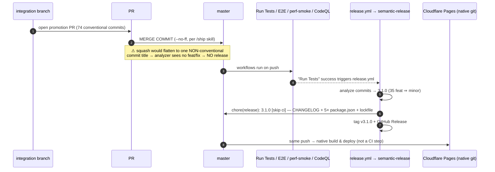

# Axoview Technical Review — 2026-07

> **Status:** Frozen-on-publish 2026-07-05 (post-labels/text-styling wave; `integration` @ `dee5d9d`, all packages `v3.0.3`, **v3.1.0 candidate** — [PR #58](https://github.com/molikas/axoview/pull/58) open at freeze). Reviewer-ready. This document is a snapshot — it does not track ongoing changes; the [ADRs](../adr/), [PLAN.md](../../PLAN.md), and the [living references](../README.md#living-references) are the current-truth artifacts. The prior [2026-06 review](technical-review-2026-06.md) is preserved unedited as the v2.0.1 snapshot; this artifact tracks the delta since, and — new this iteration — folds in the full `/audit` executive report (scorecard, UX-consistency / perf hot-path / coherence sweeps, risk register, prioritized recommendations).

## Table of contents

- [0. How to use this document](#0-how-to-use-this-document)
- [1. Executive summary](#1-executive-summary)
  - [1a. Health scorecard](#1a-health-scorecard)
  - [1b. Critical findings](#1b-critical-findings)
  - [1c. Positive highlights](#1c-positive-highlights)
- [2. Before / After](#2-before--after)
  - [2.1 At-a-glance comparison](#21-at-a-glance-comparison)
  - [2.2 What did *not* change](#22-what-did-not-change)
- [3. Architecture overview (delta)](#3-architecture-overview-delta)
  - [3a. Entity model — Label, name↔label decouple, zero-migration seeding](#3a-entity-model--label-namelabel-decouple-zero-migration-seeding)
  - [3b. Interaction machine — 11 → 13 handled modes](#3b-interaction-machine--11--13-handled-modes)
  - [3c. Chrome — the docked style strip and the portal contract](#3c-chrome--the-docked-style-strip-and-the-portal-contract)
  - [3d. Render substrate — Canvas2D node layer](#3d-render-substrate--canvas2d-node-layer)
  - [3e. History — sequence-stamped dual stacks](#3e-history--sequence-stamped-dual-stacks)
- [4. Flows](#4-flows)
- [5. Deployment & release topology](#5-deployment--release-topology)
  - [5a. Release automation (semantic-release)](#5a-release-automation-semantic-release)
  - [5b. The squash-merge release hazard](#5b-the-squash-merge-release-hazard)
  - [5c. CI gate inventory](#5c-ci-gate-inventory)
  - [5d. Bundle budgets](#5d-bundle-budgets)
- [6. Security posture](#6-security-posture)
- [7. File inventory (delta)](#7-file-inventory-delta)
- [8. Quality KPIs aggregate](#8-quality-kpis-aggregate)
  - [8a. Test inventory](#8a-test-inventory)
  - [8b. Coverage deep dive](#8b-coverage-deep-dive)
  - [8c. Static analysis](#8c-static-analysis)
  - [8d. Dependency graph health](#8d-dependency-graph-health)
  - [8e. God-file inventory](#8e-god-file-inventory)
  - [8f. Test:source LOC by package](#8f-testsource-loc-by-package)
  - [8g. Production runtime metrics](#8g-production-runtime-metrics)
  - [8h. UX consistency (audit Phase 5b)](#8h-ux-consistency-audit-phase-5b)
  - [8i. Performance hot-path (audit Phase 5c)](#8i-performance-hot-path-audit-phase-5c)
  - [8j. Experience coherence (audit Phase 5d)](#8j-experience-coherence-audit-phase-5d)
- [9. Decisions catalog](#9-decisions-catalog)
- [10. Reviewer prompts](#10-reviewer-prompts)
  - [10a. General quality + architecture review](#10a-general-quality--architecture-review)
  - [10b. Release-gate review (PR #58 / v3.1.0)](#10b-release-gate-review-pr-58--v310)
- [11. Open known issues](#11-open-known-issues)
- [12. Risk register](#12-risk-register)
- [13. Recommendations (P1 / P2 / P3)](#13-recommendations-p1--p2--p3)
- [14. Post-audit cleanup (2026-07-05, same session)](#14-post-audit-cleanup-2026-07-05-same-session)

---

## 0. How to use this document

**Audience.** An external reviewer (likely another AI agent) asked to assess Axoview's current state and suggest improvements. This iteration serves three lenses at once:

1. **General code-quality review** — architecture, testing, technical debt, maintainability.
2. **Release-gate review** — the snapshot freezes with [PR #58](https://github.com/molikas/axoview/pull/58) (`integration` → `master`, the labels & text-styling productization) **open**. Merging it is releasing `v3.1.0`. §[5b](#5b-the-squash-merge-release-hazard), §[10b](#10b-release-gate-review-pr-58--v310) and §[13](#13-recommendations-p1--p2--p3) P1 items are the pre-merge material.
3. **Audit report** — unlike the prior two reviews, this artifact embeds the full `/audit` skill output: A–F scorecard ([§1a](#1a-health-scorecard)), UX-consistency / perf hot-path / experience-coherence sweeps ([§8h](#8h-ux-consistency-audit-phase-5b)–[8j](#8j-experience-coherence-audit-phase-5d)), a risk register ([§12](#12-risk-register)) and a prioritized backlog ([§13](#13-recommendations-p1--p2--p3)).

**Reading order.** Read **1 → 2** for the mental model of the wave; jump to **§10** for review questions and **§12–§13** for the ranked outcomes. Treat §3–§8 as evidence. The [2026-06 review](technical-review-2026-06.md) remains the full-depth architecture narrative (system diagrams, sequence diagrams §4a–4f, deployment contract §5, file-by-file baseline §7) — **none of those contracts changed shape**, so this artifact does not restate them; it documents what moved on top.

**Snapshot facts.** Measured 2026-07-05 against `integration` @ `dee5d9d` (working tree clean). `origin/master` is at `2dbe177` (#57, 2026-06-25); integration is **74 commits ahead, 0 behind** (35 `feat` / 19 `fix` / 14 `docs` / 5 `test` / 1 `refactor`). Latest release: **v3.0.3** (2026-06-24); all five `package.json` files agree at `3.0.3` — the v1.1-era worker version drift stayed fixed across six consecutive cuts. The full span since the prior review is **v2.0.1 → HEAD: 104 commits, 498 files changed, +56,264 / −12,584 lines**.

**Corrections folded in from the 2026-06 artifact** (per the established convention — stated directly, lineage noted):

- **i18n is 13 locales, not 14.** The 2026-06 review (§3b) said "14 locales"; [`src/i18n/`](../../packages/axoview-lib/src/i18n/) has carried 13 locale files (incl. `en-US`) throughout — none was removed in this span.
- **"0 circular dependencies" was a measurement artifact.** The June figure came from `madge --circular src/index.ts`, which followed only 16 files. A full-tree scan (`madge --circular --ts-config tsconfig.json src/`, 432 files) reports **61 chains** ([§8d](#8d-dependency-graph-health)). This is a methodology correction, not a regression claim — the underlying barrel-file cycles predate the wave.
- **The single skipped lib test changed identity.** June's skip was `leanSave bundledFixtures[0]`; that test now runs ([leanSave.test.ts](../../packages/axoview-lib/src/utils/__tests__/leanSave.test.ts) uses the fixtures directly). Today's 1 skip is [`coordinateTransforms.test.ts:361`](../../packages/axoview-lib/src/utils/__tests__/coordinateTransforms.test.ts#L361) (grid-tile URL comparison, skipped because SVGs are mocked in jsdom). The corresponding [known_issues.md](../../known_issues.md) entry is stale ([§8j](#8j-experience-coherence-audit-phase-5d)).

**Vocabulary.** The load-bearing term pairs (browser-only = "Local mode", server-backed = "Session mode"; Dialog/Popover/Panel) are unchanged — see the [2026-06 review §0](technical-review-2026-06.md#0-how-to-use-this-document). New this cycle and equally load-bearing: **`name` vs `label`** — `name` is Layers-panel identity, never rendered on canvas; `label` (nodes) / `labels[]` (connectors) is the on-canvas text; **Label** capitalized is the free-floating first-class entity ([ADR 0031](../adr/0031-floating-label-entity-model.md), [ADR 0032](../adr/0032-node-name-caption-label-model.md)); **the strip** is the docked style-controls bar ([ADR 0030](../adr/0030-docked-style-controls-strip.md)).

---

## 1. Executive summary

The [2026-06 review](technical-review-2026-06.md) closed at **v2.0.1** — the end of the v1.1 quality wave, nineteen PRs of debt/test/refactor work with almost no product surface. Everything since is the opposite shape: **the largest product span in the project's history** — 104 commits, six releases (v2.1.0 → v3.0.3), 22 newly authored ADRs (0007 backfilled + 0012–0034, with 0016/0017 unused numbers), and a 74-commit unreleased productization cycle sitting at the promotion gate as PR #58. The repo grew from 584 to **791 tracked files**; the jest surface grew from 1,318 to **1,834 passing tests**, and the Playwright suite from 31 to **72 spec files** plus an engine-performance harness with its own CI gate.

**The span divides into five arcs**, each independently verifiable in commits/ADRs:

- **Error-UX close-out (v2.1.0, PR #27).** The prior review's #1 carried product gap — the [ADR 0011](../adr/0011-error-ux-contract.md) failure-of-intent Dialogs (save-failure / malformed-import / share-500) — **shipped the day after that review froze**. ADR 0007 (trace harness) was backfilled in the same PR; the "never authored" placeholder is gone.
- **Presentation & annotation + touch/pen (v2.1.x, Phase 6 + 6.5).** View-mode info popover ([0012](../adr/0012-view-mode-node-info-popover.md)), preview layer switcher ([0013](../adr/0013-preview-mode-layer-switcher.md)), ephemeral annotation overlay ([0014](../adr/0014-ephemeral-annotation-overlay.md)), label legibility scaling ([0015](../adr/0015-node-label-legibility-scaling.md)), and the touch/pen gesture contract ([0018](../adr/0018-touch-pen-gesture-contract.md)) with a dedicated `chromium-touch` Playwright project. The D-7 dual-history undo desync was fixed here via sequence stamping ([§3e](#3e-history--sequence-stamped-dual-stacks)).
- **Engine performance (v3.0.x + open sub-track).** Canvas2D became the default node render substrate ([0019](../adr/0019-canvas2d-node-render-layer.md)); paste went O(N³) → O(N+C) via a derived spatial `TileIndex` ([0021](../adr/0021-paste-algorithmic-perf-and-spatial-index.md)); a measurement-protocol'd perf harness landed with **deterministic anti-cheat assertions gated in CI** ([0020](../adr/0020-engine-perf-harness-and-measurement-protocol.md), [perf-smoke.yml](../../.github/workflows/perf-smoke.yml)). The pan-perf trilogy (#54/#55/#57) killed the rubber-band and decoupled culling from the pan frame; the **R1 synchronous-repaint floor remains open** ([known_issues.md](../../known_issues.md), [§11](#11-open-known-issues)).
- **Canvas UX overhaul + security hardening (v3.0.0, PRs #49–#52).** An opinionated pointer model (single-click select / double-click open / right-drag pan / right-tap context menu, pan customization removed — [0022](../adr/0022-canvas-pointer-interaction-model.md)), off-grid positioning ([0023](../adr/0023-off-grid-positioning-and-collision.md)), label drag/sizing ([0024](../adr/0024-node-label-positioning-and-sizing.md)), export robustness ([0025](../adr/0025-image-export-robustness-and-presets.md)), edge transform handles ([0026](../adr/0026-rectangle-edge-transform-handles.md)), the context menu as the per-item command surface ([0027](../adr/0027-canvas-context-menu.md)), a persona-driven journey-testing protocol ([0028](../adr/0028-ux-journey-testing-protocol.md)), and the DOMPurify sanitization contract for user-authored HTML ([0029](../adr/0029-sanitize-user-authored-html.md)) after CodeQL flagged the `dangerouslySetInnerHTML` sink. The wrangler v4 bump carried the span's only intentional `BREAKING CHANGE` and drove the v3.0.0 major.
- **Labels & text-styling productization (unreleased — the PR #58 payload).** The docked style strip as the single canonical styling surface ([0030](../adr/0030-docked-style-controls-strip.md)); the floating **Label** as a first-class entity ([0031](../adr/0031-floating-label-entity-model.md)); the node/connector **name↔label decouple** with idempotent load-time seeding — zero migration ([0032](../adr/0032-node-name-caption-label-model.md), [§3a](#3a-entity-model--label-namelabel-decouple-zero-migration-seeding)); text-style field conventions ([0033](../adr/0033-element-text-style-field-convention.md)); and inline canvas text editing with dual-scope strip formatting, retiring the rich-text popup ([0034](../adr/0034-inline-canvas-text-editing-and-dual-scope-strip-formatting.md)). Plus Docs-style Ctrl/Cmd+K link cards, per-element borders/opacity, a rotate handle, `topBarStyleControls` i18n across all 13 locales, and new perf-gate scenarios (incl. `measurePan`).

**Composition** is structurally unchanged: a Node 22 + npm 10 monorepo — [`axoview-lib`](../../packages/axoview-lib/) (React canvas library), [`axoview-app`](../../packages/axoview-app/) (SPA shell), [`axoview-backend`](../../packages/axoview-backend/) (Express + fs adapter), [`axoview-worker`](../../packages/axoview-worker/) (Hono on Cloudflare Pages Functions), plus [`axoview-e2e`](../../packages/axoview-e2e/) (Playwright). Four lib Zustand stores + the app notification store; the reducer purity contract and the [ADR 0010](../adr/0010-session-backend-contract.md) storage abstraction held through both product waves. Releases are now **fully automated by semantic-release** on merge to master ([`.releaserc.json`](../../.releaserc.json)) — six clean cuts in this span, versions in lockstep.

### 1a. Health scorecard

Grades follow the audit-skill dimensions. Where a sweep rule mandates a downgrade, the base grade and the adjustment are shown explicitly.

| Dimension | Grade | Basis (evidence in §) |
|---|---|---|
| Modularity & coupling | **B−** | Clean package graph, reducer/facade contracts held through two big waves; but 61 full-tree cycle chains incl. a real `utils → hooks` value-import inversion, and the new 2,421-LOC strip god-file ([§8d](#8d-dependency-graph-health), [§8e](#8e-god-file-inventory)). |
| Fragility & ease of change | **B → B− → B** | Feature slices land cleanly post-reshape; zero-migration data-model discipline held; thick regression floor. Downgraded one step per the coherence rule: three phantom root npm scripts reference Playwright projects that don't exist ([§8j](#8j-experience-coherence-audit-phase-5d)). *Downgrade trigger removed same-session — scripts fixed; grade restored to B ([§14](#14-post-audit-cleanup-2026-07-05-same-session)).* |
| Maintainability | **B+ → B** | Docs discipline exceptional (three-tier convention, ADR currency pass at wrap), knip hard-gated, `tsc --noEmit` clean, 0 production `any`/suppressions. Downgraded one step per the UX-consistency rule: inline `fontSize` drift class contains genuine violations; plus 161-file prettier drift and a stale docs index ([§8h](#8h-ux-consistency-audit-phase-5b), [§8c](#8c-static-analysis)). |
| Vibe coding / AI-friendliness | **A−** | Complete types, colocated tests, greppable naming, an ADR trail that answers "why" for every contract. Deductions: formatting drift, five >1,000-LOC files. |
| State architecture | **A−** | Reducer purity + transaction batching preserved; sequence-stamped dual-history fix is principled ([§3e](#3e-history--sequence-stamped-dual-stacks)); Label entity extended the model without a migration ([§3a](#3a-entity-model--label-namelabel-decouple-zero-migration-seeding)). Residuals: `reducers/types.ts` local cycles, connector drag still committing per-tile model writes. |
| Performance architecture | **B+** | Canvas2D substrate, O(N+C) paste, compositor drag, culling decoupled, anti-cheat perf harness in CI — genuine engineering. Open: R1 pan repaint floor, ~9.2 MB lazy icon chunk, entry chunk over gzip target. No 5c high-severity violations → no downgrade ([§8i](#8i-performance-hot-path-audit-phase-5c)). |
| Security posture | **B+** | 0 high/critical anywhere; the two low quill advisories are DOMPurify-mitigated at the sink ([ADR 0029](../adr/0029-sanitize-user-authored-html.md)); CodeQL runs two languages; auth surface tested. Residuals: CSP `'unsafe-inline'` style-src, preview-deploy exposure unguarded at runtime ([§6](#6-security-posture)). |
| Test architecture | **B** | 1,834 unit/integration tests + 72 e2e specs + perf harness; backend/worker contract suites healthy. The coverage story is honest but inverted: components 9% stmts with e2e compensating, and the CI floor (10%) is far below actual (37%) so it gates nothing ([§8b](#8b-coverage-deep-dive)). |

**Overall: B+.** The wave shipped an unusually large product surface while *improving* every measured quality number that CI gates (lint 44 → 6 warnings, tsc red → clean, tests +516, e2e specs +41). The debts that accumulated are concentrated, named, and — with one exception — already catalogued by the project itself; the exception is the release-trigger hazard below.

### 1b. Critical findings

Numbered; all are actionable before or at the PR #58 merge. Detail and evidence in the linked sections. *Status at publish: #1 guarded, #2 fixed, #4 fixed — and a fifth, larger finding (the red e2e gate) surfaced and was resolved in the same session; see [§14](#14-post-audit-cleanup-2026-07-05-same-session). #3 (prettier) is deliberately deferred to immediately after the merge.*

1. **The v3.1.0 release fires only if PR #58 is merged with a merge commit — and every promotion in repo history is a squash.** All prior `integration` → `master` promotions are single-parent squashes; the analyzer never saw their inner conventional commits (that is exactly the documented #49/#50 changelog-backfill incident, and why #57 sits unreleased on master today). PR #58's own body says "on merge, semantic-release auto-cuts 3.1.0 — driven by the feat commits," which is true **only** for a merge commit; its title is not a conventional commit, so a squash cuts *nothing*. The freshly updated [`/ship` skill](../../.claude/commands/ship.md) does prescribe a `--no-ff` merge commit — but the repo still allows all three merge methods, so the discipline is one button-click from failing silently. → [§5b](#5b-the-squash-merge-release-hazard), P1-1 in [§13](#13-recommendations-p1--p2--p3).
2. **Three dead root npm scripts** — `test:smoke`, `test:e2e` (`--project=firefox`), `test:visual` reference Playwright projects that do not exist in [`playwright.config.ts`](../../packages/axoview-e2e/playwright.config.ts) (projects: `chromium`, `chromium-touch` only). Anyone (or any agent) following the scripts gets "Project(s) not found". → [§8j](#8j-experience-coherence-audit-phase-5d).
3. **Prettier drift, 161 files.** `npx prettier --check` fails on 161 of ~447 lib source files. Prettier is not a CI gate, so this is drift, not breakage — but it silently poisons future diffs and contradicts the formatting-consistency premise of the AI-friendliness posture. Decide: enforce (one-shot `--write` + CI check) or drop the config. → [§8c](#8c-static-analysis).
4. **The coverage gate is decorative.** Lib actual: 37.4% statements; CI floor: 10% ([jest.config.js](../../packages/axoview-lib/jest.config.js)). A regression that halved the tested core would pass CI. Ratchet to ~30% now that the number is real. → [§8b](#8b-coverage-deep-dive).

### 1c. Positive highlights

- **The v1.1 promises held.** Worker version lockstep survived six releases; knip was promoted from soft- to **hard-fail** exactly as the close-out planned ([test.yml](../../.github/workflows/test.yml)); the June review's tsc-red known issue (perf-fixture type drift) is fixed — `tsc --noEmit` is clean.
- **The June review's #1 product gap closed in one day.** ADR 0011 Dialogs shipped as v2.1.0's headline (#27); ADR 0007 was backfilled in the same PR.
- **Release automation is real.** Six cuts, zero hand-edited versions/changelogs, all five packages in lockstep at every tag — verified at this freeze.
- **Perf work is measured, not vibes.** The harness has *anti-cheat* assertions (draw-count == N, connector-paint == committed connectors, paste N → 2N) hard-gated in CI — a discipline most projects never build. The pan fix that shipped was profiled; the one that didn't (R1) is parked with a written design ([pan-r1-design.md](../../perf-results/pan-r1-design.md)) instead of a speculative rewrite, and the full engine rewrite was explicitly **declined** against an unratified mandate (PLAN.md ENG-T3/T4).
- **Zero-migration data-model evolution, done honestly.** Every ADR 0030–0034 field is optional; `label` seeding is pure + idempotent at the load chokepoint; the one true data relocation (description → notes fold) is called out in ADR 0032 as *not* qualifying for the carve-out, with explicit behavior. This is how you evolve a schema with an installed base.
- **The review loop demonstrably closes.** Of the June review's 21 reviewer prompts, nearly all were actioned or consciously deferred; the notable exception (globbing `update-version.js`, June Q9) is carried in [§13](#13-recommendations-p1--p2--p3). The known-issue register shrank materially ([§11](#11-open-known-issues)).

---

## 2. Before / After

"Before" anchors at **v2.0.1** (2026-06-10, the prior review's freeze); "After" is `integration` @ `dee5d9d` (2026-07-05). Citations are PRs, commits, ADRs, or sections of this artifact.

### 2.1 At-a-glance comparison

| Dimension | Before (v2.0.1) | After (2026-07-05) | Evidence |
|---|---|---|---|
| **Version / releases** | v2.0.1 | v3.0.3 released; **v3.1.0 pending PR #58** (74 commits) | git tags; [§5a](#5a-release-automation-semantic-release) |
| **ADRs authored** | 10 (0007 never authored) | **32** (0007 backfilled; 0012–0034 added; 0016/0017 unused numbers) | [§9](#9-decisions-catalog) |
| **ADR 0011 Dialog gaps** | Open — the #1 carried product gap | **Closed** (save/import/share Dialogs, PR #27, v2.1.0) | [CHANGELOG v2.1.0](../../CHANGELOG.md) |
| **Jest totals** | 1,318 + 1 skipped / 116 suites | **1,834 + 1 skipped / 172 suites** (lib 1,481 / app 150 / backend 101 / worker 102) | [§8a](#8a-test-inventory) |
| **E2E surface** | 31 spec files (~58 cases), Chromium only | **72 spec files / 146 cases**, `chromium` + `chromium-touch`, + engine-perf harness | [§8a](#8a-test-inventory) |
| **Lint debt** | 0 errors / 44 warnings | **0 errors / 6 warnings** | [§8c](#8c-static-analysis) |
| **`tsc --noEmit` (lib)** | Red (~17 errors, perf-fixture drift; June §11) | **Clean** | [§8c](#8c-static-analysis) |
| **Interaction modes** | 11 | **13** handled modes (+ `LABEL`, `TEXTBOX.TRANSFORM`) | [§3b](#3b-interaction-machine--11--13-handled-modes) |
| **Node render substrate** | DOM/emotion nodes | **Canvas2D default** ([ADR 0019](../adr/0019-canvas2d-node-render-layer.md)); DOM overlay for selection/edit | [§3d](#3d-render-substrate--canvas2d-node-render-layer) |
| **Styling surface** | Per-type panels (+ rich-text popup) | **Docked strip** = single canonical surface; popup retired ([ADRs 0030/0034](../adr/)) | [§3c](#3c-chrome--the-docked-style-strip-and-the-portal-contract) |
| **On-canvas text model** | `name` doubled as canvas text | **`name` (identity) ↔ `label`/`labels[]` (canvas) decoupled**, seeded at load, zero-migration; floating **Label** entity | [§3a](#3a-entity-model--label-namelabel-decouple-zero-migration-seeding) |
| **Undo/redo across stores** | D-7 dual-stack skew (known issue) | **Fixed** — shared monotonic sequence stamping ([historySequence.ts](../../packages/axoview-lib/src/stores/historySequence.ts)) | [§3e](#3e-history--sequence-stamped-dual-stacks) |
| **Sanitization** | None at the innerHTML sink | **DOMPurify at every load/seed/commit/render path** + `stripHtmlTags` fixpoint ([ADR 0029](../adr/0029-sanitize-user-authored-html.md)) | [§6](#6-security-posture) |
| **Knip (dead code)** | Soft-fail | **Hard-fail CI gate** (promoted 2026-06-10) | [test.yml](../../.github/workflows/test.yml) |
| **Perf gating** | None | **perf-smoke.yml** — deterministic anti-cheat assertions on PR + master | [§5c](#5c-ci-gate-inventory) |
| **CodeQL** | `javascript-typescript` | + **`actions`** language | [codeql.yml](../../.github/workflows/codeql.yml) |
| **Tracked files** | 584 | **791** (lib 447, e2e 97, docs 48) | [§7](#7-file-inventory-delta) |
| **Largest source file** | `DiagramLifecycleProvider.tsx` 1,488 | **`TopBarStyleControls.tsx` 2,421** | [§8e](#8e-god-file-inventory) |
| **`dom-to-image-more`** | Transitive-only (June §11) | **Declared** in [axoview-lib/package.json](../../packages/axoview-lib/package.json) | closed item |
| **wrangler** | v3 | **v4.103** (the v3.0.0 `BREAKING CHANGE`) | PR #51 |

### 2.2 What did *not* change

- **The deployment contract.** Three targets, one HTTP contract, storage-less Worker (503 short-circuit), single `/api/config` probe with 800 ms timeout. [`app.ts`](../../packages/axoview-worker/src/app.ts) is byte-stable at 54 LOC (`onError` :22, catch-all 503 :51). ADRs 0009/0010 untouched; the [2026-06 §4–§5 diagrams](technical-review-2026-06.md#4-sequence-diagrams) remain accurate.
- **The four-store topology + reducer purity.** `modelStore` / `sceneStore` / `uiStateStore` / `localeStore` in the lib, notifications in the app; every mutation still routes through pure `(payload, state) → State` reducers with immer, history batched via `transaction()`. The wave *added* a reducer module ([`label.ts`](../../packages/axoview-lib/src/stores/reducers/label.ts)) rather than bending the pattern.
- **Auth, storage isolation, CSP.** `AUTH_MODE` triple, single-tenant-per-deploy posture (warning intact at [deployment.md:15](../deployment.md)), public-namespace carve-out, and the exact CSP string incl. its known `'unsafe-inline'` style-src residual.
- **Backend & worker.** 15 + 11 tracked files, same route contract, same test counts (101/102) — the server side sat this wave out entirely.
- **Distribution deferrals.** No npm publish, no Docker Hub image, no GH-Actions-mediated CF deploy (Locked Decisions #11/#12/#14). Google auth/Drive (3A/3B) still the next major deferred phase.

---

## 3. Architecture overview (delta)

Structure, package graph, and store topology are as documented in the [2026-06 review §3](technical-review-2026-06.md#3-architecture-overview). Five things genuinely changed shape:

### 3a. Entity model — Label, name↔label decouple, zero-migration seeding

The model gained one entity and one invariant:

- **Label** ([ADR 0031](../adr/0031-floating-label-entity-model.md)) — a free-floating, strip-stylable text chip, first-class in the model (own reducer, own interaction mode, full-chip hit target, rendered above nodes). The E3 measurement decided its render substrate is Canvas2D (ADR 0031 addendum).
- **`name` ↔ `label` decouple** ([ADR 0032](../adr/0032-node-name-caption-label-model.md)) — `name` is Layers-panel identity and never renders on canvas; nodes carry an optional `label`, connectors carry `labels[]`. Render source is `label ?? name` fallback, and the installed base is handled by **pure, idempotent load-time seeding** at the normalization chokepoint: [`seedNodeLabel`](../../packages/axoview-lib/src/utils/seedNodeLabel.ts) copies `name` → `label` once; [`seedConnectorLabel`](../../packages/axoview-lib/src/utils/seedConnectorLabel.ts) folds `name` into a midpoint label and stamps `nameSeeded: true` so a later Layers rename is never re-seeded. No migration converter exists or is needed; every new field is optional. The one true data *relocation* (node `description` → notes fold) is explicitly excluded from the zero-migration carve-out and documented with its own idempotency rule (ADR 0032).

Reviewer-relevant consequence: **the migration window closes at the v3.1.0 merge** — every data-model slice landed before the promotion, which is precisely why PR #58 is a single large release rather than several.

### 3b. Interaction machine — 11 → 13 handled modes

The module-handler map at [`useInteractionManager.ts:48`](../../packages/axoview-lib/src/interaction/useInteractionManager.ts#L48) now routes 13 modes: `CURSOR`, `DRAG_ITEMS`, `RECTANGLE.DRAW`, `RECTANGLE.TRANSFORM`, `CONNECTOR`, `PAN`, `PLACE_ICON`, `TEXTBOX`, **`TEXTBOX.TRANSFORM`** (manual resize/rotate frame, ADR 0034), **`LABEL`** (ADR 0031), `LASSO`, `FREEHAND_LASSO`, `RECONNECT_ANCHOR` — plus the `INTERACTIONS_DISABLED` early-return for `NON_INTERACTIVE`. The pointer model on top is [ADR 0022](../adr/0022-canvas-pointer-interaction-model.md)'s: single-click select, double-click open, right-drag pan vs right-tap context menu split by tap-slop, Esc always returns to Select; window-level `contextmenu`/`dblclick` listeners are owned centrally by the manager (single gesture owner — verified in [§8j](#8j-experience-coherence-audit-phase-5d)). The file grew to 1,661 LOC ([§8e](#8e-god-file-inventory)) while keeping per-function complexity below the S3776 bar the v1.1 wave established.

### 3c. Chrome — the docked style strip and the portal contract

[ADR 0030](../adr/0030-docked-style-controls-strip.md) makes the strip the **only** styling surface (per-type Style tabs retired; the rich-text popup retired by [ADR 0034](../adr/0034-inline-canvas-text-editing-and-dual-scope-strip-formatting.md)). Mechanically it follows the established lib→app portal contract: the lib renders [`TopBarStyleControls`](../../packages/axoview-lib/src/components/TopBarStyleControls/TopBarStyleControls.tsx) into a new **`styleControlsPortalTarget`** ([Axoview.tsx:84](../../packages/axoview-lib/src/Axoview.tsx#L84)) the app provides in its toolbar, alongside the existing `toolbarPortalTarget` (with deprecated `menuPortalTarget` alias) and `sidebarTogglePortalTarget`. Formatting applies with **dual scope** (ADR 0034): whole-content when not editing, live-range when an inline edit session is active; bulk styling works across homogeneous multi-selections with a relative font-size stepper. The cost of "one surface for every element type" is visible in [§8e](#8e-god-file-inventory): the strip is now the largest file in the repo (2,421 LOC), a decomposition candidate PR #58 explicitly deferred rather than churn pre-merge.

### 3d. Render substrate — Canvas2D node layer

[ADR 0019](../adr/0019-canvas2d-node-render-layer.md): nodes draw on a Canvas2D layer by default (flag removed), with the DOM path retained for selected/editing nodes and hit-testing via [`NodeLabelHitLayer`](../../packages/axoview-lib/src/components/SceneLayers/Nodes/). Spawn cost −41% @1,000 nodes; scales to ~2,000. Two deferred residuals are honestly tracked in [known_issues.md](../../known_issues.md): unselected-node notes/link badges and connectors are not yet drawn by the canvas path, and the R1 pan repaint floor ([§11](#11-open-known-issues)) is the flip side of canvas becoming the bulk renderer. The final fix of the wave (`1740713`) closed the class of "DOM-only affordances lost when a node deselects" for linked labels — the canvas and hit layers are now headerLink-aware.

### 3e. History — sequence-stamped dual stacks

The June-era D-7 known issue (model-store and scene-store history stacks skewing on interleaved ops) was closed by [`historySequence.ts`](../../packages/axoview-lib/src/stores/historySequence.ts): every history entry either store pushes is stamped with a shared monotonic sequence allocated at each logical-action boundary (`set` / `transaction` / `beginDragTransaction`), and undo/redo reverts only the stack(s) whose top carries the boundary's sequence — one keystroke, one logical action, regardless of which stores participated. Guarded by the previously-skipped, now-green coherence spec ([undo.dualStackSkew.test.tsx](../../packages/axoview-lib/src/__perf_refactor_regression__/undo.dualStackSkew.test.tsx)).

---

## 4. Flows

The six sequence diagrams in the [2026-06 review §4](technical-review-2026-06.md#4-sequence-diagrams) (boot/mode detection, save both modes, share, diagram-links, Worker lifecycle) were re-verified against HEAD and are **unchanged** — line anchors in [`app.ts`](../../packages/axoview-worker/src/app.ts) still hold (`onError` :22, body-limit :31, 503 :51). The new user-facing flows of this span (inline edit sessions, dual-scope strip formatting, Ctrl/Cmd+K link cards, label seeding) are specified with actors and acceptance criteria in [ADRs 0030–0034](../adr/) — this artifact does not duplicate them. One flow is new *infrastructure* and worth a diagram because §5b's hazard lives inside it:

---

## 5. Deployment & release topology

Deploy targets, env-var contracts, mode detection, and the dual-`wrangler.toml` posture are unchanged from the [2026-06 review §5](technical-review-2026-06.md#5-deployment-topology). What changed is everything around *releasing*:

### 5a. Release automation (semantic-release)

[`.releaserc.json`](../../.releaserc.json) runs the full chain on `master`: conventional-commit analysis (`feat`→minor, `fix`/`perf`/`refactor`→patch, `BREAKING CHANGE`→major), release-notes generation, CHANGELOG write, `update-version` sync across all five `package.json` files + lockfile, git-commit `chore(release): x.y.z [skip ci]`, GitHub Release + tag. Six cuts fired in this span:

| Tag | Date | Driver |
|---|---|---|
| v2.1.0 | 2026-06-11 | `feat(error-ux)` — ADR 0011 Dialogs + ADR 0007 backfill (#27) |
| v2.1.1 | 2026-06-14 | annotation fixes (#33) + docs reorganization |
| **v3.0.0** | 2026-06-22 | **major** — wrangler v4 `BREAKING CHANGE` (#51); carries #49/#50 content via a hand-written changelog backfill (their squash titles weren't conventional) |
| v3.0.1 | 2026-06-22 | connector tool unlock (#52) |
| v3.0.2 | 2026-06-23 | pan rubber-band + endpoint hit-halo (#54) |
| v3.0.3 | 2026-06-24 | culling decoupled from pan frame (#55) |

[`scripts/update-version.js`](../../scripts/update-version.js) still **enumerates** the five package.json paths rather than globbing `packages/*/package.json` — the June review's Q9 recommendation was not adopted. It has held correct for six releases (verified: all five files read `3.0.3` at freeze), but the next package added can still be silently omitted; the recommendation carries forward ([§13](#13-recommendations-p1--p2--p3) P2).

### 5b. The squash-merge release hazard

This is [§1b](#1b-critical-findings) finding #1, with the full evidence:

- **History:** every `integration` → `master` promotion to date is a **single-parent squash** (verified: `8c1b2fa`, `b67fad4`, `2dbe177`, `83e7c2b` all have 1 parent). When the squash title was conventional (`fix(canvas): …` #52/#54), a release fired; when it was not (`Promote integration → master: …` #49, `Canvas UX overhaul …` #50, `Canvas UX shake-out …` #57), **nothing fired** — #49/#50's notes had to be hand-backfilled into the v3.0.0 changelog section (the blockquote is still there), and **#57 sits on master unreleased today**.
- **The stake this time:** PR #58 carries 35 `feat` commits and promises v3.1.0 in its body. Its title — "Labels & text-styling productization (integration → master)" — is not a conventional commit. Squash ⇒ no release, no changelog, and the third backfill incident; merge commit ⇒ correct minor bump with full generated notes.
- **Guidance exists but isn't enforced:** the updated [`/ship` skill](../../.claude/commands/ship.md) prescribes a non-fast-forward merge commit, and repo settings still allow merge/squash/rebase alike (`allow_squash_merge: true`).

**Cheapest durable fixes:** disable squash + rebase for this repo (Settings → one toggle each), or — if squash flexibility is wanted for non-promotion PRs — adopt "promotion PR titles must be conventional" as a hard rule and retitle #58 (e.g. `feat(canvas): labels & text-styling productization`) before merging. A post-merge assertion (CI job on master: newest tag == root package.json version) would catch a silent no-release within minutes instead of at the next audit.

### 5c. CI gate inventory

| Gate | Workflow | Mode | Delta since 2026-06 |
|---|---|---|---|
| ESLint | [test.yml](../../.github/workflows/test.yml) | hard-fail (`npx eslint .`) | baseline now 0 / 6 warnings |
| Jest + coverage | test.yml | hard-fail; **floor still 10%, lib-only** | unchanged gate — now far below actual (37%); see [§1b](#1b-critical-findings) #4 |
| Build + output shape | test.yml | hard-fail (`_routes.json`, `_headers` present) | unchanged |
| **Knip dead-code** | test.yml | **hard-fail** | **promoted from soft-fail** (2026-06-10); clean at freeze |
| Worker bundle ≤ 1 MB | test.yml | hard-fail | 93,033 B (~8.9% of budget) |
| E2E Playwright | [e2e-playwright.yml](../../.github/workflows/e2e-playwright.yml) | hard-fail, PR → master *and* integration | spec set 31 → 72 files |
| **Perf smoke** | [perf-smoke.yml](../../.github/workflows/perf-smoke.yml) | **new** — deterministic anti-cheat assertions (draw-count, connector-paint, paste 2N, idle-churn) | timing certification stays manual `npm run perf` by design |
| CodeQL | [codeql.yml](../../.github/workflows/codeql.yml) | hard-fail | + `actions` language |
| Dependabot | dependabot.yml + [dependabot-automerge.yml](../../.github/workflows/dependabot-automerge.yml) | weekly grouped; minor/patch automerge | unchanged posture |
| Release | release.yml → semantic-release | on master, gated on Run Tests | see [§5a](#5a-release-automation-semantic-release)/[§5b](#5b-the-squash-merge-release-hazard) |
| Node matrix | test.yml | 22.x / 24.x | unchanged |

Prettier remains **ungated** anywhere — relevant to [§1b](#1b-critical-findings) #3.

### 5d. Bundle budgets

Measured at freeze (local builds, same commands CI runs):

| Artifact | Size | Budget / target | Verdict |
|---|---|---|---|
| Worker bundle | **93,033 B** uncompressed | < 1 MB hard (CI) | ✅ ~9% of budget (was 92,057) |
| Lib dist | CJS 1,568.6 kB + **ESM 1,460.6 kB** | — | ✅ both formats ship (tree-shakable ESM present) |
| App total | 13,794 kB / **2,671 kB gzip** | — | see below |
| App entry (`index.js`) | 870.4 kB / **234.0 kB gzip** | < 500 kB gz floor / < 200 kB gz target | ⚠️ over target, under floor |
| Largest async chunk | **9,182.9 kB / 1,470 kB gzip** | flag > 1 MB | ⚠️ the `@isoflow/isopacks` icon-pack payload — lazy-loaded, pre-existing, splash-covered; still the single biggest perceived-perf lever on slow networks |
| Other async chunks | 1,139 kB and 1,023 kB uncompressed (222/271 kB gz) | flag > 1 MB | ⚠️ two chunks just over the uncompressed flag line (editor/quill + MUI clusters) |

---

## 6. Security posture

Auth model, isolation model, header set, and CI scanning posture are as per the [2026-06 review §6](technical-review-2026-06.md#6-security-posture); nothing weakened. What this span **added** is an actual sanitization contract and fresh audit data:

- **`npm audit --workspaces` (2026-07-05): 0 critical / 0 high / 1 moderate / 2 low.** The moderate is dev-only (`js-yaml < 3.15.0` under `@istanbuljs/load-nyc-config` — jest's coverage tooling, not shipped). The two lows are `quill@2.0.3` (GHSA-v3m3-f69x-jf25, XSS via HTML export) reached through `react-quill-new`; the upstream fix requires a breaking `react-quill-new@3.7` bump. **Mitigation in place:** per [ADR 0029](../adr/0029-sanitize-user-authored-html.md), every user-authored-HTML path — load, seed, commit, paste (double-sanitized), render — passes through DOMPurify before the single `dangerouslySetInnerHTML` sink; [`sanitizeHtml.ts`](../../packages/axoview-lib/src/utils/sanitizeHtml.ts) is at 100% test coverage.
- **Link-card URL surface (new in the PR #58 payload)** was security-reviewed pre-merge: `javascript:` / `data:` / `vbscript:` schemes neutralized at write *and* render sinks; `#diagram:<id>` internal links resolve only to a same-origin SPA `navigate`. Two benign follow-ups are logged (not hidden): `mailto:`/`tel:` links get mangled by the http-only render guard, and the `#diagram:` id is unvalidated (harmless today — a bad id dead-ends in the explorer).
- **`stripHtmlTags` fixpoint** replaced the single-pass regex strips CodeQL flagged (4 high alerts resolved at source); the residual single-pass strips that remain are in non-sink plain-text paths and are tracked as CodeQL nits, not vulnerabilities.
- **CodeQL** now also analyzes the `actions` workflows language.
- **Carried, unchanged:** CSP `'unsafe-inline'` in `style-src` (MUI/emotion residual); `*.pages.dev` preview exposure if an operator overrides `AUTH_MODE=none` (default remains `shared-token`; runtime guard still unbuilt); no structured request logging on Express (observability ADR still unwritten); single-tenant-per-deploy warning intact and prominent ([deployment.md:15](../deployment.md)).

---

## 7. File inventory (delta)

The [2026-06 review §7](technical-review-2026-06.md#7-file-by-file-inventory) remains the row-level baseline. The repo is now **791 tracked files** (was 584; +207 net):

| Package / segment | 2026-07 | 2026-06 | Notes |
|---|---|---|---|
| `axoview-lib` | **447** | 349 | The wave's center of mass: `TopBarStyleControls/`, `CanvasContextMenu/`, `Label/` (+ mode + reducer), `AnnotationLayer/` + `AnnotationPalette/`, `NodesCanvas` + hit layer, link cards (`ElementLinkCard`, `TextBoxLinkCard`), `ViewModeInfoPopover/`, `PreviewLayerSwitcher/`, `ModeHint/`, `NodeActionBar/`, `spatialIndex`, `historySequence`, seeding utils, `sanitizeHtml`, rich-text transforms, + their test suites (145 spec files, was 94) |
| `axoview-app` | 108 | 102 | `DiagnosticsOverlay` growth, storage/link-registry tests (16 suites, was 11) |
| `axoview-backend` | 15 | 15 | untouched |
| `axoview-worker` | 11 | 11 | untouched |
| `axoview-e2e` | **97** | 50 | 72 specs (was 31), per-surface `pom/`, `perf/` harness (engine-perf.spec.ts + config + results protocol), touch specs |
| `docs/` | **48** | 19 | +22 ADRs, [README.md index](../README.md), [ux-principles.md](../guidelines/ux-principles.md), [perf-troubleshooting.md](../guidelines/perf-troubleshooting.md), [testing.md](../guidelines/testing.md), [workflow.md](../workflow.md) promoted to living references (the 2026-06 "Path B" reorganization), this artifact |
| repo shell (root, `.github/`, `scripts/`, `perf-results/`) | ~65 | ~38 | perf-smoke + dependabot-automerge workflows, perf-results protocol/designs, skills under `.claude/commands/` |

Net line delta v2.0.1 → HEAD: **+56,264 / −12,584 across 498 files** — insertions dominated by lib product surface + tests + ADR corpus, deletions by the strip/deck unification (dead panel editors, dead i18n keys purged) and the rich-text popup retirement.

---

## 8. Quality KPIs aggregate

Everything measured fresh at `dee5d9d` on 2026-07-05 (not carried forward). Reproduction commands, incl. the one footgun: lib/app/worker run bare `npx jest`; **backend must run via `npm test --workspace=packages/axoview-backend`** — the package is ESM and its test script sets `NODE_OPTIONS=--experimental-vm-modules`; bare `npx jest` fails all 7 suites with "Cannot use import statement outside a module". CI is unaffected (it goes through workspace scripts). Full-tree cycle scan: `npx madge --circular --ts-config tsconfig.json src/` from `packages/axoview-lib`.

### 8a. Test inventory

| Surface | Suites / files | Tests | vs 2026-06 |
|---|---|---|---|
| Jest — lib | 145 | 1,481 passing + 1 skipped (4 snapshots) | 94 / 1,029+1 |
| Jest — app | 16 | 150 | 11 / 86 |
| Jest — backend | 7 | 101 | unchanged |
| Jest — worker | 4 | 102 | unchanged |
| **Jest total** | **172** | **1,834 + 1 skipped** | 116 / 1,318+1 |
| Playwright E2E | **72 spec files** | 146 top-level cases | 31 / ~58 |
| Playwright projects | `chromium`, `chromium-touch` | touch specs scoped by `testMatch` | was Chromium-only |
| Engine perf harness | [engine-perf.spec.ts](../../packages/axoview-e2e/perf/engine-perf.spec.ts) (~1,500 LOC) | spawn / paste / drag / idle-churn / label & connector stress / **measurePan** scenarios | new (ADR 0020 + E-slice addendum) |
| Coverage floor (CI) | 10% ×4 dims, **lib only** | unchanged since v1.0 | see [§8b](#8b-coverage-deep-dive) |

The single skipped test is `coordinateTransforms.test.ts:361` (SVGs mocked in jsdom) — a different skip than June's; see [§0 corrections](#0-how-to-use-this-document).

### 8b. Coverage deep dive

Lib totals (istanbul, 270 instrumented files): **statements 37.43% (4,773/12,752) · branches 25.05% (1,990/7,943) · functions 31.63% (824/2,605)**. Per-area rollup:

| Area | Files | Stmts | Branch | Reading |
|---|---|---|---|---|
| `schemas/` | 13 | **99.2%** | 94.1% | model validation effectively fully pinned |
| `stores/reducers/` | 8 | **89.0%** | 70.7% | the mutation layer — the risk-bearing core — is solid |
| `utils/` | 43 | 78.2% | 67.7% | core math (isoMath 87.8%, spatialIndex 96.4%, sanitizeHtml 100%) strong; stragglers are render-side helpers (`renderer.ts` 34.7%, `labelChip.ts` 22.5%, `connectorLabels.ts` 31.8%) |
| `stores/` (ex reducers) | 5 | 74.7% | 57.1% | |
| `interaction/` | 19 | 59.1% | 54.3% | every mode handler has a real-module suite; branch tails are the exotic pointer paths |
| `hooks/` | 25 | 47.0% | 39.6% | `useSceneActions` partially covered; several UI hooks untested |
| **`components/`** | **116** | **9.0%** | **3.6%** | the inversion: UI is e2e-covered, not unit-covered |
| `i18n/` | 14 | 4.9% | — | dictionaries; coverage meaningless |

**Honest read:** the 37% headline is structurally an average of a well-tested engine (schemas/reducers/utils/interaction) and a nearly unit-untested component tree that 72 e2e specs exercise from outside. The project knows this — [testing.md §Known Coverage Gaps](../guidelines/testing.md#known-coverage-gaps) catalogues the remaining e2e-only gaps by name (image-export label legibility, connector "Add label" fall-through, "Add note" per type, text-color/no-color picker) with the exact spec+assertion to add, and PR #58 closed the two highest-risk unit gaps (RECT-1 drag-chrome, textbox schema round-trip) as wrap guards. Two structural asks remain: ratchet the 10% CI floor toward the real number so the tested core can't silently erode ([§1b](#1b-critical-findings) #4), and treat `components/` new-code with a "new components ship with a spec" norm rather than chasing the backlog.

### 8c. Static analysis

| Metric | Value | vs 2026-06 | Notes |
|---|---|---|---|
| ESLint (repo) | **0 errors / 6 warnings** | 0 / 44 | 4× `react-hooks/exhaustive-deps`, 1 unused var, 1 unused disable-directive — all in lib; files: `Connector.tsx`, `ViewModeInfoPopover.tsx`, `useInteractionManager.ts`, `usePanHandlers.ts`, `AnnotationLayer.tsx` |
| `tsc --noEmit` (lib) | **clean** | ~17 errors | June's §11 perf-fixture type-drift item is closed |
| Production `: any` | **0** | 0 | single grep hit is a comment; rule remains `error` |
| `@ts-ignore` / `@ts-nocheck` | **0 production** (17, all in test files) | — | within the <5-production threshold trivially |
| `eslint-disable` (prod source) | 32 | — | mostly scoped single-rule disables |
| Prettier | **161 files non-compliant** | not measured in June | ungated; [§1b](#1b-critical-findings) #3 |
| Memoization sites (lib prod) | 443 (`React.memo`/`useMemo`/`useCallback`) | — | consistent with the perf posture |

Config nit: [`eslint.config.mjs`](../../eslint.config.mjs) ignores `dist`/`build`/`coverage` but not `.worker-build*/`, so a stale local worker build gets linted (it contributed a phantom warning during this audit). One-line fix.

### 8d. Dependency graph health

Full-tree madge: **61 circular chains** across 432 files (June's "0" was entry-point-scoped — see [§0](#0-how-to-use-this-document)). They collapse into five structural classes:

1. **The barrel spine (~50 of 61):** `types/index → types/axoviewProps → types/model → schemas/index → schemas/model → schemas/validation → utils/index → utils/*` and back. Type-heavy; erased edges soften the runtime risk, but the barrels make every utils file a potential cycle member and drag tree-shaking.
2. **A genuine layering inversion:** [`utils/findNearestUnoccupiedTile.ts:2`](../../packages/axoview-lib/src/utils/findNearestUnoccupiedTile.ts#L2) **value-imports `useScene` from hooks**, pulling `hooks → stores → reducers` into the utils graph (30 of the 61 chains). A util that needs scene data should take it as a parameter; this one edge accounts for most of the runtime-relevant cycle mass.
3. **Reducer-local cycles:** `stores/reducers/types.ts ↔ {connector, label, rectangle, textBox, view, viewItem}` — the shared-types module imports the reducers it types.
4. `types/index ↔ types/interactions` (2-node).
5. **Component-level:** `Axoview.tsx → UiOverlay → ExportImageDialog → Axoview.tsx` — deliberate (the export dialog mounts a hidden `<Axoview>` instance to render the exportable scene, [ExportImageDialog.tsx:38](../../packages/axoview-lib/src/components/ExportImageDialog/ExportImageDialog.tsx#L38)), but it means the library's root component is importable from its own dialog tree.

No cross-package cycles; the package graph itself is clean.

### 8e. God-file inventory

31 production source files exceed 400 LOC (lib+app, excluding i18n/tests). The top of the table, with June comparison where the file existed:

| File | LOC | 2026-06 | Note |
|---|---|---|---|
| [TopBarStyleControls.tsx](../../packages/axoview-lib/src/components/TopBarStyleControls/TopBarStyleControls.tsx) | **2,421** | — (new) | the strip — every element type's styling in one component; top decomposition candidate |
| [useInteractionManager.ts](../../packages/axoview-lib/src/interaction/useInteractionManager.ts) | 1,661 | 992 | +2 modes, gesture ownership, keyboard dispatch |
| [DiagramLifecycleProvider.tsx](../../packages/axoview-app/src/providers/DiagramLifecycleProvider.tsx) | 1,553 | 1,488 | the standing app god-provider, third review running |
| [ExportImageDialog.tsx](../../packages/axoview-lib/src/components/ExportImageDialog/ExportImageDialog.tsx) | 1,150 | 834 | export presets + hidden-instance machinery (ADR 0025) |
| [useSceneActions.ts](../../packages/axoview-lib/src/hooks/useSceneActions.ts) | 1,143 | 877 | the write facade grew with Label/label ops |
| [FileExplorer.tsx](../../packages/axoview-app/src/components/fileExplorer/FileExplorer.tsx) | 828 | 749 | steady growth |
| [CanvasContextMenu.tsx](../../packages/axoview-lib/src/components/CanvasContextMenu/CanvasContextMenu.tsx) | 743 | — (new) | the per-item command surface (ADR 0027) |
| [ConnectorLabel.tsx](../../packages/axoview-lib/src/components/SceneLayers/ConnectorLabels/ConnectorLabel.tsx) | 713 | 341 | more than doubled — absorbed the name-label fold + link rendering (ADR 0032) |
| [NodesCanvas.tsx](../../packages/axoview-lib/src/components/SceneLayers/Nodes/NodesCanvas.tsx) | 693 | — (new) | the Canvas2D layer |

The v1.1 wave's S3776 discipline (no function above the cognitive-complexity bar) was not re-measured this cycle — no Sonar scan ran; LOC growth is the visible proxy and it is trending the wrong way at the file level even where per-function complexity is presumably held. A re-scan belongs in the next quality wave ([§13](#13-recommendations-p1--p2--p3) P2).

### 8f. Test:source LOC by package

| Package | Test LOC | 2026-06 | Note |
|---|---|---|---|
| `axoview-lib` | **24,966** | 17,360 | +44% — strip/label/seeding/canvas suites |
| `axoview-app` | 2,134 | 1,476 | |
| `axoview-backend` | 1,134 | 1,056 | |
| `axoview-worker` | 635 | 626 | |
| `axoview-e2e` (specs only) | **11,858** | 5,526 | more than doubled; 16,459 incl. POM/fixtures/perf |

### 8g. Production runtime metrics

**Still none** — unchanged third review running. No `morgan`/structured logging on Express; Cloudflare platform metrics only; the app-side `DiagnosticsOverlay` (now with working scene counts — the June MQA bug is fixed) is a user-triggered diagnostic, not telemetry. The honest position remains "instrument when a real complaint grounds it"; an observability ADR stays on the P3 list.

### 8h. UX consistency (audit Phase 5b)

Grep sweep against [ux-principles.md](../guidelines/ux-principles.md); counts are production source (lib+app), tests excluded:

| Pattern (rule) | Count | Top files | Assessment |
|---|---|---|---|
| Inline `fontSize:` in `sx` (§1.5 — theme owns type scale) | **171 raw** | TopBarStyleControls 34 · AnnotationPalette 12 · TextBoxLinkCard 9 · DiagnosticsOverlay 9 (app) · AppToolbar 8 (app) · LayerRow 7 | **Coarse net — sampled:** a large share are *model-field writes* (the strip setting an element's `fontSize` datum) and icon `sx` sizing, which the rule does not target; but genuine Typography-sx drift exists in the chrome files. True-violation subset needs a manual pass; treat 171 as an upper bound and the per-file ranking as the work order. |
| Inline `fontWeight` (§1.5) | 41 raw | same cluster | Same caveat; content-emphasis is allowed by the rule. |
| `textTransform: 'uppercase'` (§1.2/§7.2) | **0** | — | ✅ |
| ALL-CAPS string literals in JSX | **0** | — | ✅ the sentence-case pass held |
| `<TextField label=…>` (§1.3) | **0** | — | ✅ |
| `console.error` in user-facing paths (§6.3) | 24 | providers/services | Spot-checks pair them with `setNotification` per ADR 0011; a full per-site pairing audit was not done — carried as a P3 sweep. |
| `createPortal` inside MUI containers | 2 files | UiOverlay (documented hoisted pattern), LazyLoadingWelcomeNotification | No dev-warning class regression found. |
| Cold-start splash `id="ax-splash"` (§6.4) | **1** | ✅ present | |

**Verdict:** the two automated-fix classes (ALL-CAPS, TextField labels) are fully clean — the design language held through a chrome-heavy wave. The `fontSize` class contains real drift concentrated in exactly the new surfaces (strip, palette, link cards); per the audit rule this is a high-severity pattern and the maintainability grade was downgraded one step ([§1a](#1a-health-scorecard)). Recommended shape of the fix: add the missing small-type variants to `theme.ts` once, then sweep the six files.

### 8i. Performance hot-path (audit Phase 5c)

Sweep against the [perf-troubleshooting.md](../guidelines/perf-troubleshooting.md) anti-pattern catalog:

| Pattern | Finding | Verdict |
|---|---|---|
| A-1 `useScene()` inside `SceneLayers/` | **0** | ✅ |
| A-2 multi-`produce()` reducer chains | All reducers 3–9 `produce` calls (view.ts 9) | By-design one-shot user-action chains; none reachable from a per-frame handler — the drag path goes through the preview/commit split, not reducers. Acceptable per the rule. |
| A-3 >5 inline `sx={{…}}` in SceneLayers | 2 files: TextBoxLinkCard (14), ConnectorLabel (8) | ⚠️ medium — hoist static sx to module constants; both are selected/edit-time surfaces, not bulk-render paths, so no downgrade. |
| A-4 scene-slice writers outside the facade | All `previewConnectorPaths` / `batchUpdateViewItemTiles` / `scene.connectors[]` hits reviewed: mode handlers call the `useSceneActions` API; reducers own their slice | ✅ single-writer contract holds |
| A-5 `flushSync` | 1 site — the sanctioned `previewConnectorPaths` subscriber sync ([useSceneActions.ts:409](../../packages/axoview-lib/src/hooks/useSceneActions.ts#L409)), comment-justified | ✅ |
| A-6 stray `console.log/warn/debug` | **0 `log`/`debug`**; 12 `console.warn`, every one on a defensive failure path (error boundaries, parse fallbacks, config-probe fallback, svgOptimizer fallbacks) | ✅ by the pattern's intent (per-frame/leftover debug spam); the warn set is deliberate diagnostics. No downgrade. |

**Verdict:** no high-severity hot-path violations; the drag-path discipline codified after the v1.1 refactors is intact through a wave that rebuilt the render layer. The open perf items are architectural (R1 repaint floor, icon chunk) and tracked in [§11](#11-open-known-issues)/[§12](#12-risk-register), not anti-pattern regressions.

### 8j. Experience coherence (audit Phase 5d)

Orphans, phantoms, and contradictions ([workflow.md](../workflow.md) Principle 7):

| Finding | Severity | Detail |
|---|---|---|
| **Phantom Playwright projects in root scripts** | **High** | [`package.json`](../../package.json) `test:smoke` (`--project=smoke`), `test:e2e` (`--project=chromium --project=firefox`), `test:visual` (`--project=visual`) — the config defines only `chromium` and `chromium-touch`. All three scripts fail with "Project(s) not found"; `test:regression` inherits the breakage via `test:e2e`. Fix or delete; per the audit rule this downgraded Fragility one step ([§1a](#1a-health-scorecard)). |
| **docs/README.md ADR table is stale** | Medium | The [docs index](../README.md) says "eleven Accepted ADRs" and lists 0001–0011; 32 exist. The index's own footer rule ("update the table here in the same change") was violated ~22 times running. Deliberately **not** fixed by this audit — it is the evidence; one small PR closes it. |
| **known_issues.md staleness (2 entries)** | Low | The `leanSave bundledFixtures[0]` entry describes a test that now runs (the current single skip is `coordinateTransforms`); the R1 entry's "the perf harness has no pan scenario" pre-req is half-closed (`measurePan` landed in [engine-perf.spec.ts:1321](../../packages/axoview-e2e/perf/engine-perf.spec.ts#L1321) — the large-N `scrollSync` guard variant is the remaining pre-req). |
| Removed-setting residue | ✅ none | ADR 0022's deleted pan customization left no orphaned persisted keys — [`persistedSettings.ts`](../../packages/axoview-lib/src/config/persistedSettings.ts) documents the legacy `panSettings`/`hotkeyProfile` keys as ignored-on-load; every surviving key (`zoomSettings`, `labelSettings`, `connectorInteractionMode`, `expandLabels`, `readableLabels`, `canvasMode`, `snapToGrid`) has live read sites. |
| Gesture ownership | ✅ single-owner | `contextmenu` + `dblclick` are window-bound in one place ([useInteractionManager.ts:1625](../../packages/axoview-lib/src/interaction/useInteractionManager.ts#L1625)); right-drag-pan vs right-tap-menu is slop-split per ADR 0022 — no double-owner gestures found. |
| eslint doesn't ignore `.worker-build*/` | Low | see [§8c](#8c-static-analysis) |

---

## 9. Decisions catalog

**32 authored ADRs** (0001–0034; **0016 and 0017 were never authored** — unlike 0007's placeholder era, nothing references them, they are simply skipped numbers). **28 are Accepted**; four remain **Proposed** (0022, 0023, 0025, 0028) while their features have shipped:

| ADR | Title | Status | Note |
|---|---|---|---|
| [0007](../adr/0007-trace-harness.md) | Operational trace harness | Accepted | **Backfilled** in PR #27 — the June "never authored" placeholder is resolved |
| [0012](../adr/0012-view-mode-node-info-popover.md)–[0015](../adr/0015-node-label-legibility-scaling.md) | Phase 6 presentation quartet | Accepted | |
| [0018](../adr/0018-touch-pen-gesture-contract.md) | Touch/pen gesture contract | Accepted (shipped 2026-06-14) | |
| [0019](../adr/0019-canvas2d-node-render-layer.md)–[0021](../adr/0021-paste-algorithmic-perf-and-spatial-index.md) | Engine perf trio | Accepted | 0020 gained the E-slice addendum (label/pan scenarios) |
| [0022](../adr/0022-canvas-pointer-interaction-model.md) | Pointer-interaction model | **Proposed** | shipped in v3.0.0; ratification pending |
| [0023](../adr/0023-off-grid-positioning-and-collision.md) | Off-grid + collision | **Proposed** | shipped; ratification pending |
| [0024](../adr/0024-node-label-positioning-and-sizing.md) | Label positioning/sizing | Accepted (shipped) | |
| [0025](../adr/0025-image-export-robustness-and-presets.md) | Image export robustness | **Proposed** | shipped; the iso-connector export bug ([§11](#11-open-known-issues)) lives on this surface |
| [0026](../adr/0026-rectangle-edge-transform-handles.md) | Edge transform handles | Accepted | flipped Proposed→Accepted in the PR #58 currency pass |
| [0027](../adr/0027-canvas-context-menu.md) | Canvas context menu | Accepted | |
| [0028](../adr/0028-ux-journey-testing-protocol.md) | UX journey-testing protocol | **Proposed** | in active use (G1 gate); ratification pending |
| [0029](../adr/0029-sanitize-user-authored-html.md) | Sanitize user-authored HTML | Accepted | |
| [0030](../adr/0030-docked-style-controls-strip.md)–[0034](../adr/0034-inline-canvas-text-editing-and-dual-scope-strip-formatting.md) | Labels & text-styling five | Accepted | 0032 carries four dated amendments (node decouple, connector parity, Metadata section, deck dedupe supersession) — the most-amended ADR in the corpus and the load-bearing read for the data model |

The four shipped-but-Proposed ADRs are process debt: either ratify (they've survived journey re-tests and a shake-out) or record what would change them. The 17 productization Locked Decisions are unchanged; ADR 0030 D2 and the strip behavior rules (ADR 0034 §5, "ratified for every future control") extend the locked set for chrome work.

---

## 10. Reviewer prompts

Rewritten for this snapshot; the June prompts are answered or dead. Read §1–§9 first.

### 10a. General quality + architecture review

1. **`TopBarStyleControls.tsx` (2,421 LOC) — decompose without re-scattering styling.** ADR 0030's premise is one canonical surface; the cost is one god-component switching over every element type. Propose a decomposition (per-element control modules? per-control-group?) that keeps the single-surface UX and the ADR 0034 §5 behavior rules, and name the seams (the dual-scope formatting dispatch, the homogeneous-multi-select bulk path, the overflow compression) that must not split.
2. **The `utils → hooks` inversion.** [`findNearestUnoccupiedTile.ts`](../../packages/axoview-lib/src/utils/findNearestUnoccupiedTile.ts) value-imports `useScene`, wiring 30 of the 61 cycle chains. Is the fix as small as it looks (accept scene items/TileIndex as parameters; callers already have them)? What else in `utils/` reaches upward?
3. **Barrel strategy.** `types/index` ↔ `schemas/index` ↔ `utils/index` form the cycle spine. Would `import type` discipline + three targeted de-barrel edits (schemas/validation's `utils/index` import; types/model's `schemas/index` import; reducers/types.ts's reducer imports) collapse the count to near zero, or is a layering ADR needed?
4. **Label/seeding invariants.** [ADR 0032](../adr/0032-node-name-caption-label-model.md)'s guarantees: seeding is pure + idempotent; `nameSeeded` never re-seeds; render source is `label ?? name`. Attack the edges: import of a pre-2026-06 zip, paste of a legacy-shape clipboard payload, undo across a seed boundary, a connector whose `nameLabel*` fields exist but `name` is empty. Are the [seed tests](../../packages/axoview-lib/src/utils/__tests__/) sufficient for round-trip through *export* formats too?
5. **Dual-history sequence stamping ([§3e](#3e-history--sequence-stamped-dual-stacks)).** The invariant is "one keystroke ⇌ one logical action across both stores." Find a mutation path that pushes to one store *outside* a stamped boundary (a subscriber side-effect, a deferred commit) and check whether undo becomes a half-action. Does `MAX_HISTORY_SIZE=50` trimming preserve pairing under mixed-store churn?
6. **Coverage inversion strategy ([§8b](#8b-coverage-deep-dive)).** Components sit at 9% stmts under 72 e2e specs. Is the right investment (a) component unit specs, (b) more e2e with the catalogued four gaps first, or (c) a visual-regression baseline (also the named blocker for any engine rewrite)? Argue from regression history: which shipped regressions of this span would each option have caught earliest?
7. **Strip ↔ store write amplification.** The strip writes per-keystroke/per-tick style fields (font size stepper, opacity sliders) through `useSceneActions`/reducers with history batching. Verify slider drags collapse into single history entries (`transaction()`), and that a bulk multi-select style write is one entry, not N.
8. **`ExportImageDialog` hidden-instance pattern.** A second full `<Axoview>` mounts for export ([§8d](#8d-dependency-graph-health) class 5). Assess the memory/teardown story on repeated exports and whether the iso-connector export bug ([§11](#11-open-known-issues)) is a symptom of the hidden instance diverging from the live one.
9. **ESLint's six survivors.** Four are `exhaustive-deps` in hot files ([§8c](#8c-static-analysis)) — each is either a real stale-closure bug or a deliberate freshness contract that deserves a comment. Adjudicate all six; the count is small enough to reach zero-with-rationale.
10. **Sonar re-baseline.** The v1.1 S3776 discipline hasn't been re-measured across +56k inserted lines. Re-scan; report count of functions over the bar and whether the new god-files are LOC-big-but-flat or complexity regressions.

### 10b. Release-gate review (PR #58 / v3.1.0)

1. **Merge mechanics first** ([§5b](#5b-the-squash-merge-release-hazard)): confirm the merge will be a merge commit (or the title made conventional) *before* anything else; decide the durable guard (repo-settings toggle vs title rule + CI tag/version assertion).
2. **Zero-migration claim.** "Merging closes the migration window" — verify no commit in the 74 changed a required field's shape; load a v3.0.3-saved diagram + a v1-era zip against the branch and diff rendered output.
3. **Changelog quality.** With a merge commit, semantic-release will generate notes from 74 commits — sanity-check the generated section reads coherently (the `docs`/`test` types are hidden; 35 feat lines is a long section). Is a curated "highlights" paragraph in the GitHub Release body wanted, as the v3.0.0 backfill precedent suggests?
4. **The four e2e-only gaps** ([testing.md](../guidelines/testing.md#known-coverage-gaps)) are release-noted as fast-follows. Agree/disagree with shipping them open, given each has a named spec+assertion and none is data-destructive.
5. **quill posture.** Accept-and-mitigate (current, ADR 0029) vs the breaking `react-quill-new@3.7` bump. The inline-editing rewrite (ADR 0034) reduced quill's surface — is the bump now cheaper than when it was deferred?
6. **R1 pan floor** stays open into v3.1.0 ([§11](#11-open-known-issues)). Confirm the release notes/known-issues wording sets expectations for large-scene CPU-throttled pans, and that the two written pre-reqs (large-N scrollSync guard; `measurePan` — already landed) are scheduled.
7. **Post-merge verification runbook.** `/ship`'s checklist ends at the merge; write the 10-minute post-release smoke: tag exists == root version, CHANGELOG section present, CF deploy serves the new bundle (`/api/config` + a strip interaction), Docker compose build green.

---

## 11. Open known issues

Sources: [known_issues.md](../../known_issues.md) (re-verified at freeze), [testing.md §Known Coverage Gaps](../guidelines/testing.md#known-coverage-gaps), PLAN.md registers, ADR "negative/open" sections, and this audit's sweeps.

### Closed since 2026-06 (verified, not just claimed)

1. **ADR 0011 Dialog gaps** — save-failure / malformed-import / share-500 Dialogs shipped (#27, v2.1.0). The prior review's #1 product item.
2. **`tsc --noEmit` red on perf-fixture drift** — clean at freeze.
3. **`dom-to-image-more` transitive-only** — declared in lib `package.json`.
4. **MQA diag exporter zero counts** — fixed 2026-06-24 (`exposeStoreBridge` prop; verified in Docker capture).
5. **D-7 dual-stack undo desync** — fixed via sequence stamping; coherence spec unskipped.
6. **Rectangle/textbox drag perf (D-3)** — compositor drag shipped.
7. **`leanSave` skipped test** — now runs (the skip that remains is a different, environment-shaped one; [§0](#0-how-to-use-this-document)).
8. **Mixed-lasso known-red e2e** — resolved during the deck/strip cycle (`6a771d9`).
9. **Touch node placement / per-item actions** — shipped with ADR 0018.

### New or sharpened in this review

| Item | Severity | Detail |
|---|---|---|
| Squash-merge release hazard | **high (process)** | [§5b](#5b-the-squash-merge-release-hazard); pre-merge decision required |
| Phantom root test scripts | med | [§8j](#8j-experience-coherence-audit-phase-5d); trivial fix, real confusion until then |
| Prettier drift (161 files) | med | [§8c](#8c-static-analysis); decide posture |
| Coverage floor 10% vs actual 37% | med | gate is decorative; ratchet |
| Madge 61 chains / `utils→hooks` inversion | med | [§8d](#8d-dependency-graph-health); one edge carries most of it |
| `fontSize` sx drift in new chrome | med | [§8h](#8h-ux-consistency-audit-phase-5b); theme-variant fix |
| docs/README ADR table stale (11 of 32 listed) | low-med | [§8j](#8j-experience-coherence-audit-phase-5d) |
| known_issues staleness ×2 | low | leanSave entry; R1 "no pan scenario" half-stale (`measurePan` landed) |
| eslint ignores miss `.worker-build*/` | low | one line |

### Carried open (re-verified at freeze)

| Item | Severity | Status |
|---|---|---|
| **R1 — large-diagram pan repaint floor** | med-high | ~24–55 fps AC / ~6–8 fps CPU-throttled on ~54-node scenes; design written ([pan-r1-design.md](../../perf-results/pan-r1-design.md)); pre-req 1 of 2 landed (`measurePan`), large-N scrollSync guard outstanding |
| **Image export drops connectors in ISOMETRIC view** | med | 2D export fine; diagnosed to iso `matrix()` + nested `<svg>` interaction; on the ADR 0025 surface |
| Canvas layer: unselected-node badges/connectors not canvas-drawn | med | ADR 0019 deferred follow-up; screenshot-driven spec needed |
| Connector drag mutates model per-tile | med | refactor filed; drag perf currently acceptable |
| Imported icons scoped per-diagram, not per-project | med | unchanged; touches ADRs 0001/0002/0003 |
| Page tabs hard cap 5, no overflow UX | med | [`ViewTabs.tsx:14`](../../packages/axoview-lib/src/components/ViewTabs/ViewTabs.tsx#L14) |
| Preview badges don't cover all clickable-node cases | med | unified-badge decision pending |
| Partial locales de-DE / id-ID | low | stubs fall through to English; `topBarStyleControls` namespace *is* complete in all 13 |
| Express structured logging absent | med | observability ADR unwritten |
| `*.pages.dev` preview exposure if `AUTH_MODE=none` | med | default mitigates; runtime guard unbuilt |
| CSP `'unsafe-inline'` style-src | low | MUI/emotion residual |
| Dual `wrangler.toml` hand-sync | low | third review running; no consolidation |
| File-tree double-click rename missing | low | F2 + context menu work |
| PWA install card plain | low | cosmetic |
| Repo metadata (Description/Topics) unset | low | discoverability |

---

## 12. Risk register

Ranked by Likelihood × Impact at this snapshot.

| # | Risk | L | I | Exposure & mitigation path |
|---|---|---|---|---|
| 1 | **PR #58 squash-merged → v3.1.0 silently never cuts**; changelog/backfill debt repeats | M | H | One click on the wrong button reproduces a documented incident class. Mitigate before merge: [§13](#13-recommendations-p1--p2--p3) P1-1. |
| 2 | **Strip god-file** concentrates the flagship surface; styling regressions and merge conflicts converge on one 2,421-LOC component | M | M-H | Decomposition deferred consciously; schedule it before the next chrome feature lands on top ([§10a](#10a-general-quality--architecture-review)-1). |
| 3 | **Component-layer regressions escape unit CI** (9% stmts) and must be caught by 72 e2e specs with 4 named holes | M | M | Close the catalogued gaps; ratchet coverage floor; consider visual baseline ([§10a](#10a-general-quality--architecture-review)-6). |
| 4 | **R1 pan floor** degrades large-scene UX on weak hardware in the release users get next | M-H | M | Known, designed, measured (`measurePan`); risk is prioritization slip, not surprise. |
| 5 | **Barrel cycles + utils→hooks edge** create init-order/tree-shaking hazards and make refactors sticky | L-M | M | One import edge + import-type discipline removes most mass ([§10a](#10a-general-quality--architecture-review)-2/3). |
| 6 | **quill advisory** — sink is DOMPurify-guarded, but the vulnerable path ships | L | M | Bump cost shrank post-ADR-0034; revisit at [§10b](#10b-release-gate-review-pr-58--v310)-5. |
| 7 | **Prettier drift** compounds until every touch produces noise diffs | H | L | One-shot decision; cheap now, expensive later. |
| 8 | **Icon-pack 9.2 MB chunk** on slow networks (lazy + splash mitigate; first icon browse pays it) | M | L-M | Per-pack splitting / on-demand loading (P3). |
| 9 | Dual `wrangler.toml` drift | L | M | Carried; per-PR diff gate remains the cheap fix. |
| 10 | Preview-deploy exposure under operator `AUTH_MODE=none` | L | M | Carried; deploy-time assertion unbuilt. |

---

## 13. Recommendations (P1 / P2 / P3)

**P1 — before or at the PR #58 merge** (hours, not days):

1. **Guard the release trigger.** Merge #58 with a merge commit per `/ship`; then disable squash+rebase in repo settings (or adopt the conventional-title rule for promotion PRs) and add the 5-line CI assertion `newest tag version == root package.json version` on master pushes. ([§5b](#5b-the-squash-merge-release-hazard))
2. **Delete or fix the three phantom test scripts** (`test:smoke`, `test:e2e`'s firefox, `test:visual`) and re-point `test:regression`. ([§8j](#8j-experience-coherence-audit-phase-5d))
3. **One-line eslint ignore for `.worker-build*/`.** ([§8c](#8c-static-analysis))
4. **Refresh the two stale known_issues entries + the docs/README ADR table** (11 → 32 rows; it's the index's own rule). ([§8j](#8j-experience-coherence-audit-phase-5d))

**P2 — next quality sprint:**

5. **Prettier decision** — recommend: adopt; one-shot `npx prettier --write` in an isolated no-logic commit + `--check` in test.yml. (161 files; do it while no big branch is open — i.e., right after #58 merges.)
6. **Ratchet the lib coverage floor 10% → 30%** (still below actual; stops silent erosion) and add per-area floors for `stores/reducers` (85) and `schemas` (95), which are already above them.
7. **Strip decomposition RFC** — per-element control modules composed by a thin bar; preserve ADR 0034 §5 rules; target no file > 800 LOC on that surface. ([§10a](#10a-general-quality--architecture-review)-1)
8. **Break the `utils → hooks` import** (parameterize `findNearestUnoccupiedTile`) and add a `madge --circular` CI step with a ratcheting max (61 → fail-on-increase). ([§8d](#8d-dependency-graph-health))
9. **Ratify or annotate the four Proposed ADRs** (0022/0023/0025/0028). ([§9](#9-decisions-catalog))
10. **Close the four catalogued e2e-only gaps** — each has a named spec+assertion in [testing.md](../guidelines/testing.md#known-coverage-gaps).
11. **R1 pre-req #2** — the large-N `NodesCanvas.scrollSync` guard variant; then schedule the dirty-region vs hybrid decision from [pan-r1-design.md](../../perf-results/pan-r1-design.md).
12. **Sonar re-baseline** across the +56k-line surface; publish the S3776 count next review. ([§8e](#8e-god-file-inventory))

**P3 — quarterly / opportunistic:**

13. **Theme-variant sweep** for the `fontSize`/`fontWeight` sx drift in the six chrome files. ([§8h](#8h-ux-consistency-audit-phase-5b))
14. **Barrel-layering pass** (import-type discipline; de-barrel the three spine edges). ([§8d](#8d-dependency-graph-health))
15. **App entry below 200 kB gzip** (route-level splitting; MUI icon import audit) and **icon-pack on-demand loading** per pack. ([§5d](#5d-bundle-budgets))
16. **Observability ADR** (request-log format, minimal metrics, export path) — third review carrying "none". ([§8g](#8g-production-runtime-metrics))
17. **`update-version.js` glob** + lockfile assertion (carried June Q9). ([§5a](#5a-release-automation-semantic-release))
18. **CSP `'unsafe-inline'` retirement** spike (emotion nonce). ([§6](#6-security-posture))
19. **de-DE / id-ID locale refresh**; the string base is now stable post-i18n-purge.
20. **Console.error ↔ notification pairing audit** (24 sites) to close the §6.3 loop formally. ([§8h](#8h-ux-consistency-audit-phase-5b))

---

## 14. Post-audit cleanup (2026-07-05, same session)

§1–§13 are the frozen measurements against `dee5d9d`. Before publish — same session, same day — the P1 items were executed and one gap in the audit's own methodology surfaced something bigger. This appendix records what changed (the convention the 2026-05 review's §12 established: corrections and closures are appended, the measured sections stay as measured).

### 14a. The red e2e gate — the audit's biggest miss, found and resolved

**What the report missed:** PR #58's Playwright check was **failing at freeze — 8 failed / 146 passed** — and §8a/§10b never said so, because the audit measured everything *except* the PR's live CI state. Worse, that run was the **first e2e execution of the entire 74-commit cycle**: [e2e-playwright.yml](../../.github/workflows/e2e-playwright.yml) triggers on PRs and master pushes only, and the cycle was pushed straight to `integration` — a two-week window in which the only suite that exercises the canvas from the outside never ran.

**Adjudication (local reproduction + instrumented probing):** the 8 failures are deterministic (a warm local run reproduces exactly CI's set) and **none is a product bug**. Every one is a spec asserting a pre-cycle contract that the cycle deliberately changed — plus one test-actionability pattern:

| # | Failing test | Root cause (all spec-side) |
|---|---|---|
| 1–3 | `label-entity` ×2, `label-edit…` :51 | **Place-and-type**: placing a Label now opens its inline editor immediately (owner flow, rounds 4–8); while editing, `LabelsCanvas` deliberately skips painting it and the hit chip is replaced by the editor. Specs asserted committed-chip state right after placement → they now commit the placement edit first. |
| 4 | `connector.spec` :251 | Lasso selection commits to the persistent `selectedIds` slice on mouseup (the same contract shift `35a027a` applied to shared helpers); this spec's local helper still read transient `mode.selection`. |
| 5 | `cross-type-label-size` :33 | Post-decouple the stepper writes connector `labels[].fontSize` and **deliberately no-ops on label-less connectors** ([TopBarStyleControls.tsx:903](../../packages/axoview-lib/src/components/TopBarStyleControls/TopBarStyleControls.tsx#L903) — its comment even names the old field as dead); the spec read the inert `nameLabelFontSize` and never gave the fresh connector a label. Spec now adds one via the user path (F2). |
| 6 | `view-mode-info-popover` :115 | Hover previews are **notes-gated** since `5e55ae2` (owner 2026-06-30); the spec asserted the old name-only-hover contract. |
| 7 | `preview-layer-switcher` :229 | The hide-labels control **moved** to the global zoom cluster (`canvas-hide-labels`, `894cb3b`) and now persists across mode switches as a session preference; the spec targeted the deleted presentation-chrome id and the retired auto-clear. |
| 8 | `preview-layer-switcher` :157 | Click timeout from chrome overlay actionability in the bridge-forced preview — fixed with the file's own `dispatchEvent` precedent. |

**Verification:** all six spec files re-run locally against a freshly built lib: **15 / 15 pass** (was 8 failing); the pushed cleanup then went through a full CI round on the PR head — **Playwright green (154 tests), both test-matrix jobs, perf-smoke, CodeQL, title-lint: all pass**. Zero production-source changes were needed for any of the eight.

**The upgraded finding:** §8b framed the components-at-9% coverage inversion as a *risk* mitigated by e2e. §14a converts it to a recorded *incident shape*: product contracts and their e2e specs diverged silently for two weeks — it happened to be the specs that were behind, but nothing guaranteed that direction, and the discovery cost landed at the worst moment (the release gate). **New P1: trigger e2e on `integration` pushes** (~16 min/push buys out the blind window), or consciously accept PR-time-only discovery and say so in workflow.md.

### 14b. P1 execution record (+ two corrections to the frozen sections)

| Item | What was done | Verified |
|---|---|---|
| Release-trigger guard (§5b) | [promotion-title-lint.yml](../../.github/workflows/promotion-title-lint.yml) added — a PR from `integration` → `master` fails its check unless the title is a conventional commit (release fires under either merge button); **PR #58 retitled** to `feat(canvas): …`. The squash/rebase repo-settings toggle is left as a one-click owner decision. | workflow logic reviewed; title updated via `gh` |
| Phantom scripts (§8j) | `test:smoke` / `test:visual` deleted; `test:e2e` runs all configured projects; `test:regression` valid again | `--list` resolves **154 tests in 72 files** — which also corrects §8a: the grep-derived "146 cases" undercounted; 146 chromium + 8 touch = 154, reconciling CI's "8 failed / 146 passed" arithmetic |
| **App type gate (new finding, closed)** | The app package had **no type-check anywhere** (rsbuild doesn't type-check, no lint script, CI ran eslint only) and carried **4 latent type errors** — `variant="micro"` augmentation missing (×2), `react-error-boundary` v6's `unknown` error contract, `DiagramData \| null` vs `InitialData \| undefined`. All four fixed (incl. a real robustness improvement: the error fallback now renders non-`Error` throws), `lint: tsc --noEmit` added to the app, and a **Type check step added to [test.yml](../../.github/workflows/test.yml)** — closing the June review's "strict-type-check drift is latent and ungated" class permanently. Corrects §8c: "tsc clean" was true of lib only; the app was red at freeze. | `tsc --noEmit` clean in both lib and app; `npm run lint` green end-to-end |
| Coverage ratchet (§1b #4) | Lib floors 10 → **30 stmts / 30 lines / 25 funcs / 20 branches** global, plus per-directory floors `stores/reducers` 85/65 and `schemas` 95/90 | full suite re-run green under the new gates (145 suites / 1,481 + 1) |
| `utils → hooks` inversion (§8d) | The [findNearestUnoccupiedTile.ts](../../packages/axoview-lib/src/utils/findNearestUnoccupiedTile.ts) `useScene` import made **`import type`** — the runtime edge is gone (type imports are erased at emit). The headline madge count won't move until the P2 counting step adds `skipTypeImports`; the *architecture* is fixed, the *metric* needs the config. | lib `tsc` + full suite green; emit verified by rebuild |
| eslint ignore (§8c) | `**/.worker-build*/**` added | repo warnings 7 → 6 (all six real, all lib) |
| Doc currency (§8j) | known_issues: stale `leanSave` entry closed, R1 `measurePan` prereq recorded as landed; docs/README ADR table rebuilt 11 → 32 rows with Proposed markers | re-read clean |

### 14c. Verdict deltas at publish

- **Scorecard:** Fragility's rule-driven downgrade trigger is removed → **B** stands (marked in [§1a](#1a-health-scorecard)). Other grades unchanged — the e2e episode nets out neutral for Test architecture (specs were wrong, product was right; but the blind window is now its named central risk).
- **Critical findings:** #1 guarded (title-lint + retitle; settings toggle open for the owner), #2 fixed, #4 fixed. #3 (prettier, 161 files) remains deliberately deferred to immediately post-merge — running it mid-PR would bloat the diff.
- **Recommendations:** P1-1…P1-4 executed; P2-6 (coverage ratchet) pulled forward and done; P2-8 half-done (runtime edge severed, CI counting step open). **New P1 added: e2e on integration pushes** (§14a).
- **PR #58 state after cleanup:** retitled, body updated with the audit + cleanup record, and the full CI round on the cleaned head is **green across every check** — Run Tests (Node 22 + 24, including the new coverage floors and the type-check gate, which needed one ordering fix: it must run *after* the build since the app's tsc resolves the lib's emitted declarations), E2E Playwright (154 tests, was 8-red at PR-open), perf-smoke anti-cheats, CodeQL both languages, Cloudflare Pages deploy, and the new promotion-title-lint. The PR is merge-ready pending the owner's review.

---

*Measurement date 2026-07-05, `integration` @ `dee5d9d`, tooling: jest 29 / eslint 9 / madge 8 / wrangler 4.103 / node 24 local (CI: 22/24). §14 cleanup executed same-session on top of that snapshot. Prior snapshots: [2026-06](technical-review-2026-06.md) (v2.0.1) · [2026-05](technical-review-2026-05.md) (v1.0.0).*
