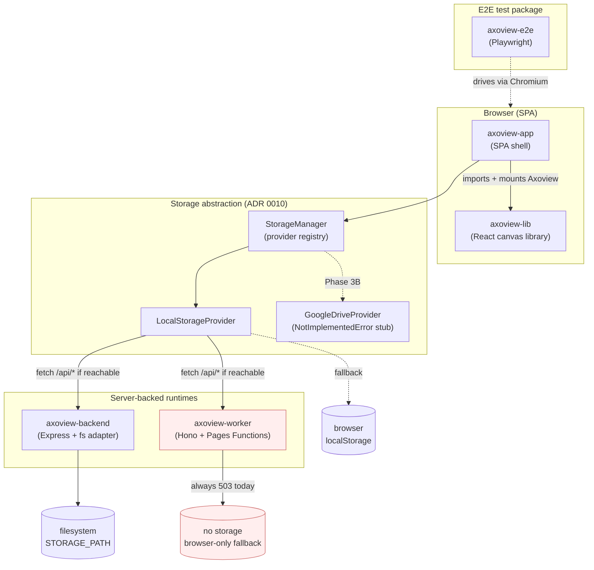
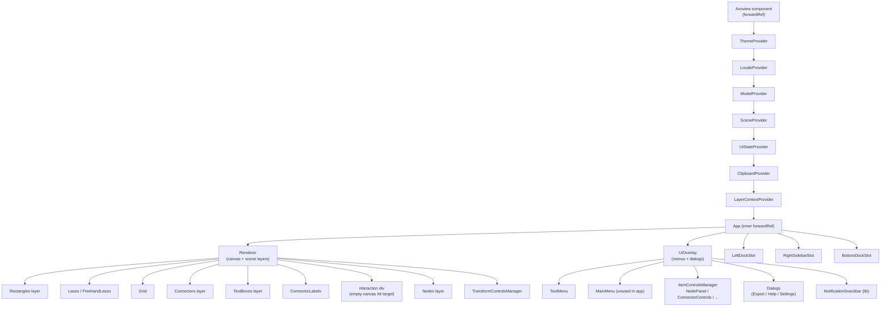
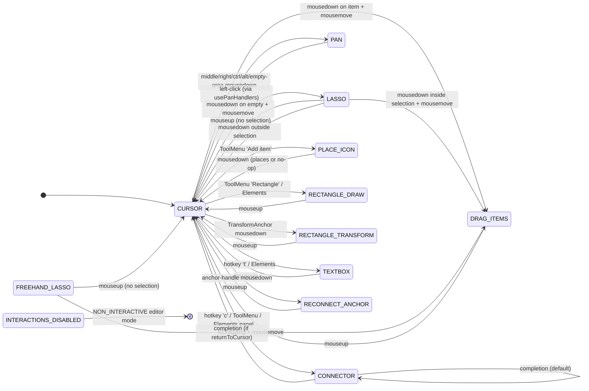
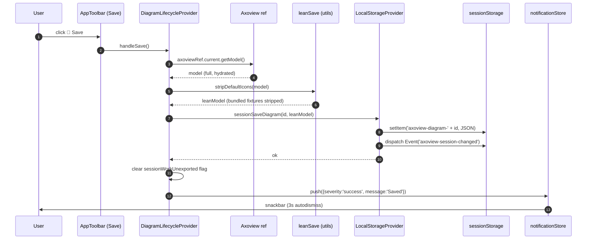
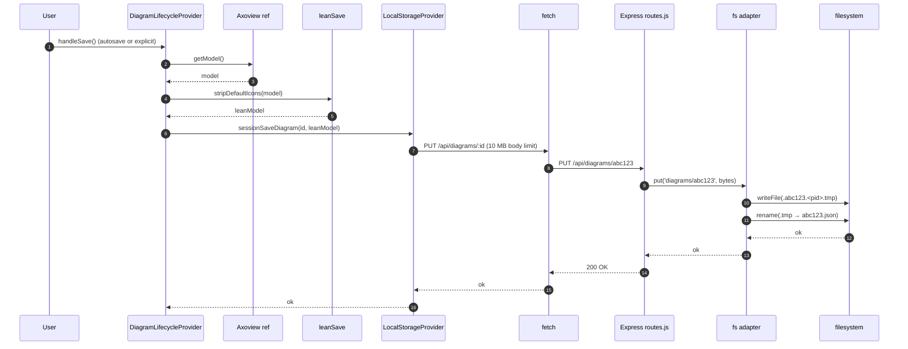
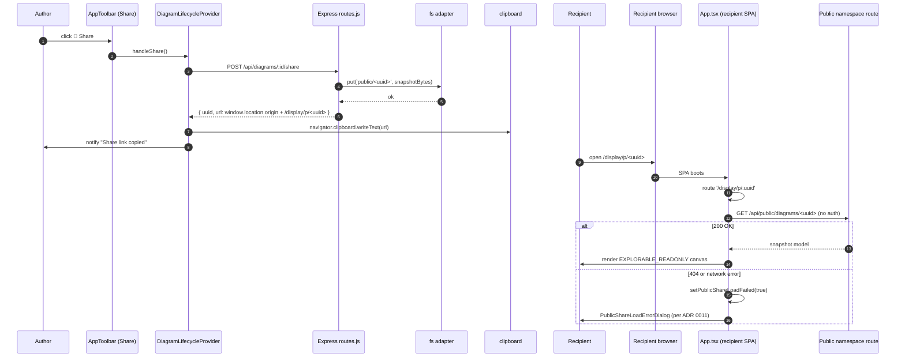
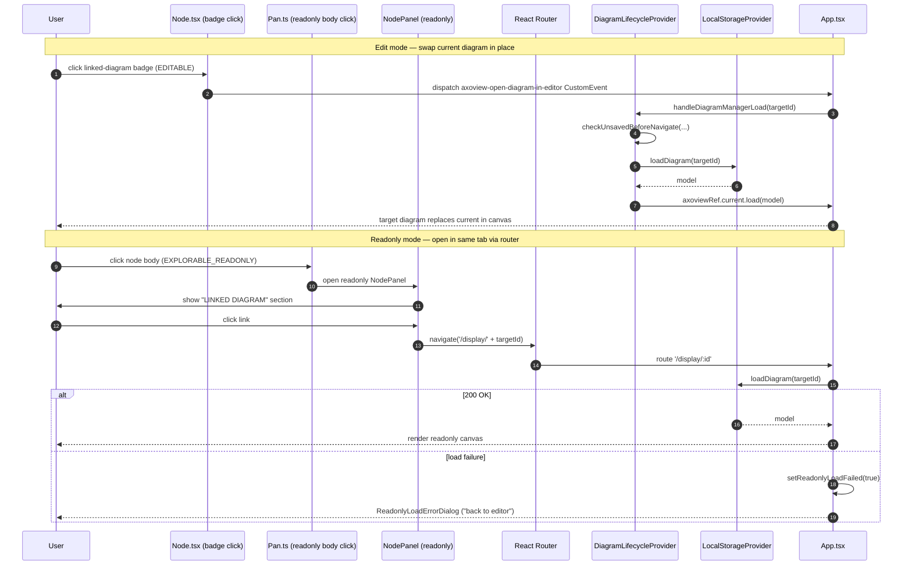
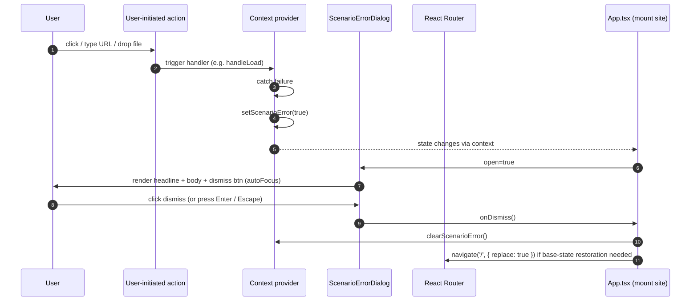
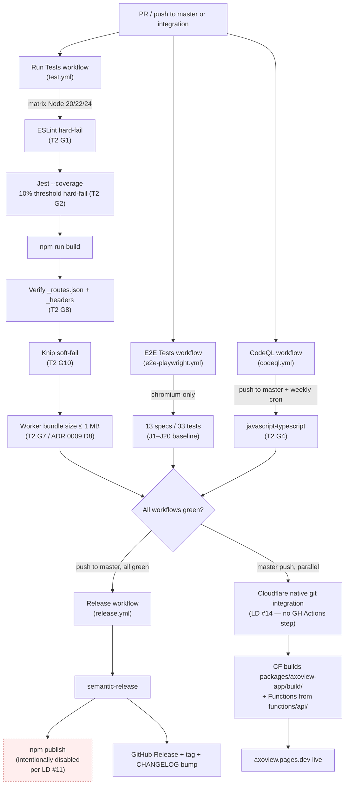

# Axoview Technical Review — 2026-05

> **Status:** Artifact frozen 2026-05-23 (Sessions A + B + C complete). Reviewer-ready. This document is a snapshot of the post-M10 v1.0.0 state — it does not track ongoing changes; the [ADRs](adr/), [PLAN.md](../PLAN.md), and [docs/architecture.md](architecture.md) are the living artifacts.

## Table of contents

- [0. How to use this document](#0-how-to-use-this-document)
- [1. Executive summary](#1-executive-summary)
- [2. Before / After](#2-before--after)
  - [2.1 At-a-glance comparison](#21-at-a-glance-comparison)
  - [2.2 What did *not* change](#22-what-did-not-change)
- [3. Architecture overview](#3-architecture-overview)
  - [3a. System diagram](#3a-system-diagram)
  - [3b. Package responsibilities](#3b-package-responsibilities)
  - [3c. State management](#3c-state-management)
  - [3d. Component tree (high level, lib-side)](#3d-component-tree-high-level-lib-side)
  - [3e. Interaction modes](#3e-interaction-modes)
- [4. Sequence diagrams](#4-sequence-diagrams)
  - [4a. App boot + mode detection (single `/api/config` probe)](#4a-app-boot--mode-detection-single-apiconfig-probe)
  - [4b. Save diagram — browser-only mode](#4b-save-diagram--browser-only-mode)
  - [4c. Save diagram — server-backed mode](#4c-save-diagram--server-backed-mode)
  - [4d. Share link generation + public consumption](#4d-share-link-generation--public-consumption)
  - [4e. Diagram-to-diagram link navigation](#4e-diagram-to-diagram-link-navigation)
  - [4f. Error UX — failure-of-intent flow (per ADR 0011)](#4f-error-ux--failure-of-intent-flow-per-adr-0011)
- [5. Deployment topology](#5-deployment-topology)
  - [5a. Three deploy targets](#5a-three-deploy-targets)
  - [5b. Mode detection contract](#5b-mode-detection-contract)
  - [5c. CI/CD chain](#5c-cicd-chain)
  - [5d. Env-var contract per target](#5d-env-var-contract-per-target)
  - [5e. Bundle-size budget](#5e-bundle-size-budget)
  - [5f. Dual `wrangler.toml`](#5f-dual-wranglertoml)
  - [5g. Distribution model](#5g-distribution-model)
- [6. Security posture](#6-security-posture)
  - [6a. Auth model](#6a-auth-model)
  - [6b. Storage isolation — single-tenant per deploy](#6b-storage-isolation--single-tenant-per-deploy)
  - [6c. Public-namespace cutout](#6c-public-namespace-cutout)
  - [6d. CSP + security headers](#6d-csp--security-headers)
  - [6e. Concurrent-write semantics](#6e-concurrent-write-semantics)
  - [6f. Atomicity](#6f-atomicity)
  - [6g. CI security scanning](#6g-ci-security-scanning)
  - [6h. Known security gaps (tracked, not blocking)](#6h-known-security-gaps-tracked-not-blocking)
- [7. File-by-file inventory](#7-file-by-file-inventory)
  - [7.1 `packages/axoview-lib`](#71-packagesaxoview-lib)
  - [7.2 `packages/axoview-app`](#72-packagesaxoview-app)
  - [7.3 `packages/axoview-backend`](#73-packagesaxoview-backend)
  - [7.4 `packages/axoview-worker`](#74-packagesaxoview-worker)
  - [7.5 `packages/axoview-e2e`](#75-packagesaxoview-e2e)
  - [7.6 Repo shell — deployment artifacts, CI, root configuration](#76-repo-shell--deployment-artifacts-ci-root-configuration)
  - [7.7 `docs/`](#77-docs)
  - [7.8 Cross-package observations](#78-cross-package-observations)
  - [7.9 Inventory totals](#79-inventory-totals)
- [8. Quality KPIs aggregate](#8-quality-kpis-aggregate)
  - [8a. Test inventory](#8a-test-inventory)
  - [8b. CI gate inventory](#8b-ci-gate-inventory)
  - [8c. LOC + file totals](#8c-loc--file-totals)
  - [8d. Test:source ratio — by package](#8d-testsource-ratio--by-package)
  - [8e. Lint debt](#8e-lint-debt)
  - [8f. Knip residual](#8f-knip-residual)
  - [8g. Production runtime metrics](#8g-production-runtime-metrics)
- [9. Decisions catalog](#9-decisions-catalog)
  - [9.1 ADRs](#91-adrs)
  - [9.2 Locked decisions (productization audit)](#92-locked-decisions-productization-audit)
- [10. Reviewer prompts](#10-reviewer-prompts)
  - [10a. General quality + architecture review (broad lens)](#10a-general-quality--architecture-review-broad-lens)
  - [10b. Productization-readiness review (narrow lens)](#10b-productization-readiness-review-narrow-lens)
- [11. Open known issues](#11-open-known-issues)

---

## 0. How to use this document

**Audience.** An external reviewer (likely another AI agent) asked to assess Axoview's current state and suggest improvements. The artifact serves two lenses at once:

1. **General code-quality review** — architecture, testing, technical debt, maintainability.
2. **Productization-readiness review** — distribution model, deployment posture, CI/CD discipline, error UX, security headers, repo hygiene.

The reviewer prompts in [§10](#10-reviewer-prompts) split into two checklists; the rest of the artifact serves both.

**Reading order.**

- Read **1 → 2 → 3 → 4** sequentially. Those four sections build the mental model.
- Jump to **§10** for the actual review questions.
- Treat **§5–§8** as reference material; consult as needed.
- **§9** is the durable decisions record (ADRs are the source of truth; §9 is a quick-scan view).
- **§11** lists known gaps the productization audit did not close — review for cumulative-debt impact.

**Snapshot date.** This artifact is dated **2026-05-23** and is **not a living doc**. It captures the post-M10 state of the [productization audit](tactical/productization-audit.md) (v1.0.0 shipped 2026-05-23). The audit itself, the ADRs, [PLAN.md](../PLAN.md), and [docs/architecture.md](architecture.md) are the living artifacts; this one is a frozen review surface.

**Vocabulary note (load-bearing).** Two pairs of terms appear throughout, and one of them is inverted from intuition:

| User-facing prose says… | Internal code-name says… | What it means |
|---|---|---|
| **browser-only** | **Local mode** | No backend; the SPA persists to `localStorage` / `sessionStorage`. Default Cloudflare Pages posture today. |
| **server-backed** | **Session mode** | An Express-or-Worker backend persists diagrams. The Docker compose stack runs in this mode. |

The historical name `Session mode` originated when the only persistence path was the per-tab `sessionStorage` — over time the backend became the load-bearing storage and the name stuck despite the inversion. This artifact uses **"browser-only"** and **"server-backed"** in narrative prose. Internal symbols (`LocalModeBanner`, `LocalStorageProvider`, `SessionStorageGauge`) keep their code names. See [ADR 0008 Decision 1](adr/0008-naming-convention.md#1-component-file-names-disambiguate-when-colliding-describe-surface-not-state) for the rename that closed the worst offender (the old `SessionModeBanner` was renamed `LocalModeBanner` precisely because it only fires in browser-only mode).

**One more vocabulary lock — Dialog / Modal / Popover / Panel / Banner / Screen.** [ADR 0008 Decision 2](adr/0008-naming-convention.md#2-modal-vs-popover-vs-dialog-vs-panel--locked-vocabulary) and [ADR 0011 §2](adr/0011-error-ux-contract.md) reserve these terms. The reviewer should expect "Dialog" to mean centred + focus-trapped + dismissible (the error-UX shape), "Popover" to mean trigger-anchored, "Panel" to mean persistent chrome region.

---

## 1. Executive summary

Axoview is a browser-based isometric diagram editor — a fork of the upstream [FossFLOW](https://github.com/stan-smith/FossFLOW) project (lineage acknowledged in the lib's LICENSE) that has been hardened, restructured, and productized to ship as a self-hostable Docker container and as a Cloudflare Pages deployment at [https://axoview.pages.dev/](https://axoview.pages.dev/). The user-facing artefact is an SPA: drag icons onto an isometric (or 2D cartesian) grid, connect them with routed connectors, label them, group them into views and layers, save the workspace as a tree of folders + diagrams, and either share a public-snapshot URL or export the whole workspace as a project zip.

The 2026 work split into two arcs. **Arc 1 (Phase 0A → 2D, completed by early May 2026)** rebuilt the editor's foundations: a 745-line `App.tsx` was decomposed into focused providers ([Phase 0A](../PLAN.md)); a notification store replaced six `alert()` calls ([Phase 0B](../PLAN.md)); the canvas gained a 2D cartesian mode alongside the isometric default ([Phase 1A](../PLAN.md), [ADR-free, strategy-pattern via `coordinateTransforms.ts`](../packages/axoview-lib/src/utils/coordinateTransforms.ts)); a pluggable storage interface replaced inline service calls ([Phase 2A](../PLAN.md)); a VS Code-style file explorer landed ([Phase 2B + 2B-R](../PLAN.md)); cross-diagram links became a first-class feature ([Phase 2C](../PLAN.md)); and a four-group right-zone top toolbar replaced the prior burger-menu junk drawer ([Phase 2D / ADR 0005](adr/0005-toolbar-and-dock-layout-contract.md)). By the end of Arc 1 the editor's UX had reached the polish layer — MQA #7 (multi-element drag perf), MQA #8/#9 (multi-select + Ctrl+A per [ADR 0006](adr/0006-canvas-selection-contract.md)), MQA #26 (imported-icon delete + tombstone), and a typography contract ([UX §1.5](ux-principles.md#15-typography-is-theme-driven--six-tiers-picked-by-role)) all shipped between mid-April and mid-May.

**Arc 2 — the productization audit** ([docs/tactical/productization-audit.md](tactical/productization-audit.md), 2026-05-19 → 2026-05-23) — is what made the v1.0.0 release possible. The audit produced 17 [locked decisions](tactical/productization-audit.md#locked-decisions-from-scoping-discussion-2026-05-19) (catalogued in [§9.2](#92-locked-decisions-productization-audit)), four Accepted ADRs ([0008 Naming](adr/0008-naming-convention.md), [0009 Deployment topology](adr/0009-deployment-topology.md), [0010 Session backend contract](adr/0010-session-backend-contract.md), [0011 Error UX](adr/0011-error-ux-contract.md)), three spawned tacticals ([E2E rewrite](tactical/e2e-suite-rewrite.md), [git-automation hardening](tactical/git-automation-hardening.md), and the cleanup waves embedded in the audit itself), and a canonical workflow doc ([docs/workflow.md](workflow.md)) codifying the session cadence. The audit ran across nine discovery workstreams (A.1–A.9) and synthesised them into nine cross-workstream themes — the most consequential being the **dual-probe collapse** (boot-time mode detection used to fire two parallel `Promise.all`'d HTTP requests; per [ADR 0009 D2](adr/0009-deployment-topology.md#2-mode-detection-collapses-to-a-single-probe-runtimeconfigserverstorage-is-removed) this is now a single `/api/config` call) and the explicit naming of the **runtime asymmetry** (one HTTP contract, one Express adapter, one Worker short-circuit — *not* "one contract, two adapters" as the retired flare plan had it; see [ADR 0009 D1](adr/0009-deployment-topology.md)).

**What shipped in v1.0.0** (2026-05-23, milestone [M10](tactical/productization-audit.md#end-to-end-productization-path)):

- **Two deployment targets, one HTTP contract.** Self-host via `docker compose up --build` (Express + nginx + filesystem adapter); Cloudflare Pages via native git integration (Worker + Pages Functions, storage-less today). The Worker is intentionally storage-less; persistent storage on the Cloudflare side returns when the Google Drive provider lands as Phase 3B. See [ADR 0009](adr/0009-deployment-topology.md).
- **Distribution = container + CDN.** No npm publish for `axoview-lib`; per [Locked Decision #11](tactical/productization-audit.md#locked-decisions-from-scoping-discussion-2026-05-19) the lib is monorepo-only. No Docker Hub image; per [Locked Decision #12](tactical/productization-audit.md#locked-decisions-from-scoping-discussion-2026-05-19) the day-1 self-host story is `git clone + docker compose up`. Both are explicit deferrals with their own ADR + tactical when the user need surfaces.
- **Explicit-error UX for failure-of-intent paths.** Per [ADR 0011](adr/0011-error-ux-contract.md), three dialogs (`LocalModeShareErrorDialog`, `ReadonlyLoadErrorDialog`, `PublicShareLoadErrorDialog`) replace prior silent-empty-canvas states and toast-only fallbacks. The pattern is `<Scenario>ErrorDialog.tsx` + `dialog.<scenario>.*` i18n namespace; side-effect failures (autosave retry, thumbnail dynamic-import) keep their toasts.
- **CI baseline locked.** Per [Locked Decision #16](tactical/productization-audit.md#locked-decisions-from-scoping-discussion-2026-05-19) every push/PR enforces ESLint, Jest coverage thresholds, build-output shape (`_routes.json` + `_headers` must ship), commitlint via `simple-git-hooks`, CodeQL static analysis, and the Worker bundle stays under 1 MB uncompressed per [ADR 0009 D8](adr/0009-deployment-topology.md). Knip runs continuously as soft-fail.
- **E2E suite green.** Per [Locked Decision #4](tactical/productization-audit.md#locked-decisions-from-scoping-discussion-2026-05-19) both prior E2E suites (legacy Python/Selenium and a stale Playwright suite) were deleted; the rewrite is 13 spec files / 33 tests against the J1–J20 [manual test baseline](manual-test-baseline.md), runs on every PR + master push via [`e2e-playwright.yml`](../.github/workflows/e2e-playwright.yml).
- **README + deployment docs reflect shipped reality.** Post-audit cleanup commit `c208fd0` (2026-05-23) replaced operational FossFLOW references with Axoview and corrected the post-audit drift; deployment docs match the env-var contract in [ADR 0009 §4](adr/0009-deployment-topology.md#4-env-var-contract--one-section-per-target).

**What did not ship and is deferred.** Google Drive persistence (Phase 3B); npm publication of `axoview-lib`; a published Docker Hub image; multi-tenant session isolation ([ADR 0010 D4](adr/0010-session-backend-contract.md) explicitly locks single-tenant-per-deploy for v1); accessibility / visual-regression / performance E2E checks; full translations for the German + Indonesian locales (see [§11](#11-open-known-issues)).

**Composition.** The codebase is a Node 22 + npm 10 monorepo of four packages — [`axoview-lib`](../packages/axoview-lib/) (the published-shape React library; 1009 passing + 1 skipped across 93 jest suites total monorepo-wide as of 2026-05-23), [`axoview-app`](../packages/axoview-app/) (the SPA shell consuming the lib), [`axoview-backend`](../packages/axoview-backend/) (Express + filesystem adapter), and [`axoview-worker`](../packages/axoview-worker/) (Hono on Cloudflare Pages Functions) — plus a sibling [`axoview-e2e`](../packages/axoview-e2e/) Playwright test package. State management is Zustand (four stores: model, scene, ui, locale), persistence goes through a `StorageProvider` abstraction defined by [ADR 0010](adr/0010-session-backend-contract.md), UI is MUI v7. Build is rsbuild + tsc; tests are Jest + jsdom for the lib + app, Playwright Chromium for E2E.

**What's load-bearing about the audit, not the code.** The audit's most durable output is *process discipline* — [`docs/workflow.md`](workflow.md) codifies the canonical session cadence (Session start → Direct work → Verify → Polish → Review → Doc sync → Promotion), the design principles enforce "every Findings register row cites file:line or a grep result" ([Theme 9](tactical/productization-audit.md#theme-9--the-verify-before-action-hygiene-from-feedback_be_serious_not_eagermd-shaped-the-entire-discovery-quality), elevated to a workflow.md principle), and the 17 locked decisions form an unambiguous record of what is in/out of scope going forward. The reviewer's biggest leverage is verifying that the *contracts* (ADRs 0008–0011) match the *shipped reality* (code) — drift between them is the canonical productization risk this audit was designed to eliminate.

---

## 2. Before / After

The "Before" column anchors at ~2026-02 — the state at the rename merge `72fa120`, just before the productization arc began. The "After" column reflects post-M10 v1.0.0 (2026-05-23). Citations are commit SHAs or ADR numbers.

### 2.1 At-a-glance comparison

| Dimension | Before (~2026-02) | After (post-M10, 2026-05-23) | Evidence |
|---|---|---|---|
| **App shell** | `App.tsx` was 745 lines (intermixed state / effects / JSX) | `App.tsx` is 103 lines (pure provider composition) | [Phase 0A](../PLAN.md), [architecture.md §2l](architecture.md#2l-axoview-app-provider-decomposition-2026-04-27) |
| **Error feedback** | 6 `alert()` calls + ad-hoc inline toast | `notificationStore` Zustand-driven `NotificationStack`; failure-of-intent paths render explicit Dialogs | [Phase 0B](../PLAN.md), [ADR 0011](adr/0011-error-ux-contract.md) |
| **Storage backend** | Inline `storageService.ts` (build-time env injection); two-tab UI | `StorageProvider` interface ([ADR 0010](adr/0010-session-backend-contract.md)), `StorageManager` orchestrator, VS Code-style file explorer with folder CRUD | [Phase 2A + 2B-R](../PLAN.md) |
| **Mode detection on boot** | Two parallel probes (`/api/config` + `/api/storage/status`) | Single `/api/config` probe; `/api/storage/status` deleted | [ADR 0009 D2](adr/0009-deployment-topology.md#2-mode-detection-collapses-to-a-single-probe-runtimeconfigserverstorage-is-removed), commit `0810690` |
| **Share-link on browser-only** | Silent empty-diagram render | Explicit `LocalModeShareErrorDialog`; dismiss strips `?share=` and boots normally | [ADR 0009 D3](adr/0009-deployment-topology.md), commit `cff3942` |
| **Owner-readonly load failure** | Silent redirect to `/` | Explicit `ReadonlyLoadErrorDialog` with "back to editor" action | [ADR 0009 D3 addendum](adr/0009-deployment-topology.md), commit `2a04061` |
| **Self-host auth posture** | nginx HTTP Basic Auth layer + Express `AUTH_MODE` (two overlapping auth layers) | Single `AUTH_MODE` contract; nginx Basic Auth + `.htpasswd` plumbing removed | [Locked Decision #13](tactical/productization-audit.md#locked-decisions-from-scoping-discussion-2026-05-19) |
| **Top toolbar layout** | Junk-drawer burger menu (New/Open/Clear/Settings/GitHub/Version/Export×3 all under one icon) | Four-group RIGHT zone: View modes (reserved) · Save group · Document actions (Export/Share/Preview) · Sidebar toggle | [ADR 0005](adr/0005-toolbar-and-dock-layout-contract.md) |
| **Naming collisions** | Two `ExportDialog.tsx` in different paths; two `StorageManager` (component + class); `SessionModeBanner` shown in browser-only mode | All four renamed per [ADR 0008 D1](adr/0008-naming-convention.md#1-component-file-names-disambiguate-when-colliding-describe-surface-not-state) | commits per audit C.2 §1–§2 |
| **Surface vocabulary** | Dialog / Modal / Popover used interchangeably | Six locked terms: Dialog · Modal · Popover · Panel · Banner · Screen | [ADR 0008 D2](adr/0008-naming-convention.md#2-modal-vs-popover-vs-dialog-vs-panel--locked-vocabulary), [UX §1](ux-principles.md#1-layout) |
| **Connector model** | `labels[]` only (up to 256 labels); no name, no notes, no F2-rename | First-class `name` + `notes`; F2-rename; Details/Style/Notes tabbed panel (parity with nodes) | [ADR 0004](adr/0004-connector-name-and-details-panel.md) |
| **Selection model** | Single-item via `itemControls`; multi-select existed only inside Lasso mode | Persistent `selectedIds: ItemReference[]` slice; Ctrl+click, Ctrl+A, multi-drag, multi-delete | [ADR 0006](adr/0006-canvas-selection-contract.md) |
| **Multi-element drag perf** | 9–13 FPS on a 6-node drag for 12–19 s windows (MQA #7) | 24–44 FPS sustained; CSS-only preview + `previewConnectorPaths` action; one history entry per drag | [known_issues.md MQA #7](../known_issues.md), Path 4-true |
| **Icon catalog persistence** | Full bundled catalog written to every diagram on every save | Lean save strips bundled fixtures; load-time merge rehydrates them; `requiredPacks` field signals what to lazy-load | [ADR 0002](adr/0002-icon-catalog-merge-on-load.md), [ADR 0003](adr/0003-session-storage-lean-icon-save.md) |
| **Workspace I/O** | Single-diagram JSON export only | Project zip ([ADR 0001](adr/0001-project-zip-format.md)) with manifest + diagrams/ + tree-manifest; three scopes (project / folder / diagram); three destinations (root / new folder / replace-all) | Phase 2B-R + ADR 0001 |
| **fs adapter atomicity** | `fs.writeFile` direct (truncation risk on crash) | tmp-file + rename per [ADR 0010 D3](adr/0010-session-backend-contract.md#3-atomicity--every-put-is-all-or-nothing) | commit `6e1b28c` |
| **Health probes** | None | `/healthz` on Express + Dockerfile `HEALTHCHECK` + compose `healthcheck:` block | [ADR 0010 D8](adr/0010-session-backend-contract.md) |
| **CI gates** | Build only | ESLint hard-fail · coverage hard-fail · build-output shape hard-fail (`_routes.json` + `_headers` present) · commitlint local hook · CodeQL · Worker bundle <1 MB · knip continuous soft-fail | [Locked Decision #16](tactical/productization-audit.md#locked-decisions-from-scoping-discussion-2026-05-19), [git-automation-hardening.md](tactical/git-automation-hardening.md) |
| **E2E suite** | Legacy Python/Selenium under `e2e-tests/` + stale Playwright under `packages/axoview-e2e/` | Both deleted; rewrite from zero: 13 spec files / 33 tests against J1–J20 manual baseline; runs on PR + master | [Locked Decision #4](tactical/productization-audit.md#locked-decisions-from-scoping-discussion-2026-05-19), [e2e-suite-rewrite.md](tactical/e2e-suite-rewrite.md) |
| **CI/deploy workflows** | `.github/workflows/e2e-tests.yml.backup` + Pages workflow + dual deploy paths | Native Cloudflare git integration is canonical; GH Pages workflow deleted; `release.yml` rewired to depend on Run Tests | [Locked Decision #14](tactical/productization-audit.md#locked-decisions-from-scoping-discussion-2026-05-19) |
| **LICENSE / lineage hygiene** | Unlicense on app, MIT on root, upstream author still credited in lib LICENSE, FUNDING.yml pointing upstream | All three normalized (LICENSE files coherent; FUNDING.yml deleted; lineage acknowledged in lib LICENSE prose) | Audit C.2 §1 quick-wins, commits `264887a` / `39a44c1` |
| **Repo hygiene** | No `.gitattributes`; `.nvmrc` was Node 20 (workflows on Node 22); duplicate ISSUE_TEMPLATE `.md` + `.yml` pairs | `.gitattributes` enforces LF; `.nvmrc` is 22; `.md` ISSUE_TEMPLATE deleted (YAML form canonical) | Audit C.2 §1, commit `264887a` |
| **Doc structure** | `current_architecture.md`, `flare_plan.md`, `session-ux-revamp.md`, `details-panel-and-ux-polish.md` as parallel tacticals | Three-tier convention: ADRs in `docs/adr/` (durable) · tacticals in `docs/tactical/` (short-lived) · PLAN.md as dashboard; `flare_plan.md` content migrated to ADRs 0009/0010 then deleted | [docs/workflow.md](workflow.md), [project_docs_convention memory](../../Users/isidenica/.claude/projects/c--myTemp-FossFLOW/memory/project_docs_convention.md) |
| **Workflow doc** | None — process tribal | [`docs/workflow.md`](workflow.md) — canonical session cadence, skill decision table, 6 design principles | [Phase A synthesis Theme 9](tactical/productization-audit.md), workflow.md authored 2026-05-20 |

### 2.2 What did *not* change

Worth naming explicitly so the reviewer doesn't infer churn where there is none:

- **Core canvas engine** (isometric projection, connector pathfinding, hit-testing, view-tab model). The 2D mode landed as a strategy alongside the iso strategy ([Phase 1A](../PLAN.md)); the iso engine itself is unchanged from the upstream fork era.
- **Zustand store topology.** Three lib stores (model, scene, uiState) + the app's `notificationStore` were in place by Phase 0B / Phase 1A; the productization arc made no structural changes here.
- **Auth implementation depth.** `AUTH_MODE = none | shared-token | cf-access` was already implemented end-to-end before the audit. The audit changed posture (removed the overlapping nginx Basic Auth layer per [Locked Decision #13](tactical/productization-audit.md#locked-decisions-from-scoping-discussion-2026-05-19)) but not the supported modes.
- **Single-tenant assumption.** Always single-tenant per deploy; [ADR 0010 D4](adr/0010-session-backend-contract.md) made it explicit and locked rather than newly imposing it.
- **Build system.** rsbuild + tsc throughout the year; no churn.

---

## 3. Architecture overview

### 3a. System diagram



### 3b. Package responsibilities

The monorepo has four shipped packages plus the E2E test package. Each has one ownership rule.

**[`packages/axoview-lib`](../packages/axoview-lib/)** — the React canvas library. Owns the renderer, scene layers (Nodes, Connectors, Rectangles, TextBoxes), interaction modes (the 11-state machine), the three Zustand stores (model, scene, uiState), the i18n layer (14 locales), and every component inside the canvas chrome (LeftDock, RightSidebar, ToolMenu, BottomDock, dialogs). Primary entry: [`Axoview.tsx`](../packages/axoview-lib/src/Axoview.tsx) (forwardRef component, ~200 lines, mounts the provider tree). Consumed only by `axoview-app` today; per [Locked Decision #11](tactical/productization-audit.md#locked-decisions-from-scoping-discussion-2026-05-19) the lib is monorepo-only (not npm-published). Deploys nowhere on its own; ships as a build output that `axoview-app` imports from `dist/`. Test surface: documented in [`docs/testing.md`](testing.md) (1009 passing + 1 skipped across 93 jest suites total monorepo-wide as of 2026-05-23; the lib carries the bulk).

**[`packages/axoview-app`](../packages/axoview-app/)** — the SPA application shell. Owns everything the lib doesn't: storage providers (`StorageManager` + `LocalStorageProvider` + the Drive stub), the file explorer UI (`FileExplorerLayout`, `FileExplorer`, `FileTreeNode`), the app toolbar (`AppToolbar`), the notification stack (`notificationStore` + `NotificationStack`), the cross-diagram link registry, the icon-pack manager, the diagram lifecycle (`DiagramLifecycleProvider` — save / load / unsaved-changes guard), the share-URL handler, and the error dialogs from [ADR 0011](adr/0011-error-ux-contract.md). Entry: [`App.tsx`](../packages/axoview-app/src/App.tsx) (103 lines, pure provider composition per [§2l](architecture.md#2l-axoview-app-provider-decomposition-2026-04-27)). Deploys to: Cloudflare Pages (static bundle), nginx (Docker compose stack). Test surface: project-zip + LocalStorageProvider + AppStorageContext suites.

**[`packages/axoview-backend`](../packages/axoview-backend/)** — Node 22 + Express + filesystem adapter. Owns the canonical `/api/*` HTTP contract (every route defined in [`src/routes.js`](../packages/axoview-backend/src/routes.js); the Worker imports the same file). Implements the `StorageAdapter` interface ([`src/adapters/types.ts`](../packages/axoview-backend/src/adapters/types.ts)) via [`fs.js`](../packages/axoview-backend/src/adapters/fs.js) — atomicity via tmp-file + rename per [ADR 0010 D3](adr/0010-session-backend-contract.md#3-atomicity--every-put-is-all-or-nothing). Auth via `AUTH_MODE` env var (`none` / `shared-token`; `cf-access` rejected at request time as Cloudflare-only). Health probe at `/healthz` per [ADR 0010 D8](adr/0010-session-backend-contract.md). Deploys to: Docker container behind nginx (compose.yml + Dockerfile). Test surface: **no jest config today** — gap tracked in audit [§C.8](tactical/productization-audit.md). Smoke-tested via Docker.

**[`packages/axoview-worker`](../packages/axoview-worker/)** — Hono on Cloudflare Pages Functions. Owns the Cloudflare-side `/api/*` surface. Imports `routes.js` from `axoview-backend` directly (the cross-package import is the single source of truth — see [productization audit P6](tactical/productization-audit.md)) but **short-circuits every storage route to 503** at [`app.ts:43-45`](../packages/axoview-worker/src/app.ts) per [ADR 0009 D1](adr/0009-deployment-topology.md). Today: storage-less by design. Implements `cf-access` auth (full JWKS RS256 verify in [`auth.ts`](../packages/axoview-worker/src/auth.ts)). Bundle-size budget <1 MB uncompressed (CI-enforced per [ADR 0009 D8](adr/0009-deployment-topology.md)). Deploys to: Cloudflare Pages via native git integration on master push (per [Locked Decision #14](tactical/productization-audit.md#locked-decisions-from-scoping-discussion-2026-05-19)); also runnable locally via `wrangler pages dev`. Test surface: **no jest config today** — same gap as backend.

**[`packages/axoview-e2e`](../packages/axoview-e2e/)** — Playwright Chromium against the local dev server. 13 spec files / 33 tests covering canonical user journeys J1–J20 from [`docs/manual-test-baseline.md`](manual-test-baseline.md). Page Object Model per surface (AppToolbar, FileExplorer, Canvas, NodeInfoTab, LayersPanel, dialogs). Per [ADR 0008 D5](adr/0008-naming-convention.md#5-data-axoview-id-attribute--selective-not-blanket-reserved-for-e2e-and-trace-harness-anchors), `data-axoview-id` attributes are added lazily as specs need them. Runs on PRs + master push via [`.github/workflows/e2e-playwright.yml`](../.github/workflows/e2e-playwright.yml).

### 3c. State management

The lib carries four Zustand stores; the app carries one more (notifications). All five use the React-context-wrapped Zustand pattern (per-mount-instance isolation) — see [architecture.md §2a](architecture.md#2a-store-layer).

| Store | Owner | Persistence | Purpose |
|---|---|---|---|
| `modelStore` | lib | included in saved diagram | Persistent model: items, connectors, rectangles, textBoxes, views, icons, colors. Has its own immer-patch-based history stack (max 50 entries). |
| `sceneStore` | lib | derived (computed from model) | Computed scene data: connector paths, textbox sizes. Independent history stack alongside model's. |
| `uiStateStore` | lib | settings persist to `localStorage` (`axoview-*` keys) | Mode, zoom, scroll, selection (`selectedIds` + `itemControls`), dialogs, settings (hotkey profile, pan/zoom settings, `canvasMode`), `iconPackManager` ref, dirty flag, mouse state. |
| `localeStore` | lib | localStorage | Current locale + dictionary. |
| `notificationStore` | app | not persisted | Side-effect notifications (success / info / warning / error). Capped at 3 visible; queue drains FIFO. |

**Mode detection on boot (per [ADR 0009 D2](adr/0009-deployment-topology.md#2-mode-detection-collapses-to-a-single-probe-runtimeconfigserverstorage-is-removed)).** The SPA issues a single `GET /api/config` request with an 800 ms `AbortSignal.timeout` cap. The `serverStorage: boolean` field in the response selects the path:

- `true` → register `LocalStorageProvider` with `usingServer=true`; it routes `listDiagrams` / `loadDiagram` / `saveDiagram` to `/api/diagrams/*`.
- `false` *or* probe failure → `LocalStorageProvider` with `usingServer=false`; falls back to `sessionStorage`.

The boot path used to fire a dual probe (`/api/config` + `/api/storage/status` in parallel `Promise.all`) — collapsed to one in commit `0810690`. The `/api/storage/status` endpoint is gone from both runtimes.

**Reducer pattern.** Every mutating action in `useScene` (~30 methods) routes through a pure reducer in [`stores/reducers/`](../packages/axoview-lib/src/stores/reducers/). Reducers take `(payload, state) → State` (pure, no I/O, no async, no store reads), use immer `produce()` for immutable updates. The hook layer wraps reducer calls with `saveToHistoryBeforeChange()` to record patches (unless inside a `transaction()`, in which case N operations collapse into one history entry). See [architecture.md §2d](architecture.md#2d-reducer-layer) for the full reducer matrix.

### 3d. Component tree (high level, lib-side)



Order matters: the **interaction div** sits *below* the Nodes layer, so `e.target === interactionDiv` is true *only* when the user clicks empty canvas (Nodes capture their own events). This `isRendererInteraction` guard is referenced throughout the mode handlers.

### 3e. Interaction modes

The 11-mode state machine — formal definitions in [architecture.md §2b](architecture.md#2b-mode-state-machine).



`INTERACTIONS_DISABLED` exists as an early-return state for the `NON_INTERACTIVE` editor mode (one of three editor modes — see [architecture.md §1 "Editor Modes"](architecture.md#1-feature-inventory)). The other two editor modes are `EDITABLE` (all modes active) and `EXPLORABLE_READONLY` (Pan + Zoom + click-to-open readonly NodePanel only).

---

## 4. Sequence diagrams

Six representative flows. Each is tuned to ~10–15 actors/messages — the readable sweet spot. Where a flow has natural pre / post halves, it's split.

### 4a. App boot + mode detection (single `/api/config` probe)

```mermaid
sequenceDiagram
    autonumber
    participant U as User
    participant Browser
    participant App as App.tsx
    participant AppStorage as AppStorageContext
    participant RuntimeCfg as useRuntimeConfig
    participant API as Backend /api/config
    participant SM as StorageManager
    participant LSP as LocalStorageProvider
    participant Splash as Inline splash div

    U->>Browser: navigate to axoview URL
    Browser->>Splash: paints inline splash (~500ms)
    Browser->>App: bundle parses + App mounts
    App->>AppStorage: AppStorageContext.Provider
    AppStorage->>RuntimeCfg: fetchRuntimeConfig() with AbortSignal.timeout(800ms)
    RuntimeCfg->>API: GET /api/config
    alt /api/config succeeds
        API-->>RuntimeCfg: { serverStorage: bool, googleClientId, ... }
        RuntimeCfg-->>AppStorage: config
        AppStorage->>SM: setServerStorage(config.serverStorage)
        SM->>LSP: usingServer = config.serverStorage
    else timeout or network error
        RuntimeCfg-->>AppStorage: console.warn + default { serverStorage: false }
        AppStorage->>SM: setServerStorage(false)
        SM->>LSP: usingServer = false  (sessionStorage fallback)
    end
    AppStorage->>App: isInitialized = true
    App->>Splash: add .ff-splash-hidden after 2 RAFs; remove node after 250ms
    App->>U: editor visible
```

Closes the dual-probe collapse from [ADR 0009 D2](adr/0009-deployment-topology.md#2-mode-detection-collapses-to-a-single-probe-runtimeconfigserverstorage-is-removed). Before the cleanup this fired both `/api/config` **and** `/api/storage/status` via `Promise.all`.

### 4b. Save diagram — browser-only mode



The lean-save pass per [ADR 0003](adr/0003-session-storage-lean-icon-save.md) drops icons whose `id` matches `bundledFixtures.byId` and whose metadata is unchanged. On the next load the rehydrate step from [ADR 0002](adr/0002-icon-catalog-merge-on-load.md) re-merges the catalog.

### 4c. Save diagram — server-backed mode



The Cloudflare Worker path is intentionally asymmetric — `PUT /api/diagrams/:id` hits the `app.all('/api/*') → 503` short-circuit at [`app.ts:43-45`](../packages/axoview-worker/src/app.ts). Cloudflare deploys are storage-less today (per [ADR 0009 D1](adr/0009-deployment-topology.md)), so server-mode persistence is Docker-only until Phase 3B (Google Drive) lands as a new `StorageAdapter`. The atomicity contract (`tmp-file + rename`) is [ADR 0010 D3](adr/0010-session-backend-contract.md#3-atomicity--every-put-is-all-or-nothing).

### 4d. Share link generation + public consumption



The `/api/public/diagrams/:uuid` route bypasses auth middleware on both runtimes (`isPublicRoute` check in Express; same check in Worker `authMiddleware`) — the **only** auth exception in the contract per [ADR 0010 D6](adr/0010-session-backend-contract.md#6-snapshots-and-share-namespace).

### 4e. Diagram-to-diagram link navigation

The contract has two paths — edit-mode swap (via CustomEvent) and readonly-mode navigation (via React Router). Both routed through `interaction/modes/Pan.ts` and `NodePanel` for the readonly case. The B-1 fix (commit `2a04061`) added the explicit error dialog when a target diagram fails to load.



Distinct from §4d's `/display/p/:uuid` public-share route (which bypasses auth and hits the public namespace). The owner-readonly `/display/:id` route runs through `storage.loadDiagram(id)` and respects `AUTH_MODE` in server-backed mode — see the [2026-05-22 addendum to ADR 0009 D3](adr/0009-deployment-topology.md#3-readonly--share-link-is-a-session-mode-only-overlay-local-mode-must-error-explicitly).

### 4f. Error UX — failure-of-intent flow (per [ADR 0011](adr/0011-error-ux-contract.md))



Three dialogs ship per the contract: `LocalModeShareErrorDialog` (browser-only + share-uuid URL → explicit error per [ADR 0009 D3](adr/0009-deployment-topology.md)); `ReadonlyLoadErrorDialog` (owner-readonly `/display/:id` load failure); `PublicShareLoadErrorDialog` (public `/api/public/diagrams/:uuid` 404 or network error, retrofitted per ADR 0011 B-9a S1). The audit's [B-9a investigation](tactical/productization-audit.md) identified 20 remaining toast-only or `.catch(() => {})` surfaces (S2–S20) that are queued for B-9b retrofit; that batch is **deferred-by-design** per the [2026-05-23 closeout disposition](tactical/productization-audit.md#phase-c-status).

---

## 5. Deployment topology

This section consolidates the operator-facing view of [ADR 0009](adr/0009-deployment-topology.md) and [`docs/deployment.md`](deployment.md). Every claim is grounded against one or the other; treat those as the living source of truth and this section as the reviewer's quick map.

### 5a. Three deploy targets

| Target | What runs | Who owns the runtime | Storage | Day-1 command |
|---|---|---|---|---|
| **Browser-only** | The SPA bundle served from any static host. No backend. Same `axoview-app` build that the other targets ship — the runtime mode is selected by the `/api/config` probe failing. | Whoever publishes the static bundle (could be a one-off `npx serve build/`, a personal nginx, S3+CDN, GH Pages, etc.). | Browser `localStorage` + `sessionStorage`. Each tab is an island; project ZIPs are the only persistence beyond the tab. | `npm run build` then drop `packages/axoview-app/build/` on a static host. |
| **Self-host (Docker)** | nginx (static + reverse proxy) + Express (`/api/*` handlers + `fs.js` adapter against `STORAGE_PATH`) inside one container per [`Dockerfile`](../Dockerfile) + [`compose.yml`](../compose.yml). | The operator: container lifecycle, TLS termination (sidecar / cloudflared / platform TLS — ADR 0009 §7 explicitly punts this), `STORAGE_PATH` volume, backup discipline. | Filesystem under `STORAGE_PATH` (default `/data/diagrams` mounted as a named volume); atomic per-key writes via tmp-file + rename ([ADR 0010 D3](adr/0010-session-backend-contract.md#3-atomicity--every-put-is-all-or-nothing)). | `docker compose up --build` per [Locked Decision #12](tactical/productization-audit.md#locked-decisions-from-scoping-discussion-2026-05-19) — no Docker Hub image is published, deploy = `git clone` then build locally. |
| **Cloudflare Pages** | Static bundle on Cloudflare's CDN; `/api/*` routed to a Hono Worker via Pages Functions (`functions/api/[[path]].ts`). The Worker imports [`packages/axoview-backend/src/routes.js`](../packages/axoview-backend/src/routes.js) but [short-circuits every storage route to 503](../packages/axoview-worker/src/app.ts) — **storage-less by design today**. End-users still get a functional editor via the browser-only fallback. | Cloudflare (TLS, CDN, Worker scheduling, observability) + operator (env-vars / secrets, `wrangler.toml`, optional CF Access policy). | None today. Persistent storage on Cloudflare returns when the Google Drive provider lands ([Phase 3B](../PLAN.md)); ADR 0010 §9 spells out the extension contract. | Native git integration on `master` push per [Locked Decision #14](tactical/productization-audit.md#locked-decisions-from-scoping-discussion-2026-05-19) — no GH Actions workflow, no `wrangler pages deploy` from CI. The one-click "Deploy to Cloudflare" button (README) covers fork-to-deploy. |

The frontend bundle is byte-identical across all three. The runtime difference is which `/api/config` flag values it receives at boot, which selects the `StorageProvider` mode.

### 5b. Mode detection contract

Per [ADR 0009 D2](adr/0009-deployment-topology.md#2-mode-detection-collapses-to-a-single-probe-runtimeconfigserverstorage-is-removed) the SPA fires **one** `GET /api/config` request with an 800 ms `AbortSignal.timeout` cap (verified in [`useRuntimeConfig.ts`](../packages/axoview-app/src/hooks/useRuntimeConfig.ts)). The boolean `serverStorage` field in the response selects the path:

| `/api/config` outcome | Resulting mode | What the user sees |
|---|---|---|
| 200 OK · `serverStorage: true` | server-backed | Diagrams persist to backend; LocalModeBanner is hidden; share links work. |
| 200 OK · `serverStorage: false` | browser-only | LocalModeBanner is shown; share links surface `LocalModeShareErrorDialog` per [ADR 0009 D3](adr/0009-deployment-topology.md#3-readonly--share-link-is-a-session-mode-only-overlay-local-mode-must-error-explicitly). |
| Timeout or network error | browser-only (fallback) | Console warning is logged; `LocalStorageProvider` runs with `usingServer=false`. |

Cloudflare Worker deploys always return `serverStorage: false` until Phase 3B; that's what makes them functionally indistinguishable from a static-only deploy from the user's perspective. The dual-probe collapse (`/api/storage/status` deleted from both runtimes) drops ~100–200 ms of avoidable cold-start latency on Cloudflare and was the audit's single most measurable correctness-and-performance win. The boot sequence diagram in [§4a](#4a-app-boot--mode-detection-single-apiconfig-probe) is the canonical reference.

### 5c. CI/CD chain



Two notes the diagram glosses over:

- **Cloudflare deploy isn't a CI step.** It's external automation triggered by the same `master` push. Per Locked Decision #14, GitHub Actions has no visibility into CF's build status — if the CF build fails, the GH side stays green. The deployment safety net for "tests pass but CF fails" is currently *operator vigilance*, not automated cross-check. Worth flagging to reviewers (and asked explicitly in [§10b](#10b-productization-readiness-review-narrow-lens)).
- **`release.yml` is gated on `workflow_run` from the Run Tests workflow.** semantic-release won't fire if tests aren't green. The chain is `master push → test.yml + e2e-playwright.yml + codeql.yml in parallel → all green → workflow_run trigger → release.yml`.

### 5d. Env-var contract per target

#### Self-host (Docker / compose)

| Variable | Required | Default | Notes |
|---|---|---|---|
| `BACKEND_PORT` | no | `3001` | Express listen port; container exposes this to the network. |
| `STORAGE_PATH` | no | `/data/diagrams` | Filesystem root for `fs.js`. **Must be backed by a container volume** for persistence across restarts. |
| `ENABLE_SERVER_STORAGE` | yes | `false` | `"true"` switches `/api/config` to report `serverStorage: true` and gates all storage routes. The implicit-off default is intentional — a fresh container without this flag behaves as a static-only deploy. |
| `AUTH_MODE` | no | `'none'` | One of `none` / `shared-token` / `cf-access`. Express rejects `cf-access` at request time (Cloudflare-only). |
| `AUTH_SHARED_SECRET` | required when `AUTH_MODE=shared-token` | — | Compared against `Authorization: Bearer <token>` via constant-time compare ([server.js:50-55](../packages/axoview-backend/server.js#L50-L55)). Public-namespace routes exempt. |
| `GOOGLE_CLIENT_ID` | no | empty | Echoed in `/api/config` for the (Phase 3B) Drive provider. Empty value hides Drive UI in the frontend. |
| `ENABLE_GIT_BACKUP` | no | `false` | Reserved for a future git-backed snapshot path; today no-op. |

#### Cloudflare Pages

| Variable | Source | Notes |
|---|---|---|
| `AUTH_MODE` | `[vars]` in `wrangler.toml` (default `shared-token`) | Same set as self-host. |
| `AUTH_SHARED_SECRET` | secret via `wrangler pages secret put` | When `AUTH_MODE=shared-token`. |
| `CF_ACCESS_TEAM_DOMAIN` | secret | When `AUTH_MODE=cf-access`; subdomain that resolves to `<team>.cloudflareaccess.com`. |
| `CF_ACCESS_AUD` | secret | When `AUTH_MODE=cf-access`; the Access application AUD tag. |
| `GOOGLE_CLIENT_ID` | secret or var (treat as var only if non-sensitive) | Same `/api/config` echo semantics as self-host. |

`STORAGE_PATH` and `ENABLE_SERVER_STORAGE` have no Cloudflare equivalent today — every storage route 503s at [`app.ts`](../packages/axoview-worker/src/app.ts). A future Drive/R2/D1 path will introduce a binding via `wrangler.toml` *and* a new `StorageAdapter` per ADR 0010; that env-var contract belongs to the Phase 3B ADR.

#### Local dev (browser-only / `npm run dev`)

None required. The SPA boots, `/api/config` either fails (no backend) or returns `serverStorage: false`, and the app falls back to browser-only mode. For end-to-end dev of the server-backed path, run `npm run dev:backend` with `ENABLE_SERVER_STORAGE=true STORAGE_PATH=./diagrams`.

### 5e. Bundle-size budget

Worker bundle is the only built artefact with a hard ceiling: **< 1 MB uncompressed** per [ADR 0009 D8](adr/0009-deployment-topology.md). The CI gate landed in test.yml (T2 G7, commit `01286f8`) runs `npx wrangler pages functions build --outdir .worker-build` and fails the job if `du -sb` returns > 1 048 576 bytes.

**Current baseline (2026-05-22):** 91 421 bytes — **~89 KB, ~9% of budget**. Substantial headroom but not unlimited: the next planned consumer is the Phase 3B Google Drive provider, whose canonical dependency `google-auth-library` and friends will be the first real stress test of the budget. The 1 MB Cloudflare free-tier ceiling is on *compressed* size; this CI assertion on uncompressed size keeps an explicit margin in front of the platform's hard limit.

### 5f. Dual `wrangler.toml`

There are two Cloudflare config files; they are kept in lockstep by hand. Per [ADR 0009 D5](adr/0009-deployment-topology.md):

- **Repo-root [`wrangler.toml`](../wrangler.toml) is authoritative for deploy** — the "Deploy to Cloudflare" button and `wrangler pages deploy` from the repo root both read it. 8 lines today (`pages_build_output_dir`, `AUTH_MODE=shared-token`, no R2 binding).
- **Worker-package [`packages/axoview-worker/wrangler.toml`](../packages/axoview-worker/wrangler.toml) is retained for local-dev workflows** — the package's `npm run dev` invokes `wrangler pages dev ../axoview-app/build --binding-from-toml`, which reads bindings from the `wrangler.toml` in cwd. Killing this file would break that workflow.

The drift risk is real: any change to `[vars]` or `compatibility_date` MUST be applied to both. A future consolidation (symlink or generator script) is a follow-up, not an ADR. This is flagged in [§7.8](#78-cross-package-observations) and named explicitly here as a reviewer-watch item.

### 5g. Distribution model

Three deferred-by-design distribution surfaces, each with its own future ADR + tactical when the user need surfaces:

- **No npm publish for `axoview-lib`** — [Locked Decision #11](tactical/productization-audit.md#locked-decisions-from-scoping-discussion-2026-05-19). The lib is monorepo-only; `@semantic-release/npm` was explicitly removed; `axoview-lib/package.json` carries `"private": true`. The "published-shape" file layout (`main` / `types` / `files`) is a coincidence of structure, not a deferred intent. If `axoview-lib` ever needs external consumers, that's a new feature with its own ADR (the public-API audit, the changelog cadence, the dist channel — none of which exist today).
- **No Docker Hub image** — [Locked Decision #12](tactical/productization-audit.md#locked-decisions-from-scoping-discussion-2026-05-19). Day-1 self-host = `git clone + docker compose up --build`. Container image scanning (T2 G6) was *removed* from the CI tactical the day this decision locked, on the grounds that scanning matters when a registry-published image is the product surface — until then, the `docker compose build` runtime is local to the operator's machine, and the existing CodeQL + npm audit + dependabot chain covers the source-side.
- **No GH-Actions-mediated Cloudflare deploy** — [Locked Decision #14](tactical/productization-audit.md#locked-decisions-from-scoping-discussion-2026-05-19). Cloudflare's native git integration is the canonical deploy mechanism; the audit's original "missing CF deploy automation" finding (A.8 #A5) was superseded by the discovery that the native integration was already live.

These are not gaps. The reviewer should flag the *intentional deferral* only if a concrete user need exists that one of these would unblock — otherwise treat them as decided.

---

## 6. Security posture

This section covers what stops unauthorised access today and what's explicitly out of scope. Cross-references are to [ADR 0009](adr/0009-deployment-topology.md), [ADR 0010](adr/0010-session-backend-contract.md), and [ADR 0011](adr/0011-error-ux-contract.md) (error UX as the security-adjacent surface).

### 6a. Auth model

Single contract: **`AUTH_MODE`** per [ADR 0009 D4](adr/0009-deployment-topology.md#4-env-var-contract--one-section-per-target). The nginx HTTP Basic Auth layer that overlapped with `AUTH_MODE` in earlier builds was removed per [Locked Decision #13](tactical/productization-audit.md#locked-decisions-from-scoping-discussion-2026-05-19) — one auth surface is comprehensible, two were not, and the overlap had forced B3-style nested-`location` carve-outs to keep share routes reachable.

| `AUTH_MODE` value | Behaviour | Runtimes |
|---|---|---|
| `none` (default) | No auth on `/api/*`. Shared instance — anyone reaching the deploy can read/write everything in the (single) tenant. | Express + Worker |
| `shared-token` | Single bearer token. `Authorization: Bearer <AUTH_SHARED_SECRET>` required on every non-public route. Express compares with constant-time equals ([server.js:50-55](../packages/axoview-backend/server.js#L50-L55)); Worker does the same in [auth.ts](../packages/axoview-worker/src/auth.ts). | Express + Worker |
| `cf-access` | Cloudflare Access JWT verified against the team JWKS (RS256). Audience must match `CF_ACCESS_AUD`. | **Worker only.** Express rejects this mode at request time per [server.js:76-77](../packages/axoview-backend/server.js#L76-L77). |

The public-namespace carve-out lives in both runtimes' middleware: `GET /api/config` and `GET /api/public/diagrams/:uuid` always bypass auth ([server.js:57-62](../packages/axoview-backend/server.js#L57-L62), [auth.ts:20-25](../packages/axoview-worker/src/auth.ts#L20-L25)). This is the **only** auth exception in the contract per [ADR 0010 D6](adr/0010-session-backend-contract.md#6-snapshots-and-share-namespace) — every other route is gated.

### 6b. Storage isolation — single-tenant per deploy

Per [ADR 0010 D4](adr/0010-session-backend-contract.md#4-session-isolation--single-tenant-per-deploy-v1) a deploy is **single-tenant**. There is no `userId` in any key, no per-user prefix, no auth-derived path scoping. Within a tenant, every diagram is visible to anyone with `AUTH_MODE` clearance.

This is the single biggest "how do you scale to multiple users?" question the reviewer will have. The honest answer: **you don't, in v1.** Multi-user collaboration on a shared deploy is explicitly out of scope; the deployment model is "one tenant per deploy", and the operator's responsibility (NOT the adapter's) is to ensure only the intended user(s) reach the storage — mechanisms include one container per user, a CF Access policy that pins a single user identity, or a network ACL.

Multi-user isolation within a deploy (per-user namespaces, per-user auth, ACLs) is a future ADR if/when the user need surfaces. The reviewer should *not* treat this as an implementation gap — it's a scoped product decision. The deployment-doc callout that surfaces this is currently thin (named in [ADR 0010 "Negative / open"](adr/0010-session-backend-contract.md#negative--open) and called out again in [§6h](#6h-known-security-gaps-tracked-not-blocking) below).

### 6c. Public-namespace cutout

`public/<uuid>` keys are world-readable. They exist *only* to support unauthenticated share-link viewers. Per [ADR 0010 D6](adr/0010-session-backend-contract.md#6-snapshots-and-share-namespace):

- Snapshots live under the `public/` prefix and are **never** enumerated by `listDiagramMeta()` or returned in a logged-in user's diagram list.
- Deletion of a parent diagram (`DELETE /api/diagrams/:id`) cascades to its snapshots — the route layer owns the cascade; the adapter doesn't infer relationships.
- The UUID space is 256-bit (generated via `crypto.getRandomValues` in [routes.js](../packages/axoview-backend/src/routes.js)); enumeration is computationally infeasible. The threat model is "leaked URL gives view access", not "guessing URLs gives view access".

### 6d. CSP + security headers

Canonical set lives in [`packages/axoview-app/public/_headers`](../packages/axoview-app/public/_headers) — that's the one source of truth per [ADR 0009 D5](adr/0009-deployment-topology.md). The three layers echo the same set:

| Layer | Mechanism | Verification |
|---|---|---|
| **Cloudflare** | `_headers` is read directly by Pages | Built into Cloudflare's static-serving path; no per-request work in the Worker. |
| **Worker (`/api/*`)** | Hono `secureHeaders()` middleware in [`app.ts`](../packages/axoview-worker/src/app.ts) | Matches the static set; CI verifies neither layer drifts. |
| **nginx (self-host)** | Headers in [`nginx.conf`](../nginx.conf) | Equivalent set; **divergence between layers is a bug** per ADR 0009 D5. |

Current canonical headers (from `_headers`):
```
X-Content-Type-Options: nosniff
X-Frame-Options: DENY
Referrer-Policy: strict-origin-when-cross-origin
Permissions-Policy: geolocation=(), microphone=(), camera=()
Content-Security-Policy: default-src 'self'; script-src 'self' https://accounts.google.com https://apis.google.com; connect-src 'self' https://www.googleapis.com https://oauth2.googleapis.com https://*.cloudflareaccess.com; img-src 'self' data: blob:; style-src 'self' 'unsafe-inline'; frame-src https://accounts.google.com; object-src 'none'; base-uri 'self'
```

Plus `Cache-Control: no-store` on `/api/*` to prevent CDN caching of authenticated responses.

The CSP's Google + Cloudflare Access exceptions are the surface the reviewer should scrutinize: they exist for the (Phase 3B) Drive OAuth flow and the `cf-access` auth mode, respectively. Both are necessary; the `'unsafe-inline'` in `style-src` is the residual MUI-emotion legacy and is the most likely tightening target in a future polish wave.

### 6e. Concurrent-write semantics

Last-writer-wins per [ADR 0010 D7](adr/0010-session-backend-contract.md#7-concurrent-write-semantics). Acceptable for a single-tenant deploy where realistic concurrency is "the user has two tabs open." Adapters do not promise transactional integrity across keys.

The **conditional-write retry pattern** (etag-based; 3-attempt cap; preserved from the retired flare plan's Architectural #5 row) is **dormant in this ADR**. It is the prescribed shape for any adapter whose underlying primitive exposes an `If-Match` semantic — Drive supports this natively, R2 supports this natively. The fs adapter does not implement it today and doesn't need to because the filesystem's own write barrier (decision 3) is sufficient for the single-tenant local case. The pattern becomes normative when Phase 3B (Drive) ships, in a follow-up ADR.

This is deliberately conservative: the MQA #21 folders-collision class of bugs is real but rare today; if a multi-tab user reports a regression, that's the trigger to amend the contract.

### 6f. Atomicity

`put` is atomic per [ADR 0010 D3](adr/0010-session-backend-contract.md#3-atomicity--every-put-is-all-or-nothing). The fs adapter implements this via tmp-file + rename ([fs.js:45](../packages/axoview-backend/src/adapters/fs.js#L45)):

```js
const tmp = path.join(dir, `.${name}.${process.pid}.tmp`);
await fs.writeFile(tmp, value);
await fs.rename(tmp, target);
```

A crash or power loss mid-write leaves the original file intact; a half-written tmp file is the worst case. Drive, R2, and D1 are atomic by API contract — the fs adapter is the only place the atomicity shim has to be explicit.

### 6g. CI security scanning

| Surface | Status | Notes |
|---|---|---|
| **CodeQL** (`javascript-typescript`) | Workflow live ([codeql.yml](../.github/workflows/codeql.yml), T2 G4); push to master + PRs targeting master + weekly Saturday cron. | **Does not run until the repo-level CodeQL toggle is enabled** (Settings → Code security and analysis → CodeQL). This is the last T4 external-action item the user owns. |
| **Container image scanning** | Intentionally not in CI. T2 G6 was dropped with the Docker Hub deferral per [Locked Decision #12](tactical/productization-audit.md#locked-decisions-from-scoping-discussion-2026-05-19). | Re-enters scope when Docker Hub publish spawns as a future feature. |
| **`npm audit`** | Not in CI; covered indirectly by Dependabot. | Weekly grouped Dependabot PRs ([dependabot.yml](../.github/dependabot.yml)) for `npm` + `github-actions`; minor/patch auto-merged per [dependabot-automerge.yml](../.github/workflows/dependabot-automerge.yml). Major-version bumps fall through to manual review. |
| **Secret scanning** | GitHub's native secret-scanning is implicit (repo setting). | Not asserted by CI; no per-PR gate beyond the default GitHub behaviour. |
| **SBOM generation** | Out of scope for v1 (A.8.4 row 5). | Deferrable; productization gate doesn't depend on it. |

### 6h. Known security gaps (tracked, not blocking)

Three items the audit named and explicitly left open. None block M10; all are reviewer-visible:

- **`*.pages.dev` preview-deploy exposure if `AUTH_MODE=none`.** Every Pages preview deploy inherits the same Worker config as production. If a deployer switches `AUTH_MODE` to `none` for an inline experiment, every preview URL becomes a world-readable instance. Documented in [ADR 0009 "Negative / open"](adr/0009-deployment-topology.md#negative--open) and mitigated by the default `wrangler.toml` keeping `AUTH_MODE=shared-token`. A future deploy-time warning is the next step; not built today.
- **No structured request logging on Express.** [`server.js`](../packages/axoview-backend/server.js) does not wire `morgan` or an equivalent; per-request audit trails on self-host depend on whatever the operator's reverse-proxy emits. Tracked in [ADR 0009 D6 "observability boundary"](adr/0009-deployment-topology.md#6-observability-boundary--per-runtime). Cloudflare side gets per-request invocation metrics automatically via the platform dashboard.
- **The single-tenant lock will surprise multi-user self-host operators.** [ADR 0010 D4 "Negative / open"](adr/0010-session-backend-contract.md#negative--open) names this directly. [`docs/deployment.md`](deployment.md) does not currently lead with a "single-tenant per deploy" callout — the operator who reads the auth-modes table and thinks "shared-token = team password" is the one who needs the warning. Action item for the next docs pass; not a code change.

The reviewer should weigh these against the v1 scope: the audit treated them as conscious deferrals, not unknowns. The corresponding prompts in [§10b](#10b-productization-readiness-review-narrow-lens) name each one as a question the reviewer should answer with operator-impact framing, not a "must fix before merge" framing.

---


---

## 7. File-by-file inventory

Every git-tracked file in the repo, segmented by the seven units described in [§3b](#3b-package-responsibilities) plus the repo shell and `docs/`. Columns: **Path** · **Type** (`source` | `config` | `test` | `fixture` | `doc` | `asset` | `lockfile` | `style` | `i18n`) · **LOC** (code lines for source/test/config-with-logic; `—` for assets/lockfiles/locales/markdown) · **Purpose** (what the file does and who consumes it) · **Flags** (audit cross-references, duplication smells, no-test-coverage callouts, anomalies a reviewer would ask about). Build outputs, `node_modules`, Playwright report/results, and `.wrangler/` are excluded by design.

Cross-package patterns surfaced only after assembling the seven tables live in [§7.8](#78-cross-package-observations); raw counts roll up in [§7.9](#79-inventory-totals). Where a Flag column cites "audit C.2 / B-10" etc., the reference is to the corresponding row in [docs/tactical/productization-audit.md](tactical/productization-audit.md).

### 7.1 `packages/axoview-lib`

The React canvas library — owns the renderer, scene layers (Nodes, Connectors, Rectangles, TextBoxes), the 11-state interaction machine, the three Zustand stores (model, scene, uiState), the 14-locale i18n layer, and every component inside the canvas chrome. Per [Locked Decision #11](tactical/productization-audit.md#locked-decisions-from-scoping-discussion-2026-05-19) the lib is monorepo-only (not npm-published); `axoview-app` is its sole consumer today.

| Path | Type | LOC | Purpose | Flags |
|---|---|---|---|---|
| `packages/axoview-lib/.gitignore` | config | — | Git ignore rules for the axoview-lib package. | — |
| `packages/axoview-lib/LICENSE` | doc | — | MIT license file for the library; verified by audit row 4 to match repo and app LICENSE. | — |
| `packages/axoview-lib/docs/.gitignore` | config | — | Git ignore inside the legacy Next.js docs scaffold. | Lives inside dead `docs/` scaffold (audit N2 — slated for deletion). |
| `packages/axoview-lib/docs/package.json` | config | — | Standalone package.json for the legacy Next.js docs site. | Dead — audit N2 / C.2 marks the whole `docs/` directory for removal. |
| `packages/axoview-lib/docs/package-lock.json` | lockfile | — | Lockfile for the legacy Next.js docs site. | Dead — cascades with `docs/` deletion (N2). |
| `packages/axoview-lib/docs/pages/_meta.json` | config | — | Nextra navigation metadata for legacy docs site. | Dead — cascades with N2. |
| `packages/axoview-lib/docs/pages/docs/_meta.json` | config | — | Nextra navigation metadata for docs section. | Dead — cascades with N2. |
| `packages/axoview-lib/docs/pages/docs/api/_meta.json` | config | — | Nextra navigation metadata for API docs. | Dead — cascades with N2. |
| `packages/axoview-lib/docs/pages/docs/api/index.mdx` | doc | — | Legacy MDX API reference page consumed by Nextra. | Dead — cascades with N2. |
| `packages/axoview-lib/docs/pages/docs/api/initialData.mdx` | doc | — | Legacy MDX docs for the `initialData` prop. | Dead — cascades with N2. |
| `packages/axoview-lib/docs/pages/docs/contributing.mdx` | doc | — | Legacy MDX contributing guide for library docs site. | Dead — cascades with N2. |
| `packages/axoview-lib/docs/pages/docs/index.mdx` | doc | — | Legacy MDX docs landing page. | Dead — cascades with N2. |
| `packages/axoview-lib/docs/pages/docs/installation.mdx` | doc | — | Legacy MDX install instructions (npm publish flow). | Dead — cascades with N2; also misleading given lib is not actually npm-published (Locked Decision #11). |
| `packages/axoview-lib/docs/pages/docs/isopacks.mdx` | doc | — | Legacy MDX docs on isopack icon usage. | Dead — cascades with N2. |
| `packages/axoview-lib/docs/pages/docs/quickstart.mdx` | doc | — | Legacy MDX quickstart page. | Dead — cascades with N2. |
| `packages/axoview-lib/docs/tsconfig.json` | config | — | TS config for the legacy Nextra docs site. | Dead — cascades with N2. |
| `packages/axoview-lib/jest.config.js` | config | ~40 | Jest configuration for the library's unit + regression test suites; consumed by `npm test`. | — |
| `packages/axoview-lib/jest.setup.js` | config | ~30 | Jest setup (jest-dom matchers, polyfills) loaded by `jest.config.js`. | — |
| `packages/axoview-lib/package.json` | config | — | Package manifest declaring `axoview` v2026.5.21, marked `"private": true` per Locked Decision #11 (not actually npm-published despite "published-shape"). | `"main"`/`"types"`/`"files"` advertise a publishable shape but `private: true` blocks publish — intentional but worth a reviewer flag. |
| `packages/axoview-lib/rslib.config.ts` | config | ~30 | Rslib build configuration producing `dist/` consumed by axoview-app via workspace symlink. | Tied to the dev-server lib-rebuild friction documented in MEMORY. |
| `packages/axoview-lib/tsconfig.declaration.json` | config | — | TS config used by `tsc --project` step in `build` to emit `.d.ts` types. | — |
| `packages/axoview-lib/tsconfig.dev.json` | config | — | TS config variant for development (less strict / different paths) consumed by dev tooling. | Unclear which tool actually consumes it — worth verifying it's not orphaned. |
| `packages/axoview-lib/tsconfig.json` | config | — | Base TS config for the library; extended by other tsconfigs and used by the editor. | — |
| `packages/axoview-lib/src/Axoview.tsx` | source | 326 | Main `<Axoview>` React component plus `useAxoview` imperative-handle hook — the library's primary entry point consumed by axoview-app and external embedders. | Large central component; no dedicated unit test (only covered via integration/regression suites). |
| `packages/axoview-lib/src/__mocks__/fileMock.ts` | fixture | 4 | Jest module-mock that maps SVG/image imports to a stub during tests. | — |
| `packages/axoview-lib/src/__perf_refactor_regression__/Connector.modes.test.ts` | test | 521 | Regression suite for the Connector interaction mode's drag/route/anchor behavior. | — |
| `packages/axoview-lib/src/__perf_refactor_regression__/Cursor.modes.test.ts` | test | 548 | Regression suite for the Cursor interaction mode (selection, click, hover). | — |
| `packages/axoview-lib/src/__perf_refactor_regression__/Cursor.waypointGestures.test.ts` | test | 266 | Regression for cursor-driven connector waypoint add/move/delete gestures. | — |
| `packages/axoview-lib/src/__perf_refactor_regression__/DragItems.modes.test.ts` | test | 555 | Regression for the DragItems interaction mode covering multi-item drag. | — |
| `packages/axoview-lib/src/__perf_refactor_regression__/Lasso.modes.test.ts` | test | 407 | Regression for the rectangular Lasso interaction mode. | — |
| `packages/axoview-lib/src/__perf_refactor_regression__/Pan.modes.test.ts` | test | 336 | Regression for the Pan interaction mode. | — |
| `packages/axoview-lib/src/__perf_refactor_regression__/README.md` | doc | — | Explains intent and conventions of the `__perf_refactor_regression__` suite. | — |
| `packages/axoview-lib/src/__perf_refactor_regression__/ReconnectAnchor.modes.test.ts` | test | 216 | Regression for the ReconnectAnchor interaction mode. | — |
| `packages/axoview-lib/src/__perf_refactor_regression__/connector.createUndoRedo.test.tsx` | test | 128 | Regression that connector create flows produce single undo/redo entries. | — |
| `packages/axoview-lib/src/__perf_refactor_regression__/connector.dragPerf.test.tsx` | test | 235 | Performance regression around connector drag re-renders. | — |
| `packages/axoview-lib/src/__perf_refactor_regression__/connector.renderIsolation.test.tsx` | test | 66 | Asserts connector renders are isolated from unrelated state updates. | — |
| `packages/axoview-lib/src/__perf_refactor_regression__/dragStart.prevention.test.ts` | test | 36 | Regression that drag-start is correctly prevented in certain modes. | — |
| `packages/axoview-lib/src/__perf_refactor_regression__/expandableLabel.selectorConsolidation.test.tsx` | test | 45 | Regression for ExpandableLabel selector consolidation refactor. | — |
| `packages/axoview-lib/src/__perf_refactor_regression__/exportImageDialog.initialLoad.test.ts` | test | 89 | Regression around ExportImageDialog initial load behavior. | — |
| `packages/axoview-lib/src/__perf_refactor_regression__/exportImageDialog.memo.test.ts` | test | 40 | Regression that ExportImageDialog memoization holds. | — |
| `packages/axoview-lib/src/__perf_refactor_regression__/f2.rendererScope.test.ts` | test | 35 | Regression for F2-rename scope being limited to the renderer. | — |
| `packages/axoview-lib/src/__perf_refactor_regression__/fixtures/perf-stress-diagram.json` | fixture | — | Large diagram JSON used as a stress fixture by perf regression tests. | — |
| `packages/axoview-lib/src/__perf_refactor_regression__/grid.backgroundFormula.test.ts` | test | 226 | Regression for the grid background-CSS formula used by the renderer. | — |
| `packages/axoview-lib/src/__perf_refactor_regression__/gsap.dependency.test.ts` | test | 64 | Asserts GSAP was successfully removed (no GSAP imports remain). | — |
| `packages/axoview-lib/src/__perf_refactor_regression__/i18n.config.test.ts` | test | 32 | Regression for i18n config shape. | — |
| `packages/axoview-lib/src/__perf_refactor_regression__/i18n.localeCompleteness.test.ts` | test | 46 | Regression that all locales contain the same keys (no missing translations). | — |
| `packages/axoview-lib/src/__perf_refactor_regression__/interactionManager.depStability.test.tsx` | test | 74 | Regression for `useInteractionManager` dependency-array stability. | — |
| `packages/axoview-lib/src/__perf_refactor_regression__/keyboard.dispatch.test.tsx` | test | 295 | Regression for keyboard event dispatch and shortcut routing. | — |
| `packages/axoview-lib/src/__perf_refactor_regression__/languageDropdown.positioning.test.ts` | test | 40 | Regression for language dropdown positioning fix. | — |
| `packages/axoview-lib/src/__perf_refactor_regression__/multiSelect.contract.test.ts` | test | 107 | Regression for multi-select API contract. | — |
| `packages/axoview-lib/src/__perf_refactor_regression__/node.linkTooltipDedup.test.ts` | test | 101 | Regression that node link tooltips are properly deduplicated. | — |
| `packages/axoview-lib/src/__perf_refactor_regression__/quickAdd.groupButton.test.ts` | test | 142 | Regression for QuickAdd popover group-button behavior. | — |
| `packages/axoview-lib/src/__perf_refactor_regression__/quickIconSelector.i18n.test.ts` | test | 71 | Regression that QuickIconSelector strings come from i18n. | — |
| `packages/axoview-lib/src/__perf_refactor_regression__/rendererSize.sharedObserver.test.tsx` | test | 106 | Regression that renderer size uses a shared ResizeObserver. | — |
| `packages/axoview-lib/src/__perf_refactor_regression__/saveTracking.isAfterLoad.test.ts` | test | 72 | Regression for dirty-tracking after a load (no spurious dirty). | — |
| `packages/axoview-lib/src/__perf_refactor_regression__/settings.defaults.test.ts` | test | 80 | Regression that persisted-settings defaults match expected; pinned by audit. | — |
| `packages/axoview-lib/src/__perf_refactor_regression__/shortcuts.test.ts` | test | 33 | Regression that fixed-shortcut mappings match `config/shortcuts.ts`; pinned by audit. | — |
| `packages/axoview-lib/src/__perf_refactor_regression__/splashScreen.welcomeNotification.test.ts` | test | 45 | Regression for the splash-screen welcome notification trigger. | — |
| `packages/axoview-lib/src/__perf_refactor_regression__/toolMenu.i18n.test.ts` | test | 67 | Regression that ToolMenu copy comes from i18n. | — |
| `packages/axoview-lib/src/__perf_refactor_regression__/toolMenu.propagation.test.tsx` | test | 155 | Regression for ToolMenu event propagation behavior. | — |
| `packages/axoview-lib/src/__perf_refactor_regression__/uiOverlay.editorModes.test.ts` | test | 102 | Regression for UiOverlay conditional rendering across editor modes. | — |
| `packages/axoview-lib/src/__perf_refactor_regression__/useRAFThrottle.cleanup.test.ts` | test | 198 | Regression that `useRAFThrottle` cleans up RAFs on unmount. | — |
| `packages/axoview-lib/src/__perf_refactor_regression__/useResizeObserver.lifecycle.test.ts` | test | 166 | Regression for `useResizeObserver` lifecycle. | — |
| `packages/axoview-lib/src/__perf_refactor_regression__/useScene.listShape.test.tsx` | test | 282 | Regression that `useScene` returns stable list-shape references. | — |
| `packages/axoview-lib/src/__perf_refactor_regression__/useScene.referenceStability.test.tsx` | test | 189 | Regression for `useScene` reference stability across renders. | — |
| `packages/axoview-lib/src/__perf_refactor_regression__/viewOps.integration.test.tsx` | test | 204 | Integration regression for view-ops (add/rename/delete view). | — |
| `packages/axoview-lib/src/__perf_refactor_regression__/viewTabs.titleReadonly.test.ts` | test | 46 | Regression that ViewTabs honors title-readonly state. | — |
| `packages/axoview-lib/src/assets/grid-tile-2d.svg` | asset | — | SVG tile used as the 2D-mode grid background. | — |
| `packages/axoview-lib/src/assets/grid-tile-bg.svg` | asset | — | SVG tile used as the isometric grid background. | — |
| `packages/axoview-lib/src/clipboard/ClipboardContext.tsx` | source | 39 | React context wiring clipboard state for copy/paste consumers in the canvas. | — |
| `packages/axoview-lib/src/clipboard/__tests__/clipboard.test.ts` | test | 69 | Unit tests for the low-level `clipboard.ts` helpers. | — |
| `packages/axoview-lib/src/clipboard/__tests__/useCopyPaste.test.ts` | test | 558 | Unit tests for the `useCopyPaste` hook covering copy/paste/duplicate flows. | — |
| `packages/axoview-lib/src/clipboard/clipboard.ts` | source | 31 | Low-level serialize/deserialize helpers for clipboard payloads. | — |
| `packages/axoview-lib/src/clipboard/useCopyPaste.ts` | source | 316 | `useCopyPaste` hook driving copy/paste/duplicate actions consumed by the canvas. | — |
| `packages/axoview-lib/src/components/BottomDock/BottomDock.tsx` | source | 93 | Bottom-of-canvas dock (mode buttons / status) consumed by `UiOverlay`. | No unit test. |
| `packages/axoview-lib/src/components/Circle/Circle.tsx` | source | 13 | Tiny SVG-circle primitive used by anchors/markers. | No unit test (trivial). |
| `packages/axoview-lib/src/components/ColorSelector/ColorPicker.tsx` | source | 24 | Wrapper around `mui-color-input` color picker, consumed by `ColorSelector`. | — |
| `packages/axoview-lib/src/components/ColorSelector/ColorSelector.tsx` | source | 27 | Color-selection control composing swatches + custom-color input, consumed by item-controls panels. | — |
| `packages/axoview-lib/src/components/ColorSelector/ColorSwatch.tsx` | source | 32 | Single color-swatch button used inside `ColorSelector`. | — |
| `packages/axoview-lib/src/components/ColorSelector/CustomColorInput.tsx` | source | 77 | Hex/text input for custom colors used by `ColorSelector`. | — |
| `packages/axoview-lib/src/components/ColorSelector/__tests__/ColorSelector.test.tsx` | test | 217 | Unit tests for `ColorSelector`. | — |
| `packages/axoview-lib/src/components/ColorSelector/__tests__/CustomColorInput.test.tsx` | test | 144 | Unit tests for `CustomColorInput`. | — |
| `packages/axoview-lib/src/components/ConfirmDiscardDialog/ConfirmDiscardDialog.tsx` | source | 58 | Dialog confirming discard of unsaved changes. | Audit row 18 / N4 — orphan-by-cascade from MainMenu deletion; **delete candidate** in C.2. |
| `packages/axoview-lib/src/components/ConnectorAnchorOverlay/ConnectorAnchorOverlay.tsx` | source | 179 | Overlay rendering anchor handles on connectors, consumed by the renderer. | No unit test. |
| `packages/axoview-lib/src/components/ConnectorEmptySpaceTooltip/ConnectorEmptySpaceTooltip.tsx` | source | 98 | Tooltip shown when hovering empty connector tracks. | No unit test. |
| `packages/axoview-lib/src/components/ConnectorHintTooltip/ConnectorHintTooltip.tsx` | source | 131 | Tooltip with hints for connector usage. | No unit test. |
| `packages/axoview-lib/src/components/ConnectorRerouteTooltip/ConnectorRerouteTooltip.tsx` | source | 125 | Tooltip prompting connector reroute. | No unit test. |
| `packages/axoview-lib/src/components/ConnectorSettings/ConnectorSettings.tsx` | source | 74 | Settings-dialog tab for connector defaults. | No unit test. |
| `packages/axoview-lib/src/components/ContextMenu/ContextMenu.tsx` | source | 37 | Canvas right-click context menu UI. | Audit listed `ContextMenu/`/`ContextMenuManager.tsx` for review — confirm mount path. |
| `packages/axoview-lib/src/components/ContextMenu/ContextMenuManager.tsx` | source | 7 | Mount/manager wrapping `ContextMenu`. | Suspiciously small (7 LOC) — verify it's not a stub or unused. |
| `packages/axoview-lib/src/components/Cursor/Cursor.tsx` | source | 23 | Renders the active-tile cursor overlay on the canvas. | — |
| `packages/axoview-lib/src/components/DOMErrorBoundary/DOMErrorBoundary.tsx` | source | 110 | React error boundary catching DOM/render errors, consumed by the canvas root. | No unit test. |
| `packages/axoview-lib/src/components/DOMErrorBoundary/index.ts` | source | 1 | Barrel re-export for `DOMErrorBoundary`. | — |
| `packages/axoview-lib/src/components/DebugUtils/DebugUtils.tsx` | source | 65 | Debug overlay component used during development; gated. | — |
| `packages/axoview-lib/src/components/DebugUtils/LineItem.tsx` | source | 36 | Single labeled-line row inside debug overlay. | — |
| `packages/axoview-lib/src/components/DebugUtils/SizeIndicator.tsx` | source | 24 | Debug widget showing element sizes. | — |
| `packages/axoview-lib/src/components/DebugUtils/Value.tsx` | source | 27 | Debug widget showing a labeled value. | — |
| `packages/axoview-lib/src/components/DebugUtils/__tests__/DebugUtils.test.tsx` | test | 37 | Snapshot test for `DebugUtils`. | — |
| `packages/axoview-lib/src/components/DebugUtils/__tests__/LineItem.test.tsx` | test | 21 | Snapshot test for `LineItem`. | — |
| `packages/axoview-lib/src/components/DebugUtils/__tests__/SizeIndicator.test.tsx` | test | 42 | Snapshot test for `SizeIndicator`. | — |
| `packages/axoview-lib/src/components/DebugUtils/__tests__/Value.test.tsx` | test | 18 | Snapshot test for `Value`. | — |
| `packages/axoview-lib/src/components/DebugUtils/__tests__/__snapshots__/DebugUtils.test.tsx.snap` | fixture | — | Jest snapshot artifact. | Auto-generated. |
| `packages/axoview-lib/src/components/DebugUtils/__tests__/__snapshots__/LineItem.test.tsx.snap` | fixture | — | Jest snapshot artifact. | Auto-generated. |
| `packages/axoview-lib/src/components/DebugUtils/__tests__/__snapshots__/SizeIndicator.test.tsx.snap` | fixture | — | Jest snapshot artifact. | Auto-generated. |
| `packages/axoview-lib/src/components/DebugUtils/__tests__/__snapshots__/Value.test.tsx.snap` | fixture | — | Jest snapshot artifact. | Auto-generated. |
| `packages/axoview-lib/src/components/DragAndDrop/DragAndDrop.tsx` | source | 34 | Drag-and-drop file/icon handler for the canvas root. | No unit test. |
| `packages/axoview-lib/src/components/ExportImageDialog/ExportImageDialog.tsx` | source | 760 | Dialog to export canvas to PNG/SVG with options; consumed by main menu. | Very large for a single dialog — refactor candidate. No direct unit test (only memo/initial-load regressions). |
| `packages/axoview-lib/src/components/FreehandLasso/FreehandLasso.tsx` | source | 46 | Renders the freehand-lasso path overlay during selection. | — |
| `packages/axoview-lib/src/components/Gradient/Gradient.tsx` | source | 16 | SVG-gradient primitive used by nodes/connectors. | — |
| `packages/axoview-lib/src/components/Grid/Grid.tsx` | source | 76 | Renders the isometric grid background using SVG tiles + CSS formula. | — |
| `packages/axoview-lib/src/components/HelpDialog/HelpDialog.tsx` | source | 304 | Help dialog listing shortcuts + hotkey table; consumed by main menu. | No dedicated unit test (covered indirectly by shortcuts regression). |
| `packages/axoview-lib/src/components/HotkeySettings/HotkeySettings.tsx` | source | 164 | Settings tab letting users switch hotkey profile (qwerty/smnrct/none). | — |
| `packages/axoview-lib/src/components/IconButton/IconButton.tsx` | source | 85 | Shared icon-button primitive used across the UI. | — |
| `packages/axoview-lib/src/components/IconButton/__tests__/IconButton.color.test.tsx` | test | 49 | Unit test for IconButton color behavior. | — |
| `packages/axoview-lib/src/components/IconPackSettings/IconPackSettings.tsx` | source | 173 | Settings tab managing installed icon packs. | — |
| `packages/axoview-lib/src/components/ImportHintTooltip/ImportHintTooltip.tsx` | source | 76 | Tooltip explaining icon-import affordance. | — |
| `packages/axoview-lib/src/components/IsoTileArea/IsoTileArea.tsx` | source | 46 | Renders an isometric tile-shaped area (selection/lasso highlight). | — |
| `packages/axoview-lib/src/components/ItemControls/ConnectorControls/ConnectorControls.tsx` | source | 557 | Right-sidebar control panel for editing a selected connector. | Large component; no direct unit test. |
| `packages/axoview-lib/src/components/ItemControls/IconSelectionControls/Icon.tsx` | source | 142 | Icon-tile rendered inside the icon-picker grid. | — |
| `packages/axoview-lib/src/components/ItemControls/IconSelectionControls/IconCollection.tsx` | source | 116 | Container rendering a category of icons inside the picker. | — |
| `packages/axoview-lib/src/components/ItemControls/IconSelectionControls/IconGrid.tsx` | source | 45 | Grid layout for the icon picker. | — |
| `packages/axoview-lib/src/components/ItemControls/IconSelectionControls/IconSelectionControls.tsx` | source | 285 | Icon-picker top-level component consumed by node controls + left dock. | — |
| `packages/axoview-lib/src/components/ItemControls/IconSelectionControls/Icons.tsx` | source | 37 | List rendering icons inside a category. | — |
| `packages/axoview-lib/src/components/ItemControls/IconSelectionControls/Searchbox.tsx` | source | 34 | Search input for filtering icons. | — |
| `packages/axoview-lib/src/components/ItemControls/IconSelectionControls/__tests__/Icon.test.tsx` | test | 26 | Unit test for the picker `Icon` tile. | — |
| `packages/axoview-lib/src/components/ItemControls/ItemControlsManager.tsx` | source | 48 | Selects the correct item-controls panel based on the selected item type. | — |
| `packages/axoview-lib/src/components/ItemControls/NodeControls/NodeInfoTab/NodeInfoTab.tsx` | source | 247 | Node-controls tab for info/metadata editing (label, description, link). | No unit test. |
| `packages/axoview-lib/src/components/ItemControls/NodeControls/NodePanel/NodePanel.tsx` | source | 377 | Node-controls top-level panel hosting info/style tabs. | No unit test. |
| `packages/axoview-lib/src/components/ItemControls/NodeControls/NodeStyleTab/NodeStyleTab.tsx` | source | 142 | Node-controls tab for visual style (color, icon, label). | No unit test. |
| `packages/axoview-lib/src/components/ItemControls/NodeControls/QuickIconSelector.tsx` | source | 170 | Inline icon-quick-pick used inside the node panel. | — |
| `packages/axoview-lib/src/components/ItemControls/RectangleControls/RectangleControls.tsx` | source | 101 | Right-sidebar control panel for the selected rectangle. | No unit test. |
| `packages/axoview-lib/src/components/ItemControls/TextBoxControls/TextBoxControls.tsx` | source | 123 | Right-sidebar control panel for the selected text box. | No unit test. |
| `packages/axoview-lib/src/components/ItemControls/components/ControlsContainer.tsx` | source | 45 | Shared container layout for item-controls panels. | — |
| `packages/axoview-lib/src/components/ItemControls/components/DeleteButton.tsx` | source | 21 | Shared delete-button used inside item-controls panels. | — |
| `packages/axoview-lib/src/components/ItemControls/components/LabelColorPicker.tsx` | source | 81 | Color picker for labels used by item-controls panels. | — |
| `packages/axoview-lib/src/components/ItemControls/components/Section.tsx` | source | 31 | Section header layout primitive inside item-controls panels. | — |
| `packages/axoview-lib/src/components/Label/ExpandButton.tsx` | source | 35 | Expand/collapse button used by `ExpandableLabel`. | — |
| `packages/axoview-lib/src/components/Label/ExpandableLabel.tsx` | source | 112 | Label that can expand to a richer multi-line view. | — |
| `packages/axoview-lib/src/components/Label/Label.tsx` | source | 81 | Primary label component used on nodes/rectangles/connectors. | — |
| `packages/axoview-lib/src/components/Label/__tests__/Label.test.tsx` | test | 53 | Unit test for `Label`. | — |
| `packages/axoview-lib/src/components/LabelSettings/LabelSettings.tsx` | source | 49 | Settings tab for label defaults. | No unit test. |
| `packages/axoview-lib/src/components/Lasso/Lasso.tsx` | source | 29 | Renders the rectangular-lasso overlay during selection. | — |
| `packages/axoview-lib/src/components/LassoHintTooltip/LassoHintTooltip.tsx` | source | 116 | Tooltip with hints for lasso usage. | No unit test. |
| `packages/axoview-lib/src/components/LassoLayerBar/LassoLayerBar.tsx` | source | 178 | Contextual action bar shown when a lasso selection is active. | No unit test. |
| `packages/axoview-lib/src/components/LayersPanel/LayerItemRow.tsx` | source | 186 | Row rendering an individual item inside the layers panel. | No unit test. |
| `packages/axoview-lib/src/components/LayersPanel/LayerRow.tsx` | source | 243 | Row rendering a layer (with its items) in the layers panel. | No unit test. |
| `packages/axoview-lib/src/components/LayersPanel/LayersPanel.tsx` | source | 535 | Right-sidebar panel listing layers + items; major UI surface. | Large; no direct unit test. |
| `packages/axoview-lib/src/components/LazyLoadingWelcomeNotification/LazyLoadingWelcomeNotification.tsx` | source | 81 | Lazy-loaded welcome notification snackbar. | No unit test (covered by splash regression). |
| `packages/axoview-lib/src/components/LeftDock/CommonElements.tsx` | source | 187 | Common-elements (rectangles, text, connectors) tile picker inside left dock. | No unit test. |
| `packages/axoview-lib/src/components/LeftDock/DeleteIconConfirmDialog.tsx` | source | 184 | Confirm-delete dialog for user-imported icons. | No unit test. |
| `packages/axoview-lib/src/components/LeftDock/ElementsPanel.tsx` | source | 440 | Left-dock panel listing draggable icons/elements. | Large; no direct unit test. |
| `packages/axoview-lib/src/components/LeftDock/ImportIconsDialog.tsx` | source | 80 | Dialog flow for importing user-supplied icons. | No unit test. |
| `packages/axoview-lib/src/components/LeftDock/LeftDock.tsx` | source | 182 | Left-edge dock container hosting elements panel + actions. | No unit test. |
| `packages/axoview-lib/src/components/Loader/Loader.tsx` | source | 22 | Loading-spinner overlay used during async init. | — |
| `packages/axoview-lib/src/components/MainMenu/MainMenu.tsx` | source | 260 | Main menu (file ops, settings, help) component. | Audit row 17 / N4 — flagged dead-by-config, **locked for deletion** in C.2 (anchor decision). |
| `packages/axoview-lib/src/components/MainMenu/MenuItem.tsx` | source | 21 | Menu-item primitive used by `MainMenu`. | Cascades with MainMenu deletion (audit C.2). |
| `packages/axoview-lib/src/components/NodeActionBar/NodeActionBar.tsx` | source | 366 | Floating action bar shown next to a selected node. | No unit test. |
| `packages/axoview-lib/src/components/NotificationSnackbar/NotificationSnackbar.tsx` | source | 30 | Global MUI snackbar for transient notifications. | — |
| `packages/axoview-lib/src/components/PanSettings/PanSettings.tsx` | source | 141 | Settings tab for pan-behavior configuration. | No unit test. |
| `packages/axoview-lib/src/components/QuickAddNodePopover/QuickAddNodePopover.tsx` | source | 127 | Popover for quick-adding a new node by icon. | — |
| `packages/axoview-lib/src/components/Renderer/Renderer.tsx` | source | 223 | The isometric scene renderer hosting all scene layers; central canvas component. | Central component; no direct unit test (covered by integration). |
| `packages/axoview-lib/src/components/RichTextEditor/RichTextEditor.tsx` | source | 131 | Quill-based rich text editor used by labels/text boxes. | — |
| `packages/axoview-lib/src/components/RichTextEditor/RichTextEditorErrorBoundary.tsx` | source | 102 | Error boundary wrapping Quill to catch its known crash modes. | — |
| `packages/axoview-lib/src/components/RichTextEditor/__tests__/RichTextEditor.formats.test.ts` | test | 67 | Unit test for the rich-text format whitelist. | — |
| `packages/axoview-lib/src/components/SceneLayer/SceneLayer.tsx` | source | 50 | Generic positioned scene-layer container used by all scene layers. | — |
| `packages/axoview-lib/src/components/SceneLayers/ConnectorLabels/ConnectorLabel.tsx` | source | 243 | Renders a single connector label on the canvas. | No unit test. |
| `packages/axoview-lib/src/components/SceneLayers/ConnectorLabels/ConnectorLabels.tsx` | source | 28 | Maps the connector list to `ConnectorLabel` components. | — |
| `packages/axoview-lib/src/components/SceneLayers/Connectors/Connector.tsx` | source | 281 | Renders a single connector path with anchors/labels. | No unit test (covered by mode/regression suites). |
| `packages/axoview-lib/src/components/SceneLayers/Connectors/Connectors.tsx` | source | 31 | Maps the connector list to `Connector` components. | — |
| `packages/axoview-lib/src/components/SceneLayers/Nodes/Node/IconTypes/IsometricIcon.tsx` | source | 31 | Renders an isometric-style icon for a node. | — |
| `packages/axoview-lib/src/components/SceneLayers/Nodes/Node/IconTypes/NonIsometricIcon.tsx` | source | 46 | Renders a non-isometric (2D) icon for a node. | — |
| `packages/axoview-lib/src/components/SceneLayers/Nodes/Node/Node.tsx` | source | 350 | Renders a single node with its icon + label + selection state. | No unit test (covered by regression). |
| `packages/axoview-lib/src/components/SceneLayers/Nodes/Nodes.tsx` | source | 47 | Maps the node list to `Node` components. | — |
| `packages/axoview-lib/src/components/SceneLayers/Rectangles/Rectangle.tsx` | source | 28 | Renders a single rectangle on the canvas. | — |
| `packages/axoview-lib/src/components/SceneLayers/Rectangles/Rectangles.tsx` | source | 23 | Maps the rectangle list to `Rectangle` components. | — |
| `packages/axoview-lib/src/components/SceneLayers/TextBoxes/TextBox.tsx` | source | 165 | Renders a single text box on the canvas. | — |
| `packages/axoview-lib/src/components/SceneLayers/TextBoxes/TextBoxes.tsx` | source | 23 | Maps the text-box list to `TextBox` components. | — |
| `packages/axoview-lib/src/components/SettingsDialog/AboutTab.tsx` | source | 64 | About-tab content shown inside the settings dialog. | — |
| `packages/axoview-lib/src/components/SettingsDialog/SettingsDialog.tsx` | source | 213 | Main settings dialog host wiring tabs (hotkeys, icon packs, label, pan, zoom, about). | — |
| `packages/axoview-lib/src/components/Sidebars/RightSidebar.tsx` | source | 64 | Right-sidebar host wrapping item controls + layers panel. | Note: `Sidebars/LeftSidebar.tsx` is **deleted** per audit register #3 — only RightSidebar remains; folder name now arguably stale. |
| `packages/axoview-lib/src/components/Svg/Svg.tsx` | source | 27 | Shared SVG root primitive used by scene layers. | — |
| `packages/axoview-lib/src/components/ToolMenu/ToolMenu.tsx` | source | 159 | Mode-switcher tool menu (cursor/pan/rectangle/connector/etc.). | — |
| `packages/axoview-lib/src/components/TransformControlsManager/NodeTransformControls.tsx` | source | 13 | Thin wrapper assembling transform anchors for nodes. | — |
| `packages/axoview-lib/src/components/TransformControlsManager/RectangleTransformControls.tsx` | source | 36 | Transform anchors for rectangles. | — |
| `packages/axoview-lib/src/components/TransformControlsManager/TextBoxTransformControls.tsx` | source | 18 | Transform anchors for text boxes. | — |
| `packages/axoview-lib/src/components/TransformControlsManager/TransformAnchor.tsx` | source | 61 | A single transform-anchor handle. | — |
| `packages/axoview-lib/src/components/TransformControlsManager/TransformControls.tsx` | source | 83 | Generic transform-controls overlay composed of anchors. | — |
| `packages/axoview-lib/src/components/TransformControlsManager/TransformControlsManager.tsx` | source | 47 | Dispatches to per-type transform-control components based on selection. | — |
| `packages/axoview-lib/src/components/UiElement/UiElement.tsx` | source | 23 | DOM positioning primitive used by UI overlays. | — |
| `packages/axoview-lib/src/components/UiOverlay/UiOverlay.tsx` | source | 321 | Top-level UI overlay hosting docks/menus/sidebars over the canvas. | — |
| `packages/axoview-lib/src/components/ViewTabs/ViewTabs.tsx` | source | 291 | Tab bar for switching between views in the diagram. | No unit test (covered by viewTabs regression). |
| `packages/axoview-lib/src/components/ZoomControls/ZoomControls.tsx` | source | 88 | Zoom in/out/reset control buttons. | — |
| `packages/axoview-lib/src/components/ZoomSettings/ZoomSettings.tsx` | source | 53 | Settings tab for zoom defaults/behavior. | — |
| `packages/axoview-lib/src/config.ts` | source | 168 | Library-wide constants (sizes, defaults, modes); broadly consumed. | — |
| `packages/axoview-lib/src/config/hotkeys.ts` | source | 36 | Hotkey-profile definitions (`qwerty`/`smnrct`/`none`); consumed by HotkeySettings + interaction layer. | Pinned by audit (locked decision #15 area). |
| `packages/axoview-lib/src/config/labelSettings.ts` | source | 6 | Label-setting defaults. | — |
| `packages/axoview-lib/src/config/panSettings.ts` | source | 14 | Pan-setting defaults. | — |
| `packages/axoview-lib/src/config/persistedSettings.ts` | source | 34 | Persisted-settings schema + defaults stored in localStorage. | — |
| `packages/axoview-lib/src/config/shortcuts.ts` | source | 9 | Fixed-shortcut mapping (cut/copy/paste/undo/redo/help). | Pinned by audit. |
| `packages/axoview-lib/src/config/zoomSettings.ts` | source | 6 | Zoom-setting defaults. | — |
| `packages/axoview-lib/src/contexts/CanvasModeContext.tsx` | source | 83 | React context tracking current canvas interaction mode. | — |
| `packages/axoview-lib/src/examples/BasicEditor/BasicEditor.tsx` | source | 6 | Minimal example mounting `<Axoview>` for dev playground. | Dev-only; not shipped to consumers. |
| `packages/axoview-lib/src/examples/DebugTools/DebugTools.tsx` | source | 12 | Dev-playground example showcasing debug tools. | Dev-only. |
| `packages/axoview-lib/src/examples/ReadonlyMode/ReadonlyMode.tsx` | source | 11 | Dev-playground example for readonly mode. | Dev-only. |
| `packages/axoview-lib/src/examples/index.tsx` | source | 42 | Router/index for the dev-playground examples consumed by `src/index.tsx`. | Dev-only. |
| `packages/axoview-lib/src/examples/initialData.ts` | fixture | 767 | Large example diagram (initial data) used by playground examples. | Dev-only; large but justified as a fixture. |
| `packages/axoview-lib/src/fixtures/colors.ts` | fixture | 11 | Default color palette used by the library at runtime + as a fixture. | Despite the `fixtures/` location these are consumed at runtime, not just by tests. |
| `packages/axoview-lib/src/fixtures/icons.ts` | fixture | 2 | Empty bundled-icons array (icons are loaded via isopacks). | — |
| `packages/axoview-lib/src/fixtures/model.ts` | fixture | 14 | Default empty-model template used to bootstrap new diagrams. | Runtime-consumed despite `fixtures/` path. |
| `packages/axoview-lib/src/fixtures/modelItems.ts` | fixture | 19 | Default model-item templates. | Runtime-consumed despite `fixtures/` path. |
| `packages/axoview-lib/src/fixtures/views.ts` | fixture | 61 | Default-view template used when creating new views. | Runtime-consumed despite `fixtures/` path. |
| `packages/axoview-lib/src/global.d.ts` | source | 38 | Ambient global type declarations (window globals, etc.). | — |
| `packages/axoview-lib/src/hooks/__tests__/useHistory.realStore.test.tsx` | test | 180 | Tests `useHistory` against a real zustand store. | — |
| `packages/axoview-lib/src/hooks/__tests__/useHistory.test.tsx` | test | 260 | Unit tests for `useHistory` (undo/redo). | — |
| `packages/axoview-lib/src/hooks/__tests__/useInitialDataManager.test.tsx` | test | 414 | Unit tests for `useInitialDataManager`. | — |
| `packages/axoview-lib/src/hooks/__tests__/useIsoProjection.twoDY.test.tsx` | test | 125 | Tests 2D-Y mode behavior of `useIsoProjection`. | — |
| `packages/axoview-lib/src/hooks/useColor.ts` | source | 14 | Hook resolving color tokens to display values. | No unit test. |
| `packages/axoview-lib/src/hooks/useConnector.ts` | source | 12 | Selector hook returning a connector by id. | No unit test (trivial). |
| `packages/axoview-lib/src/hooks/useDiagramUtils.ts` | source | 46 | Hook exposing diagram-wide utilities to UI. | No unit test. |
| `packages/axoview-lib/src/hooks/useDirtyTracker.ts` | source | 55 | Tracks dirty state of the diagram across edits; consumed by save UI. | No direct unit test (covered by saveTracking regression). |
| `packages/axoview-lib/src/hooks/useHistory.ts` | source | 105 | Undo/redo history hook backed by the model store. | — |
| `packages/axoview-lib/src/hooks/useIcon.tsx` | source | 44 | Hook resolving an icon by id from installed icon packs. | No unit test. |
| `packages/axoview-lib/src/hooks/useIconCategories.ts` | source | 25 | Hook returning grouped icon categories. | No unit test. |
| `packages/axoview-lib/src/hooks/useIconFiltering.ts` | source | 26 | Hook filtering icons by search/category. | No unit test. |
| `packages/axoview-lib/src/hooks/useInitialDataManager.ts` | source | 201 | Manages initial-data hydration into the model store; consumed by `<Axoview>`. | — |
| `packages/axoview-lib/src/hooks/useIsoProjection.ts` | source | 101 | Hook computing isometric ↔ screen projection used by the renderer. | — |
| `packages/axoview-lib/src/hooks/useLayerActions.ts` | source | 99 | Hook exposing layer CRUD actions to the layers UI. | No unit test. |
| `packages/axoview-lib/src/hooks/useLayerContext.ts` | source | 172 | Provides per-layer context (selection, visibility) to layer rows. | No unit test. |
| `packages/axoview-lib/src/hooks/useModelItem.ts` | source | 18 | Selector hook returning a model item by id. | No unit test. |
| `packages/axoview-lib/src/hooks/useRectangle.ts` | source | 11 | Selector hook returning a rectangle by id. | No unit test (trivial). |
| `packages/axoview-lib/src/hooks/useResizeObserver.ts` | source | 35 | Wraps shared ResizeObserver instance for components. | — |
| `packages/axoview-lib/src/hooks/useScene.ts` | source | 12 | Selector hook returning the current scene snapshot. | — |
| `packages/axoview-lib/src/hooks/useSceneActions.ts` | source | 789 | Largest action-hook in the lib; aggregates scene mutations consumed across components. | Very large surface; **refactor candidate** — split per-domain. No direct unit test. |
| `packages/axoview-lib/src/hooks/useSceneData.ts` | source | 107 | Hook returning derived scene data (counts, bounds, etc.). | No unit test. |
| `packages/axoview-lib/src/hooks/useTextBox.ts` | source | 11 | Selector hook returning a text box by id. | No unit test (trivial). |
| `packages/axoview-lib/src/hooks/useTextBoxProps.ts` | source | 116 | Hook deriving text-box render props. | No unit test. |
| `packages/axoview-lib/src/hooks/useView.ts` | source | 29 | Selector hook returning the current view. | No unit test. |
| `packages/axoview-lib/src/hooks/useViewItem.ts` | source | 11 | Selector hook returning a view item by id. | No unit test (trivial). |
| `packages/axoview-lib/src/i18n/bn-BD.ts` | i18n | — | Bengali (Bangladesh) translation bundle. | — |
| `packages/axoview-lib/src/i18n/de-DE.ts` | i18n | — | German translation bundle. | — |
| `packages/axoview-lib/src/i18n/en-US.ts` | i18n | — | English (US) translation bundle — canonical reference for locale-completeness test. | — |
| `packages/axoview-lib/src/i18n/es-ES.ts` | i18n | — | Spanish (Spain) translation bundle. | — |
| `packages/axoview-lib/src/i18n/fr-FR.ts` | i18n | — | French translation bundle. | — |
| `packages/axoview-lib/src/i18n/hi-IN.ts` | i18n | — | Hindi translation bundle. | — |
| `packages/axoview-lib/src/i18n/id-ID.ts` | i18n | — | Indonesian translation bundle. | — |
| `packages/axoview-lib/src/i18n/index.ts` | source | 29 | i18n registry exporting all locale bundles + helpers. | Audit C.2 note: i18n locales are also duplicated in `axoview-app` — three locale surfaces total. |
| `packages/axoview-lib/src/i18n/it-IT.ts` | i18n | — | Italian translation bundle. | — |
| `packages/axoview-lib/src/i18n/pl-PL.ts` | i18n | — | Polish translation bundle. | — |
| `packages/axoview-lib/src/i18n/pt-BR.ts` | i18n | — | Portuguese (Brazil) translation bundle. | — |
| `packages/axoview-lib/src/i18n/ru-RU.ts` | i18n | — | Russian translation bundle. | — |
| `packages/axoview-lib/src/i18n/tr-TR.ts` | i18n | — | Turkish translation bundle. | — |
| `packages/axoview-lib/src/i18n/zh-CN.ts` | i18n | — | Chinese (Simplified) translation bundle. | — |
| `packages/axoview-lib/src/index.html` | asset | — | Dev-server HTML shell loaded by `src/index.tsx`. | Dev-only; not part of the published lib. |
| `packages/axoview-lib/src/index.ts` | source | 6 | Library public-API barrel — primary import surface for consumers. | — |
| `packages/axoview-lib/src/index.tsx` | source | 24 | Dev-server entry mounting the `Examples` playground. | Dev-only; intentionally separate from the library `index.ts` (different file ext disambiguates). |
| `packages/axoview-lib/src/interaction/__tests__/DrawRectangle.test.ts` | test | 148 | Unit tests for the DrawRectangle interaction mode. | — |
| `packages/axoview-lib/src/interaction/__tests__/FreehandLasso.test.ts` | test | 294 | Unit tests for the FreehandLasso interaction mode. | — |
| `packages/axoview-lib/src/interaction/__tests__/PlaceIcon.test.ts` | test | 168 | Unit tests for the PlaceIcon interaction mode. | — |
| `packages/axoview-lib/src/interaction/__tests__/TransformRectangle.test.ts` | test | 168 | Unit tests for the TransformRectangle interaction mode. | — |
| `packages/axoview-lib/src/interaction/__tests__/usePanHandlers.test.ts` | test | 434 | Unit tests for `usePanHandlers`. | — |
| `packages/axoview-lib/src/interaction/modes/Connector.ts` | source | 208 | Connector interaction-mode state machine (mousedown/move/up). | — |
| `packages/axoview-lib/src/interaction/modes/Cursor.ts` | source | 458 | Cursor interaction-mode state machine (selection/click/hover). | Large; no direct mode-level unit test (covered only by regression suite). |
| `packages/axoview-lib/src/interaction/modes/DragItems.ts` | source | 310 | DragItems interaction-mode handling multi-item drag. | No direct unit test (covered by regression). |
| `packages/axoview-lib/src/interaction/modes/FreehandLasso.ts` | source | 252 | FreehandLasso interaction-mode. | — |
| `packages/axoview-lib/src/interaction/modes/Lasso.ts` | source | 231 | Rectangular Lasso interaction-mode. | No direct mode unit test (covered by regression). |
| `packages/axoview-lib/src/interaction/modes/Pan.ts` | source | 71 | Pan interaction-mode. | No direct mode unit test. |
| `packages/axoview-lib/src/interaction/modes/PlaceIcon.ts` | source | 57 | PlaceIcon interaction-mode (drag-from-dock placement). | — |
| `packages/axoview-lib/src/interaction/modes/Rectangle/DrawRectangle.ts` | source | 46 | Rectangle-drawing interaction mode. | — |
| `packages/axoview-lib/src/interaction/modes/Rectangle/TransformRectangle.ts` | source | 69 | Rectangle-transform interaction mode. | — |
| `packages/axoview-lib/src/interaction/modes/ReconnectAnchor.ts` | source | 47 | Reconnect-anchor interaction mode (drag connector endpoint). | — |
| `packages/axoview-lib/src/interaction/modes/TextBox.ts` | source | 32 | TextBox placement interaction-mode. | — |
| `packages/axoview-lib/src/interaction/useInteractionManager.ts` | source | 741 | Central interaction-manager hook routing pointer/keyboard events to active mode. | Very large; **refactor candidate**. No direct unit test (only depStability regression). |
| `packages/axoview-lib/src/interaction/usePanHandlers.ts` | source | 249 | Pan-gesture handlers used by canvas root. | — |
| `packages/axoview-lib/src/interaction/useRAFThrottle.ts` | source | 60 | RAF-throttle hook used by interaction loops. | — |
| `packages/axoview-lib/src/module.d.ts` | source | 4 | Ambient module declarations (e.g., for SVG imports). | — |
| `packages/axoview-lib/src/schemas/__tests__/colors.test.ts` | test | 43 | Schema-validation tests for colors. | — |
| `packages/axoview-lib/src/schemas/__tests__/connector.test.ts` | test | 157 | Schema-validation tests for connectors. | — |
| `packages/axoview-lib/src/schemas/__tests__/icons.test.ts` | test | 43 | Schema-validation tests for icons. | — |
| `packages/axoview-lib/src/schemas/__tests__/layer.test.ts` | test | 58 | Schema-validation tests for layers. | — |
| `packages/axoview-lib/src/schemas/__tests__/modelItems.test.ts` | test | 102 | Schema-validation tests for model items. | — |
| `packages/axoview-lib/src/schemas/__tests__/rectangle.test.ts` | test | 19 | Schema-validation tests for rectangles. | — |
| `packages/axoview-lib/src/schemas/__tests__/textBox.test.ts` | test | 38 | Schema-validation tests for text boxes. | — |
| `packages/axoview-lib/src/schemas/__tests__/validation.test.ts` | test | 145 | Schema-validation tests for the high-level `validation.ts` API. | — |
| `packages/axoview-lib/src/schemas/__tests__/views.test.ts` | test | 133 | Schema-validation tests for views. | — |
| `packages/axoview-lib/src/schemas/colors.ts` | source | 7 | Zod schema for color values. | — |
| `packages/axoview-lib/src/schemas/common.ts` | source | 12 | Shared zod schema primitives. | — |
| `packages/axoview-lib/src/schemas/connector.ts` | source | 52 | Zod schema for connectors. | — |
| `packages/axoview-lib/src/schemas/icons.ts` | source | 11 | Zod schema for icons. | — |
| `packages/axoview-lib/src/schemas/index.ts` | source | 9 | Barrel re-export of all zod schemas. | — |
| `packages/axoview-lib/src/schemas/layer.ts` | source | 10 | Zod schema for layers. | — |
| `packages/axoview-lib/src/schemas/model.ts` | source | 28 | Zod schema for the top-level model. | — |
| `packages/axoview-lib/src/schemas/modelItems.ts` | source | 12 | Zod schema for model items. | — |
| `packages/axoview-lib/src/schemas/rectangle.ts` | source | 11 | Zod schema for rectangles. | — |
| `packages/axoview-lib/src/schemas/textBox.ts` | source | 21 | Zod schema for text boxes. | — |
| `packages/axoview-lib/src/schemas/validation.ts` | source | 258 | High-level validate-input API (`validateConnector`/`validateRectangle`/etc.) consumed by store reducers + public API. | Knip flagged some of these exports as unused (audit row 5) — false positive; kept as lib public API. |
| `packages/axoview-lib/src/schemas/views.ts` | source | 28 | Zod schema for views. | — |
| `packages/axoview-lib/src/standaloneExports.ts` | source | 20 | Re-exports a curated set of internals (utils/types/schemas) for external consumers via `index.ts`. | Defines the lib's "public-API surface" referenced by audit row 7. |
| `packages/axoview-lib/src/stores/__tests__/sceneStore.test.ts` | test | 246 | Tests for the scene zustand store. | — |
| `packages/axoview-lib/src/stores/__tests__/zustand.deprecation.test.ts` | test | 60 | Pin-tests for zustand deprecation warnings (locked dep version). | — |
| `packages/axoview-lib/src/stores/localeStore.tsx` | source | 65 | Zustand store holding active locale + i18n bundle. | — |
| `packages/axoview-lib/src/stores/modelStore.tsx` | source | 209 | Zustand store holding the diagram model; central state. | — |
| `packages/axoview-lib/src/stores/reducers/__tests__/connector.test.ts` | test | 281 | Reducer tests for connectors. | — |
| `packages/axoview-lib/src/stores/reducers/__tests__/layer.test.ts` | test | 232 | Reducer tests for layers. | — |
| `packages/axoview-lib/src/stores/reducers/__tests__/modelItem.test.ts` | test | 87 | Reducer tests for model items. | — |
| `packages/axoview-lib/src/stores/reducers/__tests__/rectangle.test.ts` | test | 263 | Reducer tests for rectangles. | — |
| `packages/axoview-lib/src/stores/reducers/__tests__/textBox.test.ts` | test | 332 | Reducer tests for text boxes. | — |
| `packages/axoview-lib/src/stores/reducers/__tests__/view.test.ts` | test | 160 | Reducer tests for views. | — |
| `packages/axoview-lib/src/stores/reducers/__tests__/viewItem.test.ts` | test | 377 | Reducer tests for view items. | — |
| `packages/axoview-lib/src/stores/reducers/__tests__/viewReducers.branches.test.ts` | test | 215 | Branch-coverage tests for view reducers. | — |
| `packages/axoview-lib/src/stores/reducers/connector.ts` | source | 103 | Reducer functions for connector mutations. | — |
| `packages/axoview-lib/src/stores/reducers/index.ts` | source | 6 | Barrel for reducers. | — |
| `packages/axoview-lib/src/stores/reducers/modelItem.ts` | source | 30 | Reducer functions for model-item mutations. | — |
| `packages/axoview-lib/src/stores/reducers/rectangle.ts` | source | 48 | Reducer functions for rectangle mutations. | — |
| `packages/axoview-lib/src/stores/reducers/textBox.ts` | source | 65 | Reducer functions for text-box mutations. | — |
| `packages/axoview-lib/src/stores/reducers/types.ts` | source | 108 | Shared reducer type definitions. | — |
| `packages/axoview-lib/src/stores/reducers/view.ts` | source | 271 | Reducer functions for view mutations (incl. `updateViewTimestamp`, `syncScene` audited as live). | Knip flagged some exports as unused (audit row 4) — false positive risk; kept. |
| `packages/axoview-lib/src/stores/reducers/viewItem.ts` | source | 84 | Reducer functions for view-item mutations. | — |
| `packages/axoview-lib/src/stores/sceneStore.tsx` | source | 200 | Zustand store holding the derived scene (projected positions, etc.). | — |
| `packages/axoview-lib/src/stores/uiStateStore.tsx` | source | 290 | Zustand store holding UI state (selected, mode, dialogs). | No direct unit test. |
| `packages/axoview-lib/src/styles/GlobalStyles.tsx` | style | 14 | MUI `GlobalStyles` injection for the library. | — |
| `packages/axoview-lib/src/styles/theme.ts` | style | 248 | MUI theme config consumed by the lib's `ThemeProvider`. | — |
| `packages/axoview-lib/src/types/axoviewProps.ts` | source | 484 | Public type for `<Axoview>` props; central type-surface for consumers. | Largest types file; surface area that consumers depend on. |
| `packages/axoview-lib/src/types/common.ts` | source | 46 | Shared common types (Coord, Size, etc.). | — |
| `packages/axoview-lib/src/types/dom-to-image-more.d.ts` | source | 31 | Ambient types for the `dom-to-image-more` dep (no upstream types). | — |
| `packages/axoview-lib/src/types/index.ts` | source | 7 | Types barrel re-export. | — |
| `packages/axoview-lib/src/types/interactions.ts` | source | 34 | Types for interaction events / mode states. | — |
| `packages/axoview-lib/src/types/model.ts` | source | 55 | Types for the diagram model. | — |
| `packages/axoview-lib/src/types/rendererProps.ts` | source | 5 | Renderer prop types. | Very small; verify it's not over-fragmented (5 LOC for its own file). |
| `packages/axoview-lib/src/types/scene.ts` | source | 47 | Types for the derived scene. | — |
| `packages/axoview-lib/src/types/settings.ts` | source | 30 | Types for persisted user settings. | — |
| `packages/axoview-lib/src/types/ui.ts` | source | 279 | Types for UI state (dialogs, selection, modes, etc.). | — |
| `packages/axoview-lib/src/utils/CoordsUtils.ts` | source | 24 | Small coord-math helpers; consumed by interaction/renderer. | Capitalized filename inconsistent with the rest of `utils/` (lowercase) — naming inconsistency flagged by audit's ADR 0008 naming-convention work. |
| `packages/axoview-lib/src/utils/SizeUtils.ts` | source | 27 | Small size-math helpers. | Capitalized filename; same naming inconsistency as `CoordsUtils.ts`. |
| `packages/axoview-lib/src/utils/__tests__/common.test.ts` | test | 15 | Unit tests for `utils/common.ts`. | — |
| `packages/axoview-lib/src/utils/__tests__/connectorSelection.test.ts` | test | 117 | Unit tests for connector-selection helpers. | — |
| `packages/axoview-lib/src/utils/__tests__/coordinateTransforms.test.ts` | test | 216 | Unit tests for coordinate-transform helpers. | — |
| `packages/axoview-lib/src/utils/__tests__/findNearestUnoccupiedTile.test.ts` | test | 194 | Unit tests for tile-occupancy finder. | — |
| `packages/axoview-lib/src/utils/__tests__/immer.test.ts` | test | 23 | Pin-test for immer behavior. | — |
| `packages/axoview-lib/src/utils/__tests__/isoMath.richtext.test.ts` | test | 135 | Isomath tests for rich-text content. | — |
| `packages/axoview-lib/src/utils/__tests__/isoMath.test.ts` | test | 343 | Unit tests for the core `isoMath` library. | — |
| `packages/axoview-lib/src/utils/__tests__/leanSave.test.ts` | test | 96 | Unit tests for the lean-save serializer. | — |
| `packages/axoview-lib/src/utils/__tests__/model.test.ts` | test | 148 | Unit tests for model helpers. | — |
| `packages/axoview-lib/src/utils/__tests__/pointInPolygon.test.ts` | test | 180 | Unit tests for point-in-polygon helper. | — |
| `packages/axoview-lib/src/utils/__tests__/renderOrder.test.ts` | test | 56 | Unit tests for render-order helper. | — |
| `packages/axoview-lib/src/utils/__tests__/renderer.test.ts` | test | 246 | Unit tests for the public `utils/renderer.ts` API surface. | — |
| `packages/axoview-lib/src/utils/common.ts` | source | 100 | Generic small utilities (math/id/array). | — |
| `packages/axoview-lib/src/utils/connectorLabels.ts` | source | 62 | Helpers for connector-label positioning. | — |
| `packages/axoview-lib/src/utils/connectorSelection.ts` | source | 44 | Helpers for connector hit/selection logic. | — |
| `packages/axoview-lib/src/utils/coordinateTransforms.ts` | source | 189 | Iso↔screen coordinate transform helpers. | — |
| `packages/axoview-lib/src/utils/exportOptions.ts` | source | 129 | Export-to-JSON serialization options + helpers; re-exported via `index.ts`. | — |
| `packages/axoview-lib/src/utils/findNearestUnoccupiedTile.ts` | source | 97 | Finds the nearest unoccupied tile for placement. | — |
| `packages/axoview-lib/src/utils/hitDetection.ts` | source | 82 | Pointer hit-detection helpers. | No direct unit test. |
| `packages/axoview-lib/src/utils/index.ts` | source | 14 | Barrel for utils. | — |
| `packages/axoview-lib/src/utils/isoMath.ts` | source | 465 | Core isometric math library (projection, intersection, bounds). | Large; well-tested. |
| `packages/axoview-lib/src/utils/leanSave.ts` | source | 43 | Lean-save serializer (`stripDefaultIcons`/`mergeBundledFixtures`) re-exported via `index.ts`. | — |
| `packages/axoview-lib/src/utils/localStorageSave.ts` | source | 18 | localStorage save/load helpers used by persisted settings + diagram autosave. | No direct unit test. Foundation for the "browser-only" persistence path. |
| `packages/axoview-lib/src/utils/model.ts` | source | 45 | Model-manipulation helpers. | — |
| `packages/axoview-lib/src/utils/pathfinder.ts` | source | 29 | Wrapper around `pathfinding` lib for connector routing. | — |
| `packages/axoview-lib/src/utils/pointInPolygon.ts` | source | 63 | Point-in-polygon geometry helper. | — |
| `packages/axoview-lib/src/utils/renderOrder.ts` | source | 36 | Computes z-order of scene items. | — |
| `packages/axoview-lib/src/utils/renderProbe.ts` | source | 61 | Render-probe utility for measuring render performance (dev). | Audit M2 trace harness lives at `utils/trace.ts` — this `renderProbe.ts` is separate; verify it's not duplicate-purpose with planned trace. |
| `packages/axoview-lib/src/utils/renderer.ts` | source | 238 | Renderer helper library (isoToScreen, sortByPosition, bounds, etc.) — large public-API surface. | Knip flagged many exports as unused (audit row 7) — kept as lib public API; candidates for narrowing per ADR 0008. |
| `packages/axoview-lib/src/utils/svgOptimizer.test.ts` | test | 222 | Unit tests for the SVG optimizer (note: test file lives outside `__tests__/` — only test in `utils/` doing this). | Test-file placement inconsistent — should arguably move to `utils/__tests__/svgOptimizer.test.ts` for consistency. |
| `packages/axoview-lib/src/utils/svgOptimizer.ts` | source | 352 | SVG-optimizer used by ExportImageDialog. | — |
| `packages/axoview-lib/src/utils/tooltipWithShortcut.ts` | source | 7 | Helper composing tooltip text with shortcut suffix. | — |

### 7.2 `packages/axoview-app`

The SPA application shell — owns storage providers (`StorageManager` + `LocalStorageProvider` + the Drive stub), the file explorer UI, the app toolbar, the notification stack, the diagram lifecycle (save / load / unsaved-changes guard / autosave), the share-URL handler, and the three error dialogs from [ADR 0011](adr/0011-error-ux-contract.md). Deploys as a static bundle to either Cloudflare Pages or nginx (inside the Docker compose stack).

| Path | Type | LOC | Purpose | Flags |
|---|---|---|---|---|
| `packages/axoview-app/LICENSE` | doc | — | License file mirrored from repo root; consumed by package publishing tooling. | Audit C.2 #4 — verify identical to root LICENSE; flagged in productization-audit. |
| `packages/axoview-app/jest.assetMock.js` | config | 1 | Jest moduleNameMapper stub returning empty string for SVG/PNG/JPG imports so component tests don't choke on asset URLs. | — |
| `packages/axoview-app/jest.axoviewMock.js` | config | 11 | Jest stub of the `axoview` lib (`stripDefaultIcons`/`mergeBundledFixtures`/`exportAsJSON`) so axoview-app unit tests skip the lib's CSS+SVG+react-quill bundle. | Manual mock — must be kept in sync with the lib's real exports. |
| `packages/axoview-app/jest.config.js` | config | 34 | ts-jest config pinned to root `node_modules` (works around React/jsdom hoist duplication) and wires the three mock modules; consumed by `npm test`. | Audit A.5.4: verbose absolute-path resolution is intentional twin of axoview-lib's pattern. |
| `packages/axoview-app/jest.cssMock.js` | config | 1 | Jest moduleNameMapper stub returning `{}` for `.css/.less/.scss/.sass` imports during component tests. | — |
| `packages/axoview-app/jest.setup.js` | config | 21 | Jest setup file: imports `@testing-library/jest-dom`, polyfills `crypto.randomUUID` and `AbortSignal.timeout` missing in jsdom@20. | — |
| `packages/axoview-app/package-lock.json` | lockfile | — | npm lockfile for the app workspace (auto-generated by `npm install`). | Auto-generated. |
| `packages/axoview-app/package.json` | config | — | Workspace manifest: declares the `axoview` lib dep, the rsbuild/i18next/MUI/react-arborist runtime deps, and the `start`/`build`/`prebuild`/`test` scripts. | `axoview: "*"` workspace pin; `prebuild` invokes both the icon-pack generator and a root lib build. |
| `packages/axoview-app/public/_headers` | config | — | Cloudflare Pages headers file: CSP, X-Frame-Options, Referrer-Policy, `Cache-Control: no-store` for `/api/*`. | Audit A.6.5 confirmed present; CSP includes Google + Cloudflare Access origins. |
| `packages/axoview-app/public/_routes.json` | config | — | Cloudflare Pages routing config — include `/api/*` so the worker handles backend calls, exclude nothing else. | Audit A.6.5. |
| `packages/axoview-app/public/apple-touch-icon.png` | asset | — | iOS touch icon referenced from `manifest.json`/HTML head. | — |
| `packages/axoview-app/public/favicon-96x96.png` | asset | — | Browser favicon. | — |
| `packages/axoview-app/public/index.html` | source | — | rsbuild HTML template; `assetPrefix` substituted by rsbuild.config. | — |
| `packages/axoview-app/public/manifest.json` | config | — | PWA web app manifest (name, icons, start_url) — kept even though service worker is unregistered. | Manifest is live; SW is intentionally disabled (`index.tsx` calls `unregister()`). |
| `packages/axoview-app/public/robots.txt` | config | — | Default crawler directives. | — |
| `packages/axoview-app/public/web-app-manifest-192x192.png` | asset | — | PWA manifest icon (192). | — |
| `packages/axoview-app/public/web-app-manifest-512x512.png` | asset | — | PWA manifest icon (512). | — |
| `packages/axoview-app/rsbuild.config.ts` | config | 47 | rsbuild build config: forces React/react-dom to root `node_modules` to avoid duplicate instances, copies `src/i18n` to `dist/i18n/app`, defines `PUBLIC_URL`/`REACT_APP_VERSION` constants. | — |
| `packages/axoview-app/scripts/__tests__/generateMaterialIconPack.test.ts` | test | 37 | Jest test exercising the icon-pack generator's pure `generatePack()` export (asserts > 1000 icons produced). | Requires `@mui/icons-material` on disk; runs in node env. |
| `packages/axoview-app/scripts/generateMaterialIconPack.js` | source | 87 | Prebuild script (CJS) — scans `@mui/icons-material` raw `.js` files, regex-extracts SVG paths, writes `material-icons-pack.json` in the isopacks format. | Duplicates `.ts` sibling — see flag on the `.ts` file. |
| `packages/axoview-app/scripts/generateMaterialIconPack.ts` | source | 114 | TypeScript twin of the prebuild script (header comments suggest ts-node usage). | Duplication smell: `package.json` `prebuild`/`prestart` actually run the `.js` file; `.ts` version may be dead. Audit follow-up. |
| `packages/axoview-app/src/App.css` | style | 81 | Top-level layout CSS (`.App` flex root, toolbar layout); consumed only by `App.tsx`. | — |
| `packages/axoview-app/src/App.tsx` | source | 373 | Top-level React component — wires the `BrowserRouter`/`AppStorageProvider`/`DiagramLifecycleProvider`/`Axoview` stack, share-URL handling, the project import/export dialog mounts, the LocalMode banner and the three error dialogs from ADR 0011. | No dedicated unit test — exercised only via integration; audit A.3 / Phase B trace targets here. |
| `packages/axoview-app/src/LocalStorageInspector.tsx` | source | 204 | Modal that introspects browser localStorage (diagram bytes vs other), with Clear-All confirm; used by the StorageManager dialog path. | No unit test; audit A.3 #5 — reachability uncertain in server-backed mode. |
| `packages/axoview-app/src/components/AppToolbar.tsx` | source | 333 | The top bar — brand, file-name input, Save/Share/Preview buttons, ExportPopover trigger, StatusCluster. Consumed by App.tsx. | No unit test; mode-conditional gates per audit Phase A.3 mapping rows 6-9. |
| `packages/axoview-app/src/components/ChangeLanguage/index.tsx` | source | 28 | Language picker dropdown bound to i18next; rendered by App.tsx. | No unit test. |
| `packages/axoview-app/src/components/ChangeLanguage/styles.css` | style | 41 | Styles for the language picker. | Imported only via `index.tsx`. |
| `packages/axoview-app/src/components/ConfirmDialog.tsx` | source | 77 | Reusable yes/no MUI dialog used by DiagramManager, fileExplorer delete flow, LocalStorageInspector, DiagramLifecycleProvider. | No unit test. |
| `packages/axoview-app/src/components/DiagnosticsOverlay.tsx` | source | 563 | Perf + scene telemetry panel — rAF sampling, PerformanceObserver wiring, event auto-detection, AI/Human download formats. Dev: always on; prod: gated by `axoview_perf_enabled`. | Large file (~560 LOC), no dedicated unit test; memory ceiling documented in header comment. |
| `packages/axoview-app/src/components/DiagnosticsToggleButton.tsx` | source | 44 | Bug-icon toggle for the BottomDock that opens/closes DiagnosticsOverlay; reads from `diagnosticsStore`. | No unit test. |
| `packages/axoview-app/src/components/DiagramManager.css` | style | 227 | Styles for the DiagramManager modal (list/grid + thumbnails). | Imported only by DiagramManager.tsx. |
| `packages/axoview-app/src/components/DiagramManager.tsx` | source | 182 | Ctrl+O modal listing server-backed diagrams (load/share/delete); not used in browser-only mode (FileExplorer is the primary). | Audit A.3 #7 — possibly redundant with FileExplorer; reachability needs Phase B trace. No unit test. |
| `packages/axoview-app/src/components/EmptyStateScreen.tsx` | source | 84 | "No diagram open" placeholder with iso/2D background and Create/Import CTAs; rendered when no diagram is loaded. | A/B-test constant `GRID_VARIANT` flagged inline — "delete the unused branch when decided"; no unit test. |
| `packages/axoview-app/src/components/ErrorBoundary.css` | style | 68 | Styles for the global ErrorBoundary fallback UI. | — |
| `packages/axoview-app/src/components/ErrorBoundary.tsx` | source | 108 | Fallback UI for `react-error-boundary`; offers reload + "report on GitHub" actions. | Hard-codes `github.com/stan-smith/Axoview/issues/new` — verify after rename / org change. No unit test. |
| `packages/axoview-app/src/components/ExportPopover.tsx` | source | 78 | Popover behind the AppToolbar Export button — choices for JSON/PNG/project-zip; delegates to DiagramLifecycleProvider handlers. | No unit test. |
| `packages/axoview-app/src/components/ExportSingleDiagramDialog.tsx` | source | 63 | Dialog for exporting a single diagram as JSON; opened from DiagramLifecycleProvider. | No unit test; audit A.3 #4 noted dual ExportDialog naming (one here, one in fileExplorer/). |
| `packages/axoview-app/src/components/LoadDialog.tsx` | source | 111 | Ctrl+O load picker for browser-only mode (lists localStorage diagrams). | Audit A.3 #6 — undocumented in HelpDialog; reachability needs Phase B. No unit test. |
| `packages/axoview-app/src/components/LocalModeBanner.tsx` | source | 52 | "Your work lives in this browser tab only" warning banner shown in browser-only mode; dismiss persisted to localStorage. | User-facing copy is hard-coded English (not via i18next); no unit test. |
| `packages/axoview-app/src/components/LocalModeShareErrorDialog.tsx` | source | 58 | ADR 0011 error dialog: surfaced when a share-link is opened while running in browser-only mode. | No unit test. |
| `packages/axoview-app/src/components/NotificationStack.tsx` | source | 49 | Stacked MUI snackbar renderer that subscribes to `notificationStore`; mounted once in App.tsx. | No unit test (store has one). |
| `packages/axoview-app/src/components/PublicShareLoadErrorDialog.tsx` | source | 52 | ADR 0011 error dialog: shown when `/display/p/:uuid` cannot resolve a public snapshot. | No unit test. |
| `packages/axoview-app/src/components/ReadonlyLoadErrorDialog.tsx` | source | 52 | ADR 0011 error dialog: shown when `/display/:id` (read-only direct URL) fails to load. | No unit test. |
| `packages/axoview-app/src/components/SaveDialog.tsx` | source | 68 | "Name your diagram" first-save dialog in browser-only mode. | Audit A.3 #6 — reachability needs Phase B; no unit test. |
| `packages/axoview-app/src/components/StatusCluster.tsx` | source | 116 | AppToolbar status group: save status chip, saved-at relative timestamp, SessionStorageGauge in browser-only mode. | No unit test. |
| `packages/axoview-app/src/components/fileExplorer/ContextMenuItems.tsx` | source | 93 | Right-click menu for FileTreeNode (Open/Rename/Duplicate/Share/Export-image/Export-json/Delete). | No unit test. |
| `packages/axoview-app/src/components/fileExplorer/ExportProjectZipDialog.tsx` | source | 107 | Modal that builds a project ZIP via `services/project/projectZip.ts` and downloads it. | No unit test (zip service has one). |
| `packages/axoview-app/src/components/fileExplorer/FileExplorer.tsx` | source | 667 | The left-pane file tree (react-arborist) — selection, expand/collapse, drag-drop, rename, context menu, thumbnails. | Largest component in package (~670 LOC); no unit test; key spot for audit Phase B trace. |
| `packages/axoview-app/src/components/fileExplorer/FileTreeNode.tsx` | source | 179 | Per-row renderer for react-arborist (folder/diagram icons, dirty dot, selection highlight). | No unit test. |
| `packages/axoview-app/src/components/fileExplorer/FileTreeToolbar.tsx` | source | 99 | Top bar of FileExplorer: New diagram / New folder / Refresh / Collapse-all / Import / Export. | No unit test. |
| `packages/axoview-app/src/components/fileExplorer/ImportDialog.tsx` | source | 312 | Project-ZIP import dialog (parse, conflict resolution, destination picker); calls `parseProject` + `importProject`. | Audit cluster 51 (MQA Bundle B 409 fix); no dedicated unit test (parseProject tested via projectZip.test). |
| `packages/axoview-app/src/components/fileExplorer/SessionStorageGauge.tsx` | source | 187 | Quota gauge shown in browser-only mode — measures `localStorage` use vs ~5MB cap; per-diagram delete popover. | No unit test. |
| `packages/axoview-app/src/components/fileExplorer/__tests__/delete.contract.test.ts` | test | 49 | Structural source-scan test: enforces both delete entry points (FileExplorer + DiagramManager) call `notifyDiagramDeletedFromTree` before storage delete (MQA #18). | Greps source — fragile to whitespace/comment changes, but intentionally cheap regression guard. |
| `packages/axoview-app/src/components/fileExplorer/useThumbnail.ts` | source | 27 | Generates a base64 PNG thumbnail of the canvas via dynamically-imported `dom-to-image-more`. | No unit test; `dom-to-image-more` not declared in package.json (relies on transitive resolution). |
| `packages/axoview-app/src/diagramUtils.ts` | source | 62 | `DiagramData` type + `mergeDiagramData`/`extractSavableData`/`validateDiagramData` helpers used by the lifecycle provider and auto-save. | Audit anomaly #8 — `validateDiagramData` may be dead (needs grep follow-up); no unit test. |
| `packages/axoview-app/src/env.d.ts` | source | 1 | rsbuild ambient type reference. | — |
| `packages/axoview-app/src/hooks/__tests__/useRuntimeConfig.test.ts` | test | 58 | Tests `fetchRuntimeConfig` defaults and `/api/config` fetch path. | — |
| `packages/axoview-app/src/hooks/useAutoSave.ts` | source | 90 | Debounced auto-save hook used by DiagramLifecycleProvider in server-backed mode; exposes `saveStatus`/`lastSaved`/`scheduleSave`/`saveNow`. | No unit test. |
| `packages/axoview-app/src/hooks/useFileTree.ts` | source | 255 | Builds `FileNode[]` for react-arborist from `StorageProvider` listings + tree manifest; subscribes to dirty-state propagation. | No unit test. |
| `packages/axoview-app/src/hooks/useRuntimeConfig.ts` | source | 61 | Fetches and caches `/api/config` (`googleClientId`, `driveScopes`, `authMode`, `serverStorage`). | Audit anomaly #31 — `serverStorage` field is plumbed through worker/backend but mode detection now reads `LocalStorageProvider.usingServer` instead; flagged as dead field. |
| `packages/axoview-app/src/i18n.ts` | source | 82 | i18next bootstrap — http backend loading `i18n/app/{lng}.json`, language detector, `supportedLanguages` list. | Some labels (e.g. "Italian") are English not native; minor smell. |
| `packages/axoview-app/src/i18n/bn-BD.json` | i18n | — | Bengali (Bangladesh) translations for the `app` namespace. | — |
| `packages/axoview-app/src/i18n/de-DE.json` | i18n | — | German translations. | — |
| `packages/axoview-app/src/i18n/en-US.json` | i18n | — | English (canonical) translations. | — |
| `packages/axoview-app/src/i18n/es-ES.json` | i18n | — | Spanish translations. | — |
| `packages/axoview-app/src/i18n/fr-FR.json` | i18n | — | French translations. | — |
| `packages/axoview-app/src/i18n/hi-IN.json` | i18n | — | Hindi translations. | — |
| `packages/axoview-app/src/i18n/id-ID.json` | i18n | — | Indonesian translations. | — |
| `packages/axoview-app/src/i18n/it-IT.json` | i18n | — | Italian translations. | — |
| `packages/axoview-app/src/i18n/pl-PL.json` | i18n | — | Polish translations. | Not listed in `supportedLanguages` — orphan locale candidate. |
| `packages/axoview-app/src/i18n/pt-BR.json` | i18n | — | Portuguese (Brazil) translations. | — |
| `packages/axoview-app/src/i18n/ru-RU.json` | i18n | — | Russian translations. | — |
| `packages/axoview-app/src/i18n/tr-TR.json` | i18n | — | Turkish translations. | — |
| `packages/axoview-app/src/i18n/zh-CN.json` | i18n | — | Chinese (Simplified) translations. | — |
| `packages/axoview-app/src/index.css` | style | 12 | Global resets (body margin, font smoothing). | — |
| `packages/axoview-app/src/index.tsx` | source | 33 | React entry point — runs `migrateFossflowStorageKeys()`, mounts ErrorBoundary + I18nextProvider + App, unregisters any active service worker, calls `reportWebVitals()`. | — |
| `packages/axoview-app/src/layout/FileExplorerLayout.tsx` | source | 25 | Trivial flex wrapper around the main canvas region — the file explorer itself now overlays absolutely (per inline comment). | Vestigial since the overlay change; could collapse into App.tsx. |
| `packages/axoview-app/src/providers/AppStorageContext.tsx` | source | 63 | Singleton StorageManager registered with LocalStorageProvider; calls `fetchRuntimeConfig()` once at boot and sets server-vs-browser-only mode (ADR 0009 D2). | Audit anomaly #5 — earlier dual-StorageManager is now resolved; only LocalStorageProvider is registered, GoogleDriveProvider is exported-but-unused. |
| `packages/axoview-app/src/providers/DiagramLifecycleProvider.tsx` | source | 1333 | The diagram lifecycle/state god-provider — current diagram, dirty tracking, all save/load/import/export/share/delete flows, dialog visibility flags, icon-pack hydration, mode-aware autosave, route-based readonly handling. | **Largest file in the package by far (~1.3k LOC)**. Per audit, the Phase 0A decomposition that produced this still leaves it as the central bottleneck (ADR territory). No direct unit test. |
| `packages/axoview-app/src/providers/__tests__/AppStorageContext.test.tsx` | test | 62 | Tests the AppStorageProvider boot path (mode detection from `/api/config`). | — |
| `packages/axoview-app/src/reportWebVitals.ts` | source | 15 | web-vitals v5 wrapper (CLS/FCP/INP/LCP/TTFB) — called with no handler in `index.tsx`, so it's effectively a no-op. | Live module, dormant in practice; audit follow-up candidate (CRA boilerplate residue). |
| `packages/axoview-app/src/services/iconPackManager.ts` | source | 281 | Zustand store + React hooks that lazy-load icon packs (aws/gcp/azure/kubernetes/material) and merge them into the in-memory icon catalog. | Audit anomaly #10 — zustand exports look unused to knip but are consumed reactively. No dedicated unit test. |
| `packages/axoview-app/src/services/iconUsage.ts` | source | 69 | Workspace-wide scan: which diagrams reference an icon id and how many times; consumed by the imported-icon delete flow. | No unit test. |
| `packages/axoview-app/src/services/project/__tests__/projectZip.test.ts` | test | 420 | Comprehensive tests for `parseProject`/`importProject` (format detection, version, conflict resolution, legacy fossflow-project format). | — |
| `packages/axoview-app/src/services/project/projectZip.ts` | source | 341 | Project-ZIP packer/unpacker per ADR 0001; supports `axoview-project` and legacy `fossflow-project` formats. | Test coverage strong. |
| `packages/axoview-app/src/services/storage/StorageManager.ts` | source | 117 | Provider registry + StorageProvider delegator; tracks `serverStorageAvailable` (ADR 0009 D2). | Audit anomaly #5 root — name collision with old modal `StorageManager.tsx` (since removed). No direct unit test (covered via providers + AppStorageContext.test). |
| `packages/axoview-app/src/services/storage/__tests__/LocalStorageProvider.test.ts` | test | 262 | Unit tests for LocalStorageProvider: list/load/save/create/delete, lean-save behavior, soft-delete, manifest. | — |
| `packages/axoview-app/src/services/storage/__tests__/backendRoutes.contract.test.ts` | test | 45 | Contract test: client URLs LocalStorageProvider hits must match backend route shapes (greps both sides). | Structural grep test — useful but fragile. |
| `packages/axoview-app/src/services/storage/index.ts` | source | 10 | Barrel: re-exports types + StorageManager + the two providers. | Re-exports GoogleDriveProvider that is never instantiated (audit Section 7 reference; placeholder for Phase 3B). |
| `packages/axoview-app/src/services/storage/providers/GoogleDriveProvider.ts` | source | 61 | Placeholder GDrive provider — every method throws `NotImplementedError`. | Intentional placeholder for Phase 3B (audit anomaly catalogue: never registered, never instantiated). |
| `packages/axoview-app/src/services/storage/providers/LocalStorageProvider.ts` | source | 557 | Dual-mode storage provider — `usingServer=false` writes to `localStorage` (browser-only) and `usingServer=true` calls the backend HTTP API (server-backed). Includes ADR 0003 lean-save logic. | Largest source file after DiagramLifecycleProvider; tested. Branch divergence at ~L305+ is per-audit row 2/3. |
| `packages/axoview-app/src/services/storage/types.ts` | source | 71 | `DiagramMeta`/`FolderMeta`/`TreeManifest`/`StorageProvider` interface + `PublicSnapshot` + `NotImplementedError`. | — |
| `packages/axoview-app/src/serviceWorkerRegistration.ts` | source | 107 | CRA-template service-worker register/unregister scaffold; `index.tsx` only calls `unregister()`. | Audit anomaly: `service-worker.js` was deleted; only `unregister` is live, `register` export is dead. Candidate for slimming to a 5-line unregister-only helper. |
| `packages/axoview-app/src/stores/__tests__/notificationStore.test.ts` | test | 84 | Tests the zustand notification queue (push/dismiss/dedupe/autoDismiss). | — |
| `packages/axoview-app/src/stores/diagnosticsStore.ts` | source | 52 | Module-level store backing DiagnosticsOverlay + toggle button; persisted to `axoview_perf_enabled` in prod, forced-on in dev. | No unit test. |
| `packages/axoview-app/src/stores/notificationStore.ts` | source | 51 | Zustand store powering NotificationStack — push/dismiss API with action buttons and auto-dismiss. | — |
| `packages/axoview-app/src/utils/__tests__/fileOperations.test.ts` | test | 144 | Tests `sequentialName`, `copySuffix`, and `propagateDirty` helpers. | — |
| `packages/axoview-app/src/utils/__tests__/migrationShim.test.ts` | test | 67 | Tests one-shot rename migration: `fossflow_*` / `fossflow-*` keys → `axoview_*` / `axoview-*`, sentinel-gated. | — |
| `packages/axoview-app/src/utils/__tests__/shareUrl.test.ts` | test | 30 | Tests `shareUrlFromUuid` anchors links to the page origin (not backend port). | — |
| `packages/axoview-app/src/utils/apiBaseUrl.ts` | source | 14 | Returns `http://localhost:3001` only during `npm run dev` (SPA on :3000, backend on :3001); empty everywhere else. | No unit test. |
| `packages/axoview-app/src/utils/downloadBlob.ts` | source | 8 | Triggers a browser download for a `Blob`. | No unit test (trivial DOM call). |
| `packages/axoview-app/src/utils/fileOperations.ts` | source | 118 | Naming helpers (`sequentialName`/`copySuffix`) + tree dirty-state propagation (`propagateDirty`). | — |
| `packages/axoview-app/src/utils/migrationShim.ts` | source | 73 | One-shot `localStorage`/`sessionStorage` key migration `fossflow*` → `axoview*`, sentinel-gated, called from `index.tsx`. | — |
| `packages/axoview-app/src/utils/shareUrl.ts` | source | 15 | `shareUrlFromUuid(uuid)` → `${origin}/display/p/${uuid}` — anchors share links to the page origin. | — |
| `packages/axoview-app/tsconfig.json` | config | — | Extends `tsconfig.base.json`; `noEmit: true`, `target: es5`. | `target: es5` is unusually low and (per LocalStorageProvider comment) caused a ts-jest `Set` polyfill bug worked around in source code — candidate to raise once cause is verified. |

### 7.3 `packages/axoview-backend`

Node 22 + Express 5 + filesystem adapter. Owns the canonical `/api/*` HTTP contract (every route defined in [`routes.js`](../packages/axoview-backend/src/routes.js); the Worker imports the same file). Atomicity via tmp-file + rename per [ADR 0010 D3](adr/0010-session-backend-contract.md#3-atomicity--every-put-is-all-or-nothing); auth via `AUTH_MODE`; health probe at `/healthz`. Deploys behind nginx inside the server-backed Docker image.

| Path | Type | LOC | Purpose | Flags |
|---|---|---|---|---|
| `packages/axoview-backend/package.json` | config | 20 | Declares the `axoview-backend` Node 22 / Express 5 package manifest with `start`/`dev` scripts and runtime deps (express, cors, helmet, dotenv) for the server-backed deployment target; consumed by npm and Docker image build. | — |
| `packages/axoview-backend/server.js` | source | 165 | Express bootstrap entrypoint that wires helmet/cors/json middleware, the `AUTH_MODE=none\|shared-token` gate, the cached `/healthz` probe (ADR 0010 D8), the `STORAGE_PATH` fs-adapter init, and the Express→`routes.js` `adapt()` bridge mapping each `/api/*` route to the shared handler; consumed by `node server.js` / Docker entrypoint. | no-test-coverage (audit C.8 / P5 / F4 — no jest config in package); only Express bridge (not used by Cloudflare Worker) |
| `packages/axoview-backend/src/adapters/fs.js` | source | 95 | Implements the `StorageAdapter` contract over the Node filesystem: validates opaque keys against `KEY_PATTERN`, maps `diagrams/<id>`/`folders`/`tree-manifest`/`public/<uuid>` to `.json` files under `STORAGE_PATH`, performs tmp-file + rename atomic writes (ADR 0010 D3), and exposes `listDiagramMeta()` for the server-backed listing endpoint; consumed by `server.js` via `createFsAdapter()`. | no-test-coverage (audit C.8 / P5 / F4) |
| `packages/axoview-backend/src/adapters/types.ts` | source | 18 | TypeScript declaration of the `StorageAdapter`, `DiagramMeta`, and `FolderMeta` interfaces that the route layer relies on; consumed as a documentation/contract artifact (the runtime JS adapter conforms structurally — no compile step in this package). | type-only declaration in an otherwise-JS package — not imported at runtime, dead-code candidate as an import target (kept as contract doc) |
| `packages/axoview-backend/src/routes.js` | source | 325 | Framework-agnostic `(adapter, ctx) => {status, body}` handlers for the canonical `/api/*` HTTP contract — diagrams CRUD, folders CRUD, tree-manifest, share/unshare, public snapshot, `getConfig`, plus `HttpError` + id/uuid validators and share-UUID generation via `crypto.getRandomValues`; consumed by both `server.js` (Express) and the Cloudflare Worker (Hono) so the two runtimes share one implementation. | no-test-coverage (audit C.8 / P5 / F4) despite being the canonical contract surface shared with axoview-worker |

### 7.4 `packages/axoview-worker`

Hono on Cloudflare Pages Functions. Imports `routes.js` from `axoview-backend` (the cross-package import is the single source of truth) but short-circuits every storage route to 503 at [`app.ts`](../packages/axoview-worker/src/app.ts) per [ADR 0009 D1](adr/0009-deployment-topology.md) — Cloudflare deploys are storage-less today; end users land on the browser-only path. Implements `cf-access` auth (JWKS RS256 verify). Bundle-size budget <1 MB uncompressed (CI-enforced per [ADR 0009 D8](adr/0009-deployment-topology.md)).

| Path | Type | LOC | Purpose | Flags |
|---|---|---|---|---|
| `packages/axoview-worker/package.json` | config | 19 | Declares the `axoview-worker` package, its Hono runtime dependency, and `deploy`/`dev` scripts consumed by Wrangler and CI. | — |
| `packages/axoview-worker/src/app.ts` | source | 25 | Hono entry point that wires `secureHeaders`, body-limit, and `authMiddleware` onto `/api/*`, serves `/api/config` (advertising `serverStorage: false`), and short-circuits every other `/api/*` route to 503 per ADR 0009 D1 — making end users hit the browser-only path even with a Worker deploy. | No test coverage (no jest config; audit C.8 gap). |
| `packages/axoview-worker/src/auth.ts` | source | 132 | Auth middleware supporting `none` / `shared-token` / `cf-access` modes, with a public-namespace bypass for `GET /api/public/diagrams/:uuid` and full RS256 JWKS verification (Web Crypto) of Cloudflare Access JWTs, consumed by `app.ts`. | No test coverage (no jest config; audit C.8 gap); JWKS verify path is dead code until storage routes return (audit notes worker is storage-less today). |
| `packages/axoview-worker/tsconfig.json` | config | 16 | Worker-scoped TypeScript config (ES2022 + WebWorker libs, `@cloudflare/workers-types`) that also includes `../axoview-backend/src/**/*` so the shared `routes.js` typechecks against the worker build. | — |
| `packages/axoview-worker/wrangler.toml` | config | 11 | Standalone Wrangler config for local `wrangler pages dev`, kept in lockstep with the repo-root `wrangler.toml`; declares no R2 binding (storage-less) and defaults `AUTH_MODE=shared-token`. | Drift risk vs repo-root `wrangler.toml` flagged by ADR 0009 D5. |

### 7.5 `packages/axoview-e2e`

Playwright Chromium against the local dev server — 13 spec files / 33 tests covering canonical user journeys J1–J20 from [`docs/manual-test-baseline.md`](manual-test-baseline.md). Page Object Model per surface (AppToolbar, FileExplorer, Canvas, NodeInfoTab, LayersPanel, dialogs); per [ADR 0008 D5](adr/0008-naming-convention.md#5-data-axoview-id-attribute--selective-not-blanket-reserved-for-e2e-and-trace-harness-anchors) `data-axoview-id` is added lazily. Runs on PRs + master push.

| Path | Type | LOC | Purpose | Flags |
|---|---|---|---|---|
| `packages/axoview-e2e/.gitignore` | config | 3 | Excludes Playwright report/results and dist output from git; consumed by git. | — |
| `packages/axoview-e2e/fixtures/app.fixture.ts` | fixture | 22 | Base Playwright test fixture that loads `/`, waits for either EmptyStateScreen or canvas, and dismisses onboarding tooltips; consumed by all spec files. | — |
| `packages/axoview-e2e/fixtures/canvas.fixture.ts` | fixture | 22 | Extends the app fixture to ensure a canvas is mounted (creating a blank diagram from empty state if needed) and exposes a `CanvasPage` helper; consumed by canvas-dependent specs. | Currently unused — no spec imports `canvasTest`/`CanvasPage`; specs run their own `bootBlankDiagram` instead. Dead-code candidate pending CanvasPOM consolidation. |
| `packages/axoview-e2e/fixtures/index.ts` | fixture | 2 | Barrel re-export of `appTest`/`canvasTest`/`expect`; intended for spec consumers. | Unused barrel — specs import from the individual fixture files directly. Dead-code candidate. |
| `packages/axoview-e2e/fixtures/sample-diagram.json` | fixture | — | Static JSON diagram fixture (2 items + 1 connector) consumed by `import-export-json.spec.ts` (J7) for the import-from-empty-state path. | — |
| `packages/axoview-e2e/helpers/mouse.ts` | source | 35 | Generic mouse-gesture helpers (right-click, right-drag, middle-click-drag, left-drag) wrapping `page.mouse`; intended for POM composition. | Currently unused — no spec or POM imports these helpers. Dead-code candidate (deleted Selenium suite carried analogues). |
| `packages/axoview-e2e/helpers/projectZip.ts` | source | 81 | Programmatic project-ZIP fixture builder + parser (manifest + diagrams/*.json) using JSZip; consumed by `import-export-zip.spec.ts` (J9/J10). | Relies on JSZip hoisted from repo-root `node_modules`; no local devDep entry. |
| `packages/axoview-e2e/helpers/selectors.ts` | source | 4 | Locator builders `byAxoviewId` (canonical) and `byLibTestId` (transitional, for surfaces still on lib `data-testid`); consumed by every POM and spec. | — |
| `packages/axoview-e2e/helpers/store.ts` | source | 56 | Typed reads against `window.__axoview__` debug bridge (UI mode, scroll, item/connector/rectangle/textbox/view-item counts, history depth, `waitForDebugBridge`); consumed by specs for state assertions. | Dev-only (production tree-shakes the bridge). |
| `packages/axoview-e2e/package.json` | config | 16 | Workspace package manifest pinning `@playwright/test@1.59.1` and TypeScript ^5.9.3; defines `test:smoke`/`test:ui`/`test:ci` scripts; consumed by npm/Playwright. | No top-level `test` script (intentional — removed in commit e4cc80f). |
| `packages/axoview-e2e/playwright.config.ts` | config | 26 | Playwright runner config: Chromium-only single project, `workers=1`, `fullyParallel=false`, retries=0, auto-starts `npm run dev` from repo root; consumed by Playwright CLI. | Worker concurrency intentionally capped (rsbuild HMR fragility per Session 3 notes); CI parity unimplemented. |
| `packages/axoview-e2e/pom/AppToolbarPOM.ts` | source | 53 | Page Object for the top toolbar (save / export popover / share popover / preview / back-to-editing); consumed by smoke, import-export-json, import-export-zip, multi-diagram, share specs. | Contains unimplemented `getSaveButtonDisabledReason()` stub (deliberate per ADR 0008 D5). |
| `packages/axoview-e2e/pom/CanvasPOM.ts` | source | 47 | Page Object for the canvas interactions layer; provides synthetic-MouseEvent dispatch (per-event RAF tick), drag, rectangle/textbox hotkey flows, 2D-mode toggle; consumed by shapes, layers, canvas-modes specs. | `placeIcon`/`dragNode`/`drawConnector` deferred per `_pending.md`. |
| `packages/axoview-e2e/pom/DialogsPOM.ts` | source | 28 | Page Object for confirm dialogs (export-project-zip, import-icons, delete-icon) and ADR-0011 local-mode share-error dialog; consumed by import-export-zip, icons, share specs. | `ReadonlyLoadErrorDialog`/`PublicShareLoadErrorDialog` deferred per `_pending.md`. |
| `packages/axoview-e2e/pom/EmptyStateScreenPOM.ts` | source | 18 | Page Object for the empty-state screen's New / Import affordances; consumed by smoke (J20), import-export-json, import-export-zip specs. | — |
| `packages/axoview-e2e/pom/FileExplorerPOM.ts` | source | 38 | Page Object for the file explorer panel: toggle, row-by-name lookup, F2 inline-rename flow; consumed by `rename.spec.ts` (J4). | `contextMenu(name)` deferred per `_pending.md`. |
| `packages/axoview-e2e/pom/HelpDialogPOM.ts` | source | 30 | Page Object for the Help dialog (open via BottomDock or F1, shortcut-row lookup, close); consumed by `dialogs.spec.ts` (J17). | — |
| `packages/axoview-e2e/pom/LayersPanelPOM.ts` | source | 50 | Page Object for the Layers panel (add layer, drag item to layer, toggle visibility/lock); consumed by `layers.spec.ts` (J6). | Drag-reorder and item-rename methods deferred per `_pending.md`. |
| `packages/axoview-e2e/pom/NodeInfoTabPOM.ts` | source | 27 | Page Object for the right-sidebar Node Info tab's link-picker Autocomplete + open-linked-diagram button; consumed by `multi-diagram.spec.ts` (J5). | `setNodeName(text)` deferred per `_pending.md`. |
| `packages/axoview-e2e/pom/SettingsDialogPOM.ts` | source | 26 | Page Object for the Settings dialog (open via LeftDock, tab lookup, close via button / Escape); consumed by `dialogs.spec.ts` (J16). | — |
| `packages/axoview-e2e/pom/_pending.md` | doc | — | Running register of pending `data-axoview-id` retrofits and not-yet-authored POMs (ADR 0008 D5 audit trail); consumed by future-session authors. | — |
| `packages/axoview-e2e/tests/canvas-modes.spec.ts` | test | 53 | J19: toggles canvas mode ISOMETRIC↔2D↔ISOMETRIC via the ToolMenu button; consumed by Playwright runner. | — |
| `packages/axoview-e2e/tests/connector.spec.ts` | test | 79 | J2: places 2 icons, draws a connector via `c` hotkey, asserts undo/redo on `model.views[*].connectors`; consumed by Playwright runner. | Duplicates `placeIcon`/`openElementsPanel`/`bootBlankDiagram` helpers inline (per-spec copy across most spec files). |
| `packages/axoview-e2e/tests/dialogs.spec.ts` | test | 80 | J16/J17/J18: Settings dialog tab list (post-B-5), Help dialog shortcut rows (B-4 follow-up), Diagnostics overlay toggle; consumed by Playwright runner. | — |
| `packages/axoview-e2e/tests/hotkeys.spec.ts` | test | 132 | J15: per-hotkey sub-tests for Ctrl+S/Z/Y/A/C/X/V + Delete using debug-bridge selection seeding; consumed by Playwright runner. | — |
| `packages/axoview-e2e/tests/icons.spec.ts` | test | 142 | J11/J12: imports a custom SVG icon, drags it onto the canvas, then deletes the in-use icon and verifies the warning + post-state; consumed by Playwright runner. | — |
| `packages/axoview-e2e/tests/import-export-json.spec.ts` | test | 102 | J7/J8: imports a JSON diagram from the empty-state import button; exports current diagram as JSON via toolbar and round-trips the file; consumed by Playwright runner. | — |
| `packages/axoview-e2e/tests/import-export-zip.spec.ts` | test | 142 | J9/J10: imports a programmatically-built project ZIP; exports a project ZIP via toolbar dialog and re-imports it into a wiped session; consumed by Playwright runner. | — |
| `packages/axoview-e2e/tests/layers.spec.ts` | test | 124 | J6: assigns a placed item to a new layer via drag, toggles visibility, locks the layer and verifies drag rejection; consumed by Playwright runner. | — |
| `packages/axoview-e2e/tests/multi-diagram.spec.ts` | test | 173 | J5 (.1–.5): seeds two diagrams via sessionStorage, exercises self-reference filter, edit-mode preview, readonly NodePanel link, Back-to-editing, and item-controls clear on diagram swap (B-1 + B-2 regression coverage); consumed by Playwright runner. | — |
| `packages/axoview-e2e/tests/rename.spec.ts` | test | 56 | J4: renames the default `Untitled` diagram via F2 and verifies persistence across reload (MQA #14 regression) plus Escape-cancel preserves the original name; consumed by Playwright runner. | — |
| `packages/axoview-e2e/tests/shapes.spec.ts` | test | 107 | J3: enters rectangle mode via `r` hotkey, drags a rectangle, places a textbox via `t`, saves with Ctrl+S, reloads, and asserts both ids persist; consumed by Playwright runner. | — |
| `packages/axoview-e2e/tests/share.spec.ts` | test | 122 | J13/J14: navigates to a `/display/p/<uuid>` URL in Local mode and asserts the LocalModeShareErrorDialog (ADR 0011); via mocked `/api/*` routes drives the share popover round-trip and renders the shared diagram in an incognito context (B-3 regression); consumed by Playwright runner. | — |
| `packages/axoview-e2e/tests/smoke.spec.ts` | test | 90 | J1 (new diagram → place 3 icons → save → reload → state preserved) and J20 (empty-state New + Import affordances); consumed by Playwright runner. | — |
| `packages/axoview-e2e/tsconfig.json` | config | 19 | TypeScript config (CommonJS, ES2020, path aliases `@fixtures/*`/`@helpers/*`/`@pom/*`); consumed by tsc/Playwright. | Path aliases declared but never used by any source file. |

### 7.6 Repo shell — deployment artifacts, CI, root configuration

Everything outside the packages: deployment artifacts (Dockerfile, compose stacks, nginx, wrangler, docker-entrypoint), the `.github/` workflows + issue templates + Dependabot config, root build/lint/release tooling (ESLint, commitlint, semantic-release, tsconfig.base, prettier), and the root-level prose files (LICENSE, CHANGELOG, README, PLAN, known_issues).

| Path | Type | LOC | Purpose | Flags |
|---|---|---|---|---|
| `.github/ISSUE_TEMPLATE/bug_report.yml` | config | 110 | GitHub issue-form template for bug reports; consumed by github.com when contributors open a new issue. | — |
| `.github/ISSUE_TEMPLATE/config.yml` | config | 8 | Disables blank issues and routes general questions to GitHub Discussions; consumed by github.com. | — |
| `.github/ISSUE_TEMPLATE/feature_request.yml` | config | 70 | GitHub issue-form template for feature requests, including out-of-scope warnings; consumed by github.com. | — |
| `.github/dependabot.yml` | config | 21 | Configures Dependabot to raise weekly grouped npm + github-actions PRs; consumed by GitHub's Dependabot service. | — |
| `.github/workflows/codeql.yml` | config | 50 | CodeQL static analysis workflow (push/PR to master + weekly Saturday cron) closing audit A.8 / T2 G4; consumed by GitHub Actions. | — |
| `.github/workflows/dependabot-automerge.yml` | config | 23 | Auto-merges (squash) minor and patch Dependabot PRs; consumed by GitHub Actions. | — |
| `.github/workflows/e2e-playwright.yml` | config | 50 | Playwright E2E suite (chromium) on PRs to master/integration; spawns dev server via `webServer` block; consumed by GitHub Actions. Replaced legacy Python/Selenium `e2e-tests.yml` per Locked Decision #4. | — |
| `.github/workflows/release.yml` | config | 30 | semantic-release on push to master, gated on the `Run Tests` workflow conclusion; consumed by GitHub Actions. Cloudflare deploy intentionally not here (handled by CF native git integration per ADR 0009 / Locked Decision #14). | — |
| `.github/workflows/test.yml` | config | 60 | Lint + unit tests (Node 20/22/24 matrix) + build + Worker bundle size check (1 MB / ADR 0009 D8) + soft-fail Knip; consumed by GitHub Actions and gates `release.yml`. | — |
| `.gitattributes` | config | 12 | Forces LF line endings on commit and marks binary asset types; consumed by git. Critical on a Windows-developed repo. | — |
| `.gitignore` | config | 22 | Excludes build outputs, IDE/OS junk, generated icon packs, reports, and `diagrams/` from the working tree; consumed by git. | — |
| `.nvmrc` | config | 1 | Pins the Node toolchain to v22 for nvm/fnm/Volta users; consumed by local devs. | Audit row A.7.5 flagged a 20-vs-22 drift; the file now reads `22`, matching workflows + Dockerfile. |
| `.prettierrc` | config | 7 | Prettier formatter defaults (semicolons, single quotes, 80-col, 2-space indent); consumed by Prettier in IDEs. | — |
| `.releaserc.json` | config | 75 | semantic-release pipeline (commit-analyzer, release-notes, changelog, exec → `update-version` + build, github with disabled comments, git); consumed by `npx semantic-release` in `release.yml`. | — |
| `CHANGELOG.md` | doc | — | Keep-a-Changelog history of releases since the Axoview fork; consumed by humans + linked from README. | Auto-generated/appended by `@semantic-release/changelog`. |
| `Dockerfile` | config | 30 | Multi-stage Node 22 → nginx-alpine image building the server-backed (self-host) deployment with backend + nginx + healthcheck on `/healthz` (ADR 0010 D8); consumed by `docker compose up --build`. | Audit A.6.2 flagged that build stage uses `npm install` rather than `npm ci`. |
| `LICENSE` | doc | — | MIT license with attribution to Igor Sidenica (Axoview), Stan Smith (FossFLOW fork), and Mark Mankarious (Isoflow original); consumed by humans + GitHub. | — |
| `PLAN.md` | doc | — | Living strategic phase plan (phases 0A→4A); consumed by contributors at session start. | Out-of-scope for audit content edits per audit table. |
| `README.md` | doc | — | Project intro, demo link, feature list, performance notes; consumed by humans on GitHub + npm. | — |
| `commitlint.config.js` | config | 1 | Extends `@commitlint/config-conventional` for commit-message linting; consumed by simple-git-hooks `commit-msg` hook. | — |
| `compose.dev.yml` | config | 21 | Dev variant of the server-backed (self-host) stack exposing ports 3000/3001 with `NODE_ENV=development`; consumed by `npm run docker:run` / `docker compose -f compose.dev.yml up`. | — |
| `compose.yml` | config | 20 | Production server-backed (self-host) stack: single `axoview` service binding port 80, mounting `./diagrams`, with healthcheck on `/healthz`; consumed by `docker compose up`. | — |
| `docker-entrypoint.sh` | source | 10 | Container entrypoint: conditionally starts the Node backend (when `ENABLE_SERVER_STORAGE=true`) then runs nginx in the foreground; consumed by the Docker image. | — |
| `eslint.config.mjs` | config | 42 | Flat-config ESLint setup (TypeScript + react-hooks, no type-aware rules) scoped to `axoview-lib/src` and `axoview-app/src`; consumed by `npx eslint .` in CI and IDEs. | — |
| `known_issues.md` | doc | — | Live registry of accepted limitations (e.g. partial-coverage i18n locales); consumed by humans + linked from audit + README. | — |
| `nginx.conf` | config | 22 | Single-server nginx config for the server-backed (self-host) image: SPA `try_files` fallback + `/api/` reverse proxy to Node backend on :3001 + 10 MB body limit; consumed by nginx inside the Docker image. | — |
| `package-lock.json` | lockfile | — | npm v3 lockfile pinning the entire workspace dependency graph; consumed by `npm ci` in workflows and Docker builds. | Auto-generated by npm. |
| `package.json` | config | 70 | Root monorepo manifest: workspaces, dev/build/test/e2e scripts, semantic-release/commitlint devDeps, Node `>=22` engine, simple-git-hooks `commit-msg`; consumed by npm + all CI workflows. | — |
| `test-base-paths.sh` | source | 130 | Bash smoke harness that rebuilds the app under several `PUBLIC_URL` base paths, serves each via an nginx container, and optionally runs legacy Selenium E2E; consumed manually by devs. | Audit A.6.7 / row 1168 recommends moving to `scripts/smoke/`; still references the legacy Python/Selenium suite that Locked Decision #4 retired. |
| `tsconfig.base.json` | config | 22 | Shared TypeScript compiler baseline (ES6 target, strict, react-jsx, declaration + sourcemaps) extended by each workspace package; consumed by `tsc` in package builds. | — |
| `wrangler.toml` | config | 8 | Cloudflare Pages config (browser-only deploy target): `pages_build_output_dir`, `AUTH_MODE=shared-token`, no R2 binding; consumed by Cloudflare Pages' native git integration and the "Deploy to Cloudflare" button. Per ADR 0009 this is the canonical CF config (no `pages.yml` workflow). | A second `wrangler.toml` exists under `packages/axoview-worker/`; audit A.6.5 tracks the dual-config story (ADR 0009 resolves which is authoritative). |

### 7.7 `docs/`

The three-tier doc tree per [`docs/workflow.md`](workflow.md) design principle 4: ADRs in `docs/adr/` (durable, status-tracked), tacticals in `docs/tactical/` (short-lived, deleted at wrap), root-level living references (`architecture.md`, `workflow.md`, `testing.md`, `ux-principles.md`, `deployment.md`, `manual-test-baseline.md`, `perf-troubleshooting.md`), plus the frozen `upstream-changelog.md` and this artifact.

| Path | Type | LOC | Purpose | Flags |
|---|---|---|---|---|
| `docs/adr/0001-project-zip-format.md` | doc | — | Status: Accepted. Locked decision-record specifying the `.axoview.zip` project bundle format; consumed by future agents touching import/export and by external reviewers. | — |
| `docs/adr/0002-icon-catalog-merge-on-load.md` | doc | — | Status: Accepted. Locked decision-record for icon catalog merge-on-load semantics; consumed by future agents touching icon loading and by reviewers. | — |
| `docs/adr/0003-session-storage-lean-icon-save.md` | doc | — | Status: Accepted. Locked decision-record for stripping default-catalog icons before sessionStorage persist; consumed by future agents touching session persistence and by reviewers. | — |
| `docs/adr/0004-connector-name-and-details-panel.md` | doc | — | Status: Accepted. Locked decision-record establishing connector naming + details-panel parity with nodes; consumed by future agents touching the details panel and by reviewers. | — |
| `docs/adr/0005-toolbar-and-dock-layout-contract.md` | doc | — | Status: Accepted. Locked decision-record for the toolbar/dock layout contract; consumed by future agents touching chrome layout and by reviewers. | — |
| `docs/adr/0006-canvas-selection-contract.md` | doc | — | Status: Accepted. Locked decision-record for canvas single + multi-select semantics; consumed by future agents touching selection state and by reviewers. | — |
| `docs/adr/0008-naming-convention.md` | doc | — | Status: Accepted. Locked decision-record for the Axoview naming convention (incl. Decision 5 `data-axoview-id` selective retrofit, the E2E selector contract); consumed by future agents touching naming + E2E selectors and by reviewers. | Numbering gap — no ADR 0007 in the tree (trace-harness ADR was never authored; gap acknowledged in audit wrap-up) |
| `docs/adr/0009-deployment-topology.md` | doc | — | Status: Accepted. Locked decision-record for deployment topology (Cloudflare Pages + Worker, `_routes.json`/`_headers` build-output contract, Worker bundle-size budget); consumed by future agents touching deploy/CI and by reviewers. | — |
| `docs/adr/0010-session-backend-contract.md` | doc | — | Status: Accepted. Locked decision-record for the session backend HTTP contract (incl. `/healthz` shape); consumed by future agents touching the Worker / self-host adapter and by reviewers. | — |
| `docs/adr/0011-error-ux-contract.md` | doc | — | Status: Accepted. Locked decision-record for the error-UX contract (every failure-of-intent surface); consumed by future agents touching error surfaces, the E2E suite, and reviewers. | — |
| `docs/architecture.md` | doc | — | Authoritative living architecture reference — feature inventory, store/mode map, deployment contract; consumed by every onboarding agent + reviewers. | — |
| `docs/deployment.md` | doc | — | Authoritative living deployment guide — from-scratch local / Docker / Cloudflare walkthroughs; consumed by operators + reviewers assessing productization posture. | — |
| `docs/manual-test-baseline.md` | doc | — | Authoritative living manual-QA scenario catalog (J1–J20 user journeys + per-mode observations); load-bearing source for the E2E suite and consumed by reviewers + manual-QA passes. | — |
| `docs/perf-troubleshooting.md` | doc | — | Living perf playbook — diagnostic order, instrumentation, architectural invariants; appended to whenever a perf investigation lands. Consumed by future agents triaging perf regressions. | — |
| `docs/tactical/e2e-suite-rewrite.md` | doc | — | Short-lived working doc for the T1/C.5 E2E suite rewrite workstream — **Status: Complete (M9 met 2026-05-23)**, wrap-pending: per its own instructions it should be deleted now that the suite is green in CI. | Wrap-pending — slated for deletion per its own wrap-up section |
| `docs/tactical/git-automation-hardening.md` | doc | — | Short-lived working doc for the T2 git/CI/release hardening workstream — **Status: Complete (all rows shipped 2026-05-22)**, wrap-pending: per its own instructions it should be deleted now that the last row has merged. | Wrap-pending — slated for deletion per its own wrap-up section |
| `docs/tactical/productization-audit.md` | doc | — | Canonical active tactical — productization audit & dead-code hunt; the only tactical currently in flight (Phase A + most of Phase C done; C.2 Section 1 still queued per the audit's own Findings register). Consumed by the current session-author + spawned tacticals + reviewers. | Header status string lags audit Findings register progress; cleanup pending at audit wrap |
| `docs/technical-review-2026-05.md` | doc | — | Frozen (non-living) review artifact for the 3-session external technical review — Session A complete, Sessions B+C in progress; consumed by the external reviewer (another AI agent) and by the review-session author. | — |
| `docs/testing.md` | doc | — | Authoritative living regression-test-suite reference (unit/integration/E2E commands + coverage targets); consumed by every onboarding agent + reviewers. | — |
| `docs/upstream-changelog.md` | doc | — | Frozen verbatim copy of the upstream `stan-smith/FossFLOW` changelog at the fork point; preserved for pre-fork traceability and not maintained going forward. Consumed by anyone tracing pre-fork history. | — |
| `docs/ux-principles.md` | doc | — | Authoritative living UX-principles reference (design language); consumed by every UX-touching agent + reviewers. | — |
| `docs/workflow.md` | doc | — | Authoritative living workflow doc — canonical session cadence, skill decision table, six design principles (Accepted 2026-05-20); consumed by every agent starting a session + reviewers. | — |

### 7.8 Cross-package observations

Patterns the per-segment tables can't show on their own — they only emerge from comparing rows across segments.

- **i18n is triplicated across three locale surfaces.** `axoview-lib/src/i18n/*.ts` ships 14 bundles (the canonical set, tested by `i18n.localeCompleteness.test.ts`); `axoview-app/src/i18n/*.json` ships 13 (no Bengali, plus an orphan `pl-PL.json` that isn't listed in `supportedLanguages`); rsbuild then copies the app set to `dist/i18n/app/` at build time. The locale-bundle drift is the long-tail of audit B-13 ([known_issues.md](../known_issues.md) covers the German + Indonesian partial-coverage rows) — the catalogues themselves have at least one orphan + one missing locale before any per-string coverage analysis. Reviewer leverage: a coverage matrix `lib × app` would catch the orphan + missing locales in one pass and shrink the long tail.
- **The "no test config" gap is concentrated in the server runtimes.** Both `axoview-backend` (5 files) and `axoview-worker` (5 files) carry zero jest configuration today — every `source` row in §7.3 and §7.4 is flagged `no-test-coverage`. The canonical `/api/*` contract (`packages/axoview-backend/src/routes.js`, 325 LOC) is the most-load-bearing surface in the repo *without a single test* — both Express and Worker runtimes import it directly. Audit [C.8](tactical/productization-audit.md) names this as the open gap; the [git-automation tactical](tactical/git-automation-hardening.md) was scoped to leave it open. Reviewer leverage: contract tests against `routes.js` (separate adapters for Express + Hono in the test harness) close both packages' gaps at once.
- **"Published-shape, monorepo-only"** — `axoview-lib/package.json` advertises `main` / `types` / `files` like a publishable npm package but carries `"private": true` per [Locked Decision #11](tactical/productization-audit.md#locked-decisions-from-scoping-discussion-2026-05-19). The legacy `packages/axoview-lib/docs/` Next.js scaffold (13 files / its own `package-lock.json`) reinforces the npm-publish framing — it's dead per audit N2 / C.2 and slated for deletion. Together these form a coherent "ready to publish but intentionally not" surface; the reviewer should not interpret the publishable shape as an unstated intent. The day-1 productization surface is Docker + Cloudflare, not npm.
- **Storage code is split across three packages, each with a different test posture.** `axoview-app/src/services/storage/providers/LocalStorageProvider.ts` (557 LOC, well-tested with 262 LOC of jest tests) is the only fully-tested storage surface in the monorepo. `axoview-backend/src/adapters/fs.js` (95 LOC) is the *only* server-backed adapter and is untested. `axoview-worker/src/app.ts` 503-short-circuits all storage routes — also untested but the surface area is tiny. The asymmetry is by design (browser-only is the operational default; server-backed Docker is for self-hosters; Worker is storage-less until Phase 3B) but it lands the heaviest test investment on the most-substitutable component — the audit's call to invest in `routes.js` tests is the right inversion.
- **Two tacticals are wrap-pending and one carries header drift.** `docs/tactical/e2e-suite-rewrite.md` and `docs/tactical/git-automation-hardening.md` both completed (M9 and T2 row exits respectively, on 2026-05-22/23) but are still committed — per the [docs convention](workflow.md#4-decisions-live-in-adrs-status-lives-in-planmd-details-live-in-tacticals) tacticals are deleted at wrap. `productization-audit.md` is still active but its status header lags the actual Findings register progress. None of these block M10, but they are the visible loose ends for the C.9 / closeout phase.
- **Configuration drift across the four packages.** Per-package `tsconfig.json` settings diverge in non-trivial ways: `axoview-app/tsconfig.json` pins `target: es5` (low enough to have caused a ts-jest `Set` polyfill workaround in source); `axoview-worker/tsconfig.json` reaches *across* package boundaries to include `../axoview-backend/src/**/*` (so the shared `routes.js` typechecks against the worker build); `axoview-e2e/tsconfig.json` declares path aliases (`@fixtures/*`, `@helpers/*`, `@pom/*`) that no source file uses. Three different `jest.config.*` files (lib, app, and the inline Playwright config) each pin `node_modules` differently to dodge React/jsdom duplicate-instance bugs. The drift is intentional and explained inline at each site, but a reviewer scanning configs in isolation would see five different "fix this oddity" candidates that are all load-bearing — a single tsconfig/jest-config concordance doc in `docs/` would short-circuit that triage.
- **The Cloudflare config story has two `wrangler.toml` files.** Repo-root `wrangler.toml` (8 lines, consumed by native git integration + "Deploy to Cloudflare" button) and `packages/axoview-worker/wrangler.toml` (11 lines, consumed by local `wrangler pages dev`). They are kept in lockstep by hand. Audit A.6.5 catalogued this; [ADR 0009 D5](adr/0009-deployment-topology.md) names the repo-root file as authoritative. The reviewer should flag any future change that lands in one and not the other.
- **Dead-code candidates cluster around the burger-menu retirement.** `axoview-lib/src/components/MainMenu/MainMenu.tsx` (260 LOC), `MainMenu/MenuItem.tsx` (21 LOC), and `ConfirmDiscardDialog/ConfirmDiscardDialog.tsx` (58 LOC) form the cascade locked for deletion in audit C.2 — the burger menu was removed per [ADR 0005](adr/0005-toolbar-and-dock-layout-contract.md) and the only mount sites were inside the menu. Adjacent latent dead-code candidates in the same neighbourhood: `axoview-app/src/serviceWorkerRegistration.ts` (`register` export is dead — only `unregister` is live), `axoview-app/src/diagramUtils.ts` (`validateDiagramData` possibly dead), `axoview-app/src/reportWebVitals.ts` (call site uses no handler — effectively a no-op), `axoview-app/scripts/generateMaterialIconPack.ts` (the `.js` twin is what `prebuild` actually runs), and the unused `axoview-e2e/fixtures/canvas.fixture.ts` + `fixtures/index.ts` + `helpers/mouse.ts`. Knip catches some of these as soft-fail; an aggregated dead-code wave (post-MainMenu) is the natural follow-up cleanup tactical.
- **Naming-inconsistency residue from before ADR 0008.** `axoview-lib/src/utils/CoordsUtils.ts` + `SizeUtils.ts` are the last two PascalCase filenames inside otherwise-lowercase `utils/`; the `Sidebars/` folder still carries that plural name even though only `RightSidebar.tsx` remains (LeftSidebar was deleted per audit register #3). Both are direct candidates for the next ADR 0008 cleanup pass.
- **Auto-generated artifacts a reviewer should not red-pen.** `CHANGELOG.md` (root, appended by `@semantic-release/changelog`), root `package-lock.json` + `packages/axoview-app/package-lock.json` + `packages/axoview-lib/docs/package-lock.json` (npm-generated), every `__snapshots__/*.snap` under `axoview-lib/src/components/DebugUtils/__tests__/`. Worth naming explicitly because their LOC dominates raw line-count summaries and a reviewer not familiar with the conventions would otherwise spend cycles asking about them.

### 7.9 Inventory totals

Raw counts across all seven segments. Excludes `node_modules`, build outputs (`dist/`, `build/`), `playwright-report/`, `test-results/`, `.wrangler/`, `coverage/`. LOC sums are code lines only (blanks + comment-only excluded) for `source` / `test` / `config-with-logic`; `—`-LOC types (i18n bundles, lockfiles, assets, prose markdown) are file-count only.

| Type | Files | Code LOC (sum) |
|---|---|---|
| `source` | 297 | ~33,830 |
| `test` | 117 | ~17,600 |
| `config` | 57 | ~1,120 |
| `doc` | 38 | — |
| `i18n` | 26 | — |
| `fixture` | 16 | ~924 |
| `style` | 7 | ~691 |
| `asset` | 7 | — |
| `lockfile` | 3 | — |
| **Total** | **568** | **~54,165** |

| Segment | Files | Notable shape |
|---|---|---|
| `axoview-lib` | 365 | 218 source · 93 test · 14 config · 13 i18n · 12 fixture · 9 doc · 3 asset · 2 style · 1 lockfile |
| `axoview-app` | 105 | 58 source · 13 i18n · 12 config · 11 test · 5 style · 4 asset · 1 doc · 1 lockfile |
| `axoview-e2e` | 35 | 13 test · 13 source · 4 fixture · 4 config · 1 doc |
| Repo shell (`infra`) | 31 | 23 config · 5 doc · 2 source · 1 lockfile |
| `docs/` | 22 | 22 doc (10 ADRs · 3 tacticals · 7 living references · 1 review artifact · 1 frozen upstream changelog) |
| `axoview-backend` | 5 | 4 source · 1 config |
| `axoview-worker` | 5 | 3 config · 2 source |

**Sanity checks.** Test count (117 jest specs) cross-references the measured `npm test --workspaces` total of 93 jest *suites* (a single spec file can hold multiple jest suites via nested `describe()` blocks; 117 spec files + 1009 passing assertions matches the discovered figure). E2E (33 Playwright tests across 13 specs) is counted separately under §7.5. The 568 file-count total is the *git-tracked* artifact surface for the review; reviewer scope.

---

## 8. Quality KPIs aggregate

Everything quantifiable about the v1.0.0 state, in one place. Numbers come from existing sources ([§7.9](#79-inventory-totals), [`docs/testing.md`](testing.md), [`git-automation-hardening.md`](tactical/git-automation-hardening.md), measured CI output); this section's value is putting them on a single page for the reviewer.

### 8a. Test inventory

| Surface | Files | Count | Notes |
|---|---|---|---|
| Jest spec files | 117 | — | Across `axoview-lib` (93 source-tree specs) + `axoview-app` (11 specs) + `axoview-e2e` POM scaffolding (13 spec files — counted under E2E below). Some spec files declare multiple jest suites via nested `describe()`. |
| Jest suites | — | 93 | Suite-count from `npm test --workspaces` (2026-05-23). |
| Jest assertions | — | 1009 passing + 1 skipped | The single skipped test is the pre-existing `leanSave bundledFixtures[0] undefined` row in [known_issues.md](../known_issues.md) — predates the productization arc; pinned for future test-cleanup. |
| Playwright E2E specs | 13 | 33 tests | Chromium-only ([`playwright.config.ts`](../packages/axoview-e2e/playwright.config.ts) pins `workers=1`, `fullyParallel=false`); covers J1–J20 in [`docs/manual-test-baseline.md`](manual-test-baseline.md). Runs on PR + master push via [`e2e-playwright.yml`](../.github/workflows/e2e-playwright.yml). |
| Coverage threshold | — | 10% (global lines/branches/functions/statements) | Hard-fail gate per T2 G2; the `|| npm test` fallback that hid threshold failures was removed in commit `967b2c7`. Lib jest config at [`packages/axoview-lib/jest.config.js`](../packages/axoview-lib/jest.config.js#L36-L43). |

The 10% threshold is intentionally low while the suite grows; raising it is a polish-wave item, not a productization gate. Current global statement coverage on `axoview-lib` is ~32% per [`docs/testing.md`](testing.md#code-coverage) — comfortably over the threshold but well below "comprehensive."

### 8b. CI gate inventory

| Gate | Workflow | Mode | Closing commit / origin |
|---|---|---|---|
| ESLint | `test.yml` (T2 G1) | hard-fail (`npx eslint .`) | `4d74093`. Baseline at G1 lock: 0 errors / 196 warnings. |
| Jest coverage threshold | `test.yml` (T2 G2) | hard-fail (10% global) | `967b2c7`. |
| Build-output shape | `test.yml` (T2 G8) | hard-fail (`_routes.json` + `_headers` must ship) | `72f12de`. Enforces ADR 0009 D5. |
| Worker bundle size | `test.yml` (T2 G7) | hard-fail (≤ 1 MB uncompressed) | `01286f8`. Enforces ADR 0009 D8. Baseline ~89 KB (~9% of budget). |
| commitlint | local `commit-msg` hook via `simple-git-hooks` (T2 G3) | hard-fail locally; not re-validated server-side | `8574fca`. Extends `@commitlint/config-conventional` via root [`commitlint.config.js`](../commitlint.config.js). |
| CodeQL | `codeql.yml` (T2 G4) | hard-fail when active | `228bb5f`. **Does not run until the repo-level toggle is enabled** (Settings → Code security and analysis → CodeQL — the only T4 external action that's still outstanding for in-repo scope). |
| Knip dead-code | `test.yml` (T2 G10) | continuous **soft-fail** | `32c43b8`. Promotion to hard-fail gated on one full week of green master runs; baseline knip report at lock-time = 15 unused files, 23 unused exports, 22 unused exported types, 3 unused deps, 8 unused devDeps. |
| Dependabot | `dependabot.yml` + `dependabot-automerge.yml` | weekly grouped npm + GH Actions PRs; minor/patch auto-merged | Pre-T2; reaffirmed clean. |
| E2E Playwright | `e2e-playwright.yml` | hard-fail on PR + master | T1 / Locked Decision #4 + #14. |
| Container image scanning | — | **intentionally absent** | T2 G6 dropped per Locked Decision #12; re-enters scope when Docker Hub publish spawns. |

The gate inventory has been frozen since 2026-05-22 (T2 wrap per [Locked Decision #16](tactical/productization-audit.md#locked-decisions-from-scoping-discussion-2026-05-19)). The only outstanding *in-repo* lever is promoting Knip from soft- to hard-fail; the only outstanding *external* action is the CodeQL repo-toggle.

### 8c. LOC + file totals

Lifted verbatim from [§7.9](#79-inventory-totals); included here for the reviewer who lands on §8 first.

| Type | Files | Code LOC (sum) |
|---|---|---|
| `source` | 297 | ~33,830 |
| `test` | 117 | ~17,600 |
| `config` | 57 | ~1,120 |
| `doc` | 38 | — |
| `i18n` | 26 | — |
| `fixture` | 16 | ~924 |
| `style` | 7 | ~691 |
| `asset` | 7 | — |
| `lockfile` | 3 | — |
| **Total** | **568** | **~54,165** |

| Segment | Files | Source LOC | Test LOC | Test:source ratio |
|---|---|---|---|---|
| `axoview-lib` | 365 | ~23,900 | ~14,940 | **63 %** |
| `axoview-app` | 105 | ~8,530 | ~1,260 | **15 %** |
| `axoview-e2e` | 35 | ~490 (POM) | ~1,400 (specs) | (E2E surface — see §8d) |
| Repo shell (`infra`) | 31 | ~140 | 0 | 0 % |
| `docs/` | 22 | 0 | 0 | — |
| `axoview-backend` | 5 | ~600 | 0 | **0 %** |
| `axoview-worker` | 5 | ~160 | 0 | **0 %** |

### 8d. Test:source ratio — by package

The headline ratio across the monorepo is ~17.6k / 33.8k = **~52 %**, but that average hides the asymmetry that [§7.8](#78-cross-package-observations) names directly:

- **`axoview-lib` carries the bulk of the test investment** — 63 % test:source by LOC. The renderer + interaction modes + reducers + schemas + scene/store layers all have substantive coverage; the perf-refactor regression suite alone is 19 files / ~4,800 test LOC pinning specific behaviour after a major refactor.
- **`axoview-app` is at 15 %** — the well-tested surfaces are `LocalStorageProvider`, the project-zip parser/builder (`projectZip.test.ts`, 420 LOC against ~341 source LOC — the highest density in the package), the notification store, and the post-2026-05 productization-audit additions (`useRuntimeConfig`, `AppStorageContext`, file-explorer delete contract, share-URL helper, backend-routes contract). The large components — `App.tsx`, `AppToolbar.tsx`, `FileExplorer.tsx` (~670 LOC), `DiagramLifecycleProvider.tsx` (~1,330 LOC) — have no direct unit tests; they're exercised through integration only.
- **`axoview-backend` + `axoview-worker` carry zero jest configuration.** [§7.8](#78-cross-package-observations) names this the canonical inversion: the shared `routes.js` (325 LOC) is the most-load-bearing surface in the monorepo *without a single test*, while `LocalStorageProvider.ts` (the most-substitutable storage surface, given browser-only is the default mode) carries 262 LOC of jest tests. Closing this gap with contract tests against `routes.js` (separate adapters for Express + Hono in the test harness) is the highest-leverage test investment the project can make.
- **`axoview-e2e` is unusual** in that its "test LOC" (specs, 1,402 LOC) exceeds its "source LOC" (POM scaffolding, 493 LOC) — the inversion is intentional and tracks how Playwright suites scale: POM helpers are deliberately thin, specs carry the orchestration. The 284 % ratio is not directly comparable to the others.

### 8e. Lint debt

Baseline captured at T2 G1 lock (commit `89b423a`, 2026-05-22):

| Metric | Value |
|---|---|
| Errors | 0 |
| Warnings | 196 |

Top three rules by occurrence:

| Rule | Count |
|---|---|
| `@typescript-eslint/no-explicit-any` | 133 |
| `@typescript-eslint/no-unused-vars` | 30 |
| `react-hooks/exhaustive-deps` | 26 |

Distribution:

| Package | Warnings |
|---|---|
| `axoview-lib` | 92 |
| `axoview-app` | 104 |
| `axoview-backend` | 0 |
| `axoview-worker` | 0 |

The ESLint config is scoped to `axoview-lib/src` and `axoview-app/src` only (see [`eslint.config.mjs`](../eslint.config.mjs)) — the backend + worker 0-counts are by-scope, not because those packages are clean. Warnings don't fail CI today; promotion to hard-fail (e.g. via `--max-warnings 0` plus a ratchet-down of the three offending rules) is a polish-wave item rather than a productization gate.

### 8f. Knip residual

Per [T2 G10's baseline](tactical/git-automation-hardening.md) (2026-05-22 first-run report; exit 1, 124-line output):

| Category | Count |
|---|---|
| Unused files | 15 |
| Unused exports | 23 |
| Unused exported types | 22 |
| Unused dependencies | 3 |
| Unused devDependencies | 8 |
| Unlisted dependencies | 2 (`playwright`, `wrangler` — `wrangler` is induced by the T2 G7 bundle-size build step) |
| Unlisted binaries | 2 (same two) |
| Unresolved imports | 1 |
| Duplicate exports | 1 |

Knip is soft-fail today by design — the audit's recommendation is to *measure*, then drive the count to zero through a single triage row (the audit's B-10 row) before promoting to hard-fail. Many of the "unused exports" are false positives (lib's public API; see [§7.8](#78-cross-package-observations) — knip flags publicly-exported helpers as unused if no in-repo consumer happens to use them, which is the wrong heuristic for a "published-shape" lib). The B-10 cleanup wave would separate the genuine dead code from the false positives.

### 8g. Production runtime metrics

**None today.** The observability gap is named explicitly:

- Self-host: no `morgan` or equivalent on Express ([§6h](#6h-known-security-gaps-tracked-not-blocking) lists it as a known security-adjacent gap); operators get whatever their reverse proxy emits.
- Cloudflare: per-request invocation metrics + bundle-size + cold-start are visible via the Cloudflare dashboard. No application-level metrics (saves per minute, dialog-open rates, mode-detection probe failures) are emitted.

The reviewer prompt in [§10b](#10b-productization-readiness-review-narrow-lens) asks specifically: "what's the minimum-viable runtime instrumentation for v1?" — the honest answer the audit landed on is "nothing yet, by design — instrumentation lands once we have a real user complaint to ground it in." A future observability ADR would lock the request-logging format, the metric set, and the export path. None of that is built today.

---

## 9. Decisions catalog

### 9.1 ADRs

| ADR | Title | Status | Date | One-line decision | Key consequences |
|---|---|---|---|---|---|
| [0001](adr/0001-project-zip-format.md) | Project zip format | Accepted | 2026-04-30 | Workspace = single `.zip` with `manifest.json` + `diagrams/<id>.json` + optional `tree-manifest.json`; three scopes (project / folder / diagram); three import destinations (root / new folder / replace-all with typed confirm); ID rewriting always. | One symmetric format across browser-only + server-backed modes. Re-import preserves relative tree shape; share URLs don't survive a round-trip; `jszip` ~96 KB added to bundle. |
| [0002](adr/0002-icon-catalog-merge-on-load.md) | Icon catalog merge on load | Accepted | 2026-04-30 | Side-dock catalog = `bundledFixtures ∪ model.icons` (union by id; overrides win); merge runs at every load. **Plus 2026-05-18 lifecycle addendum:** imported-icon delete + workspace usage scan + `TOMBSTONE_ICON` for unresolved ids. | Side dock can't empty after load (paired with ADR 0003 strip). Catalog cannot bit-rot since merge runs on every load. Deleted bundled icons cannot be persisted-as-deleted (intentional). |
| [0003](adr/0003-session-storage-lean-icon-save.md) | Lean icon save | Accepted | 2026-04-30 | Strip default-catalog icons from every write path (session / server / export JSON / project zip); preserve custom + overrides; companion field `requiredPacks: string[]` signals lazy-load needs. | Workspaces hold materially more diagrams within sessionStorage's ~5 MB budget. Backward-compatible with older fat saves (the load-merge collapses duplicates harmlessly). |
| [0004](adr/0004-connector-name-and-details-panel.md) | Connector name + details panel parity | Accepted | 2026-05-03 | Add `name?` + `notes?` to `connectorSchema`; F2-rename works on connectors; tabbed Details/Style/Notes panel mirrors `NodePanel`. | Connectors become first-class peers of nodes. Two label surfaces (`name` + `labels[]`) coexist — visual overlap at position ~50 is explicitly accepted. Accepted 2026-05-05 (Session B bookkeeping flip; cluster 43 ship date). |
| [0005](adr/0005-toolbar-and-dock-layout-contract.md) | Toolbar + dock layout contract | Accepted | 2026-05-09 | Top toolbar = RIGHT-only with 4 groups (View modes reserved · Save group · Document actions · Sidebar toggle); left strip = 📁 → separator → ⊞ ≣ → spacer → ⚙; burger removed; SettingsDialog gains About + Diagnostics tabs. | Future toolbar additions route mechanically by class. Burger junk-drawer debt resolved. Accepted 2026-05-09 (Session B bookkeeping flip; matches cluster 46 ship date). |
| [0006](adr/0006-canvas-selection-contract.md) | Canvas selection contract (single + multi) | Accepted | 2026-05-16 | Two cooperating slices: `selectedIds: ItemReference[]` (multi) + `itemControls` (single, panel-driver). Invariant: when `selectedIds.length === 1`, `itemControls` mirrors it; otherwise null. Ctrl+click toggles, Ctrl+A selects-all, Esc clears. Locked/hidden items uniformly off-limits via `isItemInteractable`. | Single-item consumers unchanged (additive contract). Auto-hide on N>1 selection (no homogeneous-N special case). Bulk style / resize deferred. |
| 0007 | (Trace harness) | **Not authored** | — | Originally placeholder for the runtime trace harness (`?trace=1` gate, mount-anchor inventory, replay format). Per audit wrap-up: "Phase B's `?trace=1` work shipped operationally but the ADR was never authored." | Trace harness lives via commits, not a formal record. Gap acknowledged in [audit Wrap-up](tactical/productization-audit.md#wrap-up). |
| [0008](adr/0008-naming-convention.md) | Naming convention | Accepted | 2026-05-20 | 8 decisions: component name disambiguation (4 mandated renames); locked Modal/Dialog/Popover/Panel/Banner/Screen vocabulary; `// LIB-ONLY` marker (forward-looking); kebab-case provider IDs; selective `data-axoview-id` retrofit (E2E + trace anchors only); `axoview-<role>` package naming (4-set locked); skill naming (verb / verb-noun / `-check` suffix); boolean / render-gate / deploy-filename code hygiene. | Closes the audit's two name-collision bugs + one semantic-inversion bug. `data-axoview-id` is the *single* product-namespaced attribute (no parallel `data-testid`). |
| [0009](adr/0009-deployment-topology.md) | Deployment topology | Accepted | 2026-05-20 | 8 decisions: name the "one HTTP contract, one adapter, one Worker short-circuit" asymmetry; collapse dual probe → single `/api/config` (delete `/api/storage/status` + dead `RuntimeConfig.serverStorage` field); explicit browser-only share-link error dialog; env-var contract per target (self-host / Cloudflare / local-dev); authoritative `wrangler.toml` + mandatory `_routes.json` + canonical `_headers`; per-runtime observability boundary; TLS termination (operator-owned for self-host, CF for Pages); Worker bundle <1 MB uncompressed. | Boot-time cold-start latency on Cloudflare drops by ~100–200 ms. Frontend RuntimeConfig field deleted. ADR 0010 inherits the storage-adapter contract cleanly. Single-tenancy is explicit in ADR 0010 D4. |
| [0010](adr/0010-session-backend-contract.md) | Session backend contract | Accepted | 2026-05-20 | 9 decisions: 5-method `StorageAdapter` interface (`get/put/delete/list/listDiagramMeta`); opaque keys + `KEY_PATTERN` regex (path-traversal blocked at adapter boundary); atomicity (tmp-file + rename for fs); single-tenant-per-deploy lock (v1; multi-user explicitly deferred); reserved-key list (folders / tree-manifest / metadata / diagrams-index / public/<uuid>); snapshots + share-namespace cutout; last-writer-wins concurrency (conditional-write pattern dormant for Drive); `/healthz` shape; Drive (Phase 3B) extension contract. | Drive integration has a clear template; no re-litigation of decisions 1–8. Health endpoint unblocks Dockerfile HEALTHCHECK + compose healthcheck. Single-tenancy will surprise multi-collaborator self-hosters — deploy docs need a callout (open). |
| [0011](adr/0011-error-ux-contract.md) | Error UX contract | Accepted | 2026-05-22 | Every failure-of-intent renders an explicit Dialog (centred, focus-trapped, MUI Dialog primitives); `<Scenario>ErrorDialog.tsx` naming; `dialog.<scenario>.*` i18n namespace; dumb component / smart parent; carve-outs preserved (toasts for side-effect failures, in-dialog inline errors, boot-time fallbacks, form-field validation). | Codifies the latent contract that converged across `LocalModeShareErrorDialog` + `ReadonlyLoadErrorDialog`. B-9a S1 (`PublicShareLoadErrorDialog`) shipped under the new contract. S2–S20 enumerated as B-9b retrofit catalogue (deferred-by-design post-audit). |

### 9.2 Locked decisions (productization audit)

The audit doc's [Locked decisions table](tactical/productization-audit.md#locked-decisions-from-scoping-discussion-2026-05-19) — 17 rows. Distilled here for scan-ability; full rationale is in the audit doc.

| # | Decision | Date locked |
|---|---|---|
| 1 | No new PLAN.md phase row for the audit (cross-cutting tactical). | 2026-05-19 |
| 2 | Revive `__fftest__`-style instrumentation as the runtime trace harness (would-be ADR 0007). | 2026-05-19 |
| 3 | Naming convention locked after audit pass 1 (became ADR 0008). | 2026-05-19 |
| 4 | E2E plan: delete both prior suites (Python/Selenium + Playwright); rewrite from zero. | 2026-05-19 |
| 5 | Google Drive placeholder code is intentional (Phase 3B); not dead code. | 2026-05-19 |
| 6 | Cloudflare + Docker + session-backend deployment artifacts are IN scope. Productization = working public Cloudflare deploy in session mode + hardened CI/CD. | 2026-05-19 |
| 7 | `flare_plan.md` retired; durable decisions migrate to ADRs 0009 + 0010; file deleted at wrap. | 2026-05-19 |
| 8 | Git configuration + git-agent automation are IN scope (workstreams A.7 + A.8). | 2026-05-19 |
| 9 | Skills + session cadence are IN scope (workstream A.9). Output: `docs/workflow.md`. | 2026-05-19 |
| 10 | Rename tactical Phase 10 items absorbed into this audit (npm publish → M8; Docker Hub → M8; CF deploy → M10; cwd rename = note only). | 2026-05-19 |
| 11 | `axoview-lib` stays monorepo-only; **no npm publish**. Docker + Cloudflare are the productization surface. | 2026-05-20 |
| 12 | Docker Hub publish **deferred** to a future feature. Day-1 deploy = `git clone + docker compose up --build`. | 2026-05-21 |
| 13 | nginx HTTP Basic Auth **removed**. Single `AUTH_MODE` contract; deployers wanting auth use `shared-token` or `cf-access`. | 2026-05-21 |
| 14 | GitHub Pages workflow **removed**; Cloudflare Pages native git integration is canonical. `release.yml` rewired from `pages.yml` → `Run Tests`. | 2026-05-22 |
| 15 | Error UX contract codified as ADR 0011 (Accepted 2026-05-22). | 2026-05-22 |
| 16 | T2 (git-automation hardening) wraps 2026-05-22 — CI gates active (ESLint / coverage / build-output shape / commitlint / CodeQL / Worker bundle size / continuous knip soft-fail). **M8 met for in-repo scope.** | 2026-05-22 |
| 17 | **M10 ship gate met 2026-05-23 (v1.0.0).** Audit substantively complete. Closeout sequencing: cleanup → tech review artifact (this doc) → T4 external GitHub actions → `/feature wrap`. | 2026-05-23 |

---

## 10. Reviewer prompts

Two checklists. The reviewer (likely another AI agent) works through them to produce a written review. Each prompt is a complete question the reviewer can answer from the artifact + the codebase without additional context. Read the rest of the document first; these are the prompts you answer once you have the model.

### 10a. General quality + architecture review (broad lens)

1. **Architectural patterns — over-engineered or misapplied?** Walk [§3](#3-architecture-overview) + [§7](#7-file-by-file-inventory). Does the four-package monorepo split (lib / app / backend / worker / e2e) carry its weight, or is there a subset that could be collapsed without functional loss? Specifically: is `axoview-app` actually distinct enough from `axoview-lib` to deserve a separate package, given the lib is monorepo-only (LD #11)?
2. **State management — Zustand contract.** [§3c](#3c-state-management) lists five stores across two packages, plus the `react-context-wrapped Zustand` pattern for per-mount isolation. Walk the store boundaries: any subscribe-and-derive patterns that should be selectors instead? Any selectors that should be computed memoized values? Any cross-store dependencies that suggest a store should be split or merged?
3. **Interaction modes — state-machine review.** [§3e](#3e-interaction-modes) diagrams the 11-mode machine. Identify (a) any missing transitions a user could trigger today, (b) any dead transitions (mode A → B that the code declares but nothing fires), (c) any state that's a mode but feels like it should be a flag instead (e.g., `INTERACTIONS_DISABLED`).
4. **`DiagramLifecycleProvider.tsx` — 1,333 LOC god-provider.** [§7.2](#72-packagesaxoview-app) flags this as "the largest file in the package by far." Walk the file. What concerns can be extracted into hooks or sibling providers without breaking the dirty-tracking contract? Suggest a decomposition plan with a 3-step minimum that doesn't break user-visible behaviour.
5. **`useSceneActions.ts` + `useInteractionManager.ts` — 789 + 741 LOC hooks.** Both flagged as refactor candidates in [§7.1](#71-packagesaxoview-lib). Are these too large to test cleanly? Suggest splits along reducer-domain boundaries (`useSceneActions`) or per-mode handlers (`useInteractionManager`).
6. **Burger-menu retirement dead-code cluster.** [§7.8](#78-cross-package-observations) bullet 8 names `MainMenu.tsx` + `MenuItem.tsx` + `ConfirmDiscardDialog.tsx` as locked for deletion plus adjacent candidates (`reportWebVitals.ts`, half of `serviceWorkerRegistration.ts`, the `.ts` twin of `generateMaterialIconPack`). Verify the residue is bounded — grep for surviving imports of each candidate, and recommend the cleanup-wave order (anchor file first, cascades after).
7. **i18n triplication.** [§7.8](#78-cross-package-observations) bullet 1 names three locale surfaces (lib `.ts` × 14 + app `.json` × 13 + rsbuild copy to `dist/`). Walk the lib × app coverage matrix — which locales are short which strings? Is the orphan `pl-PL.json` a translation that wasn't wired in, or genuinely dead? Recommend either a coverage-matrix linter (CI-enforced) or a deliberate per-locale freeze.
8. **The "published-shape but private" lib posture.** [Locked Decision #11](tactical/productization-audit.md#locked-decisions-from-scoping-discussion-2026-05-19) keeps `axoview-lib` monorepo-only despite the `main` / `types` / `files` advertising publishability. Walk `axoview-lib/src/index.ts` + `standaloneExports.ts`. If publish ever happened, would the surface be coherent? Any internals leaking through that should be marked `@internal` / re-exported under a narrower public API?
9. **Single source of truth audit.** Pick four signals the SPA carries across surfaces: mode-detection (`serverStorage` boolean), `AUTH_MODE` state, `selectedIds`, `currentDiagramId`. For each: where does it live, who reads it, who mutates it? Any drift (two places setting the same value, two places reading slightly different forms)?
10. **Bundle composition for the Worker.** [§5e](#5e-bundle-size-budget) reports the bundle at ~89 KB (~9 % of budget). Run `wrangler pages functions build`, inspect the output, and report: what dependencies dominate the bundle? Anything unexpected (transitive imports of dev-only modules, polyfills for runtimes that Hono on CF Workers doesn't need)?
11. **Reducer-pattern adherence.** [§3c](#3c-state-management) describes the reducer convention: pure `(payload, state) → State`, immer `produce()`, no I/O. Walk `packages/axoview-lib/src/stores/reducers/`. Any reducer that violates the contract (reads from a store, performs async work, mutates input)? Any that should be reducers but live elsewhere (e.g., in `useSceneActions`)?
12. **Zustand patches + history.** [§3c](#3c-state-management) names the immer-patch-based history stack (max 50 entries) on `modelStore`. Walk the `transaction()` boundary in [`useHistory.ts`](../packages/axoview-lib/src/hooks/useHistory.ts) and find any mutation paths that should collapse N operations into one history entry but don't (the canonical example was the multi-element drag in MQA #7).
13. **Test architecture — over-mocked surfaces.** [`docs/testing.md`](testing.md) labels suites VALID vs SEMI-VALID; SEMI-VALID means a local copy of a production constant is asserted (the production module can't be imported in Jest). Walk the SEMI-VALID list. For each, is the divergence risk worth the test, or is the test actively misleading?
14. **Type surface for consumers.** [`axoviewProps.ts`](../packages/axoview-lib/src/types/axoviewProps.ts) is 484 LOC — the largest types file. Is the surface coherent? Any prop that should be narrower (e.g., a union when a string would do), any prop that's effectively unused by callers but advertised on the public API?

### 10b. Productization-readiness review (narrow lens)

1. **What's the first thing that breaks when a self-host operator hits load?** Quantify: how many concurrent saves can the fs adapter sustain before its tmp-file + rename starts colliding? At what disk-fill % does the `STORAGE_PATH` mount become a problem? Where does the 10 MB body-limit ([nginx.conf](../nginx.conf), [Express](../packages/axoview-backend/server.js)) become the bottleneck?
2. **Observability gap — minimum-viable runtime instrumentation.** [§6h](#6h-known-security-gaps-tracked-not-blocking) names "no structured request logging on Express" as known-and-deferred. Propose the minimum set for v1: which routes need logs (every storage-touching one? or just failures?), which fields (auth mode, key, size, latency, status code), which sink (stdout for `docker logs`, file under `STORAGE_PATH`, both)?
3. **The single-tenant assumption — operator-impact framing.** [ADR 0010 D4](adr/0010-session-backend-contract.md#4-session-isolation--single-tenant-per-deploy-v1) locks it, [§6b](#6b-storage-isolation--single-tenant-per-deploy) frames it honestly, but [`docs/deployment.md`](deployment.md) doesn't lead with it. Draft the exact callout that should appear in deployment.md so an operator setting up `AUTH_MODE=shared-token` for a team doesn't accidentally invite 5 collaborators into one global namespace.
4. **Backup/restore for self-host.** `STORAGE_PATH` is a Docker volume. What's the operator runbook for: (a) routine snapshot (cron + tar?), (b) restore-from-corruption, (c) cross-host migration? None of this is documented; recommend the minimum viable doc.
5. **Upgrade path between v1.0.0 → v1.0.x.** semantic-release fires on every `master` merge with a `fix:` or `feat:` subject. How does a self-host operator running v1.0.0 today actually upgrade to v1.0.5 (or v1.1.0 if a feat ships)? Is there a documented `docker compose pull && docker compose up -d`? Is there a data-migration story if the storage shape changes between minor versions?
6. **Cloudflare deploy safety net.** [§5c](#5c-cicd-chain) notes: GH Actions has no visibility into CF's build status; if CF build fails but GH tests pass, GH stays green and the deploy is silently stale. What's the minimum monitoring an operator can wire up to catch this? Cloudflare webhook into a Slack/email? A polling check via `curl axoview.pages.dev/api/config`?
7. **Cold-start latency budget.** The 89 KB Worker bundle is small, but: has actual cold-start time been measured against the budget? What budget does Cloudflare publish? Recommend a measurement protocol (e.g., `wrangler tail` during a forced cold start, three samples, p50/p99) and a CI gate (or explicit rejection of CI-gating cold start with a rationale).
8. **`*.pages.dev` preview-deploy exposure.** [§6h](#6h-known-security-gaps-tracked-not-blocking) names this gap. What's the right mitigation for the v1.0 polish wave: (a) block preview deploys via `_routes.json` or Pages settings, (b) auto-tag previews with a banner, (c) require `AUTH_MODE != none` via a deploy-time assertion? Pick one and write the implementation sketch.
9. **CSP — the `'unsafe-inline'` in `style-src`.** [§6d](#6d-csp--security-headers) names this as the residual MUI-emotion legacy and "most likely tightening target." Walk MUI's emotion integration — is there a path to a strict CSP (nonce-based, hash-based, or emotion's `cache.compat`)? What does the operator/deployer pay if `'unsafe-inline'` is removed today (visual regressions, runtime errors)?
10. **The two `wrangler.toml` files.** [§5f](#5f-dual-wranglertoml) names this as drift-prone. Recommend the right consolidation: symlink (Windows-fragile), pre-deploy generator script (added tooling), or accept the drift with a CI gate that diffs the two files on every PR (cheap, mechanical)?
11. **Container scanning re-entry.** [§8b](#8b-ci-gate-inventory) notes T2 G6 was dropped with the Docker Hub deferral. What's the trigger for re-introducing container scanning — does it have to wait for the Docker Hub publish ADR, or can `docker scout` / `trivy` run against the local-build image in CI on every PR today (catching base-image CVEs before any publish decision)?
12. **README + deployment.md drift.** [`docs/deployment.md`](deployment.md) is the operator-facing source of truth, but [§5d](#5d-env-var-contract-per-target) replicates the env-var contract from [ADR 0009 §4](adr/0009-deployment-topology.md). Cross-check the three: does any of `BACKEND_PORT` / `STORAGE_PATH` / `ENABLE_SERVER_STORAGE` / `AUTH_MODE` / `AUTH_SHARED_SECRET` / `GOOGLE_CLIENT_ID` have a different documented default in any of the three locations? Recommend the single canonical reference (probably the ADR, with the others linking to it).

---

## 11. Open known issues

Every named open item in the v1.0.0 state. Sources: [`known_issues.md`](../known_issues.md), the audit's deferred-by-design rows ([B-9b](tactical/productization-audit.md), [B-10](tactical/productization-audit.md), [B-14](tactical/productization-audit.md), [I8](tactical/productization-audit.md)), [§7.8](#78-cross-package-observations) cross-package observations that are explicitly tech debt, the "Negative / open" subsections of [ADRs 0009](adr/0009-deployment-topology.md), [0010](adr/0010-session-backend-contract.md), [0011](adr/0011-error-ux-contract.md). Severity: **low** = cosmetic / latent / no user impact today; **med** = visible to operators or specific users; **high** = blocks a documented workflow.

### Partial-coverage i18n locales (de-DE + id-ID)
- **Origin**: [`known_issues.md`](../known_issues.md) — pre-existing.
- **Severity**: low (locale switching itself works; affected users see mixed German/English or Indonesian/English UI).
- **Tracking**: filed alongside B-13 closure in [audit Section 5](tactical/productization-audit.md).
- **Next-action owner**: defer — resolved when translators refresh those locales.

### PWA install card is plain (cosmetic)
- **Origin**: [`known_issues.md`](../known_issues.md) — pre-existing.
- **Severity**: low (install still works; just a plain card).
- **Tracking**: filed alongside B-8 closure in [audit Section 5](tactical/productization-audit.md).
- **Next-action owner**: defer — addressed when there's a marketing push for PWA installs.

### Preview-mode passive badges do not cover all clickable nodes
- **Origin**: [`known_issues.md`](../known_issues.md).
- **Severity**: med (at-a-glance scanning misses `headerLink`-only and `description`-only nodes; hover cursor still works).
- **Tracking**: `known_issues.md` — open; no specific audit row.
- **Next-action owner**: user-call — decide between extending the existing badges or replacing both with one consolidated "more info" indicator.

### Page tabs hard cap of 5, no overflow UX
- **Origin**: [`known_issues.md`](../known_issues.md).
- **Severity**: med (workaround in place; cap holds at `MAX_PAGES = 5` with a "limit reached" tooltip).
- **Tracking**: [`ViewTabs.tsx`](../packages/axoview-lib/src/components/ViewTabs/ViewTabs.tsx) — cap inline.
- **Next-action owner**: defer — needs a real overflow UX (horizontal scroll + chevrons, dropdown-with-search, or pinned + drawer) before raising the cap.

### leanSave unit test: `bundledFixtures[0]` undefined
- **Origin**: [`known_issues.md`](../known_issues.md) — predates the 2026-05 shake-out.
- **Severity**: low (the single skipped test in §8a; runtime path is unaffected because real packs are supplied via `iconPackManager`).
- **Tracking**: [`packages/axoview-lib/src/utils/__tests__/leanSave.test.ts`](../packages/axoview-lib/src/utils/__tests__/leanSave.test.ts).
- **Next-action owner**: defer — guard with `if (bundledFixtures.length === 0) return;` or seed a stub fixture; future test-cleanup.

### File tree: double-click does not enter rename mode
- **Origin**: [`known_issues.md`](../known_issues.md).
- **Severity**: low (F2 + right-click → Rename both work; only the double-click affordance is missing).
- **Tracking**: [`FileExplorer.tsx`](../packages/axoview-app/src/components/fileExplorer/FileExplorer.tsx) inline.
- **Next-action owner**: defer — polish backlog.

### Imported icons are scoped per-diagram, not per-project
- **Origin**: [`known_issues.md`](../known_issues.md) — explicitly deferred during the MQA #26 session.
- **Severity**: med (icons duplicated across diagram blobs; users re-import or use project-zip round-trip).
- **Tracking**: `known_issues.md` carries a multi-layer refactor design sketch (storage API, migration, lib injection, lean-save extension, project-zip schema bump).
- **Next-action owner**: defer — a future feature with its own ADR (touches ADR 0002 + ADR 0003 + ADR 0001).

### Connector drag sustained-GC cliff (~50 s)
- **Origin**: [`known_issues.md`](../known_issues.md) — MQA #7 partial follow-up.
- **Severity**: low (only triggers on marathon drags > 50 s; typical drags hold 60 fps end-to-end).
- **Tracking**: `known_issues.md` empirical findings + refactor design context section.
- **Next-action owner**: defer — filed for a future refactor session; design context is captured.

### MQA diag exporter: element counts read 0
- **Origin**: [`known_issues.md`](../known_issues.md) — parked alongside MQA #7.
- **Severity**: low (other diag fields remain accurate).
- **Tracking**: [`DiagnosticsOverlay.tsx`](../packages/axoview-app/src/components/DiagnosticsOverlay.tsx).
- **Next-action owner**: defer.

### B-9b silent-failure retrofit catalogue (S2–S20)
- **Origin**: [Audit B-9a investigation](tactical/productization-audit.md) — 20 toast-only or `.catch(() => {})` paths catalogued.
- **Severity**: med (each is a UX inconsistency relative to [ADR 0011](adr/0011-error-ux-contract.md)'s explicit-error contract; not user-blocking).
- **Tracking**: audit register S2–S20.
- **Next-action owner**: defer — deferred-by-design per [closeout disposition](tactical/productization-audit.md#phase-c-status). Retrofitted opportunistically; not a single-PR sweep.

### B-10 knip residual triage
- **Origin**: [§8f](#8f-knip-residual) baseline (15 unused files / 23 unused exports / 22 unused types).
- **Severity**: low (CI is soft-fail; no user impact).
- **Tracking**: [T2 G10 baseline](tactical/git-automation-hardening.md).
- **Next-action owner**: defer — needs a separation pass between genuine dead code and false positives (lib's public-API exports) before promotion to hard-fail.

### Server-runtime no-test-config gap (backend + worker)
- **Origin**: [§7.8](#78-cross-package-observations) bullet 2 + [§8d](#8d-testsource-ratio--by-package).
- **Severity**: high (the most-load-bearing surface in the repo — shared `routes.js`, 325 LOC — has zero tests).
- **Tracking**: [audit C.8](tactical/productization-audit.md) — open gap.
- **Next-action owner**: defer — needs a contract-test harness with separate Express + Hono adapters; high-leverage investment, not on the v1.0 polish wave.

### Single-tenant lock — deployment docs callout missing
- **Origin**: [ADR 0010 "Negative / open"](adr/0010-session-backend-contract.md#negative--open) + [§6h](#6h-known-security-gaps-tracked-not-blocking).
- **Severity**: med (a multi-user self-host operator who reads `AUTH_MODE=shared-token` as "team password" gets a surprise).
- **Tracking**: action item for the next [`docs/deployment.md`](deployment.md) pass.
- **Next-action owner**: user-call — draft the callout per [§10b prompt 3](#10b-productization-readiness-review-narrow-lens).

### `*.pages.dev` preview-deploy exposure with `AUTH_MODE=none`
- **Origin**: [ADR 0009 "Negative / open"](adr/0009-deployment-topology.md#negative--open) + [§6h](#6h-known-security-gaps-tracked-not-blocking).
- **Severity**: med (default `wrangler.toml` ships `AUTH_MODE=shared-token`; risk only if a deployer overrides to `none`).
- **Tracking**: ADR 0009 negative consequence.
- **Next-action owner**: defer — deploy-time warning or preview-deploy block is the next-step polish; not built today.

### Express no-structured-logging gap
- **Origin**: [ADR 0009 D6 observability boundary](adr/0009-deployment-topology.md#6-observability-boundary--per-runtime) + [§6h](#6h-known-security-gaps-tracked-not-blocking).
- **Severity**: med (operator's audit/debug surface depends on whatever the reverse proxy emits).
- **Tracking**: audit follow-up; ADR 0009 names it.
- **Next-action owner**: defer — awaits a real user complaint to ground the observability ADR.

### CSP `'unsafe-inline'` in `style-src`
- **Origin**: [§6d](#6d-csp--security-headers) — residual MUI-emotion legacy.
- **Severity**: low (CSP is otherwise tight; the loosening is scoped to inline styles, not script).
- **Tracking**: `_headers` inline.
- **Next-action owner**: defer — needs MUI emotion's nonce/hash/`cache.compat` integration; addressed in a future polish ADR.

### Worker-package `axoview-worker/wrangler.toml` drift risk
- **Origin**: [§5f](#5f-dual-wranglertoml) + [§7.8](#78-cross-package-observations) bullet 7 + [ADR 0009 D5](adr/0009-deployment-topology.md#5-authoritative-wranglertoml-mandatory-_routesjson-and-the-asset-pipeline).
- **Severity**: low (both files match today; drift is operator-visible at next deploy).
- **Tracking**: ADR 0009 D5 lock + worker-package file's header comment.
- **Next-action owner**: defer — consolidation (symlink or generator script) is a polish-wave item; per-PR diff CI gate is the cheapest interim option.

### CodeQL repo-toggle not yet enabled (T4 external action)
- **Origin**: [Audit Locked Decision #16](tactical/productization-audit.md#locked-decisions-from-scoping-discussion-2026-05-19) — last outstanding T4 item.
- **Severity**: low (workflow exists; just doesn't fire until repo setting flips).
- **Tracking**: [`codeql.yml`](../.github/workflows/codeql.yml) lands the workflow; toggle lives in GitHub Settings → Code security and analysis.
- **Next-action owner**: user-call — one-click in the GitHub UI.

### Branch protection on `master` not yet enforced (T4 external action)
- **Origin**: [Audit Locked Decision #17](tactical/productization-audit.md#locked-decisions-from-scoping-discussion-2026-05-19) wrap-up sequencing.
- **Severity**: med (semantic-release fires on master push; nothing prevents a direct push that skips PR review).
- **Tracking**: GitHub Settings → Branches.
- **Next-action owner**: user-call — required statuses (Run Tests / E2E / CodeQL once enabled) + require PR review.

### Repo metadata (Description / Topics / Homepage URL) not set
- **Origin**: [Audit Locked Decision #17](tactical/productization-audit.md#locked-decisions-from-scoping-discussion-2026-05-19) wrap-up sequencing.
- **Severity**: low (discoverability only).
- **Tracking**: GitHub Settings → General.
- **Next-action owner**: user-call.

### `axoview-lib/docs/` legacy Next.js scaffold (dead)
- **Origin**: [§7.1](#71-packagesaxoview-lib) — 13 files / own `package-lock.json`; cascades from audit N2.
- **Severity**: low (no user impact; misleading "installation via npm publish" prose in the dead MDX).
- **Tracking**: audit C.2 — slated for deletion.
- **Next-action owner**: defer — bundled into the next dead-code cleanup wave.

### Pre-ADR-0008 naming residue (`CoordsUtils.ts`, `SizeUtils.ts`, `Sidebars/` folder)
- **Origin**: [§7.8](#78-cross-package-observations) bullet 9.
- **Severity**: low (no functional impact; inconsistency with the rest of `utils/` lowercase + post-LeftSidebar-deletion folder name).
- **Tracking**: [ADR 0008](adr/0008-naming-convention.md) cleanup cascade.
- **Next-action owner**: defer — next ADR 0008 cleanup pass.

### `dom-to-image-more` is a transitive-only dependency
- **Origin**: [§7.2](#72-packagesaxoview-app) — `useThumbnail.ts` dynamically imports it but it's not declared in `package.json`.
- **Severity**: low (works today via npm's transitive resolution; would break under a stricter resolver).
- **Tracking**: app package.json.
- **Next-action owner**: defer — add as direct devDep in next maintenance pass.
