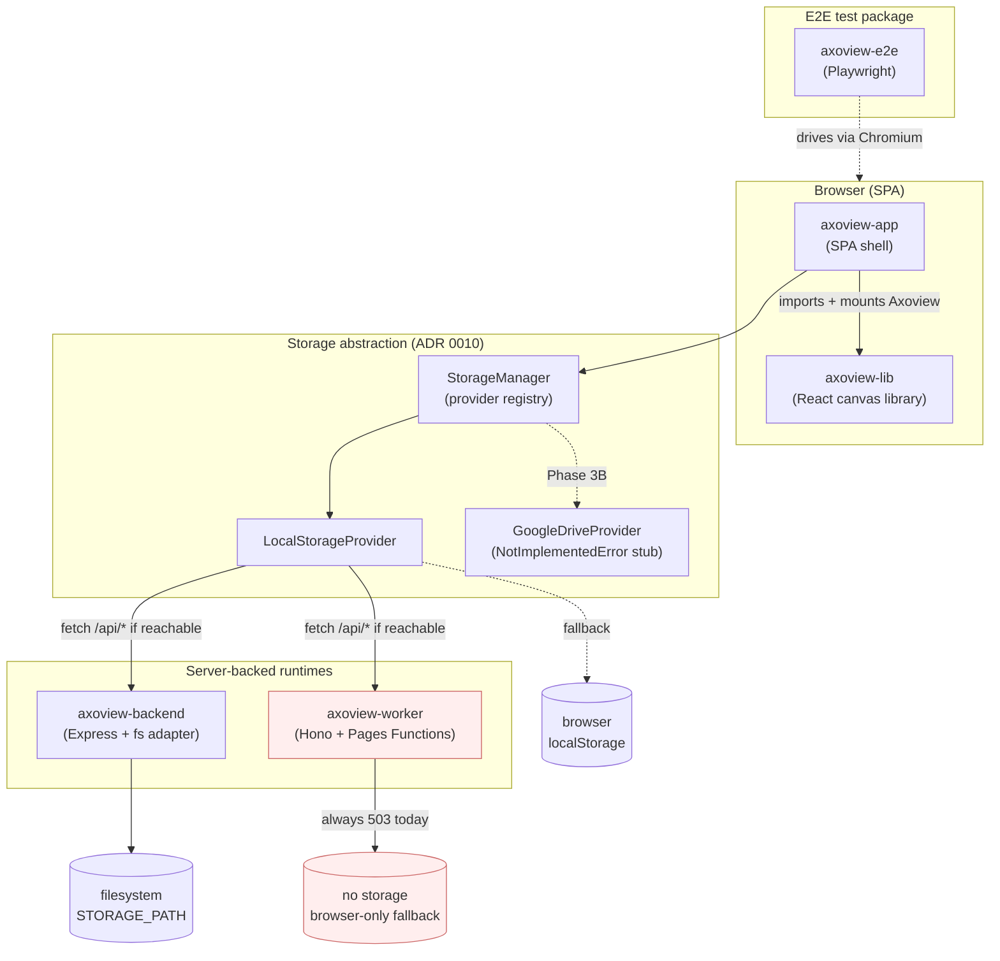
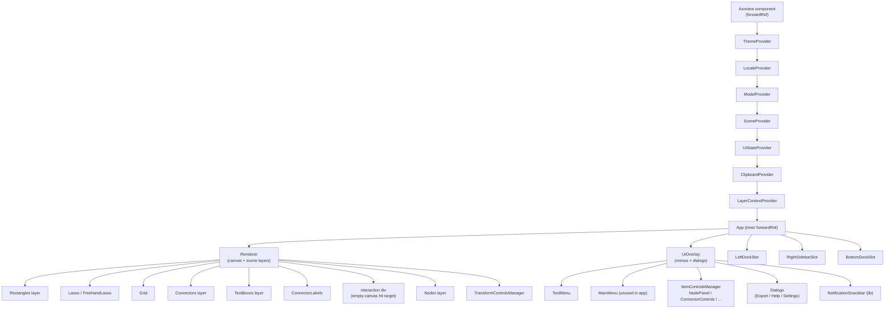
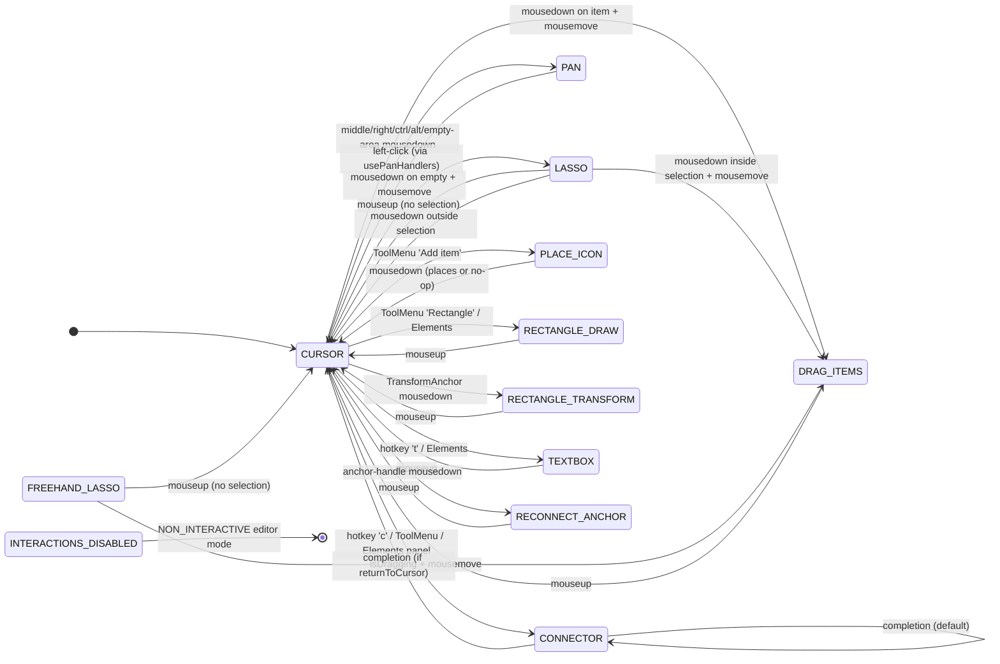
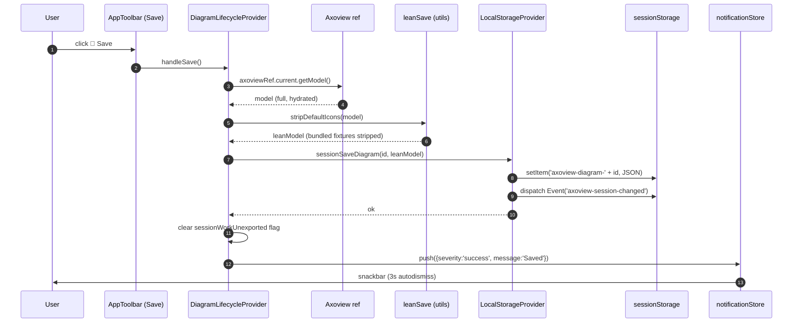
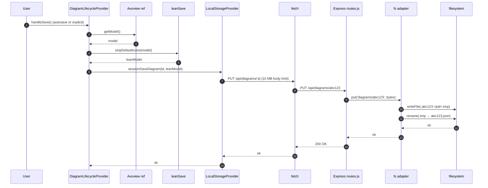
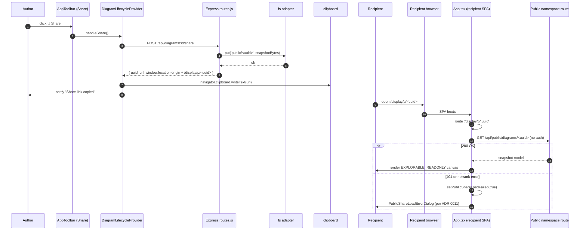
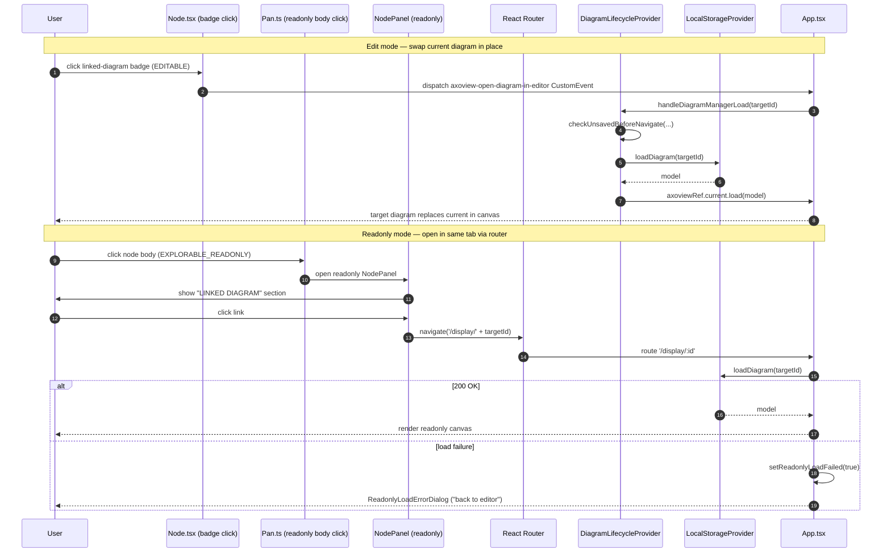
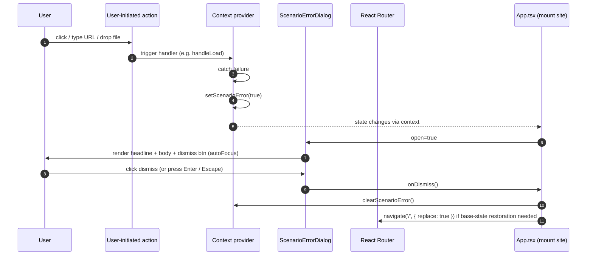

# Axoview Technical Review — 2026-05

> **Status:** Session A complete (sections 0–4 + 9). Sessions B + C populate sections 5–8 + 10–11. Last updated 2026-05-23.

---

## 0. How to use this document

**Audience.** An external reviewer (likely another AI agent) asked to assess Axoview's current state and suggest improvements. The artifact serves two lenses at once:

1. **General code-quality review** — architecture, testing, technical debt, maintainability.
2. **Productization-readiness review** — distribution model, deployment posture, CI/CD discipline, error UX, security headers, repo hygiene.

The reviewer prompts in [§10](#10-reviewer-prompts) split into two checklists; the rest of the artifact serves both.

**Reading order.**

- Read **1 → 2 → 3 → 4** sequentially. Those four sections build the mental model.
- Jump to **§10** for the actual review questions.
- Treat **§5–§8** as reference material; consult as needed.
- **§9** is the durable decisions record (ADRs are the source of truth; §9 is a quick-scan view).
- **§11** lists known gaps the productization audit did not close — review for cumulative-debt impact.

**Snapshot date.** This artifact is dated **2026-05-23** and is **not a living doc**. It captures the post-M10 state of the [productization audit](tactical/productization-audit.md) (v1.0.0 shipped 2026-05-23). The audit itself, the ADRs, [PLAN.md](../PLAN.md), and [docs/architecture.md](architecture.md) are the living artifacts; this one is a frozen review surface.

**Vocabulary note (load-bearing).** Two pairs of terms appear throughout, and one of them is inverted from intuition:

| User-facing prose says… | Internal code-name says… | What it means |
|---|---|---|
| **browser-only** | **Local mode** | No backend; the SPA persists to `localStorage` / `sessionStorage`. Default Cloudflare Pages posture today. |
| **server-backed** | **Session mode** | An Express-or-Worker backend persists diagrams. The Docker compose stack runs in this mode. |

The historical name `Session mode` originated when the only persistence path was the per-tab `sessionStorage` — over time the backend became the load-bearing storage and the name stuck despite the inversion. This artifact uses **"browser-only"** and **"server-backed"** in narrative prose. Internal symbols (`LocalModeBanner`, `LocalStorageProvider`, `SessionStorageGauge`) keep their code names. See [ADR 0008 Decision 1](adr/0008-naming-convention.md#1-component-file-names-disambiguate-when-colliding-describe-surface-not-state) for the rename that closed the worst offender (the old `SessionModeBanner` was renamed `LocalModeBanner` precisely because it only fires in browser-only mode).

**One more vocabulary lock — Dialog / Modal / Popover / Panel / Banner / Screen.** [ADR 0008 Decision 2](adr/0008-naming-convention.md#2-modal-vs-popover-vs-dialog-vs-panel--locked-vocabulary) and [ADR 0011 §2](adr/0011-error-ux-contract.md) reserve these terms. The reviewer should expect "Dialog" to mean centred + focus-trapped + dismissible (the error-UX shape), "Popover" to mean trigger-anchored, "Panel" to mean persistent chrome region.

---

## 1. Executive summary

Axoview is a browser-based isometric diagram editor — a fork of the upstream [FossFLOW](https://github.com/stan-smith/FossFLOW) project (lineage acknowledged in the lib's LICENSE) that has been hardened, restructured, and productized to ship as a self-hostable Docker container and as a Cloudflare Pages deployment at [https://axoview.pages.dev/](https://axoview.pages.dev/). The user-facing artefact is an SPA: drag icons onto an isometric (or 2D cartesian) grid, connect them with routed connectors, label them, group them into views and layers, save the workspace as a tree of folders + diagrams, and either share a public-snapshot URL or export the whole workspace as a project zip.

The 2026 work split into two arcs. **Arc 1 (Phase 0A → 2D, completed by early May 2026)** rebuilt the editor's foundations: a 745-line `App.tsx` was decomposed into focused providers ([Phase 0A](../PLAN.md)); a notification store replaced six `alert()` calls ([Phase 0B](../PLAN.md)); the canvas gained a 2D cartesian mode alongside the isometric default ([Phase 1A](../PLAN.md), [ADR-free, strategy-pattern via `coordinateTransforms.ts`](../packages/axoview-lib/src/utils/coordinateTransforms.ts)); a pluggable storage interface replaced inline service calls ([Phase 2A](../PLAN.md)); a VS Code-style file explorer landed ([Phase 2B + 2B-R](../PLAN.md)); cross-diagram links became a first-class feature ([Phase 2C](../PLAN.md)); and a four-group right-zone top toolbar replaced the prior burger-menu junk drawer ([Phase 2D / ADR 0005](adr/0005-toolbar-and-dock-layout-contract.md)). By the end of Arc 1 the editor's UX had reached the polish layer — MQA #7 (multi-element drag perf), MQA #8/#9 (multi-select + Ctrl+A per [ADR 0006](adr/0006-canvas-selection-contract.md)), MQA #26 (imported-icon delete + tombstone), and a typography contract ([UX §1.5](ux-principles.md#15-typography-is-theme-driven--six-tiers-picked-by-role)) all shipped between mid-April and mid-May.

**Arc 2 — the productization audit** ([docs/tactical/productization-audit.md](tactical/productization-audit.md), 2026-05-19 → 2026-05-23) — is what made the v1.0.0 release possible. The audit produced 17 [locked decisions](tactical/productization-audit.md#locked-decisions-from-scoping-discussion-2026-05-19) (catalogued in [§9.2](#92-locked-decisions-productization-audit)), four Accepted ADRs ([0008 Naming](adr/0008-naming-convention.md), [0009 Deployment topology](adr/0009-deployment-topology.md), [0010 Session backend contract](adr/0010-session-backend-contract.md), [0011 Error UX](adr/0011-error-ux-contract.md)), three spawned tacticals ([E2E rewrite](tactical/e2e-suite-rewrite.md), [git-automation hardening](tactical/git-automation-hardening.md), and the cleanup waves embedded in the audit itself), and a canonical workflow doc ([docs/workflow.md](workflow.md)) codifying the session cadence. The audit ran across nine discovery workstreams (A.1–A.9) and synthesised them into nine cross-workstream themes — the most consequential being the **dual-probe collapse** (boot-time mode detection used to fire two parallel `Promise.all`'d HTTP requests; per [ADR 0009 D2](adr/0009-deployment-topology.md#2-mode-detection-collapses-to-a-single-probe-runtimeconfigserverstorage-is-removed) this is now a single `/api/config` call) and the explicit naming of the **runtime asymmetry** (one HTTP contract, one Express adapter, one Worker short-circuit — *not* "one contract, two adapters" as the retired flare plan had it; see [ADR 0009 D1](adr/0009-deployment-topology.md)).

**What shipped in v1.0.0** (2026-05-23, milestone [M10](tactical/productization-audit.md#end-to-end-productization-path)):

- **Two deployment targets, one HTTP contract.** Self-host via `docker compose up --build` (Express + nginx + filesystem adapter); Cloudflare Pages via native git integration (Worker + Pages Functions, storage-less today). The Worker is intentionally storage-less; persistent storage on the Cloudflare side returns when the Google Drive provider lands as Phase 3B. See [ADR 0009](adr/0009-deployment-topology.md).
- **Distribution = container + CDN.** No npm publish for `axoview-lib`; per [Locked Decision #11](tactical/productization-audit.md#locked-decisions-from-scoping-discussion-2026-05-19) the lib is monorepo-only. No Docker Hub image; per [Locked Decision #12](tactical/productization-audit.md#locked-decisions-from-scoping-discussion-2026-05-19) the day-1 self-host story is `git clone + docker compose up`. Both are explicit deferrals with their own ADR + tactical when the user need surfaces.
- **Explicit-error UX for failure-of-intent paths.** Per [ADR 0011](adr/0011-error-ux-contract.md), three dialogs (`LocalModeShareErrorDialog`, `ReadonlyLoadErrorDialog`, `PublicShareLoadErrorDialog`) replace prior silent-empty-canvas states and toast-only fallbacks. The pattern is `<Scenario>ErrorDialog.tsx` + `dialog.<scenario>.*` i18n namespace; side-effect failures (autosave retry, thumbnail dynamic-import) keep their toasts.
- **CI baseline locked.** Per [Locked Decision #16](tactical/productization-audit.md#locked-decisions-from-scoping-discussion-2026-05-19) every push/PR enforces ESLint, Jest coverage thresholds, build-output shape (`_routes.json` + `_headers` must ship), commitlint via `simple-git-hooks`, CodeQL static analysis, and the Worker bundle stays under 1 MB uncompressed per [ADR 0009 D8](adr/0009-deployment-topology.md). Knip runs continuously as soft-fail.
- **E2E suite green.** Per [Locked Decision #4](tactical/productization-audit.md#locked-decisions-from-scoping-discussion-2026-05-19) both prior E2E suites (legacy Python/Selenium and a stale Playwright suite) were deleted; the rewrite is 13 spec files / 33 tests against the J1–J20 [manual test baseline](manual-test-baseline.md), runs on every PR + master push via [`e2e-playwright.yml`](../.github/workflows/e2e-playwright.yml).
- **README + deployment docs reflect shipped reality.** Post-audit cleanup commit `c208fd0` (2026-05-23) replaced operational FossFLOW references with Axoview and corrected the post-audit drift; deployment docs match the env-var contract in [ADR 0009 §4](adr/0009-deployment-topology.md#4-env-var-contract--one-section-per-target).

**What did not ship and is deferred.** Google Drive persistence (Phase 3B); npm publication of `axoview-lib`; a published Docker Hub image; multi-tenant session isolation ([ADR 0010 D4](adr/0010-session-backend-contract.md) explicitly locks single-tenant-per-deploy for v1); accessibility / visual-regression / performance E2E checks; full translations for the German + Indonesian locales (see [§11](#11-open-known-issues)).

**Composition.** The codebase is a Node 22 + npm 10 monorepo of four packages — [`axoview-lib`](../packages/axoview-lib/) (the published-shape React library, ~1085 unit tests), [`axoview-app`](../packages/axoview-app/) (the SPA shell consuming the lib), [`axoview-backend`](../packages/axoview-backend/) (Express + filesystem adapter), and [`axoview-worker`](../packages/axoview-worker/) (Hono on Cloudflare Pages Functions) — plus a sibling [`axoview-e2e`](../packages/axoview-e2e/) Playwright test package. State management is Zustand (four stores: model, scene, ui, locale), persistence goes through a `StorageProvider` abstraction defined by [ADR 0010](adr/0010-session-backend-contract.md), UI is MUI v7. Build is rsbuild + tsc; tests are Jest + jsdom for the lib + app, Playwright Chromium for E2E.

**What's load-bearing about the audit, not the code.** The audit's most durable output is *process discipline* — [`docs/workflow.md`](workflow.md) codifies the canonical session cadence (Session start → Direct work → Verify → Polish → Review → Doc sync → Promotion), the design principles enforce "every Findings register row cites file:line or a grep result" ([Theme 9](tactical/productization-audit.md#theme-9--the-verify-before-action-hygiene-from-feedback_be_serious_not_eagermd-shaped-the-entire-discovery-quality), elevated to a workflow.md principle), and the 17 locked decisions form an unambiguous record of what is in/out of scope going forward. The reviewer's biggest leverage is verifying that the *contracts* (ADRs 0008–0011) match the *shipped reality* (code) — drift between them is the canonical productization risk this audit was designed to eliminate.

---

## 2. Before / After

The "Before" column anchors at ~2026-02 — the state at the rename merge `72fa120`, just before the productization arc began. The "After" column reflects post-M10 v1.0.0 (2026-05-23). Citations are commit SHAs or ADR numbers.

### 2.1 At-a-glance comparison

| Dimension | Before (~2026-02) | After (post-M10, 2026-05-23) | Evidence |
|---|---|---|---|
| **App shell** | `App.tsx` was 745 lines (intermixed state / effects / JSX) | `App.tsx` is 103 lines (pure provider composition) | [Phase 0A](../PLAN.md), [architecture.md §2l](architecture.md#2l-axoview-app-provider-decomposition-2026-04-27) |
| **Error feedback** | 6 `alert()` calls + ad-hoc inline toast | `notificationStore` Zustand-driven `NotificationStack`; failure-of-intent paths render explicit Dialogs | [Phase 0B](../PLAN.md), [ADR 0011](adr/0011-error-ux-contract.md) |
| **Storage backend** | Inline `storageService.ts` (build-time env injection); two-tab UI | `StorageProvider` interface ([ADR 0010](adr/0010-session-backend-contract.md)), `StorageManager` orchestrator, VS Code-style file explorer with folder CRUD | [Phase 2A + 2B-R](../PLAN.md) |
| **Mode detection on boot** | Two parallel probes (`/api/config` + `/api/storage/status`) | Single `/api/config` probe; `/api/storage/status` deleted | [ADR 0009 D2](adr/0009-deployment-topology.md#2-mode-detection-collapses-to-a-single-probe-runtimeconfigserverstorage-is-removed), commit `0810690` |
| **Share-link on browser-only** | Silent empty-diagram render | Explicit `LocalModeShareErrorDialog`; dismiss strips `?share=` and boots normally | [ADR 0009 D3](adr/0009-deployment-topology.md), commit `cff3942` |
| **Owner-readonly load failure** | Silent redirect to `/` | Explicit `ReadonlyLoadErrorDialog` with "back to editor" action | [ADR 0009 D3 addendum](adr/0009-deployment-topology.md), commit `2a04061` |
| **Self-host auth posture** | nginx HTTP Basic Auth layer + Express `AUTH_MODE` (two overlapping auth layers) | Single `AUTH_MODE` contract; nginx Basic Auth + `.htpasswd` plumbing removed | [Locked Decision #13](tactical/productization-audit.md#locked-decisions-from-scoping-discussion-2026-05-19) |
| **Top toolbar layout** | Junk-drawer burger menu (New/Open/Clear/Settings/GitHub/Version/Export×3 all under one icon) | Four-group RIGHT zone: View modes (reserved) · Save group · Document actions (Export/Share/Preview) · Sidebar toggle | [ADR 0005](adr/0005-toolbar-and-dock-layout-contract.md) |
| **Naming collisions** | Two `ExportDialog.tsx` in different paths; two `StorageManager` (component + class); `SessionModeBanner` shown in browser-only mode | All four renamed per [ADR 0008 D1](adr/0008-naming-convention.md#1-component-file-names-disambiguate-when-colliding-describe-surface-not-state) | commits per audit C.2 §1–§2 |
| **Surface vocabulary** | Dialog / Modal / Popover used interchangeably | Six locked terms: Dialog · Modal · Popover · Panel · Banner · Screen | [ADR 0008 D2](adr/0008-naming-convention.md#2-modal-vs-popover-vs-dialog-vs-panel--locked-vocabulary), [UX §1](ux-principles.md#1-layout) |
| **Connector model** | `labels[]` only (up to 256 labels); no name, no notes, no F2-rename | First-class `name` + `notes`; F2-rename; Details/Style/Notes tabbed panel (parity with nodes) | [ADR 0004](adr/0004-connector-name-and-details-panel.md) |
| **Selection model** | Single-item via `itemControls`; multi-select existed only inside Lasso mode | Persistent `selectedIds: ItemReference[]` slice; Ctrl+click, Ctrl+A, multi-drag, multi-delete | [ADR 0006](adr/0006-canvas-selection-contract.md) |
| **Multi-element drag perf** | 9–13 FPS on a 6-node drag for 12–19 s windows (MQA #7) | 24–44 FPS sustained; CSS-only preview + `previewConnectorPaths` action; one history entry per drag | [known_issues.md MQA #7](../known_issues.md), Path 4-true |
| **Icon catalog persistence** | Full bundled catalog written to every diagram on every save | Lean save strips bundled fixtures; load-time merge rehydrates them; `requiredPacks` field signals what to lazy-load | [ADR 0002](adr/0002-icon-catalog-merge-on-load.md), [ADR 0003](adr/0003-session-storage-lean-icon-save.md) |
| **Workspace I/O** | Single-diagram JSON export only | Project zip ([ADR 0001](adr/0001-project-zip-format.md)) with manifest + diagrams/ + tree-manifest; three scopes (project / folder / diagram); three destinations (root / new folder / replace-all) | Phase 2B-R + ADR 0001 |
| **fs adapter atomicity** | `fs.writeFile` direct (truncation risk on crash) | tmp-file + rename per [ADR 0010 D3](adr/0010-session-backend-contract.md#3-atomicity--every-put-is-all-or-nothing) | commit `6e1b28c` |
| **Health probes** | None | `/healthz` on Express + Dockerfile `HEALTHCHECK` + compose `healthcheck:` block | [ADR 0010 D8](adr/0010-session-backend-contract.md) |
| **CI gates** | Build only | ESLint hard-fail · coverage hard-fail · build-output shape hard-fail (`_routes.json` + `_headers` present) · commitlint local hook · CodeQL · Worker bundle <1 MB · knip continuous soft-fail | [Locked Decision #16](tactical/productization-audit.md#locked-decisions-from-scoping-discussion-2026-05-19), [git-automation-hardening.md](tactical/git-automation-hardening.md) |
| **E2E suite** | Legacy Python/Selenium under `e2e-tests/` + stale Playwright under `packages/axoview-e2e/` | Both deleted; rewrite from zero: 13 spec files / 33 tests against J1–J20 manual baseline; runs on PR + master | [Locked Decision #4](tactical/productization-audit.md#locked-decisions-from-scoping-discussion-2026-05-19), [e2e-suite-rewrite.md](tactical/e2e-suite-rewrite.md) |
| **CI/deploy workflows** | `.github/workflows/e2e-tests.yml.backup` + Pages workflow + dual deploy paths | Native Cloudflare git integration is canonical; GH Pages workflow deleted; `release.yml` rewired to depend on Run Tests | [Locked Decision #14](tactical/productization-audit.md#locked-decisions-from-scoping-discussion-2026-05-19) |
| **LICENSE / lineage hygiene** | Unlicense on app, MIT on root, upstream author still credited in lib LICENSE, FUNDING.yml pointing upstream | All three normalized (LICENSE files coherent; FUNDING.yml deleted; lineage acknowledged in lib LICENSE prose) | Audit C.2 §1 quick-wins, commits `264887a` / `39a44c1` |
| **Repo hygiene** | No `.gitattributes`; `.nvmrc` was Node 20 (workflows on Node 22); duplicate ISSUE_TEMPLATE `.md` + `.yml` pairs | `.gitattributes` enforces LF; `.nvmrc` is 22; `.md` ISSUE_TEMPLATE deleted (YAML form canonical) | Audit C.2 §1, commit `264887a` |
| **Doc structure** | `current_architecture.md`, `flare_plan.md`, `session-ux-revamp.md`, `details-panel-and-ux-polish.md` as parallel tacticals | Three-tier convention: ADRs in `docs/adr/` (durable) · tacticals in `docs/tactical/` (short-lived) · PLAN.md as dashboard; `flare_plan.md` content migrated to ADRs 0009/0010 then deleted | [docs/workflow.md](workflow.md), [project_docs_convention memory](../../Users/isidenica/.claude/projects/c--myTemp-FossFLOW/memory/project_docs_convention.md) |
| **Workflow doc** | None — process tribal | [`docs/workflow.md`](workflow.md) — canonical session cadence, skill decision table, 6 design principles | [Phase A synthesis Theme 9](tactical/productization-audit.md), workflow.md authored 2026-05-20 |

### 2.2 What did *not* change

Worth naming explicitly so the reviewer doesn't infer churn where there is none:

- **Core canvas engine** (isometric projection, connector pathfinding, hit-testing, view-tab model). The 2D mode landed as a strategy alongside the iso strategy ([Phase 1A](../PLAN.md)); the iso engine itself is unchanged from the upstream fork era.
- **Zustand store topology.** Three lib stores (model, scene, uiState) + the app's `notificationStore` were in place by Phase 0B / Phase 1A; the productization arc made no structural changes here.
- **Auth implementation depth.** `AUTH_MODE = none | shared-token | cf-access` was already implemented end-to-end before the audit. The audit changed posture (removed the overlapping nginx Basic Auth layer per [Locked Decision #13](tactical/productization-audit.md#locked-decisions-from-scoping-discussion-2026-05-19)) but not the supported modes.
- **Single-tenant assumption.** Always single-tenant per deploy; [ADR 0010 D4](adr/0010-session-backend-contract.md) made it explicit and locked rather than newly imposing it.
- **Build system.** rsbuild + tsc throughout the year; no churn.

---

## 3. Architecture overview

### 3a. System diagram



### 3b. Package responsibilities

The monorepo has four shipped packages plus the E2E test package. Each has one ownership rule.

**[`packages/axoview-lib`](../packages/axoview-lib/)** — the React canvas library. Owns the renderer, scene layers (Nodes, Connectors, Rectangles, TextBoxes), interaction modes (the 11-state machine), the three Zustand stores (model, scene, uiState), the i18n layer (14 locales), and every component inside the canvas chrome (LeftDock, RightSidebar, ToolMenu, BottomDock, dialogs). Primary entry: [`Axoview.tsx`](../packages/axoview-lib/src/Axoview.tsx) (forwardRef component, ~200 lines, mounts the provider tree). Consumed only by `axoview-app` today; per [Locked Decision #11](tactical/productization-audit.md#locked-decisions-from-scoping-discussion-2026-05-19) the lib is monorepo-only (not npm-published). Deploys nowhere on its own; ships as a build output that `axoview-app` imports from `dist/`. Test surface: ~525 lib tests + 8 app tests in [`docs/testing.md`](testing.md).

**[`packages/axoview-app`](../packages/axoview-app/)** — the SPA application shell. Owns everything the lib doesn't: storage providers (`StorageManager` + `LocalStorageProvider` + the Drive stub), the file explorer UI (`FileExplorerLayout`, `FileExplorer`, `FileTreeNode`), the app toolbar (`AppToolbar`), the notification stack (`notificationStore` + `NotificationStack`), the cross-diagram link registry, the icon-pack manager, the diagram lifecycle (`DiagramLifecycleProvider` — save / load / unsaved-changes guard), the share-URL handler, and the error dialogs from [ADR 0011](adr/0011-error-ux-contract.md). Entry: [`App.tsx`](../packages/axoview-app/src/App.tsx) (103 lines, pure provider composition per [§2l](architecture.md#2l-axoview-app-provider-decomposition-2026-04-27)). Deploys to: Cloudflare Pages (static bundle), nginx (Docker compose stack). Test surface: project-zip + LocalStorageProvider + AppStorageContext suites.

**[`packages/axoview-backend`](../packages/axoview-backend/)** — Node 22 + Express + filesystem adapter. Owns the canonical `/api/*` HTTP contract (every route defined in [`src/routes.js`](../packages/axoview-backend/src/routes.js); the Worker imports the same file). Implements the `StorageAdapter` interface ([`src/adapters/types.ts`](../packages/axoview-backend/src/adapters/types.ts)) via [`fs.js`](../packages/axoview-backend/src/adapters/fs.js) — atomicity via tmp-file + rename per [ADR 0010 D3](adr/0010-session-backend-contract.md#3-atomicity--every-put-is-all-or-nothing). Auth via `AUTH_MODE` env var (`none` / `shared-token`; `cf-access` rejected at request time as Cloudflare-only). Health probe at `/healthz` per [ADR 0010 D8](adr/0010-session-backend-contract.md). Deploys to: Docker container behind nginx (compose.yml + Dockerfile). Test surface: **no jest config today** — gap tracked in audit [§C.8](tactical/productization-audit.md). Smoke-tested via Docker.

**[`packages/axoview-worker`](../packages/axoview-worker/)** — Hono on Cloudflare Pages Functions. Owns the Cloudflare-side `/api/*` surface. Imports `routes.js` from `axoview-backend` directly (the cross-package import is the single source of truth — see [productization audit P6](tactical/productization-audit.md)) but **short-circuits every storage route to 503** at [`app.ts:43-45`](../packages/axoview-worker/src/app.ts) per [ADR 0009 D1](adr/0009-deployment-topology.md). Today: storage-less by design. Implements `cf-access` auth (full JWKS RS256 verify in [`auth.ts`](../packages/axoview-worker/src/auth.ts)). Bundle-size budget <1 MB uncompressed (CI-enforced per [ADR 0009 D8](adr/0009-deployment-topology.md)). Deploys to: Cloudflare Pages via native git integration on master push (per [Locked Decision #14](tactical/productization-audit.md#locked-decisions-from-scoping-discussion-2026-05-19)); also runnable locally via `wrangler pages dev`. Test surface: **no jest config today** — same gap as backend.

**[`packages/axoview-e2e`](../packages/axoview-e2e/)** — Playwright Chromium against the local dev server. 13 spec files / 33 tests covering canonical user journeys J1–J20 from [`docs/manual-test-baseline.md`](manual-test-baseline.md). Page Object Model per surface (AppToolbar, FileExplorer, Canvas, NodeInfoTab, LayersPanel, dialogs). Per [ADR 0008 D5](adr/0008-naming-convention.md#5-data-axoview-id-attribute--selective-not-blanket-reserved-for-e2e-and-trace-harness-anchors), `data-axoview-id` attributes are added lazily as specs need them. Runs on PRs + master push via [`.github/workflows/e2e-playwright.yml`](../.github/workflows/e2e-playwright.yml).

### 3c. State management

The lib carries four Zustand stores; the app carries one more (notifications). All five use the React-context-wrapped Zustand pattern (per-mount-instance isolation) — see [architecture.md §2a](architecture.md#2a-store-layer).

| Store | Owner | Persistence | Purpose |
|---|---|---|---|
| `modelStore` | lib | included in saved diagram | Persistent model: items, connectors, rectangles, textBoxes, views, icons, colors. Has its own immer-patch-based history stack (max 50 entries). |
| `sceneStore` | lib | derived (computed from model) | Computed scene data: connector paths, textbox sizes. Independent history stack alongside model's. |
| `uiStateStore` | lib | settings persist to `localStorage` (`axoview-*` keys) | Mode, zoom, scroll, selection (`selectedIds` + `itemControls`), dialogs, settings (hotkey profile, pan/zoom settings, `canvasMode`), `iconPackManager` ref, dirty flag, mouse state. |
| `localeStore` | lib | localStorage | Current locale + dictionary. |
| `notificationStore` | app | not persisted | Side-effect notifications (success / info / warning / error). Capped at 3 visible; queue drains FIFO. |

**Mode detection on boot (per [ADR 0009 D2](adr/0009-deployment-topology.md#2-mode-detection-collapses-to-a-single-probe-runtimeconfigserverstorage-is-removed)).** The SPA issues a single `GET /api/config` request with an 800 ms `AbortSignal.timeout` cap. The `serverStorage: boolean` field in the response selects the path:

- `true` → register `LocalStorageProvider` with `usingServer=true`; it routes `listDiagrams` / `loadDiagram` / `saveDiagram` to `/api/diagrams/*`.
- `false` *or* probe failure → `LocalStorageProvider` with `usingServer=false`; falls back to `sessionStorage`.

The boot path used to fire a dual probe (`/api/config` + `/api/storage/status` in parallel `Promise.all`) — collapsed to one in commit `0810690`. The `/api/storage/status` endpoint is gone from both runtimes.

**Reducer pattern.** Every mutating action in `useScene` (~30 methods) routes through a pure reducer in [`stores/reducers/`](../packages/axoview-lib/src/stores/reducers/). Reducers take `(payload, state) → State` (pure, no I/O, no async, no store reads), use immer `produce()` for immutable updates. The hook layer wraps reducer calls with `saveToHistoryBeforeChange()` to record patches (unless inside a `transaction()`, in which case N operations collapse into one history entry). See [architecture.md §2d](architecture.md#2d-reducer-layer) for the full reducer matrix.

### 3d. Component tree (high level, lib-side)



Order matters: the **interaction div** sits *below* the Nodes layer, so `e.target === interactionDiv` is true *only* when the user clicks empty canvas (Nodes capture their own events). This `isRendererInteraction` guard is referenced throughout the mode handlers.

### 3e. Interaction modes

The 11-mode state machine — formal definitions in [architecture.md §2b](architecture.md#2b-mode-state-machine).



`INTERACTIONS_DISABLED` exists as an early-return state for the `NON_INTERACTIVE` editor mode (one of three editor modes — see [architecture.md §1 "Editor Modes"](architecture.md#1-feature-inventory)). The other two editor modes are `EDITABLE` (all modes active) and `EXPLORABLE_READONLY` (Pan + Zoom + click-to-open readonly NodePanel only).

---

## 4. Sequence diagrams

Six representative flows. Each is tuned to ~10–15 actors/messages — the readable sweet spot. Where a flow has natural pre / post halves, it's split.

### 4a. App boot + mode detection (single `/api/config` probe)

```mermaid
sequenceDiagram
    autonumber
    participant U as User
    participant Browser
    participant App as App.tsx
    participant AppStorage as AppStorageContext
    participant RuntimeCfg as useRuntimeConfig
    participant API as Backend /api/config
    participant SM as StorageManager
    participant LSP as LocalStorageProvider
    participant Splash as Inline splash div

    U->>Browser: navigate to axoview URL
    Browser->>Splash: paints inline splash (~500ms)
    Browser->>App: bundle parses + App mounts
    App->>AppStorage: AppStorageContext.Provider
    AppStorage->>RuntimeCfg: fetchRuntimeConfig() with AbortSignal.timeout(800ms)
    RuntimeCfg->>API: GET /api/config
    alt /api/config succeeds
        API-->>RuntimeCfg: { serverStorage: bool, googleClientId, ... }
        RuntimeCfg-->>AppStorage: config
        AppStorage->>SM: setServerStorage(config.serverStorage)
        SM->>LSP: usingServer = config.serverStorage
    else timeout or network error
        RuntimeCfg-->>AppStorage: console.warn + default { serverStorage: false }
        AppStorage->>SM: setServerStorage(false)
        SM->>LSP: usingServer = false  (sessionStorage fallback)
    end
    AppStorage->>App: isInitialized = true
    App->>Splash: add .ff-splash-hidden after 2 RAFs; remove node after 250ms
    App->>U: editor visible
```

Closes the dual-probe collapse from [ADR 0009 D2](adr/0009-deployment-topology.md#2-mode-detection-collapses-to-a-single-probe-runtimeconfigserverstorage-is-removed). Before the cleanup this fired both `/api/config` **and** `/api/storage/status` via `Promise.all`.

### 4b. Save diagram — browser-only mode



The lean-save pass per [ADR 0003](adr/0003-session-storage-lean-icon-save.md) drops icons whose `id` matches `bundledFixtures.byId` and whose metadata is unchanged. On the next load the rehydrate step from [ADR 0002](adr/0002-icon-catalog-merge-on-load.md) re-merges the catalog.

### 4c. Save diagram — server-backed mode



The Cloudflare Worker path is intentionally asymmetric — `PUT /api/diagrams/:id` hits the `app.all('/api/*') → 503` short-circuit at [`app.ts:43-45`](../packages/axoview-worker/src/app.ts). Cloudflare deploys are storage-less today (per [ADR 0009 D1](adr/0009-deployment-topology.md)), so server-mode persistence is Docker-only until Phase 3B (Google Drive) lands as a new `StorageAdapter`. The atomicity contract (`tmp-file + rename`) is [ADR 0010 D3](adr/0010-session-backend-contract.md#3-atomicity--every-put-is-all-or-nothing).

### 4d. Share link generation + public consumption



The `/api/public/diagrams/:uuid` route bypasses auth middleware on both runtimes (`isPublicRoute` check in Express; same check in Worker `authMiddleware`) — the **only** auth exception in the contract per [ADR 0010 D6](adr/0010-session-backend-contract.md#6-snapshots-and-share-namespace).

### 4e. Diagram-to-diagram link navigation

The contract has two paths — edit-mode swap (via CustomEvent) and readonly-mode navigation (via React Router). Both routed through `interaction/modes/Pan.ts` and `NodePanel` for the readonly case. The B-1 fix (commit `2a04061`) added the explicit error dialog when a target diagram fails to load.



Distinct from §4d's `/display/p/:uuid` public-share route (which bypasses auth and hits the public namespace). The owner-readonly `/display/:id` route runs through `storage.loadDiagram(id)` and respects `AUTH_MODE` in server-backed mode — see the [2026-05-22 addendum to ADR 0009 D3](adr/0009-deployment-topology.md#3-readonly--share-link-is-a-session-mode-only-overlay-local-mode-must-error-explicitly).

### 4f. Error UX — failure-of-intent flow (per [ADR 0011](adr/0011-error-ux-contract.md))



Three dialogs ship per the contract: `LocalModeShareErrorDialog` (browser-only + share-uuid URL → explicit error per [ADR 0009 D3](adr/0009-deployment-topology.md)); `ReadonlyLoadErrorDialog` (owner-readonly `/display/:id` load failure); `PublicShareLoadErrorDialog` (public `/api/public/diagrams/:uuid` 404 or network error, retrofitted per ADR 0011 B-9a S1). The audit's [B-9a investigation](tactical/productization-audit.md) identified 20 remaining toast-only or `.catch(() => {})` surfaces (S2–S20) that are queued for B-9b retrofit; that batch is **deferred-by-design** per the [2026-05-23 closeout disposition](tactical/productization-audit.md#phase-c-status).

---

## 5. Deployment topology

<!-- TBD Session C — Will cover: Docker compose stack (nginx + Express + filesystem volume); Cloudflare Pages deployment (Worker + Pages Functions + native git integration); env-var contract per target (per ADR 0009 §4); TLS termination per target; bundle-size budget; deploy automation (CF native git integration is canonical per Locked Decision #14). Cross-references: ADR 0009 §§1, 4, 5, 7, 8; docs/deployment.md. -->

---

## 6. Security posture

<!-- TBD Session C — Will cover: auth modes (none / shared-token / cf-access — Cloudflare-only); single-tenant-per-deploy lock (ADR 0010 D4); public-namespace cutout (the only auth exception); CSP delivery per target (Helmet on Express, _headers on Cloudflare, nginx.conf for self-host); CodeQL static analysis; nginx Basic Auth removal (Locked Decision #13); path-traversal blocked at adapter boundary via KEY_PATTERN regex; 10 MB body limit. Cross-references: ADR 0009 §4/§7, ADR 0010 §2/§4/§6. -->

---

## 7. File-by-file inventory

<!-- TBD Session B — Comprehensive walk of every tracked file in the repo, grouped by package per §3b. For each file: purpose (one line), key entry points / exports, primary consumers, notable contracts. Token-heavy; the planned fan-out shape depends on §3b's segmentation (already clean: 4 packages + e2e + repo-level deployment artifacts + .github + docs). -->

---

## 8. Quality KPIs aggregate

<!-- TBD Session C — Will cover: test counts (~1085 lib + ~8 app + 33 E2E = ~1126 total; 103 suites; ~32% global statement coverage with 10% global minimum threshold), build outputs (axoview-app build, axoview-lib dist), bundle sizes (Worker <1 MB uncompressed per ADR 0009 D8), CI duration, lint findings, knip soft-fail surface, CodeQL findings. Cross-references: docs/testing.md, T2 git-automation tactical for the CI gate list. -->

---

## 9. Decisions catalog

### 9.1 ADRs

| ADR | Title | Status | Date | One-line decision | Key consequences |
|---|---|---|---|---|---|
| [0001](adr/0001-project-zip-format.md) | Project zip format | Accepted | 2026-04-30 | Workspace = single `.zip` with `manifest.json` + `diagrams/<id>.json` + optional `tree-manifest.json`; three scopes (project / folder / diagram); three import destinations (root / new folder / replace-all with typed confirm); ID rewriting always. | One symmetric format across browser-only + server-backed modes. Re-import preserves relative tree shape; share URLs don't survive a round-trip; `jszip` ~96 KB added to bundle. |
| [0002](adr/0002-icon-catalog-merge-on-load.md) | Icon catalog merge on load | Accepted | 2026-04-30 | Side-dock catalog = `bundledFixtures ∪ model.icons` (union by id; overrides win); merge runs at every load. **Plus 2026-05-18 lifecycle addendum:** imported-icon delete + workspace usage scan + `TOMBSTONE_ICON` for unresolved ids. | Side dock can't empty after load (paired with ADR 0003 strip). Catalog cannot bit-rot since merge runs on every load. Deleted bundled icons cannot be persisted-as-deleted (intentional). |
| [0003](adr/0003-session-storage-lean-icon-save.md) | Lean icon save | Accepted | 2026-04-30 | Strip default-catalog icons from every write path (session / server / export JSON / project zip); preserve custom + overrides; companion field `requiredPacks: string[]` signals lazy-load needs. | Workspaces hold materially more diagrams within sessionStorage's ~5 MB budget. Backward-compatible with older fat saves (the load-merge collapses duplicates harmlessly). |
| [0004](adr/0004-connector-name-and-details-panel.md) | Connector name + details panel parity | **Proposed** | 2026-05-03 | Add `name?` + `notes?` to `connectorSchema`; F2-rename works on connectors; tabbed Details/Style/Notes panel mirrors `NodePanel`. | Connectors become first-class peers of nodes. Two label surfaces (`name` + `labels[]`) coexist — visual overlap at position ~50 is explicitly accepted. **Status note:** Proposed since 2026-05-03 — see [§11](#11-open-known-issues). |
| [0005](adr/0005-toolbar-and-dock-layout-contract.md) | Toolbar + dock layout contract | **Proposed** | 2026-05-09 | Top toolbar = RIGHT-only with 4 groups (View modes reserved · Save group · Document actions · Sidebar toggle); left strip = 📁 → separator → ⊞ ≣ → spacer → ⚙; burger removed; SettingsDialog gains About + Diagnostics tabs. | Future toolbar additions route mechanically by class. Burger junk-drawer debt resolved. **Status note:** Marked Proposed but shipped 2026-05-09 — drift between status and reality; see [§11](#11-open-known-issues). |
| [0006](adr/0006-canvas-selection-contract.md) | Canvas selection contract (single + multi) | Accepted | 2026-05-16 | Two cooperating slices: `selectedIds: ItemReference[]` (multi) + `itemControls` (single, panel-driver). Invariant: when `selectedIds.length === 1`, `itemControls` mirrors it; otherwise null. Ctrl+click toggles, Ctrl+A selects-all, Esc clears. Locked/hidden items uniformly off-limits via `isItemInteractable`. | Single-item consumers unchanged (additive contract). Auto-hide on N>1 selection (no homogeneous-N special case). Bulk style / resize deferred. |
| 0007 | (Trace harness) | **Not authored** | — | Originally placeholder for the runtime trace harness (`?trace=1` gate, mount-anchor inventory, replay format). Per audit wrap-up: "Phase B's `?trace=1` work shipped operationally but the ADR was never authored." | Trace harness lives via commits, not a formal record. Gap acknowledged in [audit Wrap-up](tactical/productization-audit.md#wrap-up). |
| [0008](adr/0008-naming-convention.md) | Naming convention | Accepted | 2026-05-20 | 8 decisions: component name disambiguation (4 mandated renames); locked Modal/Dialog/Popover/Panel/Banner/Screen vocabulary; `// LIB-ONLY` marker (forward-looking); kebab-case provider IDs; selective `data-axoview-id` retrofit (E2E + trace anchors only); `axoview-<role>` package naming (4-set locked); skill naming (verb / verb-noun / `-check` suffix); boolean / render-gate / deploy-filename code hygiene. | Closes the audit's two name-collision bugs + one semantic-inversion bug. `data-axoview-id` is the *single* product-namespaced attribute (no parallel `data-testid`). |
| [0009](adr/0009-deployment-topology.md) | Deployment topology | Accepted | 2026-05-20 | 8 decisions: name the "one HTTP contract, one adapter, one Worker short-circuit" asymmetry; collapse dual probe → single `/api/config` (delete `/api/storage/status` + dead `RuntimeConfig.serverStorage` field); explicit browser-only share-link error dialog; env-var contract per target (self-host / Cloudflare / local-dev); authoritative `wrangler.toml` + mandatory `_routes.json` + canonical `_headers`; per-runtime observability boundary; TLS termination (operator-owned for self-host, CF for Pages); Worker bundle <1 MB uncompressed. | Boot-time cold-start latency on Cloudflare drops by ~100–200 ms. Frontend RuntimeConfig field deleted. ADR 0010 inherits the storage-adapter contract cleanly. Single-tenancy is explicit in ADR 0010 D4. |
| [0010](adr/0010-session-backend-contract.md) | Session backend contract | Accepted | 2026-05-20 | 9 decisions: 5-method `StorageAdapter` interface (`get/put/delete/list/listDiagramMeta`); opaque keys + `KEY_PATTERN` regex (path-traversal blocked at adapter boundary); atomicity (tmp-file + rename for fs); single-tenant-per-deploy lock (v1; multi-user explicitly deferred); reserved-key list (folders / tree-manifest / metadata / diagrams-index / public/<uuid>); snapshots + share-namespace cutout; last-writer-wins concurrency (conditional-write pattern dormant for Drive); `/healthz` shape; Drive (Phase 3B) extension contract. | Drive integration has a clear template; no re-litigation of decisions 1–8. Health endpoint unblocks Dockerfile HEALTHCHECK + compose healthcheck. Single-tenancy will surprise multi-collaborator self-hosters — deploy docs need a callout (open). |
| [0011](adr/0011-error-ux-contract.md) | Error UX contract | Accepted | 2026-05-22 | Every failure-of-intent renders an explicit Dialog (centred, focus-trapped, MUI Dialog primitives); `<Scenario>ErrorDialog.tsx` naming; `dialog.<scenario>.*` i18n namespace; dumb component / smart parent; carve-outs preserved (toasts for side-effect failures, in-dialog inline errors, boot-time fallbacks, form-field validation). | Codifies the latent contract that converged across `LocalModeShareErrorDialog` + `ReadonlyLoadErrorDialog`. B-9a S1 (`PublicShareLoadErrorDialog`) shipped under the new contract. S2–S20 enumerated as B-9b retrofit catalogue (deferred-by-design post-audit). |

### 9.2 Locked decisions (productization audit)

The audit doc's [Locked decisions table](tactical/productization-audit.md#locked-decisions-from-scoping-discussion-2026-05-19) — 17 rows. Distilled here for scan-ability; full rationale is in the audit doc.

| # | Decision | Date locked |
|---|---|---|
| 1 | No new PLAN.md phase row for the audit (cross-cutting tactical). | 2026-05-19 |
| 2 | Revive `__fftest__`-style instrumentation as the runtime trace harness (would-be ADR 0007). | 2026-05-19 |
| 3 | Naming convention locked after audit pass 1 (became ADR 0008). | 2026-05-19 |
| 4 | E2E plan: delete both prior suites (Python/Selenium + Playwright); rewrite from zero. | 2026-05-19 |
| 5 | Google Drive placeholder code is intentional (Phase 3B); not dead code. | 2026-05-19 |
| 6 | Cloudflare + Docker + session-backend deployment artifacts are IN scope. Productization = working public Cloudflare deploy in session mode + hardened CI/CD. | 2026-05-19 |
| 7 | `flare_plan.md` retired; durable decisions migrate to ADRs 0009 + 0010; file deleted at wrap. | 2026-05-19 |
| 8 | Git configuration + git-agent automation are IN scope (workstreams A.7 + A.8). | 2026-05-19 |
| 9 | Skills + session cadence are IN scope (workstream A.9). Output: `docs/workflow.md`. | 2026-05-19 |
| 10 | Rename tactical Phase 10 items absorbed into this audit (npm publish → M8; Docker Hub → M8; CF deploy → M10; cwd rename = note only). | 2026-05-19 |
| 11 | `axoview-lib` stays monorepo-only; **no npm publish**. Docker + Cloudflare are the productization surface. | 2026-05-20 |
| 12 | Docker Hub publish **deferred** to a future feature. Day-1 deploy = `git clone + docker compose up --build`. | 2026-05-21 |
| 13 | nginx HTTP Basic Auth **removed**. Single `AUTH_MODE` contract; deployers wanting auth use `shared-token` or `cf-access`. | 2026-05-21 |
| 14 | GitHub Pages workflow **removed**; Cloudflare Pages native git integration is canonical. `release.yml` rewired from `pages.yml` → `Run Tests`. | 2026-05-22 |
| 15 | Error UX contract codified as ADR 0011 (Accepted 2026-05-22). | 2026-05-22 |
| 16 | T2 (git-automation hardening) wraps 2026-05-22 — CI gates active (ESLint / coverage / build-output shape / commitlint / CodeQL / Worker bundle size / continuous knip soft-fail). **M8 met for in-repo scope.** | 2026-05-22 |
| 17 | **M10 ship gate met 2026-05-23 (v1.0.0).** Audit substantively complete. Closeout sequencing: cleanup → tech review artifact (this doc) → T4 external GitHub actions → `/feature wrap`. | 2026-05-23 |

---

## 10. Reviewer prompts

<!-- TBD Session C — Will split into two checklists per the dual-lens design: (A) general code-quality review (architecture coherence, test depth, performance contracts, known-issues impact); (B) productization-readiness review (deployment + auth + error UX + CI gates + LICENSE + docs). Each prompt cites the §3/§4/§9 location it grounds in so the reviewer can verify with one click. -->

---

## 11. Open known issues

<!-- TBD Session C — Will compose from known_issues.md + the deferred-by-design rows from the audit closeout. Notable categories: partial-coverage i18n locales (de-DE + id-ID); PWA install card is plain; preview-mode passive badge incomplete; ADR 0004 + ADR 0005 status drift (marked Proposed but shipped); page tabs hard cap of 5 with no overflow UX; pre-existing failing leanSave unit test (bundledFixtures[0] undefined); double-click rename in file tree; imported icons per-diagram (deferred); connector drag sustained-GC cliff (deferred); B-9b silent-failure retrofit catalogue (S2–S20); leanSave test seeding gap. -->
